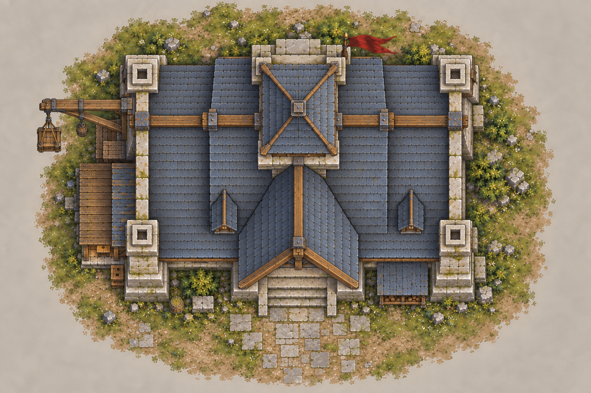
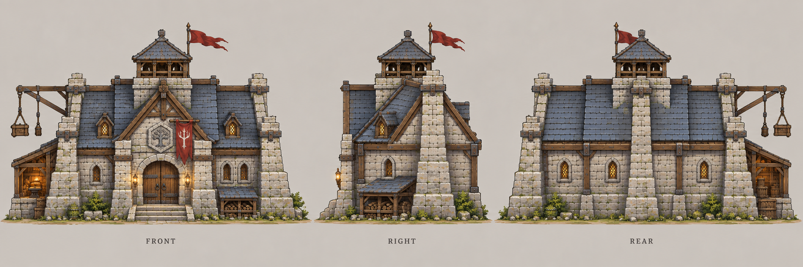

# 主城设计

| 文档属性 | 内容 |
|---|---|
| 建筑编号 | BLD-001 |
| 版本 | v0.2 |
| 更新日期 | 2026-09-25 |
| 状态 | 基础属性与失败条件已确定；功能和美术为设计提案 |
| 规则依赖 | [SYS-CBT-001 · 战斗与护甲规则](战斗与护甲规则.md) |

[返回文档目录](游戏设计文档.md)

## 1. 建筑定位

主城是基地的生存核心。玩家需要通过经营、军队部署和防御建设保护主城。其生命值降至 0 时，本局游戏结束。

「主城」为当前通用名称，正式命名待定。

## 2. 属性表

| 属性 | 当前设定 | 状态 |
|---|---|---|
| 最大生命值 | **1000** | 已确定 |
| 护甲 | **20** | 已确定 |
| 目标减伤率 | **约 40%** | 已确定 |
| 当前公式结果 | **40%** | 按通用护甲提案计算 |
| 摧毁结果 | **本局游戏结束** | 已确定 |
| 主动攻击 | 暂不具备 | 设计提案 |
| 初始数量 | 开局提供 1 座 | 设计提案 |
| 占地、成本、建造时间 | 待定 | 待设计 |

## 3. 伤害表现

按当前护甲提案，主城承受原始伤害的 **60%**。单次原始伤害为 20 时扣 12 生命，为 100 时扣 60 生命。满血主城分别需要 84 次或 17 次同等命中才能摧毁，不考虑修理和其他机制。

界面最大生命值仍为 1000。完整公式和精度约定以 [战斗与护甲规则](战斗与护甲规则.md) 为准。

## 4. 功能边界

### 当前设计提案

- 作为基地指挥和基础管理入口。
- 开局提供一座，供玩家围绕其布置基地。
- 首版不提供自动攻击能力，防御依赖士兵及后续防御设施。
- 摧毁后直接结算失败，不进入复活或重建阶段。

### 待定功能

| 功能项 | 需确定内容 |
|---|---|
| 人口与工人 | 是否提供人口上限、是否生产工人 |
| 储存与交付 | 是否承担仓库或资源交付点 |
| 招募与研究 | 是否承担初始招募、研究或科技解锁 |
| 修理 | 消耗、速度、执行者、战斗中能否修理 |
| 升级 | 等级、成本、条件、属性与外观变化 |

## 5. 摧毁规则

**触发条件：**伤害结算后的内部生命值为 0。

**处理结果：**立即触发本局失败。坍塌动画可以继续播放，但不额外提供抢救窗口；失败流程只触发一次。

修理与致命伤害同时发生时的顺序，待修理系统确定后补充。

## 6. 美术设计提案

### 6.1 造型目标

紧凑、厚重的石木指挥大厅，在俯视镜头中形成清晰轮廓。建筑保留魔法世界既有文化，并带有早期机械改造痕迹。

| 元素 | 设计内容 | 目的 |
|---|---|---|
| 石基与支撑墙 | 浅灰粗石、宽厚基座 | 表现防御性与稳定感 |
| 主屋顶 | 大面积灰蓝板岩、木质屋架 | 建立俯视角主体轮廓 |
| 中央高点 | 瞭望结构与暗红旗帜 | 便于在基地中识别 |
| 正面入口 | 加固木门、短台阶、雕刻徽记 | 明确正面方向 |
| 工程改造 | 侧面小工坊、滑轮吊架 | 表现早期技术发展 |
| 魔法文化 | 门楣装饰纹样 | 保留原世界文化痕迹 |

工坊、吊架和雕刻目前属于美术表达，不自动意味着已确定的生产或魔法功能。

### 6.2 受损表现提案

| 剩余生命值 H | 建议表现 |
|---|---|
| 500 < H ≤ 1000 | 基本完整 |
| 250 < H ≤ 500 | 局部裂纹、少量破损 |
| 0 < H ≤ 250 | 明显破损、少量烟火、危险提示 |
| H = 0 | 摧毁表现与失败界面 |

受损外观暂不降低护甲或其他能力。

## 7. 美术图稿

### 7.1 概念图

用于确定整体气质、材质和倾斜俯视镜头中的观感。

### 7.2 俯视图

用于观察屋顶、附属结构与占地关系，入口朝向画面下方。

### 7.3 三视图

从左到右为 FRONT（正面）、RIGHT（右侧面）、REAR（背面）。背面未知区域按相同建筑风格补全，属于设计提案。图组为造型参考，精确尺寸与投影在建模阶段统一。

## 8. 交付与后续工作

本轮交付：属性与规则初稿、概念图、俯视图、三视图。后续优先确定占地、主城功能与修理机制，再设计升级形态。

图稿采用内置 imagegen 制作，完整提示词见 [图稿说明](图稿说明.md)。

## 9. 版本记录

| 版本 | 日期 | 变更 |
|---|---|---|
| v0.1 | 2026-09-25 | 主城基础规则与第一版概念图 |
| v0.2 | 2026-09-25 | 独立成文；补充俯视图、三视图；通用公式拆至系统文档 |
