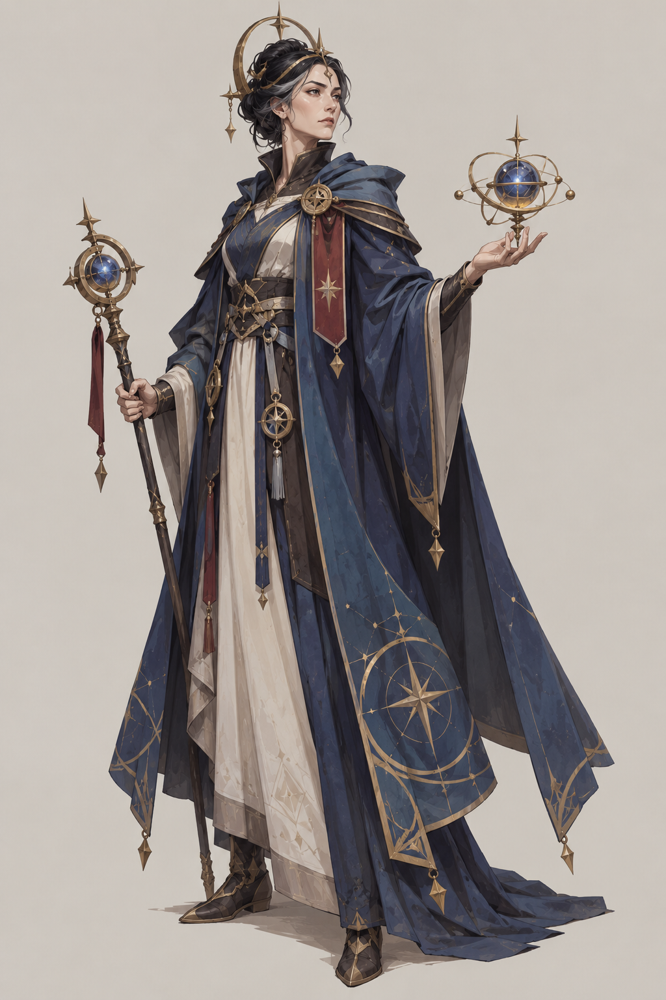
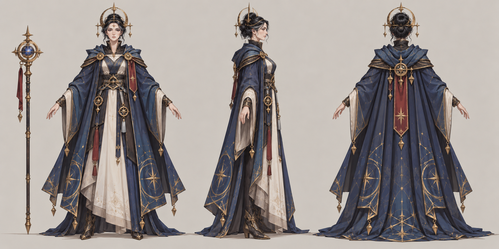

# 先知

| 文档属性 | 内容 |
|---|---|
| 单位编号 | UNT-010 |
| 版本 | v0.1 |
| 更新日期 | 2026-09-29 |
| 状态 | 单位名称、星象殿招募已确定；光环定位与全部数值为设计提案；价格见本轮原型基线 |
| 规则依赖 | [SYS-CBT-001 · 战斗与护甲规则](../系统/战斗与护甲规则.md) · [SYS-MOV-001 · 距离与移动速度标准](../系统/距离与移动速度标准.md) · [SYS-BHV-001 · 单位行为与警戒规则](../系统/单位行为与警戒规则.md) |

[返回文档目录](../../游戏设计文档.md)

<!-- combat-baseline-20261008:start -->
## 原型数值基线（2026-10-08 · 第二轮）

成本 **4200 金币 + 25 魔晶**；维持费 **200 金币/分钟**，人口机会成本另计。招募加成只作用于之后招募的单位，基础值与本数加成只乘一次。 普通攻击频率+25%=间隔×0.8，同类光环取强；不缩治疗、护盾、召唤冷却。

本节为原型参数，不代表真人试玩已平衡。正文历史强度示例若使用修订前参数，须重新验算；不以历史例子的胜负作为新版本承诺。详见[生存数值配置](../系统/生存数值配置.md)。
<!-- combat-baseline-20261008:end -->

## 1. 单位定位

先知是**光环辅助单位**，在[星象殿](../建筑/军事建筑/星象殿.md)招募（已确定）。它自己不攻击，站在队伍里，让周围友军**攻击更快**，同时拥有**较远的视野**，替队伍看得更远。

先知的名字与星象殿的主题相符：能预见战况，替友军「指路」。

## 2. 属性表

| 属性 | 当前设定 | 状态 |
|---|---|---|
| 最大生命值 | **180** | 设计提案 |
| 护甲 | **0** | 设计提案 |
| 攻击 | 无，不会攻击 | 设计提案 |
| 光环 | 周围 **10 m** 内的友方单位攻击间隔缩短 **20%**（攻击速度约 +25%） | 设计提案 |
| 视野 | **18 m** | 设计提案，远大于普通单位（10 m） |
| 移动速度 | **3 m/s**（标准档） | 设计提案 |
| 招募建筑 | [星象殿](../建筑/军事建筑/星象殿.md) | 已确定 |
| 招募时间 | **35 秒** | 设计提案 |
| 招募成本 | 4200 金币 + 25 魔晶 | 本轮原型基线（待试玩） |
| 人口占用 | 占用 **1** 名人口 | 设计提案 |
| 维持费 | 200 金币 / 分钟 | 本轮原型基线（待试玩） |

## 3. 光环规则（设计提案）

| 规则 | 内容 |
|---|---|
| 类型 | 被动光环，单位上有图标显示 |
| 对象 | 范围内的所有友方**单位**，不含建筑；不含先知自己（本身不攻击） |
| 效果 | 攻击间隔缩短 20%，即攻击速度约提高 25%；只影响普通攻击，不影响技能的触发概率之外的冷却 |
| 叠加 | 多个先知的光环**不叠加**，取最强一个 |
| 影响古塞奇尤 | 有效，她的攻击更快，连环闪电触发次数也更多 |

## 4. 强度检验

| 项目 | 结果 |
|---|---|
| 民兵（攻击间隔 1.5 秒） | 变为 1.2 秒，每秒伤害由 10 提高到 12.5 |
| 火枪手（攻击间隔 2.5 秒） | 变为 2.0 秒，每秒伤害由 16 提高到 20 |
| 10 名单位的队伍 | 总输出约 +25%，等价于多了 2–3 名单位 |
| 绿皮消灭一名先知 | 9 次命中，约 12 秒 |

**设计意图：**先知的价值随队伍规模增长，队伍越大越值得带；单独一个先知没有意义。它和大主教互补：一个提升输出，一个提升续航。

## 5. 待设计内容

| 项目 | 需确定内容 |
|---|---|
| 价格 | 招募成本与维持费 |
| 数值 | 光环范围、加成幅度是否合适 |
| 视野共享 | 先知的大视野是否让所有友军共享（目前只自己获得视野） |
| 星象殿升本 | 升本后新招募的先知血量提升，光环不随升本提升（避免叠加放大），见[星象殿](../建筑/军事建筑/星象殿.md) |
| 美术 | 概念图与模型规范 |

## 6. 关联文档

[星象殿](../建筑/军事建筑/星象殿.md) · [大主教](大主教.md) · [防御术士](防御术士.md) · [星术士](星术士.md) · [古塞奇尤](古塞奇尤.md) · [民兵](民兵.md) · [火枪手](火枪手.md)

## 7. 版本记录

| 版本 | 日期 | 变更 |
|---|---|---|
| v0.1 | 2026-09-29 | 建立文档：星象殿招募的光环辅助单位；数值为设计提案 |

### 先知概念图（2026-09-30 美术提案）

造型、配色、服装及装饰为美术提案，尚未确认为最终设定；玩法与数值以本文原有规则为准。

[生成提示词](../美术/主城/敌人与建筑设定图/先知-概念图-v1-提示词.txt) · [设定图索引](../美术/主城/敌人与建筑设定图/设定图索引.md)

### 先知三视图（2026-10-01）

以当前概念图为参考的正面、右侧和背面美术图。建模前需校准尺寸、遮挡与细部。

[生成提示词](../美术/主城/敌人与建筑设定图/先知-Apose三视图-v1-提示词.txt)

### 本轮数值版本记录

| 版本 | 日期 | 变更 |
|---|---|---|
| 2026.10.08-B2 | 2026-10-08 | 第二轮原型成本、维护与战斗边界；历史例需按新参数重验 |
