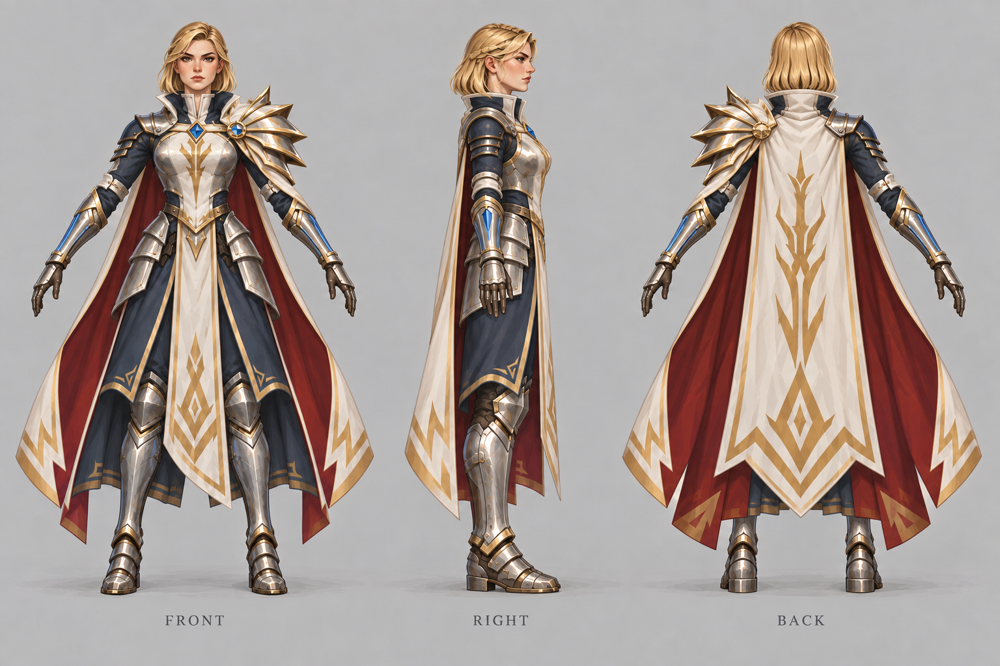

# 古塞奇尤

| 文档属性 | 内容                                                                                                                                        |
| ---- | ----------------------------------------------------------------------------------------------------------------------------------------- |
| 单位编号 | HRO-001                                                                                                                                   |
| 版本   | v1.0                                                                                                                                      |
| 更新日期 | 2026-10-08                                                                                                                                |
| 状态   | 身份、头衔、英雄定位、被动技能「连环闪电」机制、阵亡复活规则、最高 15 级已确定；属性、技能数值与经验成长为设计提案                                                                                            |
| 规则依赖 | [SYS-CBT-001 · 战斗与护甲规则](../系统/战斗与护甲规则.md) · [SYS-MOV-001 · 距离与移动速度标准](../系统/距离与移动速度标准.md) · [SYS-BHV-001 · 单位行为与警戒规则](../系统/单位行为与警戒规则.md) |

[返回文档目录](../../游戏设计文档.md)

## 1. 角色定位

古塞奇尤是**英雄单位**，也是发起复活仪式的**孙女**，头衔为**代理领主**，见 [世界观与角色](../世界观与角色.md)。她在主角到来之前代为执掌主城，冒险模式的剧情围绕她展开。

- **开局即在场**：第一关地图上就有主城、开拓者和古塞奇尤。
- **唯一单位**：不能招募，全场只有一位。
- **魔法一侧的代表**：这个世界原本只有魔法。主角带来科技，古塞奇尤代表本土魔法，后续魔法方向的解锁可以由她引出。

## 2. 头衔

**代理领主**（已确定）。祖先复活之前，由古塞奇尤代为执掌领地与主城。

## 3. 属性表（设计提案）

| 属性 | 提案值 | 说明 |
|---|---|---|
| 最大生命值 | **600** | 约为民兵的 4 倍 |
| 护甲 | **5**（减伤约 14.3%） | |
| 攻击力 | **30** / 次，远程魔法，单体 | |
| 攻击间隔 | **1.5 秒**（每秒伤害 20） | 与民兵、箭塔、绿皮一致，便于比较 |
| 攻击距离 | **8 m** | 施法者，站在民兵身后输出 |
| 移动速度 | **3 m/s**（标准档） | |
| 视野 | **12 m** | |
| 警戒距离 | **8 m** | 与攻击距离相同 |
| 维持费 | 无 | |
| 人口占用 | 无 | |

## 4. 技能：连环闪电（被动）

**普通攻击有概率额外释放闪电，闪电在多个敌人之间跳跃。被动触发，不需要操作**（已确定），用来减轻操作压力。

| 参数 | 提案值 |
|---|---|
| 触发概率 | 每次攻击 **25%** |
| 闪电伤害 | 每个目标 **40**，跳跃不衰减 |
| 命中目标数 | 最多 **4 个**：首个目标 + 跳跃 3 次 |
| 跳跃距离 | 相邻目标之间不超过 **5 m** |
| 目标限制 | 只跳向敌方单位；同一道闪电不重复命中同一目标 |

闪电伤害在普通攻击之外额外结算。古塞奇尤的普通攻击和连环闪电都是魔法伤害，**无视目标护甲**（已确定，见[战斗与护甲规则](../系统/战斗与护甲规则.md)）。

## 5. 阵亡与复活（已确定）

**古塞奇尤阵亡 2 分钟后在主城复活，复活消耗 10000 金币。**

| 参照 | 结果 |
|---|---|
| 10000 金币 ≈ 住满的木屋产出 | 约 5.5 分钟 |
| 10000 金币 ≈ 击杀普通绿皮 | 约 33 只（平均 300 金币） |

阵亡代价很高，前期尤其明显。玩家需要保护好英雄，不能拿她硬扛大规模进攻。

设计提案：

- 阵亡不导致关卡失败。
- 复活倒计时结束时自动扣除 10000 金币；金币不足时，等金币凑够后立即复活。
- 复活后生命值全满。

## 6. 等级与成长

**古塞奇尤最高 15 级**（已确定）。她的等级是法师营地升本的门槛，见 [科技系统](../系统/科技系统.md)。

### 6.1 经验来源（设计提案）

| 来源 | 经验 |
|---|---|
| 古塞奇尤亲手击杀普通绿皮 | **10** |
| 附近 15 m 内友方单位或塔击杀普通绿皮 | **5**（一半） |

设计理由：大部分绿皮会被箭塔和士兵打死。只算亲手击杀时，玩家只能把英雄推到最前线，风险太大；附近击杀也给一半经验，她站在防线后方同样能成长。

### 6.2 升级所需经验（设计提案）

从 N 级升到 N+1 级需要 **100 × N** 经验。

| 等级 | 升到该级所需经验 | 累计经验 | 约合亲手击杀 | 意义 |
|---|---|---|---|---|
| 2 | 100 | 100 | 10 只 | |
| 5 | 400 | 1000 | 100 只 | 法师营地可建成（2 本） |
| 10 | 900 | 4500 | 450 只 | 法师营地可升 3 本 |
| 15 | 1400 | 10500 | 1050 只 | 满级 |

### 6.3 属性成长（设计提案）

| 属性 | 每级成长 | 1 级 | 15 级 |
|---|---|---|---|
| 最大生命值 | +40 | 600 | 1160 |
| 攻击力 | +3 | 30 | 72 |

护甲、攻击间隔、射程、连环闪电的数值不随等级成长；闪电由法师营地的研究强化。

### 6.4 其他规则（设计提案）

- 阵亡**不损失经验和等级**。复活费用固定 10000 金币，不随等级增加。
- 升级时回满生命值。

## 7. 强度检验

普通绿皮属性以设计提案为准：**200 生命、20 攻击、1.5 秒攻击间隔、无护甲、近战**。

| 项目 | 结果 |
|---|---|
| 绿皮每次对古塞奇尤的实际伤害 | 20 × 30 ÷ 35 ≈ 17.1 |
| 一只绿皮击杀古塞奇尤 | 35 次命中，约 52 秒 |
| 古塞奇尤击杀一只绿皮 | 平均约 6 次攻击，约 9 秒（含闪电期望） |
| 闪电对成群绿皮的期望伤害 | 每次攻击平均 40（25% × 40 × 4 个目标） |

| 对抗情况 | 结果 |
|---|---|
| 1 vs 2 绿皮 | 古塞奇尤稳赢 |
| 1 vs 3 绿皮 | 勉强获胜，所剩生命不多 |
| 1 vs 5 绿皮 | 古塞奇尤阵亡，需要民兵和箭塔配合 |

**设计意图：**古塞奇尤能单独处理小股绿皮，对成群绿皮有明显的清场能力，但顶不住大规模进攻，仍需要防线配合。

## 8. 待设计内容

| 项目 | 需确定内容 |
|---|---|
| 成长 | 是否在特定等级解锁新技能 |
| 更多技能 | 主动技能、光环等 |
| 美术 | v4 面容未采纳；v5 恢复 v3 面容方向，发型改为简洁侧分短发；概念稿与 A-pose 三视图独立保存，造型待确认 |

## 9. 关联文档

[世界观与角色](../世界观与角色.md) · [科技系统](../系统/科技系统.md) · [游戏模式与关卡](../游戏模式与关卡.md) · [主城设计](../建筑/经营建筑/主城设计.md) · [民兵](民兵.md) · [普通绿皮](../敌人/普通绿皮.md)

## 10. 版本记录

| 版本 | 日期 | 变更 |
|---|---|---|
| v0.1 | 2026-09-28 | 建立文档：确定孙女古塞奇尤为英雄单位、开局在场、被动技能连环闪电；提出属性、技能数值与头衔候选 |
| v0.2 | 2026-09-28 | 确定头衔代理领主；阵亡 2 分钟后在主城复活，消耗 500 金币 |
| v0.3 | 2026-09-28 | 补充古塞奇尤概念及正面／右侧／背面设定图 v1，外观细节作为美术提案 |
| v0.4 | 2026-09-28 | 根据用户反馈修订为金发女骑士外观、保留魔法英雄定位；v1 不再作为当前形象方向，v2 因出图额度限制待生成 |
| v0.5 | 2026-09-29 | 补齐金发女骑士外观的设定图 v2，保留施法者定位；更新当前图稿链接 |
| v0.6 | 2026-09-29 | 根据用户“像杂兵、缺少英雄感”的反馈重做 v3：强化独特轮廓、领主披风和施法护臂；v2 未采纳 |
| v0.7 | 2026-09-29 | 简化为金色低马尾、调整偏东亚女性面容；v4 拆分为独立概念图与 A-pose 三视图，供造型和建模参考 |
| v0.8 | 2026-09-29 | 按最新反馈恢复 v3 面容方向，发型改为简洁侧分短发；v5 概念图与 A-pose 三视图独立保存，待确认 |
| v0.9 | 2026-09-29 | 加入等级系统：最高 15 级，提出经验来源、升级曲线与属性成长 |
| v1.0 | 2026-10-08 | 金币数量级整体 ×20（价格、维持费、奖励同比放大，平衡不变） |

## 11. 美术设定图（英雄造型提案 v5）

**当前方向：金发女骑士外观，恢复 v3 的面容方向，改为简洁侧分短发，保留代理领主与魔法英雄的辨识度。**v1 的长衣法师方向未符合预期；v2 因英雄感不足未采纳；v3 的发型被指出过于复杂，且概念姿态与三视图不应混在一张图中。

### 11.1 当前造型

- **面容**：按用户最新反馈恢复 v3 面容方向，保留沉着、坚定的英雄气质；v4 的偏东亚面容未采纳。
- **发型**：金色侧分短发，长度在颈部附近，以清晰的大体块形成紧凑轮廓；不采用低马尾、复杂盘髻或多层散发，便于游戏内实现。
- **英雄轮廓**：保留左肩放射状不对称肩甲、高立领、象牙白领主披风与深蓝内搭。
- **身份与能力**：胸甲／披风的大型金色分枝闪电纹样及蓝色施法护臂延续英雄辨识度；闪电电弧仅出现在概念图中。

纹章与护臂均为美术提案，不新增家族背景、装备机制或技能，不调整现有玩法数值。v5 具体造型尚待用户确认。

### 11.2 独立概念图

用于展示英雄气质、色彩与施法姿态，仅绘制一个完整人物。

![[Pasted image 20260929005737.png]][概念图提示词 v5](../美术/主城/敌人与建筑设定图/古塞奇尤-概念图-提示词-v5.txt)

### 11.3 独立 A-pose 三视图

正面、右侧、背面单独成图，统一人物高度与站姿；双臂斜向展开，肘部伸直，双脚平行分开，移除施法动作和电弧。侧面为相同姿势的侧向投影，手臂会自然重叠、缩短。后续人物三视图沿用这一独立图稿要求。

[A-pose 三视图提示词 v5](../美术/主城/敌人与建筑设定图/古塞奇尤-Apose三视图-提示词-v5.txt)

三视图用于造型与建模参考，不等于严格尺寸图。建模时仍需统一肩甲分片、披风下摆及布料结构，并检验肩甲与手臂活动、短发与立领、长披风与腿部之间的穿插。

### 11.4 历史图稿

[v4 概念图（面容未采纳）](../美术/主城/敌人与建筑设定图/古塞奇尤-概念图-v4.png) · [v4 A-pose 三视图](../美术/主城/敌人与建筑设定图/古塞奇尤-Apose三视图-v4.png)

[v3 混合设定图](../美术/主城/敌人与建筑设定图/古塞奇尤-设定图-v3.png) · [v3 提示词](../美术/主城/敌人与建筑设定图/古塞奇尤-提示词-v3.txt) · [v2（英雄感不足，未采纳）](../美术/主城/敌人与建筑设定图/古塞奇尤-设定图-v2.png) · [v2 提示词](../美术/主城/敌人与建筑设定图/古塞奇尤-提示词-v2.txt) · [v1](../美术/主城/敌人与建筑设定图/古塞奇尤-设定图-v1.png) · [v1 提示词](../美术/主城/敌人与建筑设定图/古塞奇尤-提示词-v1.txt)

[设定图索引](../美术/主城/敌人与建筑设定图/设定图索引.md)
