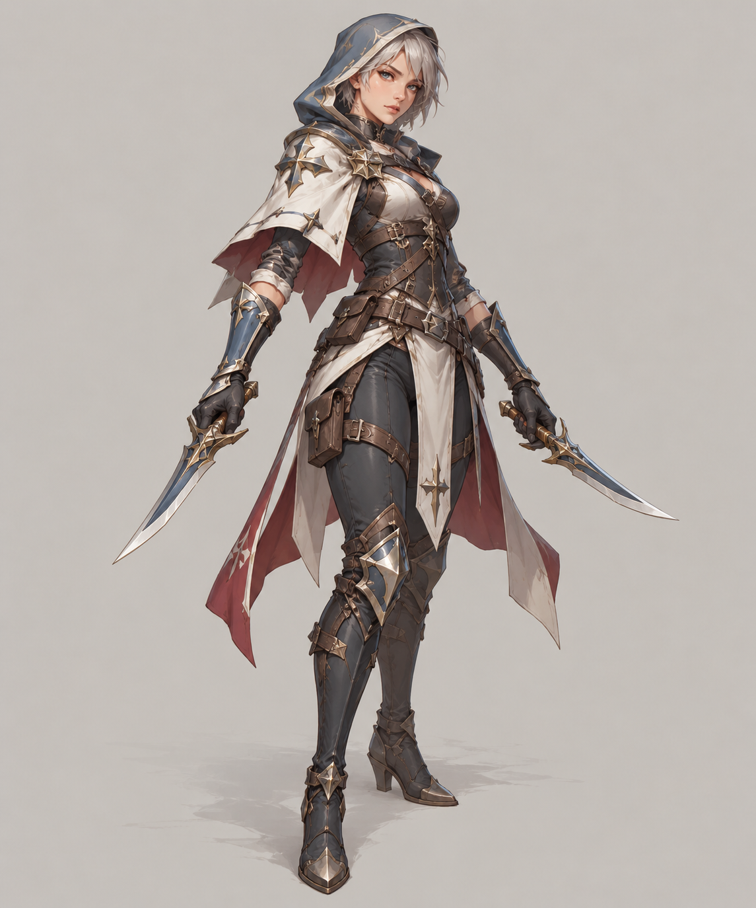
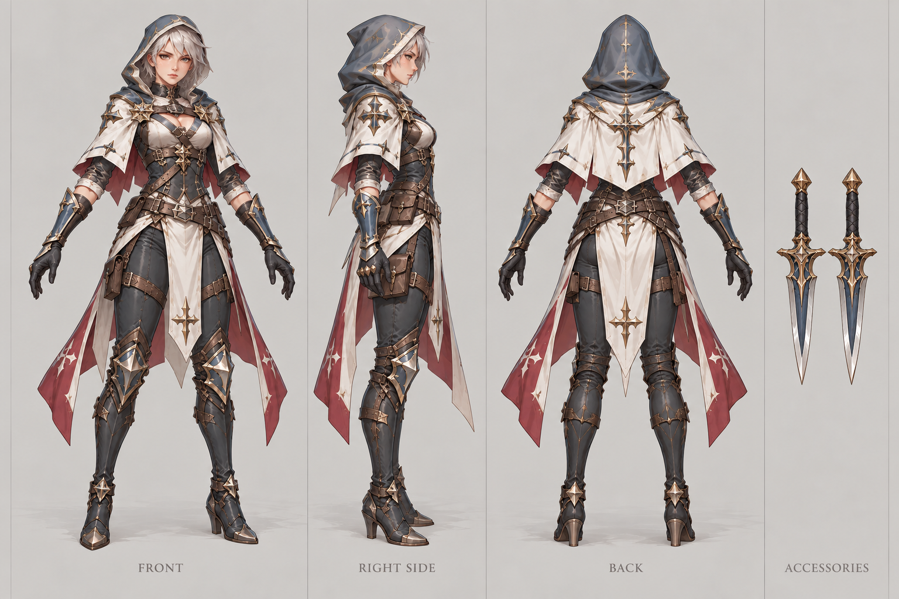

# 圣堂刺客

| 文档属性 | 内容 |
|---|---|
| 单位编号 | UNT-005 |
| 版本 | v0.5 |
| 更新日期 | 2026-10-08 |
| 状态 | 单位名称、在圣堂招募、需要解锁后才能招募、生命值 150、移动速度 4.2 m/s、被动技能（攻击额外造成目标生命值 20% 伤害），已确定；其余属性为设计提案；价格见本轮原型基线 |
| 规则依赖 | [SYS-CBT-001 · 战斗与护甲规则](../系统/战斗与护甲规则.md) · [SYS-MOV-001 · 距离与移动速度标准](../系统/距离与移动速度标准.md) · [SYS-BHV-001 · 单位行为与警戒规则](../系统/单位行为与警戒规则.md) |

[返回文档目录](../../游戏设计文档.md)

<!-- combat-baseline-20261008:start -->
## 原型数值基线（2026-10-08 · 第二轮）

成本 **3400 金币 + 12 魔晶**；维持费 **180 金币/分钟**，人口机会成本另计。招募加成只作用于之后招募的单位，基础值与本数加成只乘一次。 基础每击20 + 当前HP20%的物理额外伤害；额外部分原型上限80/击，当前HP取此次命中前，整体过护甲；3本基础28，不将20%再×1.4。

本节为原型参数，不代表真人试玩已平衡。正文历史强度示例若使用修订前参数，须重新验算；不以历史例子的胜负作为新版本承诺。详见[生存数值配置](../系统/生存数值配置.md)。
<!-- combat-baseline-20261008:end -->

## 1. 单位定位

圣堂刺客是**高爆发的近战突击单位**，在[圣堂](../建筑/军事建筑/圣堂.md)招募，**开局不能招募，必须先在圣堂中解锁**（已确定）。

它的定位（设计提案）：**移动快、输出高**。因为需要解锁，它整体上要**强于开局就能招募的[民兵](民兵.md)**（已确定的原则：解锁单位比最初等的单位厉害）。它与民兵的「肉盾」定位不同，更适合绕到侧面或者跟在民兵后面补输出。这是魔法一侧第一个攻击单位，和[牧师](牧师.md)的治疗形成搭配。

## 2. 属性表

| 属性 | 当前设定 | 状态 |
|---|---|---|
| 最大生命值 | **150** | 已确定，与民兵相同 |
| 护甲 | **0** | 设计提案 |
| 攻击力 | **20** / 次，近战单体（另有技能额外伤害） | 设计提案；因为加了技能，基础攻击从 30 下调到 20 |
| 攻击间隔 | **1.25 秒**（基础每秒伤害 16） | 设计提案 |
| 技能 | 被动：每次攻击额外造成目标当前生命值 **20%** 的伤害 | 已确定「攻击造成敌人生命值 20% 的额外伤害」；按当前生命值计算为设计提案 |
| 攻击距离 | **1 m** | 设计提案，与民兵、绿皮相同 |
| 移动速度 | **4.2 m/s**（快档上沿，约为标准的 140%） | 已确定 |
| 视野 | **10 m** | 设计提案 |
| 警戒距离 | **8 m** | 设计提案 |
| 招募建筑 | [圣堂](../建筑/军事建筑/圣堂.md) | 已确定 |
| 解锁条件 | 需要在圣堂中解锁后才能招募 | 已确定；范围（是否对所有圣堂生效）、价格与前置条件见下 |
| 招募时间 | **20 秒** | 设计提案 |
| 招募成本 | 3400 金币 + 12 魔晶 | 本轮原型基线（待试玩） |
| 人口占用 | 占用 **1** 名人口 | 设计提案，与其他单位一致 |
| 维持费 | 180 金币 / 分钟 | 本轮原型基线（待试玩） |

### 2.1 技能：生命汲取斩（暂定名，被动）

**每次攻击都会额外造成敌人生命值 20% 的伤害**（已确定）。被动触发，不需要操作，与古塞奇尤的连环闪电一样减轻操作压力。

| 参数 | 提案值 |
|---|---|
| 触发 | 每次攻击必定触发，不是概率 |
| 额外伤害 | 目标**当前**生命值的 **20%** |
| 对象 | 敌方单位，不作用于建筑 |
| 护甲 | 额外伤害与普通攻击一样，**受目标护甲影响**，属于物理伤害（魔法伤害才无视护甲，见[战斗与护甲规则](../系统/战斗与护甲规则.md)） |
| 伤害上限 | 额外部分每击上限 **80**（原型值，取命中前当前生命值，整体过护甲）；无上限时 3 名刺客即可换掉一只巨怪，刺客会成为唯一的首领解法，故设上限 |

**为什么按当前生命值：**满血时额外伤害最高，越打越低，天然形成收益递减，不会在最后几下白白溢出；同时对高血量的精英、首领仍有明显的一击。若按最大生命值计算，每次额外伤害恒定，对首领类敌人会过强。

**示例（对 200 生命的普通绿皮）：**

| 第几下 | 目标剩余生命 | 普通攻击 | 额外伤害 | 命中后剩余 |
|---|---|---|---|---|
| 1 | 200 | 20 | 40 | 140 |
| 2 | 140 | 20 | 28 | 92 |
| 3 | 92 | 20 | 18.4 | 53.6 |
| 4 | 53.6 | 20 | 10.7 | 22.9 |
| 5 | 22.9 | 20 | 4.6 | 击杀 |

## 3. 解锁规则（设计提案）

与[火枪手](火枪手.md)在兵营的解锁方式保持一致，便于玩家理解：

| 规则 | 内容 |
|---|---|
| 解锁位置 | 在圣堂中操作，解锁前对应按钮处于锁定状态 |
| 解锁范围 | 在任意一座圣堂解锁一次，对所有圣堂生效 |
| 解锁花费 | 一次性花费 **2000 金币 + 15 魔晶**，研究 **40 秒**（见[成本体系](../系统/成本体系.md) §5） |
| 前置条件 | 设计提案：仅需**圣堂已建成**并完成一次全局解锁，不增设古塞奇尤等级或本数门槛（法师营地建成已要求英雄 Lv5，再加等级会卡住魔法线；刺客是魔法线不依赖魔法的破咒解药，需在破咒首现前到手） |

## 4. 强度检验

普通绿皮属性以设计提案为准：**200 生命、20 攻击、1.5 秒攻击间隔、无护甲、近战、移动速度 3 m/s**。

| 项目 | 结果 |
|---|---|
| 圣堂刺客消灭一只绿皮 | 5 次命中，约 5 秒（含技能额外伤害） |
| 绿皮消灭一名圣堂刺客 | 8 次命中，约 10.5 秒 |
| 1 圣堂刺客 vs 1 绿皮 | 刺客胜，剩约 70 生命 |
| 1 圣堂刺客 + 1 民兵 vs 1 绿皮 | 约 4 秒击杀，刺客几乎无损 |
| 与民兵比较 | 基础输出约 1.6 倍，技能对满血目标的首次攻击伤害翻倍以上，血量相同，速度快 40% |

**设计意图：**
- 民兵单挑绿皮会败，刺客单挑明显能胜，体现「解锁单位强于开局单位」。
- 技能让刺客对**高血量目标**格外有效：对 1000 生命的目标，首击的额外伤害就有 200；对低血量的杂兵则主要靠基础攻击。这使它成为未来精英、首领类敌人的针对手段。
- 血量与民兵相同，不算肉盾，仍需要牧师治疗和民兵保护。
- 速度 4.2 m/s 是快档上沿，适合快速支援远处的采矿场或哨塔，或者去清理零星的敌人。
- 现有 10 种敌人，已有绿皮弓手、投矛绿皮等远程后排，刺客「优先击杀后排」有了对象；对铁皮绿皮（甲 30，额外部分减半）较弱，对破咒小子（魔免）则是物理解药，见各敌人文档。

## 5. 待设计内容

| 项目 | 需确定内容 |
|---|---|
| 技能 | 是否再加主动技能（绕背、隐身等）；额外伤害的基准与上限已按原型基线定为当前生命值、≤ 80/击 |
| 数值 | 基础伤害 20、攻击间隔 1.25 秒是否合适（生命值 150、速度 4.2 m/s 已确定） |
| 升级 | 圣堂升本后新招募的刺客生命值与基础攻击提升（2 本 +20%、3 本 +40%），百分比伤害不受加成，见[圣堂](../建筑/军事建筑/圣堂.md)第 4 节 |
| 美术 | 概念图与模型规范 |

## 6. 关联文档

[圣堂](../建筑/军事建筑/圣堂.md) · [牧师](牧师.md) · [民兵](民兵.md) · [火枪手](火枪手.md) · [古塞奇尤](古塞奇尤.md) · [普通绿皮](../敌人/普通绿皮.md) · [距离与移动速度标准](../系统/距离与移动速度标准.md)

## 7. 版本记录

| 版本 | 日期 | 变更 |
|---|---|---|
| v0.1 | 2026-09-29 | 建立文档：圣堂招募的近战突击单位，需要解锁；属性为设计提案 |
| v0.2 | 2026-09-29 | 确定生命值 150、移动速度 4.2 m/s；写明解锁单位强于开局单位的原则，更新强度检验 |
| v0.3 | 2026-09-29 | 加入被动技能：每次攻击额外造成目标生命值 20% 的伤害；基础攻击由 30 下调为 20，更新强度检验 |
| v0.4 | 2026-10-08 | 金币数量级整体 ×20（价格、维持费、奖励同比放大，平衡不变） |

### 圣堂刺客概念图（2026-09-30 美术提案）

造型、配色、服装及装饰为美术提案，尚未确认为最终设定；玩法与数值以本文原有规则为准。

[生成提示词](../美术/主城/敌人与建筑设定图/圣堂刺客-概念图-v1-提示词.txt) · [设定图索引](../美术/主城/敌人与建筑设定图/设定图索引.md)

### 圣堂刺客三视图（2026-10-02 修订）

以当前概念图为参考的正面、右侧和背面美术图。三栏人物均空手，两把匕首作为一组只在最右栏出现一次，每栏留有裁切边界。建模前需校准尺寸、遮挡与细部。

[生成提示词](../美术/主城/敌人与建筑设定图/圣堂刺客-Apose三视图-v2-提示词.txt)

### 本轮数值版本记录

| 版本 | 日期 | 变更 |
|---|---|---|
| 2026.10.08-B2 | 2026-10-08 | 第二轮原型成本、维护与战斗边界；历史例需按新参数重验 |
| v0.5 | 2026-10-08 | 第五轮同步：额外部分上限 80/击入正文；解锁价 2000 金 + 15 魔晶/40 秒；前置改设计提案（仅需圣堂建成）；删已覆盖的待设计行；订正「只有普通绿皮」过期句 |
