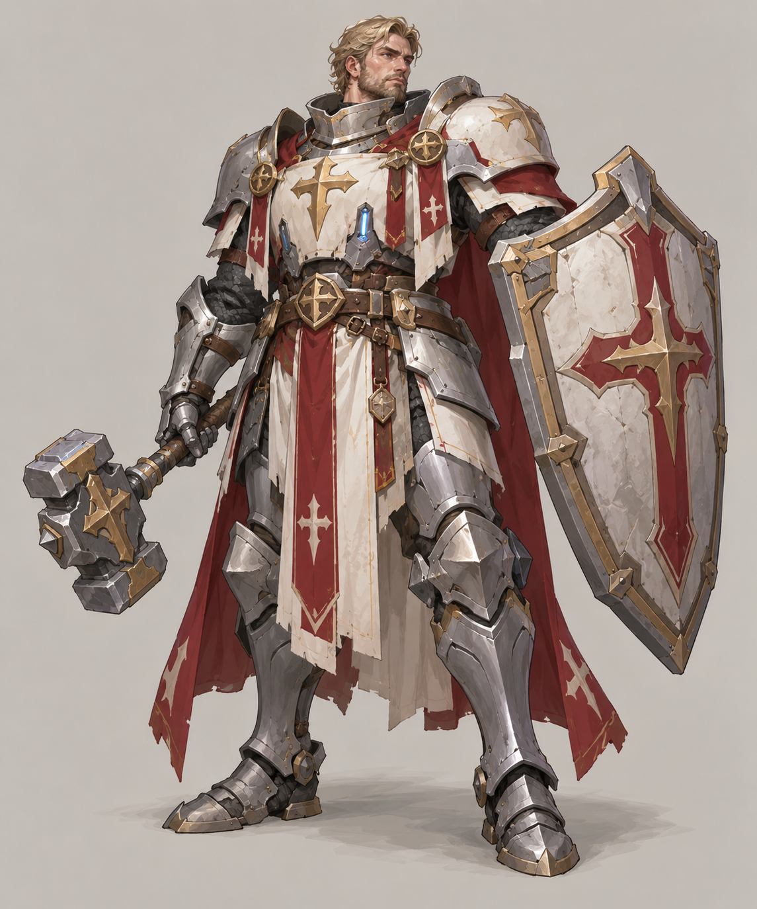
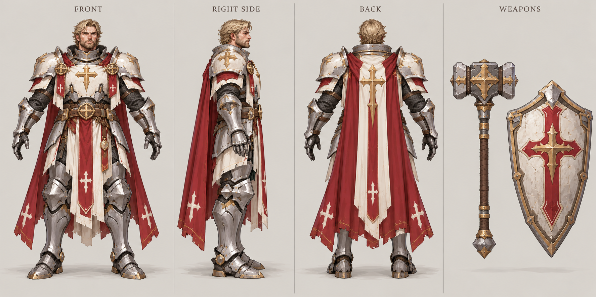

# 圣骑士

| 文档属性 | 内容 |
|---|---|
| 单位编号 | UNT-006 |
| 版本 | v0.2 |
| 更新日期 | 2026-09-29 |
| 状态 | 单位名称、需要科技 2 本才能使用、需要解锁、自带增加自身回血的技能、带有一点现代装饰，已确定；招募建筑、定位与具体数值为设计提案；价格待定 |
| 规则依赖 | [SYS-TEC-001 · 科技系统](../系统/科技系统.md) · [SYS-CBT-001 · 战斗与护甲规则](../系统/战斗与护甲规则.md) · [SYS-MOV-001 · 距离与移动速度标准](../系统/距离与移动速度标准.md) |

[返回文档目录](../../游戏设计文档.md)

## 1. 单位定位

圣骑士是**重甲近战的前排单位**，**需要科技 2 本才能使用**（已确定），外观上**带有一点现代的装饰**（已确定），体现主角带来的科技与本土圣职传统的结合。

它的定位（设计提案）：**血厚、护甲高、稳稳站在前排**。与[圣堂刺客](圣堂刺客.md)的「高爆发、低防御」相对，圣骑士是「高防御、中输出」，是需要投入更多才能用上的强力前排，强于开局的[民兵](民兵.md)。

## 2. 使用条件（已确定 + 设计提案）

| 条件 | 内容 | 状态 |
|---|---|---|
| 科技本数 | 研究院建成（科技 2 本） | 已确定「需要科技二本」 |
| 招募建筑 | [圣堂](../建筑/圣堂.md) | 设计提案，名字带「圣」，与魔法一侧的圣堂搭配 |
| 解锁 | 需要在圣堂中解锁后才能招募 | 已确定 |
| 解锁范围 | 在任意一座圣堂解锁一次，对所有圣堂生效 | 设计提案，与火枪手、圣堂刺客一致 |
| 解锁顺序 | 先满足科技 2 本，才能在圣堂中进行解锁；科技 2 本不足时按钮不可用 | 设计提案 |
| 解锁花费 | 一次性花费，价格与时间待定 | 待定 |

这使圣骑士成为**魔法与科技两个体系的混合单位**：需要建成圣堂（魔法 2 本）才有招募地点，又需要研究院（科技 2 本）才能使用。走单一体系的玩家用不了它，鼓励两条路线同时发展，见[科技系统](../系统/科技系统.md)。

## 3. 属性表

| 属性 | 当前设定 | 状态 |
|---|---|---|
| 最大生命值 | **320** | 设计提案，约为民兵的 2.1 倍 |
| 护甲 | **10**（减伤 25%） | 设计提案 |
| 攻击力 | **25** / 次，近战单体 | 设计提案 |
| 攻击间隔 | **1.5 秒**（每秒伤害约 16.7） | 设计提案 |
| 攻击距离 | **1 m** | 设计提案 |
| 移动速度 | **3 m/s**（标准档） | 设计提案 |
| 视野 | **10 m** | 设计提案 |
| 警戒距离 | **8 m** | 设计提案 |
| 招募建筑 | [圣堂](../建筑/圣堂.md) | 设计提案 |
| 使用条件 | 科技 2 本，并在圣堂中解锁 | 已确定 |
| 技能 | 被动：增加自身回血，每秒恢复最大生命值的 **2%**（约 6.4 点 / 秒） | 已确定「增加自己的回血」；具体数值为设计提案 |
| 招募时间 | **25 秒** | 设计提案 |
| 招募成本 | 待定 | 后面单独确定 |
| 人口占用 | 占用 **1** 名人口 | 设计提案 |
| 维持费 | 待定 | 后面单独确定；应高于民兵（5 金币 / 分钟） |

### 3.1 技能：圣光庇佑（暂定名，被动）

**圣骑士自身有一个技能，可以增加自己的回血**（已确定）。

| 参数 | 提案值 |
|---|---|
| 类型 | 被动，战斗中与战斗外都生效，不需要操作（已确定） |
| 表现 | 效果就是自己的回血比较多；单位上有一个**图标**显示这个被动（已确定），不额外增加特效或操作 |
| 回血速度 | 每秒恢复自身最大生命值的 **2%**（320 生命时约 6.4 点 / 秒） |
| 与治疗叠加 | 与[牧师](牧师.md)的治疗可以叠加 |
| 对象 | 只对自己生效，不影响附近友军 |
| 生命值上限 | 回血不会超过最大生命值 |

一名普通绿皮对圣骑士的实际输出约每秒 10 点，被动回血抵消了其中约 64%；加上一名牧师（每秒 12），就足以完全抵消 1 只绿皮的输出。这是圣骑士作为持久前排的核心。

## 4. 与其他近战单位的比较

| 单位 | 生命值 | 护甲 | 每秒伤害 | 速度 | 定位 |
|---|---|---|---|---|---|
| [民兵](民兵.md) | 150 | 0 | 10 | 3 | 基础前排 |
| [圣堂刺客](圣堂刺客.md) | 150 | 0 | 16 起，另有技能 | 4.2 | 突击输出 |
| **圣骑士** | 320 | 10 | 16.7 | 3 | 重甲前排 |

## 5. 强度检验

普通绿皮属性以设计提案为准：**200 生命、20 攻击、1.5 秒攻击间隔、无护甲、近战**。

| 项目 | 结果 |
|---|---|
| 绿皮每次对圣骑士的实际伤害 | 20 × 30 ÷ 40 = 15 |
| 圣骑士消灭一只绿皮 | 8 次命中，约 10.5 秒 |
| 绿皮消灭一名圣骑士 | 22 次命中，约 31.5 秒 |
| 1 圣骑士 vs 1 绿皮 | 圣骑士胜，剩约 280 生命（含被动回血） |
| 1 圣骑士 vs 2 只绿皮 | 圣骑士胜，剩约 140 生命 |
| 1 圣骑士 vs 3 只绿皮 | 圣骑士败 |
| 1 圣骑士 + 1 牧师 vs 3 只绿皮 | 牧师每秒 12 加被动约 6.4，合计每秒恢复约 18，圣骑士勉强获胜 |

**设计意图：**
- 单个圣骑士能稳稳守住 2 只绿皮，强度接近一座多重箭塔的一半；它可以移动，机动性是它相对塔的优势。
- 被动回血让它在战斗间隙自己恢复，减少对牧师的依赖，适合长时间驻守前线。
- 与牧师配合最好：治疗与被动回血叠加，使它能扛住 3 只绿皮。
- 要用上它，玩家要同时建成圣堂和研究院，成本高，所以强度高于开局单位是合理的。

## 6. 美术提案（现代装饰）

圣骑士的外观在传统圣职铠甲的基础上，**带有一点现代的装饰元素**，用来体现主角带来的科技影响。具体元素为美术提案，需要与既有的手绘奇幻 RTS 风格保持一致，装饰只占一小部分，不改变整体的中世纪圣职气质：

- 铠甲上带有金属加固、简单的机械关节或护具细节。
- 少量发光部件（例如胸甲上的能量指示灯、护目镜），颜色与魔法一侧的蓝色施法护臂呼应。

以上仅是方向，不新增或改变玩法数值。概念图与提示词后续另建。

## 7. 待设计内容

| 项目 | 需确定内容 |
|---|---|
| 招募建筑 | 是否确定在圣堂，还是兵营等其他建筑 |
| 解锁 | 解锁的价格、时间；解锁范围是否对所有圣堂生效（提案为是） |
| 技能 | 回血比例（2% / 秒）是否合适；图标的样式与显示位置；是否再加入主动技能（例如短暂护盾） |
| 价格 | 招募成本与维持费 |
| 数值 | 生命值、护甲、伤害是否合适 |
| 升级 | 圣堂升本后新招募的圣骑士生命值与攻击力提升（2 本 +20%、3 本 +40%），被动回血按最大生命值算，同步增加，见[圣堂](../建筑/圣堂.md)第 4 节 |
| 美术 | 概念图与模型规范，现代装饰的具体形式 |

## 8. 关联文档

[圣堂](../建筑/圣堂.md) · [圣堂刺客](圣堂刺客.md) · [牧师](牧师.md) · [民兵](民兵.md) · [科技系统](../系统/科技系统.md) · [普通绿皮](../敌人/普通绿皮.md) · [战斗与护甲规则](../系统/战斗与护甲规则.md)

## 9. 版本记录

| 版本 | 日期 | 变更 |
|---|---|---|
| v0.1 | 2026-09-29 | 建立文档：需要科技 2 本才能使用的重甲近战单位，带有一点现代装饰；招募建筑与数值为设计提案 |
| v0.2 | 2026-09-29 | 加入被动技能：增加自身回血（每秒 2% 最大生命值，提案）；确定需要在圣堂中解锁，且需先满足科技 2 本；更新强度检验；确定技能为被动、效果只是回血更多、有图标显示 |

### 圣骑士概念图（2026-09-30 美术提案）

造型、配色、服装及装饰为美术提案，尚未确认为最终设定；玩法与数值以本文原有规则为准。

[生成提示词](../美术/主城/敌人与建筑设定图/圣骑士-概念图-v1-提示词.txt) · [设定图索引](../美术/主城/敌人与建筑设定图/设定图索引.md)

### 圣骑士三视图（2026-10-02 修订）

以当前概念图为参考的正面、右侧和背面美术图。三栏人物均空手，战锤与盾牌只在最右栏各出现一次，每栏留有裁切边界。建模前需校准尺寸、遮挡与细部。

[生成提示词](../美术/主城/敌人与建筑设定图/圣骑士-Apose三视图-v2-提示词.txt)
