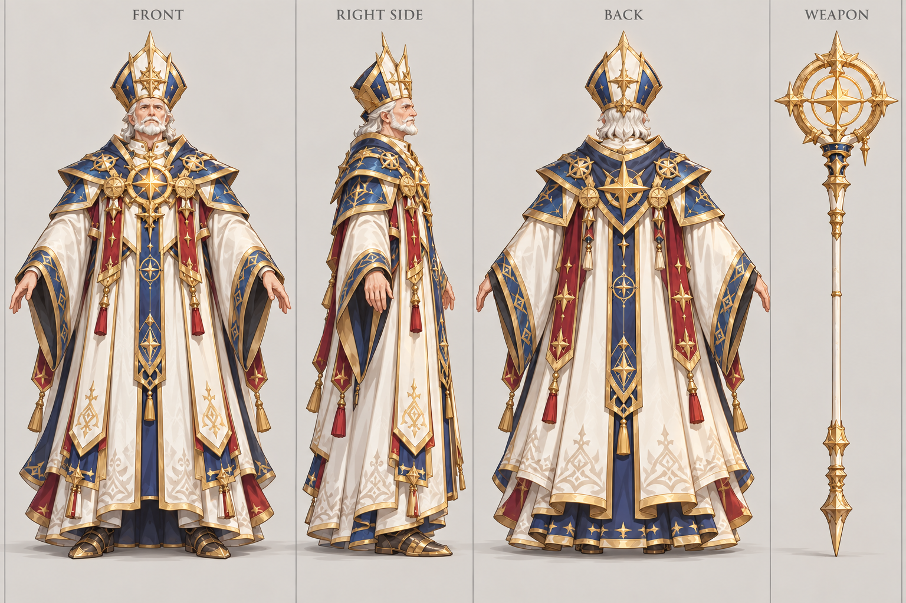

# 大主教

| 文档属性 | 内容 |
|---|---|
| 单位编号 | UNT-009 |
| 版本 | v0.1 |
| 更新日期 | 2026-09-29 |
| 状态 | 单位名称、星象殿招募已确定；定位与全部数值为设计提案；价格待定 |
| 规则依赖 | [SYS-CBT-001 · 战斗与护甲规则](../系统/战斗与护甲规则.md) · [SYS-MOV-001 · 距离与移动速度标准](../系统/距离与移动速度标准.md) · [SYS-BHV-001 · 单位行为与警戒规则](../系统/单位行为与警戒规则.md) |

[返回文档目录](../../游戏设计文档.md)

## 1. 单位定位

大主教是**范围治疗单位**，在[星象殿](../建筑/星象殿.md)招募（已确定）。它是[牧师](牧师.md)的高阶版：牧师一次只治疗一个人，大主教一次治疗**一片**友军，适合大规模作战。

不会攻击，血量比牧师厚，站在阵线后方持续回复整个阵线的血量。

## 2. 属性表

| 属性 | 当前设定 | 状态 |
|---|---|---|
| 最大生命值 | **220** | 设计提案，高于牧师（180） |
| 护甲 | **0** | 设计提案 |
| 攻击 | 无，不会攻击 | 设计提案，与牧师一致 |
| 治疗方式 | 对目标恢复 **60**，目标周围 **4 m** 内的其他友军恢复 **30** | 设计提案 |
| 治疗间隔 | **3.0 秒** | 设计提案 |
| 治疗距离 | **9 m** | 设计提案 |
| 治疗对象 | 友方单位，不含建筑，不含自己 | 设计提案，与牧师一致 |
| 移动速度 | **3 m/s**（标准档） | 设计提案 |
| 视野 | **10 m** | 设计提案 |
| 招募建筑 | [星象殿](../建筑/星象殿.md) | 已确定 |
| 招募时间 | **35 秒** | 设计提案 |
| 招募成本 | 待定 | 后面单独确定 |
| 人口占用 | 占用 **1** 名人口 | 设计提案 |
| 维持费 | 待定 | 后面单独确定 |

## 3. 治疗规则（设计提案）

- **自动治疗：**不需要操作，治疗距离内有受伤友军时自动治疗。
- **目标选择：**选生命值比例最低的友军作为主目标，溅射到周围 4 m 内其他友军。
- **不能治疗建筑与自己：**与牧师一致。
- **多名治疗叠加：**大主教与牧师的治疗可以叠加。
- **可治疗古塞奇尤：**同样适用。

## 4. 与牧师的比较

| | 牧师 | 大主教 |
|---|---|---|
| 生命值 | 180 | 220 |
| 单目标每秒治疗 | 12 | 20 |
| 范围 | 单体 | 主目标 + 周围 4 m |
| 阵线 3 名友军受伤时，总每秒恢复 | 12 | 约 40 |
| 来源 | 圣堂，魔法 2 本 | 星象殿，魔法 3 本 |

## 5. 强度检验

| 项目 | 结果 |
|---|---|
| 1 名大主教 + 3 名受伤民兵 | 每 3 秒共恢复约 120 点，等于每秒 40 点 |
| 对比 3 只绿皮的输出 | 3 只绿皮每秒对单个目标约 40 点，大主教几乎可以抵消一个前排的伤害 |
| 绿皮消灭一名大主教 | 11 次命中，约 15 秒 |

**设计意图：**牧师负责小队，大主教负责大军。人多的阵线里大主教效果最大，只有一两个单位时，它比牧师强得不多。

## 6. 待设计内容

| 项目 | 需确定内容 |
|---|---|
| 价格 | 招募成本与维持费 |
| 数值 | 治疗量、范围、间隔是否合适 |
| 星象殿升本 | 升本后新招募的大主教治疗量提升，见[星象殿](../建筑/星象殿.md) |
| 美术 | 概念图与模型规范 |

## 7. 关联文档

[星象殿](../建筑/星象殿.md) · [牧师](牧师.md) · [先知](先知.md) · [防御术士](防御术士.md) · [星术士](星术士.md) · [普通绿皮](../敌人/普通绿皮.md)

## 8. 版本记录

| 版本 | 日期 | 变更 |
|---|---|---|
| v0.1 | 2026-09-29 | 建立文档：星象殿招募的范围治疗单位；数值为设计提案 |

### 大主教概念图（2026-09-30 美术提案）

造型、配色、服装及装饰为美术提案，尚未确认为最终设定；玩法与数值以本文原有规则为准。

[生成提示词](../美术/主城/敌人与建筑设定图/大主教-概念图-v1-提示词.txt) · [设定图索引](../美术/主城/敌人与建筑设定图/设定图索引.md)

### 大主教三视图（2026-10-02 修订）

以当前概念图为参考的正面、右侧和背面美术图。三栏人物均空手，法杖只在最右栏出现一次，每栏留有裁切边界。建模前需校准尺寸、遮挡与细部。

[生成提示词](../美术/主城/敌人与建筑设定图/大主教-Apose三视图-v2-提示词.txt)
