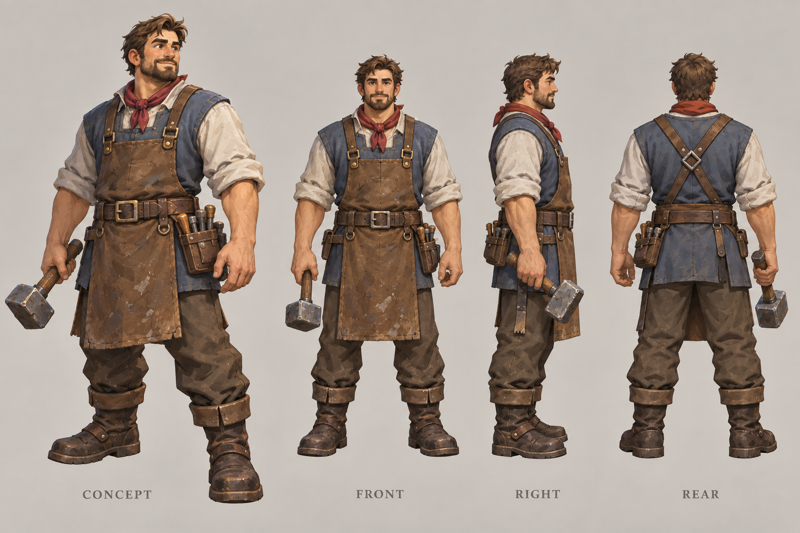

# 开拓者

| 文档属性 | 内容 |
|---|---|
| 单位编号 | UNT-001 |
| 版本 | v0.1 |
| 更新日期 | 2026-09-26 |
| 状态 | 生命值已确定；移动速度为设计提案；其余属性待定 |
| 规则依赖 | [SYS-MOV-001 · 距离与移动速度标准](../系统/距离与移动速度标准.md) · [SYS-CBT-001 · 战斗与护甲规则](../系统/战斗与护甲规则.md) |

[返回文档目录](../../游戏设计文档.md)

## 1. 单位定位

开拓者是基础建造单位，负责修建建筑，相当于工人。

「开拓者」为当前名称。采集资源、修理建筑等其他职能是否也由开拓者承担，待资源与建筑系统确定后再补充。

## 2. 属性表

| 属性 | 当前设定 | 状态 |
|---|---|---|
| 最大生命值 | **100** | 已确定 |
| 移动速度 | **2.5 m/s**（慢档，约为标准的 83%） | 设计提案 |
| 护甲 | 待定 | 待设计 |
| 攻击能力 | 待定 | 待设计 |
| 体型 | 人形，身高约 1.7–1.8 m，碰撞半径约 0.4 m | 设计提案 |
| 生产价格 | **50 金币**，15 秒 | 已确定，见[成本体系](../系统/成本体系.md) |
| 生产建筑 | [主城](../建筑/主城设计.md) | 已确定 |
| 人口占用 | 占用人口 | 已确定；数量待定 |
| 维持费 | 3 金币 / 分钟 | 已确定 |
| 建造速度 | 待定 | 待设计 |

## 3. 移动速度说明

开拓者的移动速度定为 2.5 m/s，比 3 m/s 的标准速度慢，属于「慢」档。

- **比士兵慢：**玩家不会拿开拓者当快速侦察单位用；绿皮来袭时，开拓者需要保护或提前撤离。
- **不比标准慢太多：**生存经营玩法里开拓者要在各处工地来回奔走，速度太慢会让操作很拖沓。《Warcraft III》的农民只有步兵速度的 70% 左右，那是配合资源点紧挨主城的设计。本项目的地图和资源布局还没定，先取一个宽松点的值。
- **后续调整：**如果资源点离主城比较远，或者开拓者逃跑太容易，可以降到 2.2–2.3 m/s，仍在慢档之内。

## 4. 生存能力

开拓者的生命值是 100，为主城的十分之一。按当前护甲规则，没有护甲时，原始伤害为 20 的攻击 5 次就能消灭它。

普通绿皮的攻击力确定后，需要复核 100 生命是否合适：开拓者被突袭时应当有撤离的时间，但放着不管也会有明显损失。

## 5. 待设计内容

| 项目 | 需确定内容 |
|---|---|
| 建造机制 | 建造方式（单人建造还是多人协作）、建造速度、能否中途离开 |
| 其他职能 | 是否采集资源、是否修理建筑 |
| 人口 | 人口占用数量 |
| 战斗 | 有没有攻击、护甲值、遇敌时的默认行为 |
| 美术 | 概念图与模型规范 |

## 6. 关联文档

[距离与移动速度标准](../系统/距离与移动速度标准.md) · [战斗与护甲规则](../系统/战斗与护甲规则.md) · [主城设计](../建筑/主城设计.md) · [箭塔](../建筑/箭塔.md) · [项目总览](../项目总览.md)

## 7. 版本记录

| 版本 | 日期 | 变更 |
|---|---|---|
| v0.1 | 2026-09-26 | 建立单位文档：确定生命值 100，提出 2.5 m/s 移动速度 |

### 开拓者设定图

造型提案 v1：沿用主城的手绘奇幻 RTS 风格。图内包含概念及正面／右侧／背面人物视图；建模时需统一尺寸与细节。图稿不新增或改变玩法数值。

[生成提示词](../美术/主城/敌人与建筑设定图/开拓者-提示词-v1.txt)
