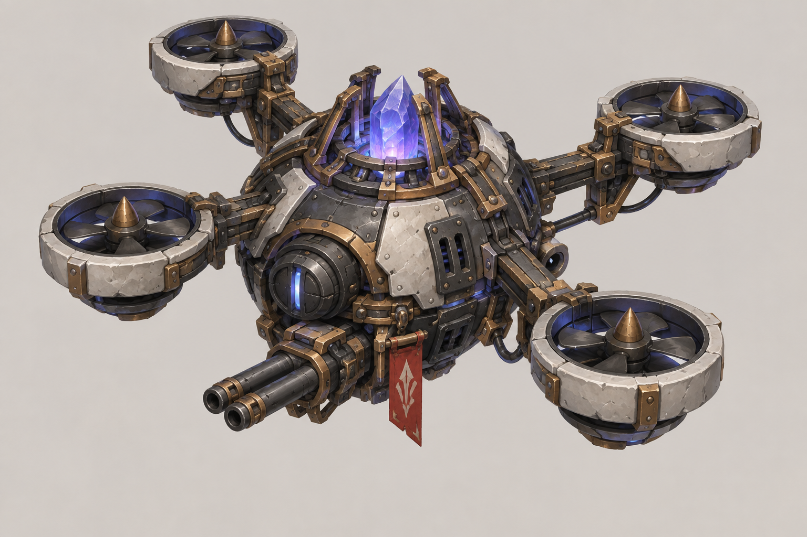
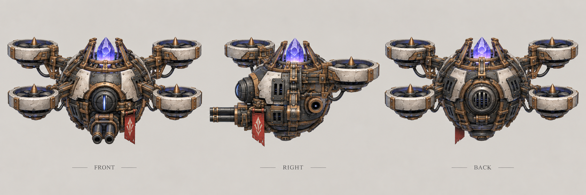
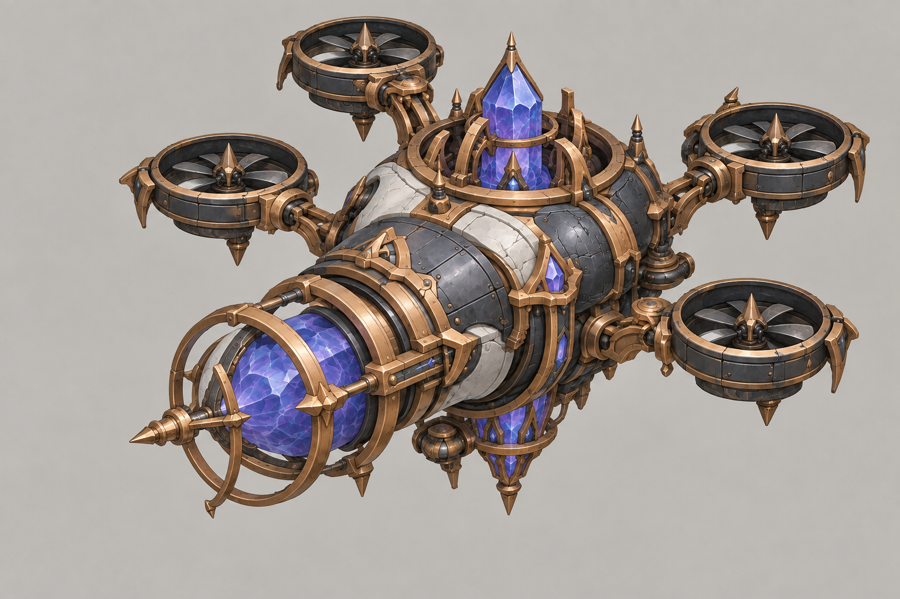
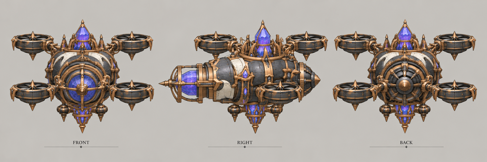
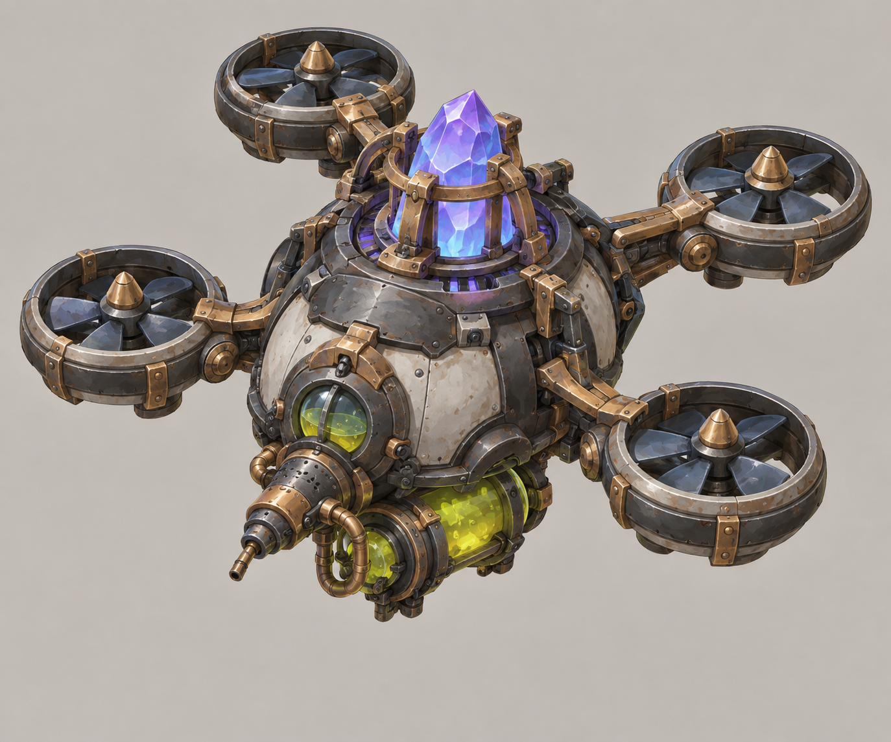
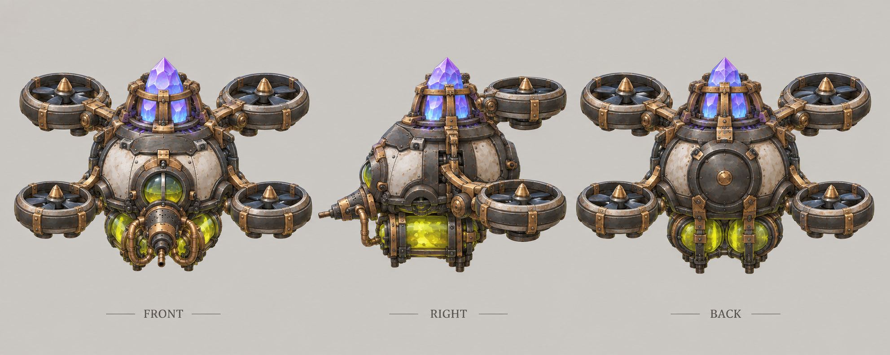

# 无人机

| 文档属性 | 内容 |
|---|---|
| 单位编号 | UNT-013 |
| 版本 | v0.3 |
| 更新日期 | 2026-09-30 |
| 状态 | 由无人机坞生产、分物理、魔法（范围伤害）、腐蚀三种、近战单位可以攻击无人机、警戒范围较大、被摧毁后自动补造、玩家不能选中控制已确定；飞行规则与全部数值为设计提案 |
| 规则依赖 | [SYS-CBT-001 · 战斗与护甲规则](../系统/战斗与护甲规则.md) · [SYS-MOV-001 · 距离与移动速度标准](../系统/距离与移动速度标准.md) · [SYS-BHV-001 · 单位行为与警戒规则](../系统/单位行为与警戒规则.md) |

[返回文档目录](../../游戏设计文档.md)

## 1. 单位定位

无人机由[无人机坞](../建筑/军事建筑/无人机坞.md)自动生产，是游戏中**第一个飞行单位**。它**警戒范围大**（已确定），发现敌人就飞过去扫射，打完飞回集结点；被摧毁后由无人机坞自动补造。

**玩家不能选中或控制无人机**（已确定），只能通过[无人机坞](../建筑/军事建筑/无人机坞.md)设置集结点，决定它们去哪。

**无人机分三种**（已确定）：

| 类型 | 定位 |
|---|---|
| **物理无人机** | 机枪扫射，单体物理输出 |
| **魔法无人机** | 发射魔晶脉冲，**范围**魔法伤害（已确定） |
| **腐蚀无人机** | 喷射酸液，**降低护甲**，是会飞的[腐蚀塔](../建筑/军事建筑/腐蚀塔.md) |

无人机坞建成后三种各带 1 架，玩家再通过「增加无人机」选项决定多加哪一种，每座最多 8 架，见[无人机坞](../建筑/军事建筑/无人机坞.md)。

## 2. 属性表（设计提案）

### 2.1 共用属性

| 属性 | 提案值 | 说明 |
|---|---|---|
| 最大生命值 | **200** | 与普通绿皮相同；无人机不能手动操控撤退，需要足够耐打，由 120 上调 |
| 护甲 | **0** | |
| 移动速度 | **6 m/s** | 标准速度的 2 倍，属于「很快」档 |
| 视野 | **16 m** | |
| 警戒距离 | **16 m** | 已确定「警戒范围较大」；为民兵（8 m）的 2 倍 |
| 移动方式 | 飞行 | 见第 3 节 |
| 维持费 | 无 | 包含在无人机坞的维持费中 |
| 人口占用 | 不占用 | |

### 2.2 各类型攻击

| 类型 | 攻击 | 攻击距离 | 每秒伤害 |
|---|---|---|---|
| 物理无人机 | 每 **0.5 秒** **6** 点，物理，单体 | 6 m | 12 |
| 魔法无人机 | 每 **2 秒**一次魔晶脉冲，目标周围 **2 m** 内所有敌人各受 **16** 点，魔法，无视护甲 | 6 m | 每个目标 8 |
| 腐蚀无人机 | 每 **1.5 秒**一发酸液，**4** 点物理伤害，单体；每次命中 **−4 护甲**，最低 −15，持续 8 秒 | 6 m | 约 2.7，主要价值在减甲 |

腐蚀无人机的减甲与[腐蚀塔](../建筑/军事建筑/腐蚀塔.md)规则相同，并共用 −15 的下限；优先攻击护甲尚未降到 −15 的敌人。

## 3. 飞行规则（设计提案）

无人机是第一个飞行单位，以下规则同时作为飞行单位的通用规则提案：

| 规则 | 内容 |
|---|---|
| 地形与城墙 | 飞越城墙、深坑和地形，不受阻挡 |
| 被攻击 | **近战单位也能攻击飞行单位**（已确定）：无人机低空悬停，绿皮举起武器就能打到；远程单位同样可以攻击 |
| 碰撞 | 飞行单位之间、与地面单位之间都不碰撞 |

**影响：**无人机飞得快、不受城墙阻挡，但玩家不能手动让它们撤退，冲进绿皮群仍会被打掉；集结点的位置决定了它们的安危。

## 4. 行为

遵循[单位行为与警戒规则](../系统/单位行为与警戒规则.md)：

- 警戒范围（16 m）内出现敌人，主动飞过去攻击。
- 追击不设上限，打完**回到集结点**。
- 不接受玩家的直接命令；集结点改变时，全部无人机飞往新集结点。

## 5. 强度检验

普通绿皮属性以设计提案为准：**200 生命、20 攻击、1.5 秒攻击间隔、无护甲、近战、移动速度 3 m/s**。

| 项目 | 结果 |
|---|---|
| 普通绿皮击落 1 架无人机 | 10 次命中，约 15 秒 |
| 1 架物理无人机消灭 1 只普通绿皮 | 约 17 秒；单挑略输于绿皮 |
| 1 架魔法无人机对 5 只挤在一起的绿皮 | 每只每秒 8，总计每秒 40 |
| 2 物理 + 1 腐蚀 | 腐蚀叠满后物理伤害翻倍，2 架物理每秒合计约 48 |
| 打[破咒小子](../敌人/破咒小子.md)（护甲 10、魔法免疫） | 魔法无人机无效；物理无人机配合腐蚀无人机最有效 |

**设计意图：**三种无人机互相搭配：物理负责单体输出，魔法负责清理成群的敌人，腐蚀负责放大物理伤害。玩家按敌人的种类决定增加哪一种。

## 6. 待设计内容

| 项目 | 需确定内容 |
|---|---|
| 对空 | 哪些我方塔可以攻击飞行单位；绿皮是否会出现飞行单位 |
| 研究 | 是否有强化无人机火力、生命的研究 |
| 美术 | 无人机造型、扫射与坠毁表现 |

## 7. 关联文档

[无人机坞](../建筑/军事建筑/无人机坞.md) · [单位行为与警戒规则](../系统/单位行为与警戒规则.md) · [绿皮弓手](../敌人/绿皮弓手.md) · [普通绿皮](../敌人/普通绿皮.md)

## 8. 版本记录

| 版本 | 日期 | 变更 |
|---|---|---|
| v0.1 | 2026-09-30 | 建立文档：无人机坞生产的飞行单位，警戒范围大、被摧毁后自动补造；飞行规则与数值为设计提案 |
| v0.2 | 2026-09-30 | 无人机改为物理、魔法（范围伤害）、腐蚀三种；近战单位可以攻击无人机；生命值上调为 120 |
| v0.3 | 2026-09-30 | 玩家不能选中控制无人机，只能通过集结点指挥；生命值上调为 200 |

<!-- art-20261005:start -->
## 美术设定图补充（2026-10-05）

本批补充概念稿和正面、侧面、背面三视图。用于造型与材质参考；建模时统一尺寸、结构和各视图细节。俯视图与动画另行制作。

魔法无人机按实体结构设计，粒子、拖尾与发光在后期特效中制作。

### 物理无人机

[概念稿提示词](../美术/主城/敌人与建筑设定图/物理无人机-概念图-v1-提示词.txt) · [三视图提示词](../美术/主城/敌人与建筑设定图/物理无人机-三视图-v1-提示词.txt)

### 魔法无人机

[概念稿提示词](../美术/主城/敌人与建筑设定图/魔法无人机-概念图-v2-提示词.txt) · [三视图提示词](../美术/主城/敌人与建筑设定图/魔法无人机-三视图-v1-提示词.txt)

### 腐蚀无人机

[概念稿提示词](../美术/主城/敌人与建筑设定图/腐蚀无人机-概念图-v1-提示词.txt) · [三视图提示词](../美术/主城/敌人与建筑设定图/腐蚀无人机-三视图-v1-提示词.txt)

<!-- art-20261005:end -->
