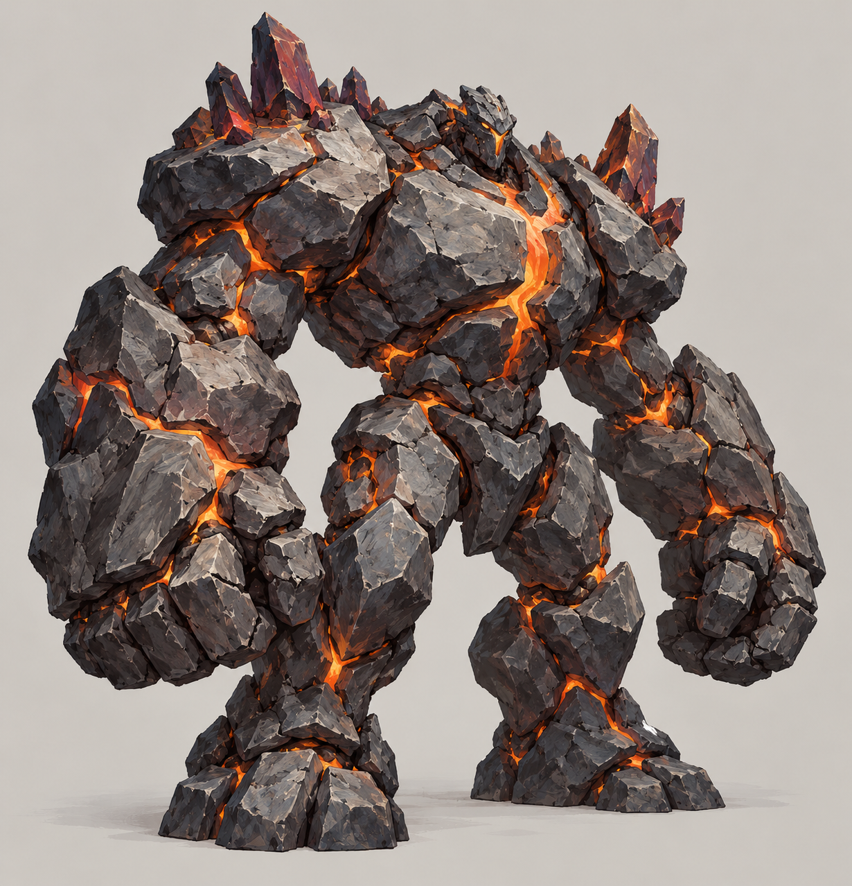
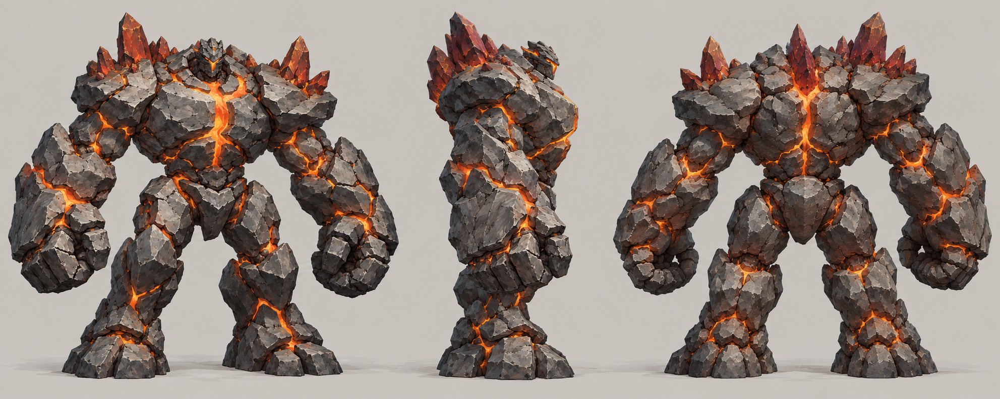
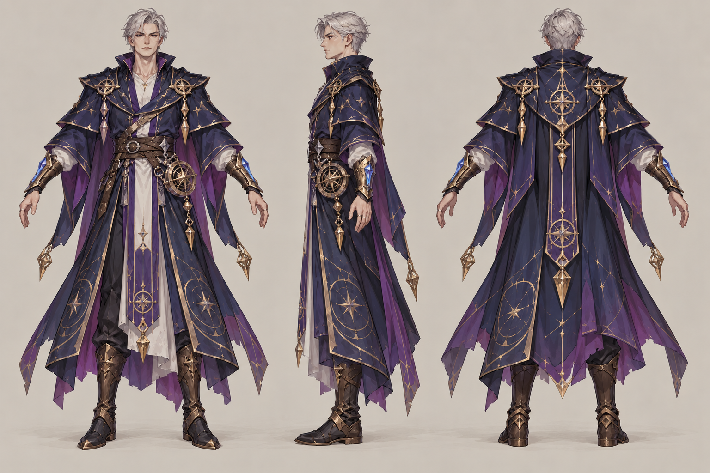

# 星术士

| 文档属性 | 内容 |
|---|---|
| 单位编号 | UNT-012 |
| 版本 | v0.1 |
| 更新日期 | 2026-09-29 |
| 状态 | 单位名称、星象殿招募、召唤陨石砸在地面上造成伤害并生成魔像（类似地狱火）已确定；施放方式与全部数值为设计提案；价格见本轮原型基线 |
| 规则依赖 | [SYS-CBT-001 · 战斗与护甲规则](../系统/战斗与护甲规则.md) · [SYS-MOV-001 · 距离与移动速度标准](../系统/距离与移动速度标准.md) · [SYS-BHV-001 · 单位行为与警戒规则](../系统/单位行为与警戒规则.md) |

[返回文档目录](../../游戏设计文档.md)

<!-- combat-baseline-20261008:start -->
## 原型数值基线（2026-10-08 · 第二轮）

成本 **6000 金币 + 40 魔晶**；维持费 **300 金币/分钟**，人口机会成本另计。招募加成只作用于之后招募的单位，基础值与本数加成只乘一次。 保留陨石200/3米/45秒CD、魔像400HP/10甲/20DPS/60秒存续，单术士至多同时2只，攻速不缩陨石冷却。

本节为原型参数，不代表真人试玩已平衡。正文历史强度示例若使用修订前参数，须重新验算；不以历史例子的胜负作为新版本承诺。详见[生存数值配置](../系统/生存数值配置.md)。
<!-- combat-baseline-20261008:end -->

## 1. 单位定位

星术士是**召唤系的魔法单位**，在[星象殿](../建筑/军事建筑/星象殿.md)招募（已确定）。它的技能是**召唤陨石砸在地面上，造成伤害，并生成一个魔像**（已确定），效果类似《魔兽争霸 3》的地狱火：一次施法既造成范围伤害，又留下一个战斗单位。

它是星象殿单位中最强的一个：既有范围爆发，又能补充前排。代价是施法间隔很长，不能频繁使用。

## 2. 属性表

| 属性 | 当前设定 | 状态 |
|---|---|---|
| 最大生命值 | **150** | 设计提案 |
| 护甲 | **0** | 设计提案 |
| 普通攻击 | 无 | 设计提案，只靠技能输出 |
| 技能 | 陨星召唤（见第 3 节） | 已确定内容；具体数值为设计提案 |
| 施法距离 | **14 m** | 设计提案 |
| 移动速度 | **3 m/s**（标准档） | 设计提案 |
| 视野 | **12 m** | 设计提案 |
| 招募建筑 | [星象殿](../建筑/军事建筑/星象殿.md) | 已确定 |
| 招募时间 | **40 秒** | 设计提案 |
| 招募成本 | 6000 金币 + 40 魔晶 | 本轮原型基线（待试玩） |
| 人口占用 | 占用 **1** 名人口 | 设计提案 |
| 维持费 | 300 金币 / 分钟 | 本轮原型基线（待试玩） |

## 3. 技能：陨星召唤

**召唤一颗陨石砸在地面上，对范围内敌人造成伤害，并在落点生成一个魔像**（已确定）。

| 参数 | 提案值 |
|---|---|
| 类型 | 自动施放，不需要操作，单位上有图标显示；玩家也可以手动指定落点（待定） |
| 触发 | 施法距离 **14 m** 内有敌人时自动施放，落点选敌人最密集的位置 |
| 冷却 | **45 秒** |
| 陨石伤害 | 落点 **3 m** 半径内所有敌人 **200**，魔法伤害，无视护甲 |
| 眩晕 | 被陨石命中的敌人眩晕 **1 秒** |
| 生成魔像 | 落点生成 **1 个魔像**，作为召唤物，持续 **60 秒** |
| 魔像属性 | 见下表，不占用人口、没有维持费 |
| 友军 | 陨石不伤害友军 |
| 魔法免疫 | 对[破咒小子](../敌人/破咒小子.md)无效，但魔像照常生成 |

### 3.1 召唤的魔像

| 属性 | 提案值 |
|---|---|
| 最大生命值 | **400** |
| 护甲 | **10**（减伤 25%） |
| 攻击力 | **40** / 次，近战单体 |
| 攻击间隔 | **2.0 秒**（每秒伤害 20） |
| 移动速度 | **2.5 m/s** |
| 存续时间 | **60 秒**，到时自动消失 |
| 人口占用 | 不占用，是召唤物 |

魔像只在战斗中作为一次性的帮手出现，和已经被取消的「可招募魔像」不同：它不需要招募，也不占用人口。

## 4. 强度检验

普通绿皮属性以设计提案为准：**200 生命、20 攻击、1.5 秒攻击间隔、无护甲、近战、移动速度 3 m/s**。

| 项目 | 结果 |
|---|---|
| 陨石对 10 只聚成一团的绿皮 | 3 m 半径内每只 200，可能一次杀光落点附近的所有绿皮 |
| 魔像 | 400 生命、20 每秒伤害，不反击时面对3只绿皮约13.33秒；反击逐个减员需离散重算，60秒是存续上限 |
| 45 秒冷却内的平均输出 | 单次陨石对 5 只绿皮总计 1000 伤害，折合每秒约 22 点，另附赠一个魔像 |
| 绿皮消灭一名星术士 | 8 次命中，约 10.5 秒 |

**设计意图：**
- 星术士靠一次施法解决一波聚集的敌人，非常适合应对绿皮成群冲锋的情形。
- 冷却长，一场战斗里只能放一两次，不像法师的龙破斩那样频繁；用「爆发 + 留下魔像」的节奏。
- 血量低，被贴身就危险，需要前排保护；魔像也在一定程度上替它挡住敌人。

## 5. 待设计内容

| 项目 | 需确定内容 |
|---|---|
| 施放 | 是否允许玩家手动指定落点 |
| 价格 | 招募成本与维持费 |
| 数值 | 陨石伤害、范围、冷却，魔像的属性与存续时间是否合适 |
| 星象殿升本 | 升本后新招募的星术士血量提升，陨石伤害和魔像属性是否提升，见[星象殿](../建筑/军事建筑/星象殿.md) |
| 美术 | 概念图与模型规范，陨石落地与魔像成形的特效 |

## 6. 关联文档

[星象殿](../建筑/军事建筑/星象殿.md) · [大主教](大主教.md) · [先知](先知.md) · [防御术士](防御术士.md) · [法师](法师.md) · [普通绿皮](../敌人/普通绿皮.md) · [破咒小子](../敌人/破咒小子.md)

## 7. 版本记录

| 版本 | 日期 | 变更 |
|---|---|---|
| v0.1 | 2026-09-29 | 建立文档：星象殿招募的召唤系单位，陨石造成伤害并生成魔像；数值为设计提案 |

### 星术士概念图（2026-09-30 美术提案）

造型、配色、服装及装饰为美术提案，尚未确认为最终设定；玩法与数值以本文原有规则为准。

[生成提示词](../美术/主城/敌人与建筑设定图/星术士-概念图-v1-提示词.txt) · [设定图索引](../美术/主城/敌人与建筑设定图/设定图索引.md)

### 召唤魔像概念图（2026-09-30 美术提案）

造型、配色、服装及装饰为美术提案，尚未确认为最终设定；玩法与数值以本文原有规则为准。 本稿对应星术士技能产生的召唤物，不代表恢复已取消的可招募魔像。

[生成提示词](../美术/主城/敌人与建筑设定图/召唤魔像-概念图-v1-提示词.txt) · [设定图索引](../美术/主城/敌人与建筑设定图/设定图索引.md)

### 召唤魔像三视图（2026-10-01）

以当前概念图为参考的正面、右侧和背面美术图。建模前需校准尺寸、遮挡与细部。

[生成提示词](../美术/主城/敌人与建筑设定图/召唤魔像-Apose三视图-v1-提示词.txt)

### 星术士三视图（2026-10-01）

以当前概念图为参考的正面、右侧和背面美术图。建模前需校准尺寸、遮挡与细部。

[生成提示词](../美术/主城/敌人与建筑设定图/星术士-Apose三视图-v1-提示词.txt)

### 本轮数值版本记录

| 版本 | 日期 | 变更 |
|---|---|---|
| 2026.10.08-B2 | 2026-10-08 | 第二轮原型成本、维护与战斗边界；历史例需按新参数重验 |
