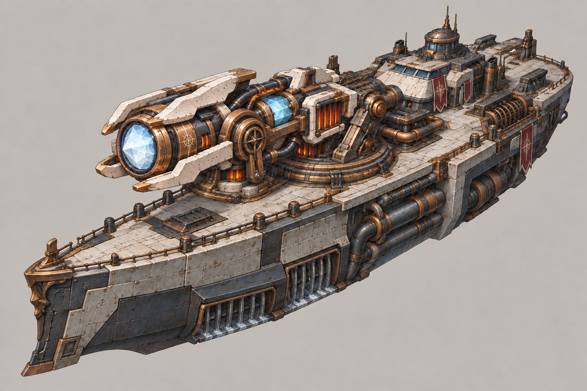
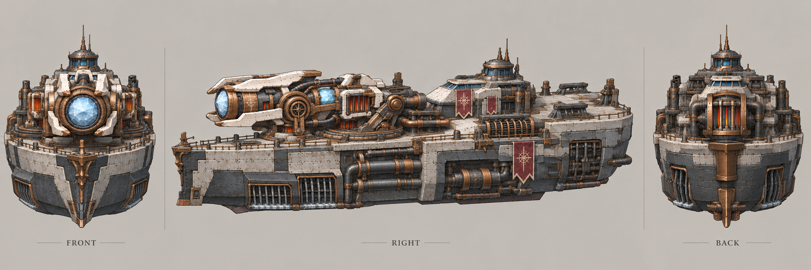

# 曙光号

| 文档属性 | 内容 |
|---|---|
| 单位编号 | UNT-015 |
| 版本 | v0.1 |
| 更新日期 | 2026-09-30 |
| 状态 | 造船厂建造、像曙光一样发射大激光、靠水散热射得更久、伤害比曙光低，已确定；全部数值为设计提案；价格见本轮原型基线 |
| 规则依赖 | [BLD-023 · 曙光](../建筑/军事建筑/曙光.md) · [BLD-030 · 造船厂](../建筑/军事建筑/造船厂.md) · [SYS-CBT-001 · 战斗与护甲规则](../系统/战斗与护甲规则.md) · [SYS-ENG-001 · 能源体系](../系统/能源体系.md) |

[返回文档目录](../../游戏设计文档.md)

<!-- combat-baseline-20261008:start -->
## 原型数值基线（2026-10-08 · 第二轮）

成本 **20000 金币 + 250 钢铁 + 180 魔晶**；维持费 **800 金币/分钟**，人口机会成本另计。招募加成只作用于之后招募的单位，基础值与本数加成只乘一次。

本节为原型参数，不代表真人试玩已平衡。正文历史强度示例若使用修订前参数，须重新验算；不以历史例子的胜负作为新版本承诺。详见[生存数值配置](../系统/生存数值配置.md)。
<!-- combat-baseline-20261008:end -->

## 1. 单位定位

曙光号是**装着曙光激光炮的战舰**（已确定）：**像[曙光](../建筑/军事建筑/曙光.md)一样发射大激光**，但因为在海上，可以用海水给炮管散热，所以**可以射得更久**；作为交换，**伤害比曙光低一点**（已确定）。

它是海上的火力平台：护送运输舰、清理沿岸的敌人、压制海岸线附近的绿皮。

## 2. 属性表

| 属性 | 当前设定 | 状态 |
|---|---|---|
| 解锁条件 | 法师营地 3 本 + 研究院 3 本（与曙光相同），并有[造船厂](../建筑/军事建筑/造船厂.md) | 设计提案 |
| 攻击方式 | 持续激光，长 **20 m**，贯穿直线上的所有敌人 | 设计提案，与曙光相同 |
| 伤害类型 | **一半物理、一半魔法**，与曙光相同：魔法部分无视护甲，魔法免疫的敌人只受物理部分 | 设计提案 |
| 最大生命值 | **500** | 设计提案 |
| 护甲 | **10**（减伤 25%） | 设计提案 |
| 移动速度 | **3 m/s**（仅水面） | 设计提案 |
| 攻击目标 | 地面单位，包括岸上的敌人；船在水上开火 | 设计提案 |
| 视野 | **16 m** | 设计提案 |
| 生产建筑 | [造船厂](../建筑/军事建筑/造船厂.md) | 已确定 |
| 建造时间 | **60 秒** | 设计提案 |
| 建造成本 | 20000 金币 + 250 钢铁 + 180 魔晶 | 本轮原型基线（待试玩） |
| 人口占用 | 占用 **3** 名人口 | 设计提案 |
| 维持费 | 800 金币 / 分钟 | 本轮原型基线（待试玩） |
| 能源占用 | **200** | 设计提案，低于曙光建筑本身的 300 |

## 3. 海水散热：和曙光的对比（设计提案）

曙光持续发射时热量上升，到 100% 过热停火；曙光号用海水冷却，**升温更慢、冷却更快、发射时间更长**，伤害相应降低：

| 项目 | 曙光（建筑） | 曙光号 |
|---|---|---|
| 升温 | 持续发射 **6 秒**升到 100% | 持续发射 **15 秒**升到 100% |
| 过热后冷却 | **8 秒** | **4 秒** |
| 一个循环 | 6 + 8 = 14 秒 | 15 + 4 = 19 秒 |
| 白光（0–40%）每 0.5 秒伤害 | 20 | **10** |
| 橙光（40–80%）每 0.5 秒伤害 | 30 | **15** |
| 红光（80–100%）每 0.5 秒伤害 | 40 | **20** |
| 自然降温 | 无敌人时每秒 −20% | 无敌人时每秒 −30%（海水散热更快） |

**对比：**
- 曙光的红光每秒对每个敌人 80 点，曙光号只有 40 点，**峰值只有一半**。
- 曙光一个循环对每个敌人造成约 330，曙光号约 420，**总输出略高**，但摊在更长的时间里。
- 平均每秒（含冷却）：曙光约 24，曙光号约 22，非常接近；区别在于**节奏**：曙光是「6 秒爆发 + 8 秒空窗」，曙光号是「15 秒持续压制 + 4 秒短暂空窗」。

## 4. 瞄准规则

与[曙光](../建筑/军事建筑/曙光.md)一致：激光指向射程内最近的敌人并跟随，目标死亡后转向下一个最近的敌人，热量不重置。

## 5. 强度检验

普通绿皮属性以设计提案为准：**200 生命、20 攻击、1.5 秒攻击间隔、无护甲、近战、移动速度 3 m/s**。

| 项目 | 结果 |
|---|---|
| 一个循环中，被持续照射的绿皮受到的伤害 | 约 420，足以杀死 200 生命的绿皮 |
| 消灭激光上的普通绿皮 | 约 7 秒，比曙光的 3.5 秒慢，因为伤害低 |
| 一艘曙光号 vs 直线排开的 10 只绿皮 | 15 秒内全部消灭，激光贯穿整队 |

**设计意图：**
- 曙光号是海岸线上的持续火力，不是爆发火力：对聚集在岸边的敌人压制很久。
- 它比岸上的曙光弱，但机动，可以沿海岸线移动支援不同方向。
- 不能上岸，敌人退到 20 m 外它就够不到，所以它主要用于护航和海岸防御。

## 6. 待设计内容

| 项目 | 需确定内容 |
|---|---|
| 价格 | 造价、维持费 |
| 数值 | 升温 15 秒、冷却 4 秒、各阶段伤害是否合适 |
| 能源 | 单位占用能源的规则，与「能源不足只是不能再建新的」是否兼容 |
| 美术 | 概念图；船头炮管、水冷管线、激光的白橙红三段表现 |

## 7. 关联文档

[曙光](../建筑/军事建筑/曙光.md) · [造船厂](../建筑/军事建筑/造船厂.md) · [运输舰](运输舰.md) · [战斗与护甲规则](../系统/战斗与护甲规则.md) · [能源体系](../系统/能源体系.md) · [破咒小子](../敌人/破咒小子.md)

## 8. 版本记录

| 版本 | 日期 | 变更 |
|---|---|---|
| v0.1 | 2026-09-30 | 建立文档：像曙光一样发射激光的战舰，海水散热使发射更久、伤害更低；数值为设计提案 |

<!-- art-20261005:start -->
## 美术设定图补充（2026-10-05）

本批补充概念稿和正面、侧面、背面三视图。用于造型与材质参考；建模时统一尺寸、结构和各视图细节。俯视图与动画另行制作。

曙光号沿用曙光炮塔的短粗晶体炮口、浅色装甲与铜色结构语言。

### 曙光号

[概念稿提示词](../美术/主城/敌人与建筑设定图/曙光号-概念图-v2-提示词.txt) · [三视图提示词](../美术/主城/敌人与建筑设定图/曙光号-三视图-v1-提示词.txt)

<!-- art-20261005:end -->

### 本轮数值版本记录

| 版本 | 日期 | 变更 |
|---|---|---|
| 2026.10.08-B2 | 2026-10-08 | 第二轮原型成本、维护与战斗边界；历史例需按新参数重验 |
