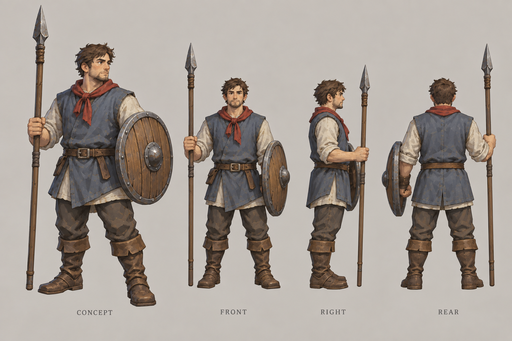

# 民兵

| 文档属性 | 内容 |
|---|---|
| 单位编号 | UNT-002 |
| 版本 | v0.1 |
| 更新日期 | 2026-09-26 |
| 状态 | 名称、定位、基础属性已确定；警戒距离为设计提案 |
| 规则依赖 | [SYS-CBT-001 · 战斗与护甲规则](../系统/战斗与护甲规则.md) · [SYS-MOV-001 · 距离与移动速度标准](../系统/距离与移动速度标准.md) · [SYS-BHV-001 · 单位行为与警戒规则](../系统/单位行为与警戒规则.md) |

[返回文档目录](../../游戏设计文档.md)

## 1. 单位定位

民兵是临时组建的基础步兵，由[兵营](../建筑/兵营.md)招募。装备简陋（长矛加木盾），训练不足。

**单兵打不过绿皮**，需要靠数量和箭塔配合守住阵地。后续的正规兵种应明显强于民兵。

## 2. 属性表

| 属性 | 当前设定 | 状态 |
|---|---|---|
| 最大生命值 | **150** | 已确定 |
| 护甲 | **0** | 已确定 |
| 攻击力 | **15** / 次，近战单体 | 已确定 |
| 攻击间隔 | **1.5 秒**（每秒伤害 10） | 已确定 |
| 攻击距离 | **1 m** | 已确定 |
| 移动速度 | **3 m/s**（标准档） | 已确定 |
| 视野 | **10 m** | 已确定 |
| 武器 | 长矛、木盾 | 已确定 |
| 警戒距离 | **8 m** | 设计提案；规则见单位行为与警戒规则 |
| 招募时间 | **15 秒** | 已确定 |
| 招募成本 | **60 金币** | 已确定，见[成本体系](../系统/成本体系.md) |
| 人口占用 | 占用人口 | 已确定；数量待定 |
| 维持费 | 5 金币 / 分钟 | 已确定 |

民兵的移动速度就是[距离与移动速度标准](../系统/距离与移动速度标准.md)中「基础步兵」的标准速度。攻击间隔与箭塔相同，便于对比。

## 3. 强度检验

普通绿皮尚无正式数值，以下借用测试建议检验：**200 生命、20 攻击、1.5 秒攻击间隔、无护甲、近战**。**这组数值仅用于检验，不属于已采纳的单位数据。**

### 3.1 单项数据

| 项目 | 结果 |
|---|---|
| 绿皮打死一个民兵 | 8 次命中，约 10.5 秒 |
| 民兵打死一只绿皮 | 14 次命中，约 19.5 秒 |
| 民兵打死一个开拓者 | 7 次命中，约 9 秒 |

### 3.2 对抗结果

| 对抗情况 | 结果 |
|---|---|
| 1 民兵 vs 1 绿皮 | 民兵败，绿皮剩约 80 生命 |
| 2 民兵 vs 1 绿皮 | 民兵胜，约 9 秒，无伤亡 |
| 1 民兵 + 1 箭塔 vs 1 绿皮 | 约 7.5 秒结束，民兵存活 |

**设计意图：**

- 2 个民兵对 1 只绿皮是基础兵力比例，直观体现民兵的弱势。
- 民兵与箭塔配合效率明显提高，引导玩家依托塔防作战。
- 兵营 15 秒出 1 个民兵，而一只绿皮约 17 秒拆掉兵营，临时出兵救不回被偷袭的兵营，需要提前布防。

普通绿皮的正式数值确定后，需要重新验算本节。

## 4. 升级方向（示意）

兵营升本后，该兵营新招募的民兵生命值和攻击力提升（2 本 +20%，3 本 +40%，设计提案），见[兵营](../建筑/兵营.md)第 5 节。更强的兵种（正规步兵、弩兵等）是否另设，待设计。[火枪手](火枪手.md)是独立的远程兵种，直接在兵营中解锁招募，不是民兵的升级。

## 5. 待设计内容

| 项目 | 需确定内容 |
|---|---|
| 人口 | 人口占用数量 |
| 美术 | 概念图与模型规范 |

## 6. 关联文档

[兵营](../建筑/兵营.md) · [单位行为与警戒规则](../系统/单位行为与警戒规则.md) · [开拓者](开拓者.md) · [箭塔](../建筑/箭塔.md) · [战斗与护甲规则](../系统/战斗与护甲规则.md) · [距离与移动速度标准](../系统/距离与移动速度标准.md)

## 7. 版本记录

| 版本 | 日期 | 变更 |
|---|---|---|
| v0.1 | 2026-09-26 | 建立文档：确定生命值 150、护甲 0、攻击 15 / 1.5 秒、速度 3 m/s 等基础属性 |

### 民兵设定图

造型提案 v1：沿用主城的手绘奇幻 RTS 风格。图内包含概念及正面／右侧／背面人物视图；建模时需统一尺寸与细节。图稿不新增或改变玩法数值。

[生成提示词](../美术/主城/敌人与建筑设定图/民兵-提示词-v1.txt)
