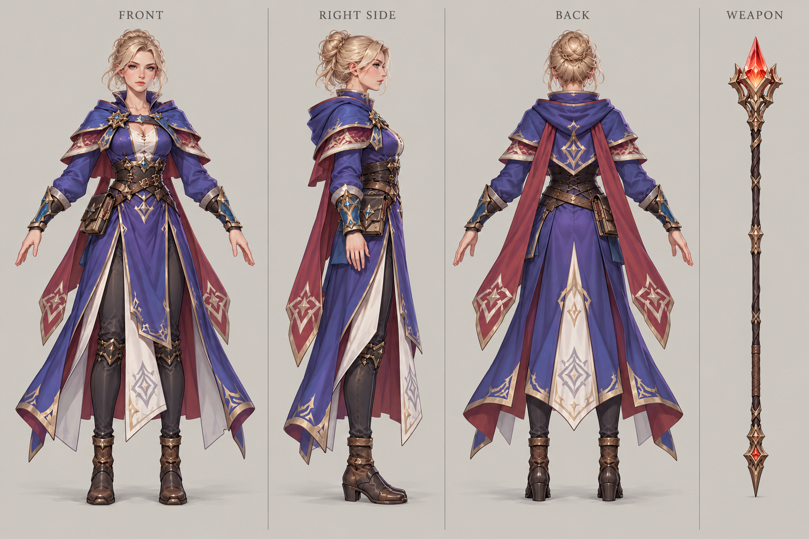

# 法师

| 文档属性 | 内容 |
|---|---|
| 单位编号 | UNT-008 |
| 版本 | v0.4 |
| 更新日期 | 2026-10-08 |
| 状态 | 单位名称、圣堂 3 本且法师营地 3 本、需要解锁、魔法伤害无视护甲、可以攻击、攻击有概率释放魔法龙破斩（类似 Dota 的丽娜），已确定；具体数值为设计提案；价格见本轮原型基线 |
| 规则依赖 | [SYS-CBT-001 · 战斗与护甲规则](../系统/战斗与护甲规则.md) · [SYS-MOV-001 · 距离与移动速度标准](../系统/距离与移动速度标准.md) · [SYS-BHV-001 · 单位行为与警戒规则](../系统/单位行为与警戒规则.md) |

[返回文档目录](../../游戏设计文档.md)

<!-- combat-baseline-20261008:start -->
## 原型数值基线（2026-10-08 · 第二轮）

成本 **4200 金币 + 15 魔晶**；维持费 **220 金币/分钟**，人口机会成本另计。招募加成只作用于之后招募的单位，基础值与本数加成只乘一次。

本节为原型参数，不代表真人试玩已平衡。正文历史强度示例若使用修订前参数，须重新验算；不以历史例子的胜负作为新版本承诺。详见[生存数值配置](../系统/生存数值配置.md)。
<!-- combat-baseline-20261008:end -->

## 1. 单位定位

法师是**圣堂线上最高阶的远程魔法输出单位**，需要圣堂升到 **3 本**，并且**需要解锁**（已确定）。可以攻击，**普通攻击有概率释放魔法龙破斩**，对一条线上的敌人造成大范围伤害，风格类似 Dota 里丽娜的龙破斩（已确定）。

它是魔法一侧的群体清场单位：单体输出中等，靠技能对成群的直线敌人造成大量伤害。血量低，是典型的后排「玻璃大炮」。

## 2. 使用条件（已确定 + 设计提案）

| 条件 | 内容 | 状态 |
|---|---|---|
| 圣堂本数 | 圣堂升到 **3 本** | 已确定 |
| 魔法体系本数 | [法师营地](../系统/科技系统.md)升到 **3 本**（魔法 3 本） | 已确定 |
| 解锁 | 需要在圣堂中解锁后才能招募 | 已确定 |
| 解锁范围 | 在任意一座圣堂解锁一次，对所有圣堂生效；只有 3 本的圣堂才能招募 | 设计提案，与骑士、圣堂刺客的规则一致 |
| 解锁花费 | 一次性花费 **2500 金币 + 20 魔晶**，研究 **45 秒**（圣堂 3 本且法师营地 3 本） | 本轮原型基线，见[成本体系](../系统/成本体系.md) §5 |

与[骑士](骑士.md)不同，法师**不是自动解锁**，而是升到 3 本后还要额外花费解锁。它需要**两处都升到 3 本**：圣堂（生产建筑）和法师营地（魔法体系的科技建筑）。

法师营地升 3 本的条件很重：样例是 16000 金币 + 300 魔晶、占用 400 能源、古塞奇尤 Lv10（见[科技系统](../系统/科技系统.md)）。这意味着法师是魔法路线的终极兵种，玩家需要长期投入魔晶和英雄等级才能用上，所以它强于圣堂的其他单位是合理的。

## 3. 属性表

| 属性 | 当前设定 | 状态 |
|---|---|---|
| 最大生命值 | **100**（3 本圣堂 +40% 后为 140） | 设计提案 |
| 护甲 | **0** | 设计提案 |
| 攻击力 | **30** / 次，远程魔法单体（3 本圣堂 +40% 后为 42） | 设计提案 |
| 攻击间隔 | **2.0 秒**（3 本圣堂加成后每秒伤害 21） | 设计提案 |
| 攻击距离 | **9 m** | 设计提案 |
| 移动速度 | **3 m/s**（标准档） | 设计提案 |
| 视野 | **12 m** | 设计提案 |
| 警戒距离 | **9 m** | 设计提案，与攻击距离相同 |
| 技能 | 被动：魔法龙破斩（见第 4 节） | 已确定 |
| 招募建筑 | [圣堂](../建筑/军事建筑/圣堂.md)（3 本） | 已确定 |
| 招募时间 | **30 秒** | 设计提案 |
| 招募成本 | 4200 金币 + 15 魔晶 | 本轮原型基线（待试玩） |
| 人口占用 | 占用 **1** 名人口 | 设计提案 |
| 维持费 | 220 金币 / 分钟 | 本轮原型基线（待试玩） |

法师只能由 3 本圣堂招募，因此总是吃到 +40% 的加成，表中同时给出了基础值与加成后的值，详见[圣堂](../建筑/军事建筑/圣堂.md)第 4 节。

## 4. 技能：魔法龙破斩（被动）

**普通攻击有概率释放魔法龙破斩**（已确定）：向目标方向发出一道直线的魔法冲击，对路径上的所有敌人造成伤害。被动触发，不需要操作，单位上有图标显示。

| 参数 | 提案值 |
|---|---|
| 触发概率 | 每次普通攻击 **25%** |
| 形状 | 从法师指向目标的**直线**，长 **10 m**、宽 **2 m** |
| 伤害 | 直线上每个敌人 **100**，不衰减 |
| 护甲 | 魔法伤害，**无视目标护甲**（已确定），与古塞奇尤的连环闪电一致 |
| 是否与普通攻击叠加 | 普通攻击照常造成伤害，龙破斩是额外的一击 |
| 圣堂升本加成 | 龙破斩的伤害是固定值，不受升本加成影响，只有基础攻击提升 |
| 对象 | 只伤害敌方单位；不伤害友军和建筑 |

**类似 Dota 丽娜的龙破斩，区别在于：**丽娜的龙破斩是主动技能、有冷却；这里是被动概率触发，减轻操作压力，也和连环闪电的机制保持一致。

## 5. 与其他远程单位的比较

| 单位 | 生命值 | 每秒伤害 | 射程 | 定位 |
|---|---|---|---|---|
| [火枪手](火枪手.md) | 100 | 16 | 10 m | 单体集火 |
| **法师** | 140（加成后） | 21 起，另有龙破斩 | 9 m | 群体清场 |
| [古塞奇尤](古塞奇尤.md) | 600 | 20 起，另有连环闪电 | 8 m | 英雄 |

火枪手擅长集火单个目标，法师擅长打成排的敌人，两者形成互补。

## 6. 强度检验

普通绿皮属性以设计提案为准：**200 生命、20 攻击、1.5 秒攻击间隔、无护甲、近战、移动速度 3 m/s**。法师按 3 本圣堂加成后的属性（140 生命、42 攻击）计算。

| 项目 | 结果 |
|---|---|
| 法师消灭一只绿皮 | 5 次普通攻击，约 8 秒（不含龙破斩） |
| 绿皮从射程边缘走到法师面前 | 约 3 秒，法师先射约 2 发 |
| 1 法师 vs 1 绿皮 | 法师胜，剩约 60 生命（不含龙破斩） |
| 龙破斩对排成一线的 3 只绿皮 | 一次造成 300 总伤害，每只 100 |
| 龙破斩的期望伤害 | 每次攻击 25% × 100 = 每个目标额外期望 25，敌人成群时提升明显 |

**设计意图：**
- 法师单打不强，价值来自成群的敌人：绿皮习惯排成长队冲向目标，龙破斩正好命中一整条线。
- 血量低，被近战敌人贴近就很危险，必须有前排（民兵、圣骑士）保护，牧师治疗。
- 需要圣堂 3 本和额外解锁，成本很高，所以强度高于开局单位和圣堂的其他单位是合理的。

## 7. 待设计内容

| 项目 | 需确定内容 |
|---|---|
| 数值 | 龙破斩的概率、伤害、长度和宽度是否合适 |
| 护甲 | 魔法免疫的敌人（[破咒小子](../敌人/破咒小子.md)）不受法师的任何伤害；魔法抗性敌人是否存在待定 |
| 解锁 | 圣堂升 3 本的价格与前置条件见[圣堂](../建筑/军事建筑/圣堂.md)与成本体系；解锁操作的价格与时间已回填（见 §2） |
| 美术 | 概念图与模型规范，龙破斩的特效 |

## 8. 关联文档

[圣堂](../建筑/军事建筑/圣堂.md) · [牧师](牧师.md) · [圣骑士](圣骑士.md) · [圣堂刺客](圣堂刺客.md) · [火枪手](火枪手.md) · [古塞奇尤](古塞奇尤.md) · [普通绿皮](../敌人/普通绿皮.md) · [战斗与护甲规则](../系统/战斗与护甲规则.md)

## 9. 版本记录

| 版本 | 日期 | 变更 |
|---|---|---|
| v0.1 | 2026-09-29 | 建立文档：圣堂 3 本、需要解锁的远程魔法输出单位，攻击有概率释放魔法龙破斩；数值为设计提案 |
| v0.2 | 2026-09-29 | 确定魔法伤害无视护甲；解锁条件增加法师营地 3 本 |
| v0.3 | 2026-10-08 | 金币数量级整体 ×20（价格、维持费、奖励同比放大，平衡不变） |

### 法师概念图（2026-09-30 美术提案）

造型、配色、服装及装饰为美术提案，尚未确认为最终设定；玩法与数值以本文原有规则为准。

[生成提示词](../美术/主城/敌人与建筑设定图/法师-概念图-v1-提示词.txt) · [设定图索引](../美术/主城/敌人与建筑设定图/设定图索引.md)

### 法师三视图（2026-10-02 修订）

以当前概念图为参考的正面、右侧和背面美术图。三栏人物均空手，法杖只在最右栏出现一次，每栏留有裁切边界。建模前需校准尺寸、遮挡与细部。

[生成提示词](../美术/主城/敌人与建筑设定图/法师-Apose三视图-v2-提示词.txt)

### 本轮数值版本记录

| 版本 | 日期 | 变更 |
|---|---|---|
| 2026.10.08-B2 | 2026-10-08 | 第二轮原型成本、维护与战斗边界；历史例需按新参数重验 |
| v0.4 | 2026-10-08 | 第五轮同步：回填解锁价 2500 金 + 20 魔晶/45 秒（成本体系 §5），删已覆盖的待设计价格行 |
