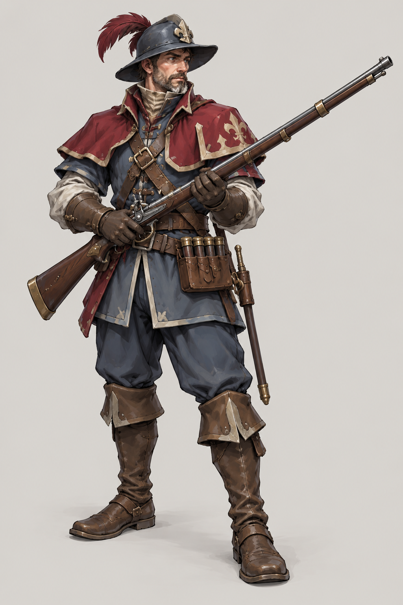
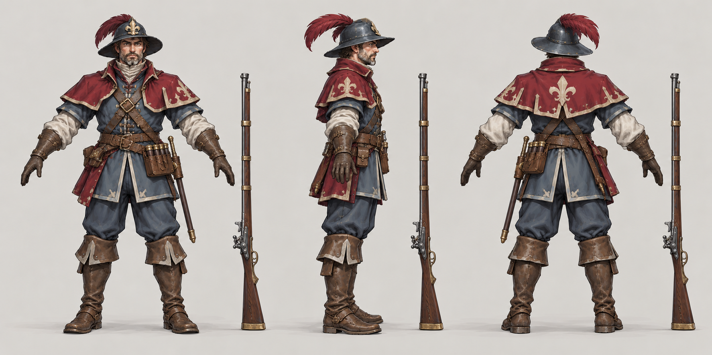

# 火枪手

| 文档属性 | 内容 |
|---|---|
| 单位编号 | UNT-003 |
| 版本 | v0.2 |
| 更新日期 | 2026-09-29 |
| 状态 | 单位名称、兵营招募、需要在兵营中解锁后才能招募，已确定；属性与强度检验为设计提案；价格待定 |
| 规则依赖 | [SYS-CBT-001 · 战斗与护甲规则](../系统/战斗与护甲规则.md) · [SYS-MOV-001 · 距离与移动速度标准](../系统/距离与移动速度标准.md) · [SYS-BHV-001 · 单位行为与警戒规则](../系统/单位行为与警戒规则.md) |

[返回文档目录](../../游戏设计文档.md)

## 1. 单位定位

火枪手是**远程火器步兵**，在[兵营](../建筑/兵营.md)招募，但**开局不能招募，必须先在兵营中解锁**（已确定）。解锁前，兵营里的火枪手按钮处于锁定状态。

它是主角带来的科技兵种，与民兵形成分工：**民兵在前面挡，火枪手在后面射**。火枪手输出高、射程远，但血量低、装填慢，被近战敌人贴上就很危险，需要民兵、城墙或箭塔保护。

**不设技能（已确定）：**火枪手的特色是远程单位**多人集火同一个目标**，这本身就是机制，不需要再加技能。玩家用「攻击指定目标」命令（见[单位行为与警戒规则](../系统/单位行为与警戒规则.md)），让一群火枪手同时点掉关键敌人。

## 2. 属性表

| 属性 | 当前设定 | 状态 |
|---|---|---|
| 最大生命值 | **100** | 设计提案，与开拓者相同 |
| 护甲 | **0** | 设计提案 |
| 攻击力 | **40** / 次，远程单体 | 设计提案 |
| 攻击间隔 | **2.5 秒**（装填慢，每秒伤害 16） | 设计提案 |
| 攻击距离 | **10 m** | 设计提案，与箭塔相同 |
| 移动速度 | **3 m/s**（标准档） | 设计提案 |
| 视野 | **12 m** | 设计提案 |
| 警戒距离 | **10 m** | 设计提案，与攻击距离相同 |
| 武器 | 火枪 | 已确定 |
| 招募建筑 | [兵营](../建筑/兵营.md) | 已确定 |
| 解锁条件 | 需要在兵营中解锁后才能招募；解锁一次，**对所有兵营生效** | 已确定；解锁的价格与前置条件待定 |
| 招募时间 | **20 秒** | 设计提案 |
| 招募成本 | 待定 | 后面单独确定 |
| 人口占用 | 占用 **1** 名人口 | 设计提案，与民兵、开拓者一致 |
| 维持费 | 待定 | 后面单独确定；应高于民兵（5 金币 / 分钟） |

攻击距离不超过警戒距离，警戒距离不超过视野，符合[单位行为与警戒规则](../系统/单位行为与警戒规则.md)的约束。

## 3. 与其他单位的比较

| 单位 | 生命值 | 每秒伤害 | 射程 | 定位 |
|---|---|---|---|---|
| [民兵](民兵.md) | 150 | 10 | 1 m | 近战，前排 |
| **火枪手** | 100 | 16 | 10 m | 远程，后排输出 |
| [箭塔](../建筑/箭塔.md) | 300 | 13.3 | 10 m | 固定远程 |
| [古塞奇尤](古塞奇尤.md) | 600 | 20（含闪电约 30+） | 8 m | 英雄，远程魔法 |

火枪手的输出比箭塔高、比民兵高，代价是：可以移动但很脆，单次伤害大但装填间隔长。**单次 40 伤害**在面对未来的高护甲敌人时也比箭（20）更不容易被吃掉。

## 4. 强度检验

普通绿皮属性以设计提案为准：**200 生命、20 攻击、1.5 秒攻击间隔、无护甲、近战、移动速度 3 m/s**。

| 项目 | 结果 |
|---|---|
| 火枪手消灭一只绿皮 | 5 次命中，约 10 秒 |
| 绿皮从射程边缘走到火枪手面前 | 约 3.3 秒，火枪手可先射 2 发（共 80 伤害） |
| 绿皮消灭一名火枪手 | 5 次命中，约 7.5 秒 |
| 1 火枪手 vs 1 绿皮 | 火枪手败：绿皮剩约 40 生命 |
| 1 火枪手 + 1 民兵 vs 1 绿皮 | 火枪手和民兵胜，民兵挡在前面时火枪手无伤 |
| 2 火枪手 vs 1 绿皮 | 火枪手胜，约 5 秒击杀 |

**设计意图：**
- 火枪手单独作战会输，必须依托民兵、城墙或塔。这样它不会取代民兵，反而让两者互相需要。
- 与城墙配合特别有效：火枪手站在墙后，10 m 射程可以越过墙射击，弥补了民兵射程只有 1 m、隔墙够不着的问题。

## 5. 待设计内容

| 项目 | 需确定内容 |
|---|---|
| 解锁 | 在兵营中解锁的价格、时间和前置条件（是否需要科技本数） |
| 价格 | 招募成本与维持费 |
| 数值 | 生命值、伤害、装填间隔、射程是否合适 |
| 集火 | 多个火枪手打同一个目标时，目标死亡后多余的子弹如何处理（是否浪费）；弹道是即时命中还是飞行 |
| 升级 | 是否有更高阶的火器兵种；兵营升本后新招募的火枪手生命值与攻击力提升，见[兵营](../建筑/兵营.md)第 5 节 |
| 美术 | 概念图与模型规范 |

## 6. 关联文档

[兵营](../建筑/兵营.md) · [民兵](民兵.md) · [箭塔](../建筑/箭塔.md) · [城墙](../建筑/城墙.md) · [普通绿皮](../敌人/普通绿皮.md) · [单位行为与警戒规则](../系统/单位行为与警戒规则.md) · [战斗与护甲规则](../系统/战斗与护甲规则.md) · [成本体系](../系统/成本体系.md)

## 7. 版本记录

| 版本 | 日期 | 变更 |
|---|---|---|
| v0.1 | 2026-09-29 | 建立文档：远程火器兵种，在兵营招募，开局不能招募，需要在兵营中解锁；属性为设计提案 |
| v0.2 | 2026-09-29 | 确定火枪手不设技能，特色是多人集火同一目标 |

### 火枪手概念图（2026-09-30 美术提案）

造型、配色、服装及装饰为美术提案，尚未确认为最终设定；玩法与数值以本文原有规则为准。

[生成提示词](../美术/主城/敌人与建筑设定图/火枪手-概念图-v1-提示词.txt) · [设定图索引](../美术/主城/敌人与建筑设定图/设定图索引.md)

### 火枪手三视图（2026-10-01）

以当前概念图为参考的正面、右侧和背面美术图。建模前需校准尺寸、遮挡与细部。

[生成提示词](../美术/主城/敌人与建筑设定图/火枪手-三视图-v1-提示词.txt)
