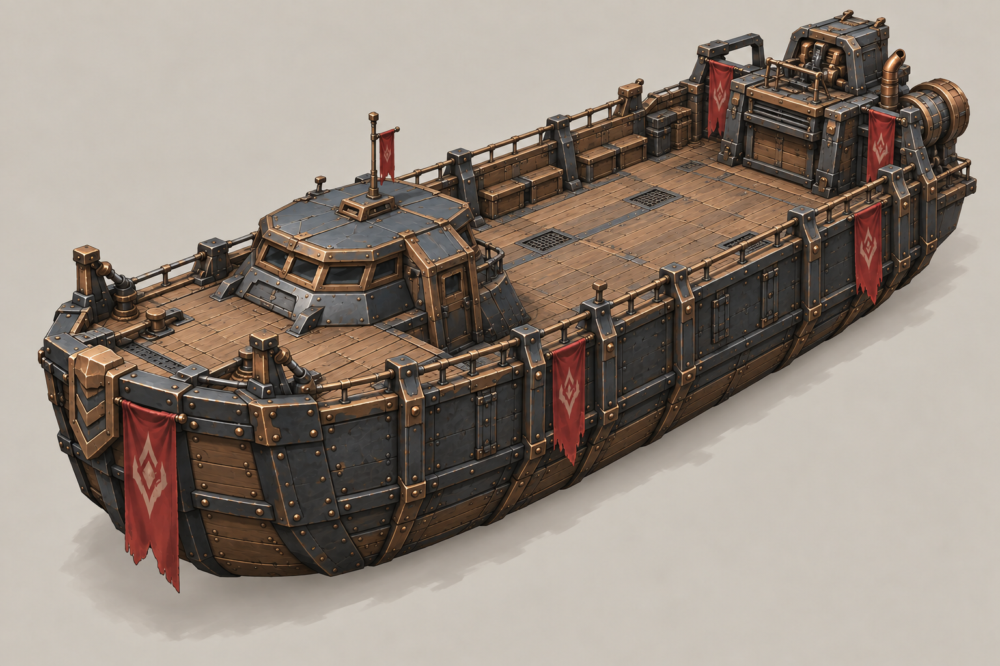
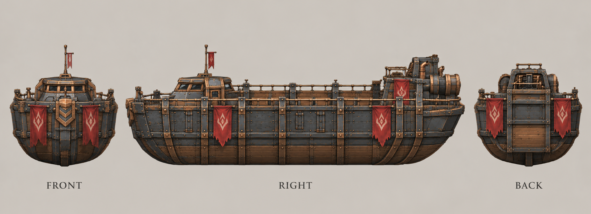

# 运输舰

| 文档属性 | 内容 |
|---|---|
| 单位编号 | UNT-014 |
| 版本 | v0.1 |
| 更新日期 | 2026-09-30 |
| 状态 | 造船厂建造、把人送到船上、载着移动到别的大陆，已确定；全部数值与装卸规则为设计提案；价格待定 |
| 规则依赖 | [BLD-030 · 造船厂](../建筑/造船厂.md) · [SYS-MOV-001 · 距离与移动速度标准](../系统/距离与移动速度标准.md) · [SYS-MAP-001 · 地图与资源点](../系统/地图与资源点.md) |

[返回文档目录](../../游戏设计文档.md)

## 1. 单位定位

运输舰是**跨海运兵的船**（已确定）：**把人送到运输舰上，载着移动到别的大陆**。它是玩家到达隔海大陆的唯一方式，也是远征、开拓海外矿点和宝箱的前提。

它没有攻击能力，靠自身血量和护航活下来。

## 2. 属性表

| 属性 | 当前设定 | 状态 |
|---|---|---|
| 最大生命值 | **600** | 设计提案 |
| 护甲 | **10**（减伤 25%） | 设计提案 |
| 攻击 | 无 | 已确定（运输舰不攻击） |
| 移动速度 | **4 m/s**（快档，仅水面） | 设计提案 |
| 载员 | **20** 个单位位（普通单位占 1 位，体型大的占更多） | 设计提案 |
| 视野 | **12 m** | 设计提案 |
| 生产建筑 | [造船厂](../建筑/造船厂.md) | 已确定 |
| 建造时间 | **45 秒** | 设计提案 |
| 建造成本 | 待定 | 后面单独确定 |
| 人口占用 | 占用 **2** 名人口（船员） | 设计提案 |
| 维持费 | 待定 | 后面单独确定 |
| 通航 | 只能在水面行驶，浅海与深海均可 | 设计提案 |

## 3. 装卸规则（设计提案）

| 规则 | 内容 |
|---|---|
| 上船 | 陆地单位走到船旁（离岸 3 m 内的船），对运输舰右键，或者被选中后点击「登船」，就会被装上船 |
| 载员显示 | 船上单位不占用地面位置，船的界面显示载员图标与数量 |
| 移动 | 船载着全部乘员移动，速度由船决定 |
| 下船 | 船靠近陆地（离岸 3 m 内），选择「卸载」，乘员在岸上登陆，占据靠岸一侧的位置 |
| 船被击毁 | 船沉没时，船上乘员**全部死亡**，这是跨海运兵的风险 |
| 船上单位的战斗 | 船上的单位不能攻击，也不会被单独攻击，需要先摧毁船 |
| **海上建造（已确定）** | 建造和修理**海上建筑**（如海上石油平台）时，系统召集的是最近的空闲运输舰，且舰上必须载有开拓者；开拓者在船上施工，运输舰停在工地旁不能移动。详见[建造与修理](../系统/建造与修理.md)第 2.3 节 |

## 4. 强度与风险

| 项目 | 结果 |
|---|---|
| 一次运输 | 20 个单位位，可以运一整支分队和几名开拓者 |
| 一只绿皮拆一艘运输舰 | 每次对船实际伤害 20 × 30 ÷ 40 = 15，600 生命需要 40 次命中，约 60 秒 |
| 远程绿皮（弓手，射程 9 m） | 只能打到贴岸的船，所以航线应离岸远一些 |

**设计意图：**
- 跨海运兵有风险，船沉没全员损失，玩家需要护航或者挑安全的航线。
- 载员 20 是一个折衷：足够送一支小队到海外开拓，但不能一次搬空全军。

## 5. 待设计内容

| 项目 | 需确定内容 |
|---|---|
| 价格 | 造价与维持费 |
| 数值 | 生命值、速度、载员是否合适 |
| 装卸 | 是否需要专门的码头，还是任意海岸都能装卸 |
| 大型单位 | 骑士、魔像这类体型大的单位如何占位 |
| 美术 | 概念图与模型规范 |

## 6. 关联文档

[造船厂](../建筑/造船厂.md) · [曙光号](曙光号.md) · [开拓者](开拓者.md) · [传送阵](../建筑/传送阵.md) · [地图与资源点](../系统/地图与资源点.md) · [普通绿皮](../敌人/普通绿皮.md)

## 7. 版本记录

| 版本 | 日期 | 变更 |
|---|---|---|
| v0.1 | 2026-09-30 | 建立文档：造船厂建造的运输船，载着人跨海到别的大陆；数值为设计提案 |

<!-- art-20261005:start -->
## 美术设定图补充（2026-10-05）

本批补充概念稿和正面、侧面、背面三视图。用于造型与材质参考；建模时统一尺寸、结构和各视图细节。俯视图与动画另行制作。

运输舰采用适度升级的金属船体与木甲板，取消外伸脚踏板。

### 运输舰

[概念稿提示词](../美术/主城/敌人与建筑设定图/运输舰-概念图-v2-提示词.txt) · [三视图提示词](../美术/主城/敌人与建筑设定图/运输舰-三视图-v1-提示词.txt)

<!-- art-20261005:end -->
