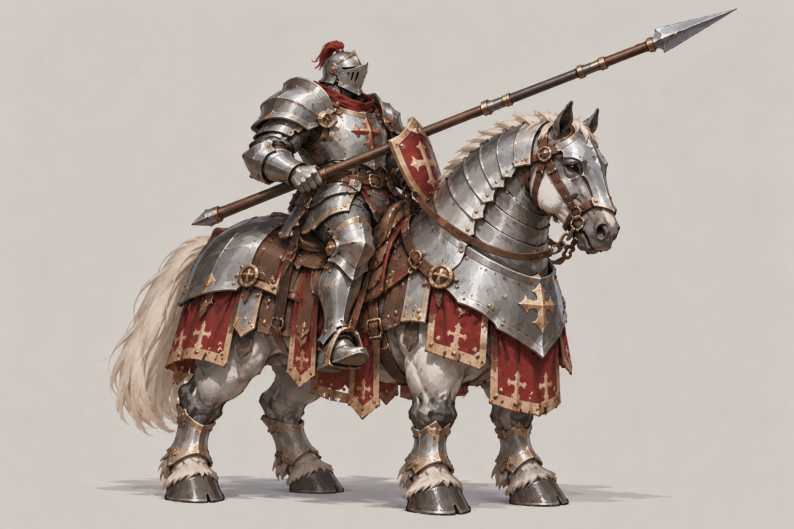
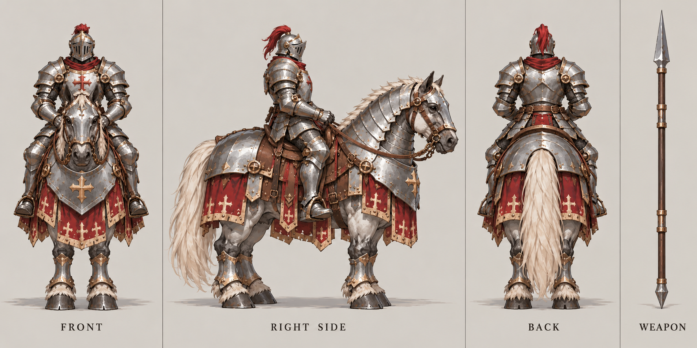

# 骑士

| 文档属性 | 内容 |
|---|---|
| 单位编号 | UNT-007 |
| 版本 | v0.3 |
| 更新日期 | 2026-10-08 |
| 状态 | 单位名称、兵营 3 本自动解锁、移动较快、技能猎手（对远程单位额外 +50% 伤害），已确定；具体数值为设计提案；价格见本轮原型基线 |
| 规则依赖 | [SYS-CBT-001 · 战斗与护甲规则](../系统/战斗与护甲规则.md) · [SYS-MOV-001 · 距离与移动速度标准](../系统/距离与移动速度标准.md) · [BLD-004 · 兵营](../建筑/军事建筑/兵营.md) |

[返回文档目录](../../游戏设计文档.md)

<!-- combat-baseline-20261008:start -->
## 原型数值基线（2026-10-08 · 第二轮）

成本 **3000 金币 + 12 钢铁**；维持费 **160 金币/分钟**，人口机会成本另计。招募加成只作用于之后招募的单位，基础值与本数加成只乘一次。

本节为原型参数，不代表真人试玩已平衡。正文历史强度示例若使用修订前参数，须重新验算；不以历史例子的胜负作为新版本承诺。详见[生存数值配置](../系统/生存数值配置.md)。
<!-- combat-baseline-20261008:end -->

## 1. 单位定位

骑士是**兵营的高阶近战单位**，**兵营升到 3 本时自动解锁**（已确定），**跑得比较快**（已确定）。

它是兵营线上最强的近战兵种，强于[民兵](民兵.md)，也是物理路线里与魔法一侧[圣骑士](圣骑士.md)、[圣堂刺客](圣堂刺客.md)对应的单位。因为速度快，它适合快速驰援、追击和冲锋，而不是死守一处。

## 2. 解锁方式（已确定）

| 规则 | 内容 |
|---|---|
| 解锁条件 | 兵营升到 **3 本** |
| 解锁方式 | **自动解锁**，不需要像[火枪手](火枪手.md)那样额外花费解锁 |
| 解锁范围 | 只有 3 本的兵营才能招募骑士（设计提案）；升本是按兵营独立的，见[兵营](../建筑/军事建筑/兵营.md)第 5 节 |

## 3. 属性表

| 属性 | 当前设定 | 状态 |
|---|---|---|
| 最大生命值 | **250**（3 本兵营 +40% 后为 350） | 设计提案 |
| 护甲 | **5**（减伤约 14.3%） | 设计提案 |
| 攻击力 | **25** / 次，近战单体（3 本兵营 +40% 后为 35） | 设计提案 |
| 攻击间隔 | **1.5 秒**（3 本兵营加成后每秒伤害约 23） | 设计提案 |
| 攻击距离 | **1 m** | 设计提案 |
| 移动速度 | **4.0 m/s**（快档） | 已确定「比较快」；具体值为设计提案 |
| 视野 | **10 m** | 设计提案 |
| 警戒距离 | **8 m** | 设计提案 |
| 技能 | 被动：猎手，对远程单位额外造成 50% 伤害（见第 4 节） | 已确定 |
| 招募建筑 | [兵营](../建筑/军事建筑/兵营.md)（3 本） | 已确定 |
| 招募时间 | **25 秒** | 设计提案 |
| 招募成本 | 3000 金币 + 12 钢铁 | 本轮原型基线（待试玩） |
| 人口占用 | 占用 **1** 名人口 | 设计提案 |
| 维持费 | 160 金币 / 分钟 | 本轮原型基线（待试玩） |

**关于兵营升本加成：**骑士只能由 3 本兵营招募，因此实际属性总是按 +40% 计算。表中的基础值 250 / 25 是为了配合这个加成设定的：最终生命值 350、攻击力 35。

## 4. 技能：猎手（被动）

**对远程单位额外造成 50% 伤害**（已确定）。这是骑士的对策技能，专门针对躲在后排的远程敌人。

| 参数 | 提案值 |
|---|---|
| 类型 | 被动，不需要操作，单位上有图标显示 |
| 效果 | 攻击**远程类敌人**时，伤害额外 **+50%**（3 本兵营加成后 35 → 52.5） |
| 对象 | 敌方单位中攻击方式为远程的（例如[绿皮弓手](../敌人/绿皮弓手.md)）；对建筑无效 |
| 优先锁定 | 视野内有远程敌人时，骑士的自动警戒**优先选择远程目标**，而不是最近的目标（设计提案，待确认） |

**为什么这样设计：**
- 骑士的核心是「跑得快」，正好用来**切入后排**，解决「前排挡着，远程敌人在后面输出」的问题。
- 没有优先锁定的话，骑士会被近战杂兵缠住，永远打不到后排。这条规则是否采用，你可以再定。
- 目前只有一种近战敌人，这个技能暂时没有对象。等远程敌人出现才生效，目前只有草案中的[绿皮弓手](../敌人/绿皮弓手.md)。

## 5. 与其他近战单位的比较

| 单位 | 生命值 | 每秒伤害 | 速度 | 定位 |
|---|---|---|---|---|
| [民兵](民兵.md)（1 本） | 150 | 10 | 3.0 | 基础前排 |
| [圣堂刺客](圣堂刺客.md) | 150 | 16 起 | 4.2 | 突击输出 |
| [圣骑士](圣骑士.md) | 320 | 16.7 | 3.0 | 重甲前排 |
| **骑士**（3 本兵营） | 350 | 约 23 | 4.0 | 机动近战 |

## 6. 强度检验

普通绿皮属性以设计提案为准：**200 生命、20 攻击、1.5 秒攻击间隔、无护甲、近战、移动速度 3 m/s**。骑士按 3 本兵营加成后的属性（350 生命、35 攻击）计算。

| 项目 | 结果 |
|---|---|
| 绿皮每次对骑士的实际伤害 | 20 × 30 ÷ 35 ≈ 17.1 |
| 骑士消灭一只绿皮 | 6 次命中，约 7.5 秒 |
| 骑士消灭一只[绿皮弓手](../敌人/绿皮弓手.md)（100 生命，远程） | 猎手加成后单次 52.5，2 次命中约 1.5 秒；无加成需 3 次 |
| 绿皮消灭一名骑士 | 21 次命中，约 31.5 秒 |
| 1 骑士 vs 2 只绿皮 | 骑士胜，剩约 95 生命（不含冲锋） |
| 1 骑士 vs 3 只绿皮 | 骑士败 |

**设计意图：**
- 骑士单挑能稳赢，对 2 只也能赢，强于开局的民兵，符合「解锁单位强于最初等单位」。
- 但仍守不住 3 只，和多重箭塔一样需要配合；它的价值在机动性，而不是站桩。
- 速度 4.0 m/s，略慢于圣堂刺客（4.2），但血量更厚，两者分别偏防御与偏爆发。

## 7. 待设计内容

| 项目 | 需确定内容 |
|---|---|
| 技能 | 是否采用「优先锁定远程目标」；技能图标样式 |
| 价格 | 招募成本与维持费 |
| 数值 | 生命值、伤害、速度是否合适 |
| 解锁 | 兵营升本的价格与时间（见[兵营](../建筑/军事建筑/兵营.md)） |
| 美术 | 概念图与模型规范，是否骑马 |

## 8. 关联文档

[兵营](../建筑/军事建筑/兵营.md) · [民兵](民兵.md) · [火枪手](火枪手.md) · [圣堂刺客](圣堂刺客.md) · [圣骑士](圣骑士.md) · [普通绿皮](../敌人/普通绿皮.md) · [距离与移动速度标准](../系统/距离与移动速度标准.md)

## 9. 版本记录

| 版本 | 日期 | 变更 |
|---|---|---|
| v0.1 | 2026-09-29 | 建立文档：兵营 3 本自动解锁的高阶近战单位，移动较快；提出冲锋技能与备选方案 |
| v0.2 | 2026-09-29 | 确定技能为猎手：对远程单位额外造成 50% 伤害；取消冲锋方案 |
| v0.3 | 2026-10-08 | 金币数量级整体 ×20（价格、维持费、奖励同比放大，平衡不变） |

### 骑士概念图（2026-09-30 美术提案）

造型、配色、服装及装饰为美术提案，尚未确认为最终设定；玩法与数值以本文原有规则为准。 骑乘战马与骑枪属于本稿的外观提案，原文仅确定高阶快速近战定位。

[生成提示词](../美术/主城/敌人与建筑设定图/骑士-概念图-v2-提示词.txt) · [设定图索引](../美术/主城/敌人与建筑设定图/设定图索引.md)

**2026-09-30 修订说明（v2，图稿待确认）：**按用户反馈强化厚重感：壮实战马、完整人马板甲、短而下垂的布料，去除长披风与飘旗。仍保留快速近战定位；骑马与骑枪为待确认的外观提案。

[旧稿 v1](../美术/主城/敌人与建筑设定图/骑士-概念图-v1.png) · [旧稿提示词](../美术/主城/敌人与建筑设定图/骑士-概念图-v1-提示词.txt) · [单位强度视觉分层提案](../美术/主城/敌人与建筑设定图/单位强度视觉分层提案.md)

### 骑士三视图（2026-10-02 修订）

以当前概念图为参考的正面、右侧和背面美术图。三栏人物均空手，骑枪只在最右栏出现一次，每栏留有裁切边界。建模前需校准尺寸、遮挡与细部。

[生成提示词](../美术/主城/敌人与建筑设定图/骑士-三视图-v3-提示词.txt)

### 本轮数值版本记录

| 版本 | 日期 | 变更 |
|---|---|---|
| 2026.10.08-B2 | 2026-10-08 | 第二轮原型成本、维护与战斗边界；历史例需按新参数重验 |
