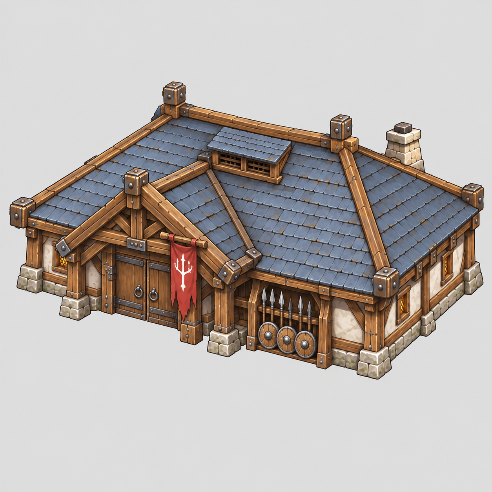
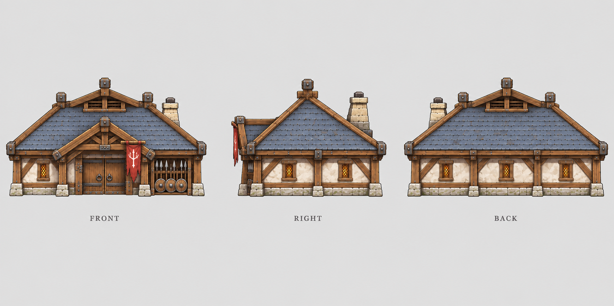

# 兵营

| 文档属性 | 内容 |
|---|---|
| 建筑编号 | BLD-004 |
| 版本 | v0.1 |
| 更新日期 | 2026-09-26 |
| 状态 | 名称、定位、生命值、护甲、可招募单位已确定；其余数值与招募规则为设计提案 |
| 规则依赖 | [SYS-CBT-001 · 战斗与护甲规则](../系统/战斗与护甲规则.md) · [SYS-MOV-001 · 距离与移动速度标准](../系统/距离与移动速度标准.md) |

[返回文档目录](../../游戏设计文档.md)

## 1. 建筑定位

兵营是后方的士兵生产建筑，用来招募基础士兵「民兵」。

**兵营理应脆弱。**它不是去打仗的建筑，而是藏在基地后方生产士兵的设施。玩家需要把它布置在安全位置，用箭塔、哨塔和士兵保护起来；绿皮一旦绕到后方，兵营会很快被拆。

## 2. 属性表

| 属性 | 当前设定 | 状态 |
|---|---|---|
| 最大生命值 | **200** | 已确定 |
| 护甲 | **5**（减伤约 14.3%） | 已确定 |
| 攻击 | 无 | 已确定 |
| 可招募单位 | **民兵** | 已确定 |
| 占地 | **8 × 8 m** | 设计提案 |
| 建造时间 | **30 秒**（1 名开拓者） | 已确定 |
| 视野 | **10 m** | 设计提案 |
| 成本 | **150 金币** | 已确定，见[成本体系](../系统/成本体系.md) |

兵营是目前最脆的建筑，生命值低于箭塔和哨塔（均为 300）。护甲与哨塔相同。

## 3. 招募功能

| 项目 | 当前设定 | 状态 |
|---|---|---|
| 可招募单位 | 民兵（1 种） | 已确定；更多兵种后续通过科技或升级解锁 |
| 招募时间 | **15 秒** / 人 | 已确定 |
| 民兵招募价格 | **60 金币** | 已确定 |
| 招募队列 | 最多 **5** 个，依次出兵 | 设计提案 |
| 集结点 | 可设置，新兵出营后自动前往 | 设计提案 |
| 取消招募 | 可以，全额返还资源 | 设计提案 |
| 多座兵营 | 允许建造多座，以加快出兵 | 设计提案 |
| 人口占用 | 待定 | 待资源与人口体系确定 |

民兵属性见[民兵](../单位/民兵.md)。

## 4. 强度检验

普通绿皮尚无正式数值，以下借用测试建议检验：**20 攻击、1.5 秒攻击间隔、近战**。**这组数值仅用于检验，不属于已采纳的单位数据。**

| 项目 | 结果 |
|---|---|
| 绿皮每次对兵营的实际伤害 | 20 × 30 ÷ 35 ≈ 17.1 |
| 一只绿皮拆掉满血兵营 | 12 次命中，约 17 秒 |
| 对比箭塔 / 哨塔 | 分别约 25 秒 / 26 秒 |

兵营被偷袭时，一只绿皮不到 20 秒就能拆掉，大约只够再出 1 个民兵。玩家需要事先把兵营布置在防线以内。

## 5. 升级方向（示意）

**兵营**（冷兵器步兵）→ **军营**（弩兵、训练更快）→ **军校 / 训练基地**（火枪兵等科技兵种）

升级方式、科技前置和数值成长均待设计。

## 6. 待设计内容

| 项目 | 需确定内容 |
|---|---|
| 人口 | 是否占用人口，人口上限来源 |
| 前置条件 | 建造兵营是否需要主城等级或其他建筑 |
| 修理 | 消耗、速度、执行者 |
| 美术 | 概念图、俯视图、三视图 |

## 7. 关联文档

[箭塔](箭塔.md) · [哨塔](哨塔.md) · [城墙](城墙.md) · [主城设计](主城设计.md) · [开拓者](../单位/开拓者.md) · [民兵](../单位/民兵.md) · [战斗与护甲规则](../系统/战斗与护甲规则.md)

## 8. 版本记录

| 版本 | 日期 | 变更 |
|---|---|---|
| v0.1 | 2026-09-26 | 建立文档：确定后方脆弱定位、生命值 200、护甲 5、可招募民兵；提出占地、建造时间与招募规则 |

### 兵营设定图

造型提案 v3（2026-09-29）：概念稿与正面／右侧／背面三视图独立成图。沿用既有造型与玩法设定，建模时仍需统一精确尺寸与细节。

[概念图提示词](../美术/主城/敌人与建筑设定图/兵营-概念图-v3-提示词.txt) · [三视图提示词](../美术/主城/敌人与建筑设定图/兵营-三视图-v3-提示词.txt)

[历史合版](../美术/主城/敌人与建筑设定图/兵营-设定图-v1.png)

[生成提示词](../美术/主城/敌人与建筑设定图/兵营-提示词-v1.txt)
