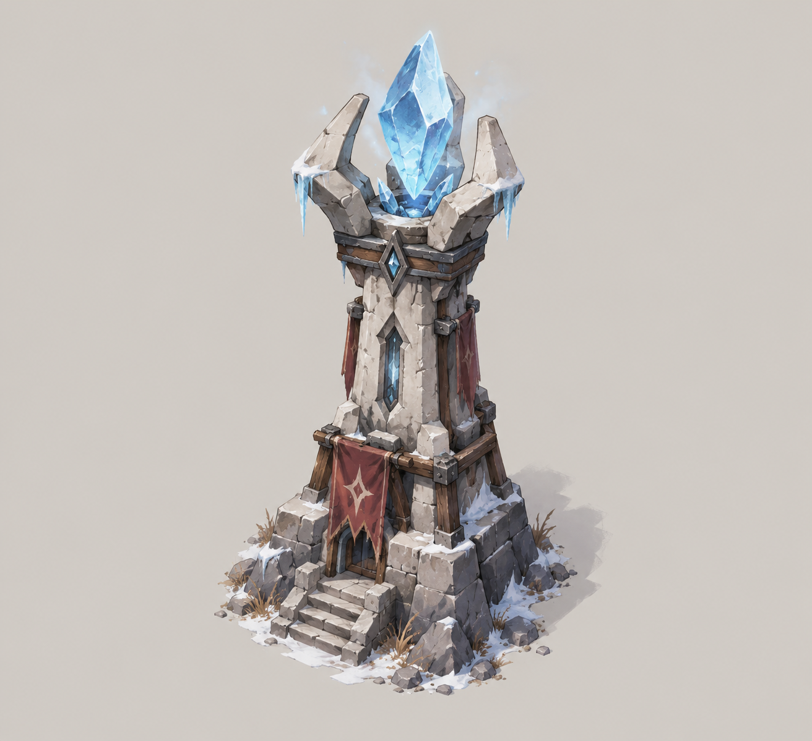
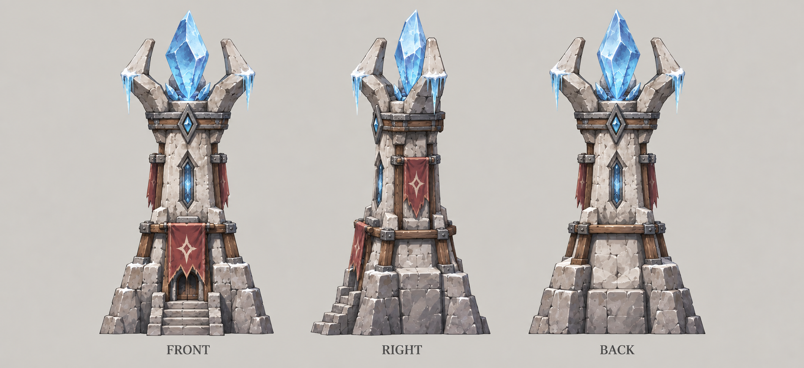

# 凝霜塔

| 文档属性 | 内容 |
|---|---|
| 建筑编号 | BLD-008 |
| 建筑分类 | 军事建筑 |
| 版本 | v0.3 |
| 更新日期 | 2026-10-08 |
| 状态 | 魔法塔、1 本（基础阶段）解锁、单体减速、伤害与箭塔相仿、无视护甲已确定；名称暂定；其余数值为设计提案 |
| 规则依赖 | [SYS-CBT-001 · 战斗与护甲规则](../../系统/战斗与护甲规则.md) · [SYS-TEC-001 · 科技系统](../../系统/科技系统.md) · [SYS-ENG-001 · 能源体系](../../系统/能源体系.md) |

[返回文档目录](../../../游戏设计文档.md)

## 1. 建筑定位

凝霜塔是**基础阶段（1 本）的魔法塔**，**开局即可建造，不需要法师营地**，用魔法冻结目标：**单体攻击，伤害与箭塔相仿，无视护甲，命中后使目标减速。**

它和箭塔同属基础塔，分工不同：箭塔便宜，靠数量；凝霜塔更贵，贡献的是「拖住敌人」和「打穿护甲」。前期敌人护甲为 0 时，它的伤害与箭塔相同，价值主要来自减速；等高护甲敌人出现后，无视护甲才体现出价值。

它是魔法一侧最早出现的防御手段，与[古塞奇尤](../../单位/古塞奇尤.md)一样代表这个世界的本土魔法。

**名称说明：**「凝霜塔」为暂定名。备选：霜晶塔、凛冬塔、寒霜塔。原先样例中的「冰霜塔」偏直白，不再使用。

## 2. 属性表

| 属性 | 当前设定 | 状态 |
|---|---|---|
| 解锁条件 | **1 本（基础阶段），开局可建**，不需要法师营地 | 已确定 |
| 攻击类型 | 魔法，单体 | 已确定 |
| 护甲穿透 | **无视护甲**（伤害不再乘护甲减伤） | 已确定 |
| 攻击力 | **20** / 次，与箭塔相同 | 已确定「相仿」；具体值为设计提案 |
| 攻击间隔 | **1.5 秒** | 设计提案 |
| 射程 | **10 m** | 设计提案 |
| 视野 | **12 m** | 设计提案 |
| 减速效果 | 命中后目标移动速度 **−40%**，持续 **3 秒** | 设计提案 |
| 最大生命值 | **300** | 设计提案，与箭塔相同 |
| 护甲 | **3** | 设计提案，与箭塔相同 |
| 占地 | **3 × 3 m** | 设计提案 |
| 攻击目标 | 地面单位 | 设计提案 |
| 成本 | **3200 金币** | 设计提案；比箭塔（2400）贵，不需要魔晶 |
| 建造时间 | **20 秒**（1 名开拓者） | 设计提案，与箭塔相同 |
| 维持费 | **200** 金币 / 分钟 | 设计提案，与箭塔相同，见[成本体系](../../系统/成本体系.md) |
| 能源占用 | 不占用 | 设计提案；基础塔不占用能源 |
| 人口占用 | 不占用 | 设计提案，与其他塔一致 |

## 3. 减速规则（设计提案）

| 规则 | 内容 |
|---|---|
| 效果 | 移动速度 −40%（标准 3 m/s 降为 1.8 m/s） |
| 持续 | 3 秒，再次命中刷新时间 |
| 叠加 | **不叠加**。多座凝霜塔命中同一目标时，取最强的一个，不重复计算 |
| 影响范围 | 只降低移动速度，不影响攻击速度和攻击力 |
| 免疫 | 后期的精英、首领类敌人可以部分或全部免疫，待敌人设计 |

**为什么不叠加：**叠加后多座凝霜塔可以把敌人几乎定在原地，防线过强，也难以平衡。

**对城墙防线的影响：**减速只影响移动。绿皮被墙挡住后是在原地拆墙，减速对这个阶段没有效果，它的价值集中在敌人接近防线的路上，以及墙后敌人越墙冲出之后。如果想让它在墙前也有用，可以考虑同时降低攻击速度，待定。

## 4. 无视护甲

凝霜塔的攻击不经过[战斗与护甲规则](../../系统/战斗与护甲规则.md)中的减伤公式，**实际伤害等于原始伤害**。这是因为**魔法伤害都无视护甲**（已确定，见[战斗与护甲规则](../../系统/战斗与护甲规则.md)），不是凝霜塔独有的特性。

| 目标护甲 | 减伤率 | 箭塔实际伤害 | 凝霜塔实际伤害 |
|---:|---:|---:|---:|
| 0（普通绿皮） | 0% | 20 | 20 |
| 10 | 25% | 15 | 20 |
| 20 | 40% | 12 | 20 |
| 30 | 50% | 10 | 20 |

当前只有普通绿皮（护甲 0），无视护甲暂时没有实际效果。需要护甲较高的敌人出现，才能体现它相对箭塔的优势。

## 5. 强度检验

普通绿皮属性以设计提案为准：**200 生命、20 攻击、1.5 秒攻击间隔、无护甲、近战、移动速度 3 m/s**。

| 项目 | 结果 |
|---|---|
| 凝霜塔消灭一只绿皮 | 10 次命中，约 15 秒，与箭塔相同 |
| 绿皮从射程边缘走到塔下 | 未减速约 3.3 秒；被减速后约 5.6 秒（3 m/s → 1.8 m/s），多出约 2.3 秒，即多打约 1.5 次 |
| 一只绿皮拆掉满血凝霜塔 | 约 25 秒，与箭塔相同 |

**设计意图：**单座凝霜塔的输出没有比箭塔强多少，价格却高出 800 金币，它的价值来自配合。放在箭塔组前方，敌人在射程内多停留的时间等于全体箭塔多射的箭数，因此塔越多，减速的收益越大。

## 6. 待设计内容

| 项目 | 需确定内容 |
|---|---|
| 名称 | 是否采用「凝霜塔」，或改用备选名 |
| 价格 | 价格是否合适；是否限制建造数量，避免开局全堆减速 |
| 减速 | 幅度、持续时间、是否同时降低攻速 |
| 升级 | 是否有 Lv2，能否与科技体系塔混搭 |
| 弹道 | 冰弹是即时命中还是飞行弹道 |
| 美术 | 概念图、俯视图、三视图 |

## 7. 关联文档

[科技系统](../../系统/科技系统.md) · [战斗与护甲规则](../../系统/战斗与护甲规则.md) · [箭塔](箭塔.md) · [能源体系](../../系统/能源体系.md) · [成本体系](../../系统/成本体系.md) · [普通绿皮](../../敌人/普通绿皮.md)

## 8. 版本记录

| 版本 | 日期 | 变更 |
|---|---|---|
| v0.1 | 2026-09-29 | 建立文档：魔法塔，单体减速、伤害与箭塔相仿、无视护甲；暂定名凝霜塔，其余数值为设计提案 |
| v0.2 | 2026-09-29 | 改为基础阶段（1 本）开局可建的魔法塔，不需要法师营地；价格 160、维持费 10、不占用能源 |
| v0.3 | 2026-10-08 | 金币数量级整体 ×20（价格、维持费同比放大，平衡不变） |

## 美术图稿（2026-10-01 补充）

[概念图提示词](../../美术/主城/敌人与建筑设定图/凝霜塔-概念图-v1-提示词.txt) · [三视图提示词](../../美术/主城/敌人与建筑设定图/凝霜塔-三视图-v1-提示词.txt) · [图稿索引](../../美术/主城/敌人与建筑设定图/设定图索引.md)

沿用现有概念造型，三视图为美术参考；不可见部位为推定补全，建模前需统一尺寸与结构。
