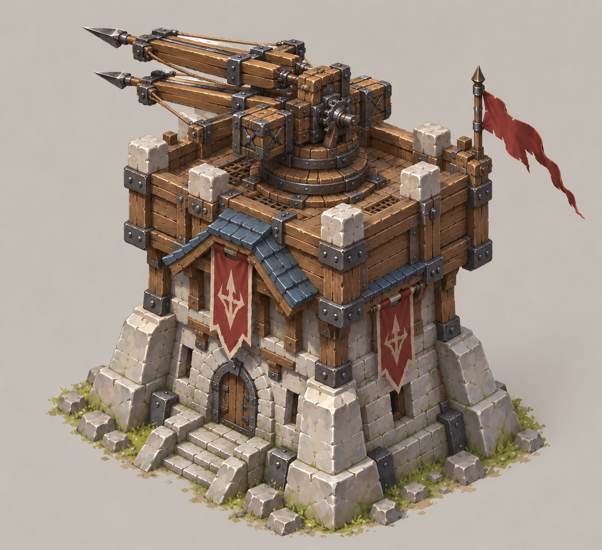
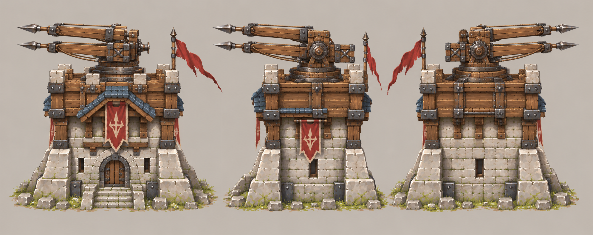

# 双重箭塔 / 多重箭塔

| 文档属性 | 内容 |
|---|---|
| 建筑编号 | BLD-009 |
| 建筑分类 | 军事建筑 |
| 版本 | v0.4 |
| 更新日期 | 2026-10-08 |
| 状态 | 2 本建筑、双重箭塔（2 支箭）升级为多重箭塔（4 支箭）已确定；归属科技体系、攻击方式与全部数值为设计提案；价格见本轮原型基线 |
| 规则依赖 | [SYS-CBT-001 · 战斗与护甲规则](../../系统/战斗与护甲规则.md) · [SYS-TEC-001 · 科技系统](../../系统/科技系统.md) · [SYS-ENG-001 · 能源体系](../../系统/能源体系.md) |

[返回文档目录](../../../游戏设计文档.md)

<!-- combat-baseline-20261008:start -->
## 原型数值基线（2026-10-08 · 第二轮）

造价 **4800 金币 + 40 钢铁**；维持费 **400 金币/分钟**；能源占用 **50**。军事成本主表统一见[成本体系](../../系统/成本体系.md)。 四重升级4000金币+80钢铁、30秒、需科技3本；累计8800金币+120钢铁；4×20/1.5秒，能源80、维护600。升级回满既有规则保留。

本节为原型参数，不代表真人试玩已平衡。正文历史强度示例若使用修订前参数，须重新验算；不以历史例子的胜负作为新版本承诺。详见[生存数值配置](../../系统/生存数值配置.md)。
<!-- combat-baseline-20261008:end -->

## 1. 建筑定位

双重箭塔是**2 本建筑**，是[箭塔](箭塔.md)的多目标版本：**一次齐射发出 2 支箭，分别射向不同的敌人。**升级后成为**多重箭塔**，一次齐射发出 4 支箭。

它解决箭塔的一个弱点：箭塔一次只能打一个目标，面对成群的绿皮，输出被浪费在排队上。双重箭塔和多重箭塔用「同时打多个目标」换取对群体的压制力，输出上限仍然受单支箭伤害限制，不能取代[凝霜塔](凝霜塔.md)或以后的范围伤害塔。

**归属（设计提案）：**科技体系，研究院建成（2 本）后解锁，是科技 2 本的 2 座纯体系塔之一（另一座为火炮塔样例）。理由：机械连发属于主角带来的科技，魔法体系用魔法塔表现。若你想放在魔法体系，或改成基础阶段，需要调整。

## 2. 属性表

### 2.1 双重箭塔（升级前）

| 属性 | 当前设定 | 状态 |
|---|---|---|
| 解锁条件 | 研究院 2 本（建成） | 设计提案 |
| 每次齐射 | **2 支箭**，每支 **20** 伤害 | 已确定「双重」；数值为设计提案 |
| 目标分配 | 第 1 支射最近的敌人，第 2 支射次近的敌人；范围内只有 1 个敌人时，2 支箭都射向它 | 设计提案 |
| 攻击间隔 | **1.5 秒** | 设计提案 |
| 每秒伤害 | 单目标 **26.7**，双目标各 13.3 | 与箭塔一致的单支箭伤害 |
| 射程 | **10 m** | 设计提案，与箭塔相同 |
| 视野 | **12 m** | 设计提案 |
| 最大生命值 | **400** | 设计提案 |
| 护甲 | **5**（减伤约 14.3%） | 设计提案 |
| 占地 | **4 × 4 m** | 设计提案 |
| 攻击目标 | 地面单位 | 设计提案 |
| 建造时间 | **25 秒**（1 名开拓者） | 设计提案 |
| 成本 | 4800 金币 + 40 钢铁 | 本轮原型基线（待试玩） |
| 维持费 | 400 金币 / 分钟 | 本轮原型基线（待试玩） |
| 能源占用 | 50 | 本轮原型基线（待试玩） |
| 人口占用 | 不占用 | 设计提案，与其他塔一致 |

### 2.2 多重箭塔（升级后）

| 属性 | 当前设定 | 状态 |
|---|---|---|
| 升级方式 | 由双重箭塔**原地升级**，不是另建新塔 | 已确定 |
| 每次齐射 | **4 支箭**，每支 **20** 伤害 | 已确定 |
| 目标分配 | 依次射最近的、次近的、第三近的、第四近的敌人；不足 4 个时，多余的箭依次补射向最近的敌人 | 设计提案 |
| 每秒伤害 | 单目标 **53.3**，四目标各 13.3 | |
| 最大生命值 | **500**（升级时回满） | 设计提案 |
| 护甲 | **8**（减伤约 21.1%） | 设计提案 |
| 攻击间隔 | **1.5 秒** | 设计提案，同双重箭塔 |
| 射程 | **10 m** | 设计提案，同双重箭塔 |
| 视野 | **12 m** | 设计提案，同双重箭塔 |
| 占地 | **4 × 4 m** | 设计提案，同双重箭塔 |
| 升级时间 | **30 秒**，需科技 3 本 | 本轮原型基线（成本体系 §5 与基线块一致） |
| 成本（升级价格） | 4000金币+80钢铁（累计 8800 金币 + 120 钢铁） | 本轮原型基线 |
| 维持费 | **600** 金币 / 分钟 | 设计提案 |
| 能源占用 | **80** | 设计提案 |
| 人口占用 | 不占用 | 设计提案 |

## 3. 目标分配规则（设计提案）

- 每次齐射开始时重新选择目标。
- 目标必须在射程内；不同的箭不会同时射向同一个目标，除非射程内目标数不足。
- 与单个箭塔不同，这里**不锁定当前目标**。每次齐射都按「最近的几个」重新选，换来自然的分摊输出，也避免所有箭堆在同一只绿皮上。
- 研究「铁箭头」（箭塔攻击力 +30%）建议对箭塔、双重箭塔、多重箭塔同时生效，统一叫「箭矢类塔」。

## 4. 强度检验

普通绿皮属性以设计提案为准：**200 生命、20 攻击、1.5 秒攻击间隔、无护甲、近战、移动速度 3 m/s**。以下不含维持费、能源和价格，为大致数值。

| 对抗情况 | 箭塔 | 双重箭塔 | 多重箭塔 |
|---|---|---|---|
| 消灭 1 只绿皮 | 15 秒 | 7.5 秒 | 约 4.5 秒 |
| 1 塔 vs 2 只绿皮 | 塔被拆，只消灭 1 只 | 约 15 秒消灭 2 只，塔剩约 130 生命 | 约 7.5 秒消灭 2 只，塔剩约 410 生命 |
| 1 塔 vs 3 只绿皮 | 塔被拆 | 塔约被拆平，勉强同归于尽 | 约 12 秒消灭 3 只，塔剩约 270 生命 |
| 1 塔 vs 4 只绿皮 | 塔被拆 | 塔被拆 | 约 15 秒消灭 4 只，塔仅剩约 10 生命 |

**设计意图：**
- 双重箭塔单独能守住 2 只绿皮，比箭塔强一档；多重箭塔单独能守住 3 只，4 只时勉强险胜。
- 不追求单塔守住更多，仍需要多座塔、士兵和城墙配合。
- 群体越大，多目标塔的优势越明显；单个目标（比如精英、首领）时，它们的输出只是同价位箭塔的两三倍，没有额外优势。这是留给以后高血量敌人的克制位置。

## 5. 与其他塔的关系

| 塔 | 定位 |
|---|---|
| [箭塔](箭塔.md) | 便宜，靠数量，单体 |
| [凝霜塔](凝霜塔.md) | 减速、无视护甲，单体，与箭矢类塔配合 |
| 双重 / 多重箭塔 | 同时压制多个目标，弱点是护甲高的敌人（20 点箭伤害被护甲吃掉） |

凝霜塔的无视护甲，恰好补上双重 / 多重箭塔面对高护甲敌人的弱点，这一组合值得鼓励。

## 6. 待设计内容

| 项目 | 需确定内容 |
|---|---|
| 归属 | 确认属于科技体系，还是魔法体系或基础阶段 |
| 数值 | 箭的数量、伤害、生命值、护甲是否合适 |
| 进一步升级 | 多重箭塔之后是否还有更高等级 |
| 弹道 | 箭矢是即时命中还是飞行弹道，齐射的表现 |
| 美术 | 双重箭塔与多重箭塔的造型区分，概念图、俯视图、三视图 |

## 7. 关联文档

[箭塔](箭塔.md) · [凝霜塔](凝霜塔.md) · [科技系统](../../系统/科技系统.md) · [战斗与护甲规则](../../系统/战斗与护甲规则.md) · [能源体系](../../系统/能源体系.md) · [成本体系](../../系统/成本体系.md) · [普通绿皮](../../敌人/普通绿皮.md)

## 8. 版本记录

| 版本 | 日期 | 变更 |
|---|---|---|
| v0.1 | 2026-09-29 | 建立文档：2 本建筑，双重箭塔（2 支箭）可升级为多重箭塔（3 支箭）；归属科技体系及全部数值为设计提案 |
| v0.2 | 2026-09-29 | 多重箭塔改为一次齐射 4 支箭，更新目标分配与强度检验 |
| v0.3 | 2026-10-08 | 金币数量级整体 ×20（价格、维持费同比放大，平衡不变） |

### 当前设定图：双重箭塔 v2（2026-10-01）

用户认可的一体双箭机构造型；整座塔共用一个机座，双箭并非两座独立箭塔。三视图供美术和建模参考，精确结构仍需校准。

[概念图提示词](../../美术/主城/敌人与建筑设定图/双重箭塔-概念图-v2-提示词.txt) · [三视图提示词](../../美术/主城/敌人与建筑设定图/双重箭塔-三视图-v2-提示词.txt)

### 旧版美术稿（仅供追溯）

v1 为早期造型提案，已由上方 v2 替代：[概念图](../../美术/主城/敌人与建筑设定图/双重箭塔-概念图-v1.png) · [提示词](../../美术/主城/敌人与建筑设定图/双重箭塔-概念图-v1-提示词.txt)。

### 本轮数值版本记录

| 版本 | 日期 | 变更 |
|---|---|---|
| 2026.10.08-B2 | 2026-10-08 | 第二轮原型成本、维护与战斗边界；历史例需按新参数重验 |
| v0.4 | 2026-10-08 | 第五轮同步：多重箭塔升级时间回填 30 秒，升级价格补累计；删已覆盖的价格待设计行 |
