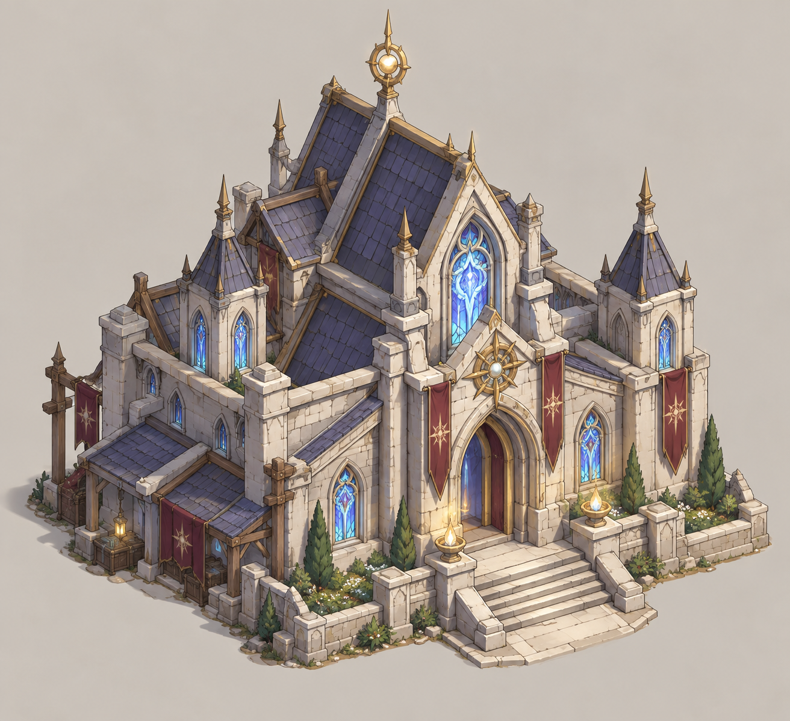
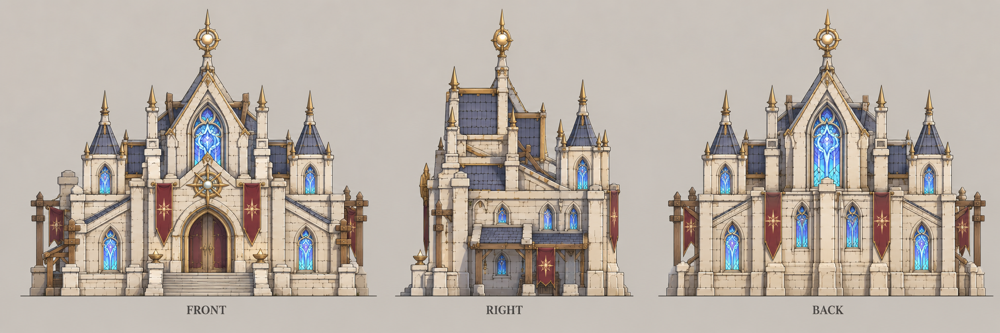

# 圣堂

| 文档属性 | 内容 |
|---|---|
| 建筑编号 | BLD-013 |
| 建筑分类 | 军事建筑 |
| 版本 | v0.9 |
| 更新日期 | 2026-10-08 |
| 状态 | 魔法 2 本建筑、类似兵营、可生成单位、有牧师，已确定；牧师、刺客等现有单位按正文前置招募，后续扩展待定；属性与招募规则为设计提案；价格见本轮原型基线 |
| 规则依赖 | [SYS-TEC-001 · 科技系统](../../系统/科技系统.md) · [BLD-004 · 兵营](兵营.md) · [SYS-ENG-001 · 能源体系](../../系统/能源体系.md) |

[返回文档目录](../../../游戏设计文档.md)

<!-- combat-baseline-20261008:start -->
## 原型数值基线（2026-10-08 · 第二轮）

造价 **5000 金币 + 40 魔晶**；维持费 **0 金币/分钟**；能源占用 **50**。军事成本主表统一见[成本体系](../../系统/成本体系.md)。

本节为原型参数，不代表真人试玩已平衡。正文历史强度示例若使用修订前参数，须重新验算；不以历史例子的胜负作为新版本承诺。详见[生存数值配置](../../系统/生存数值配置.md)。
<!-- combat-baseline-20261008:end -->

## 1. 建筑定位

圣堂是**魔法体系的 2 本建筑**，功能**类似[兵营](兵营.md)：生产单位**。兵营招募物理兵种，圣堂招募魔法一侧的单位，目前已确定的第一个单位是**牧师**（可以回血的单位）。

它和[法师营地](../../系统/科技系统.md)不是同一座建筑：法师营地是魔法体系的科技建筑，负责升本和研究；建成法师营地（魔法 2 本）后，才能建造圣堂。

**为什么放在法师营地建成之后：**魔法一侧的单位由古塞奇尤所代表的本土魔法传授，需要先有法师营地作为魔法传承的基础。

## 2. 属性表

| 属性 | 当前设定 | 状态 |
|---|---|---|
| 解锁条件 | 法师营地建成（魔法 2 本） | 已确定 |
| 建筑功能 | 招募魔法一侧的单位 | 已确定 |
| 可招募单位 | [牧师](../../单位/牧师.md)（开局可招募）；[圣堂刺客](../../单位/圣堂刺客.md)（需先解锁）；[圣骑士](../../单位/圣骑士.md)（需科技 2 本并先解锁，招募建筑为设计提案）；[法师](../../单位/法师.md)（圣堂 3 本并先解锁）；更多单位待设计 | 牧师、圣堂刺客已确定 |
| 最大生命值 | **250** | 设计提案 |
| 护甲 | **5**（减伤约 14.3%） | 设计提案 |
| 攻击 | 无 | 设计提案 |
| 占地 | **6 × 6 m** | 设计提案 |
| 视野 | **10 m** | 设计提案 |
| 建造时间 | **30 秒**（1 名开拓者） | 设计提案 |
| 成本 | 5000 金币 + 40 魔晶 | 本轮原型基线（待试玩） |
| 维持费 | 0 金币 / 分钟 | 本轮原型基线（待试玩） |
| 能源占用 | 50 | 本轮原型基线（待试玩） |
| 人口占用 | 建筑本身不占用；招募的单位各占用 1 名人口 | 设计提案 |

## 3. 招募功能（设计提案）

规则与[兵营](兵营.md)一致，便于玩家理解：

| 项目 | 当前设定 |
|---|---|
| 招募队列 | 最多 **5** 个，依次出兵 |
| 集结点 | 可设置，新单位出塔后自动前往 |
| 取消招募 | 可以，全额返还资源 |
| 多座圣堂 | 允许建造多座，以加快出兵 |
| 招募时间 | 各单位不同，牧师见[牧师](../../单位/牧师.md) |
| 兵种解锁 | 圣堂刺客、圣骑士、法师需先在圣堂中解锁；圣骑士另需科技2本，法师另需圣堂及法师营地均3本。一次解锁对所有圣堂生效；刺客2000金币+15魔晶/40秒，圣骑士2500金币+10钢铁+10魔晶/45秒，法师2500金币+20魔晶/45秒，价格以成本体系主表为准，其他未配置项仍待定 |
| 其他单位 | 更多单位是否需要解锁、是否随升本开放，待定 |

## 4. 升本（已确定可升本，与兵营一样）

**圣堂可以升本，与[兵营](兵营.md)一样**（已确定）：升本后，**这座圣堂招募出来的角色，生命值和攻击力都有提升**。

这里的「本」是圣堂自己的等级，与法师营地、研究院的本数互相独立，也与兵营的本数互相独立。圣堂本数示意：**圣堂**（1 本）→ **大圣堂**（2 本）→ **圣殿**（3 本），名称为设计提案。

### 4.1 升本规则（与兵营一致）

| 规则 | 内容 | 状态 |
|---|---|---|
| 生效对象 | 这座圣堂**升本之后招募**的单位，已招募的单位不会变强 | 与兵营一致 |
| 独立计算 | 按圣堂独立升本，建多座圣堂各自升本、各自花费 | 与兵营一致 |
| 加成幅度 | 2 本 **+20%**，3 本 **+40%**（生命值与攻击力） | 设计提案，与兵营相同 |
| 升本花费 | 1→2：4000金+20晶/40秒/+20E，需法营2本；2→3：7000金+40晶/60秒/+30E，需法营3本 | 原型参数，见成本体系 |

圣堂基础能源50，本栋2/3本累计70/100；升级不提高建筑自身250生命/5护甲。

升级/兵种解锁为本栋自研，不额外占工人；与招募共用唯一执行队列，同一时刻只执行一项，其他同类设施可并行。全局解锁只执行一次，同一解锁不得在两栋重复扣款。未达到前置的任务不得开始；升级开始扣实际金币材料并预留新增能源，完成转为实际占用。招募仍按既有规则预留人口、按本栋实际等级及装备来源生成单位，旧兵不追溯强化。

未开始的排队任务手动取消或设施被毁时，全退实付资源并释放预留。**已经开始的自研升本/解锁**取消或设施被毁，返实付金币50%，材料不返，不保进度，不授新等级/解锁，释放升级能源增量；取消后建筑保留原等级和原有生命/护甲。未完成招募手动取消或设施被毁均全退实付资源、释放人口/能源预留，不产兵；不能套自研50%规则。已完成全局解锁不随执行设施被毁回滚；本栋被毁等级丢失，重建从1本开始。设施升本期间保留原有生命、护甲、视野和可受攻击状态，不获得工地/工人无敌；暂停本栋招募及其他自研。敌人摧毁已完成建筑不额外发主动拆除退款；升级失败退款仅针对该未完成订单一次，旧已完成投入不得重复返还。修理与主动拆除的基准仅累计已完成等级的实付金币，未完成升级退款后不再进入基准。

**本轮评审补正**：法师营地等级、生产圣堂本栋等级、全基地兵种解锁是三个独立条件。法师要求三者满足对应3本与解锁完成，不能仅付法师营地升级就使用3本圣堂属性。自定义配置缺少圣堂1→2/2→3价格、时间与执行规则时，验证器拒绝依赖这些升级的阵容，不能默认免费。已有1本圣堂可以招基础牧师，刺客需先完成实际解锁；每名新兵记录生产设施ID与本数，旧兵不追溯增强。

### 4.2 各单位升本后的数值（设计提案）

| 单位 | 1 本 | 2 本 | 3 本 |
|---|---|---|---|
| [牧师](../../单位/牧师.md) | 180 生命 / 治疗 30 | 216 / 36 | 252 / 42 |
| [圣堂刺客](../../单位/圣堂刺客.md) | 150 生命 / 20 攻击 | 180 / 24 | 210 / 28 |
| [圣骑士](../../单位/圣骑士.md) | 320 生命 / 25 攻击 | 384 / 30 | 448 / 35 |
| [法师](../../单位/法师.md) | 只能由 3 本圣堂招募 | 只能由 3 本圣堂招募 | 140 生命 / 42 攻击（龙破斩伤害不变） |

**几个需要注意的地方（设计提案）：**
- **牧师不攻击**，所以「攻击力提升」对牧师改为提升**治疗量**。
- **圣堂刺客的百分比伤害**不受攻击力加成影响，只有基础攻击提升，避免百分比技能被重复放大。
- **圣骑士的被动回血是按最大生命值百分比算的**，血量提升后回血也同步增加（3 本时约每秒 9 点）。这会让 3 本圣骑士明显更耐打，若觉得过强，可以把回血改成固定值。

## 5. 强度检验

普通绿皮属性以设计提案为准：**200 生命、20 攻击、1.5 秒攻击间隔、无护甲、近战**。

| 项目 | 结果 |
|---|---|
| 绿皮每次对圣堂的实际伤害 | 20 × 30 ÷ 35 ≈ 17.1 |
| 一只绿皮拆掉满血圣堂 | 15 次命中，约 21 秒 |

与兵营（约 17 秒）相近，同样是后方脆弱的生产建筑，需要放在防线内部。

## 6. 待设计内容

| 项目 | 需确定内容 |
|---|---|
| 可招募单位 | 除牧师、圣堂刺客、圣骑士外还有哪些单位 |
| 升本 | 已补升级价格/时间/能源/前置；继续验证队列与回报；3 本是否自动解锁某个单位（像兵营的骑士） |
| 数值 | 生命值、护甲、能源占用是否合适 |
| 美术 | 概念图、俯视图、三视图 |

## 7. 关联文档

[牧师](../../单位/牧师.md) · [兵营](兵营.md) · [科技系统](../../系统/科技系统.md) · [能源体系](../../系统/能源体系.md) · [古塞奇尤](../../单位/古塞奇尤.md) · [成本体系](../../系统/成本体系.md)

## 8. 版本记录

| 版本 | 日期 | 变更 |
|---|---|---|
| v0.1 | 2026-09-29 | 建立文档：魔法 2 本建筑，类似兵营，可招募牧师；其余属性为设计提案 |
| v0.2 | 2026-09-29 | 由「法师塔」改名为「圣堂」 |
| v0.3 | 2026-09-29 | 加入可招募单位圣堂刺客，需要在圣堂中解锁 |
| v0.4 | 2026-09-29 | 加入圣骑士（需科技 2 本，招募建筑暂定为圣堂） |
| v0.5 | 2026-09-29 | 确定圣堂可以升本，规则与兵营一致：只影响升本之后招募的单位，生命值与攻击力提升 |
| v0.6 | 2026-09-29 | 加入法师（圣堂 3 本，需要解锁） |

## 美术图稿（2026-10-01 补充）

[概念图提示词](../../美术/主城/敌人与建筑设定图/圣堂-概念图-v1-提示词.txt) · [三视图提示词](../../美术/主城/敌人与建筑设定图/圣堂-三视图-v1-提示词.txt) · [图稿索引](../../美术/主城/敌人与建筑设定图/设定图索引.md)

沿用现有概念造型，三视图为美术参考；不可见部位为推定补全，建模前需统一尺寸与结构。

### 本轮数值版本记录

| 版本 | 日期 | 变更 |
|---|---|---|
| 2026.10.08-B2 | 2026-10-08 | 第二轮原型成本、维护与战斗边界；历史例需按新参数重验 |

### 第三轮版本记录

| 版本 | 日期 | 变更 |
|---|---|---|
| v0.8 | 2026-10-08 | 本栋升级能源70/100、前置与自研队列落文；原型规则，未宣称实机或真人通过 |
| v0.9 | 2026-10-08 | 第五轮同步：兵种解锁价补圣骑士（2500 金 + 10 钢 + 10 晶/45 秒），删已覆盖的价格待设计行 |
