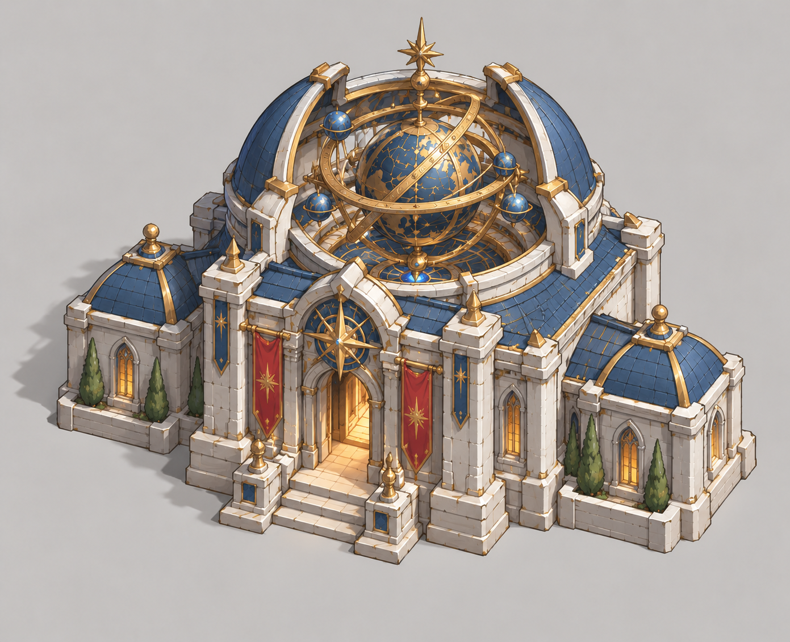
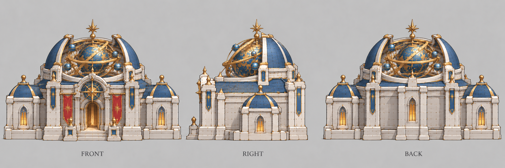

# 星象殿

| 文档属性 | 内容 |
|---|---|
| 建筑编号 | BLD-019 |
| 建筑分类 | 军事建筑 |
| 版本 | v0.4 |
| 更新日期 | 2026-10-08 |
| 状态 | 魔法 3 本建筑、可以招募单位且单位较强、可升本、大范围视野，已确定；名称暂定；招募单位为大主教、先知、防御术士、星术士，视野与其余数值为设计提案；价格待定 |
| 规则依赖 | [SYS-TEC-001 · 科技系统](../../系统/科技系统.md) · [BLD-004 · 兵营](兵营.md) · [BLD-013 · 圣堂](圣堂.md) · [SYS-ENG-001 · 能源体系](../../系统/能源体系.md) |

[返回文档目录](../../../游戏设计文档.md)

## 1. 建筑定位

星象殿是**魔法体系的 3 本建筑**（法师营地升到 3 本后解锁），**功能类似[兵营](兵营.md)和[圣堂](圣堂.md)：招募单位，但招募的单位比较强**，同时拥有**大范围视野**（已确定）。

它是魔法路线的终极生产建筑：用「占星」的能力看到很远的地方，也能召出更强大的魔法造物。因为需要魔法 3 本，成本和门槛都很高，所以单位比圣堂的强。

**名称说明：**「星象殿」为暂定名，取「观星象、知天下」之意，对应大范围视野。备选：观星台、天穹殿、先知殿。

## 2. 属性表

| 属性 | 当前设定 | 状态 |
|---|---|---|
| 解锁条件 | 法师营地升到 3 本（魔法 3 本） | 已确定 |
| 建筑功能 | 招募较强的魔法单位；提供大范围视野 | 已确定 |
| 可招募单位 | [大主教](../../单位/大主教.md)、[先知](../../单位/先知.md)、[防御术士](../../单位/防御术士.md)、[星术士](../../单位/星术士.md) | 已确定；各单位职能与数值为设计提案 |
| 视野 | **40 m** | 已确定「大范围」；40 m 为设计提案，是[哨塔](哨塔.md)白天视野（20 m）的两倍 |
| 夜间视野 | **30 m**（比白天缩小，但仍远大于其他建筑） | 设计提案 |
| 最大生命值 | **500** | 设计提案 |
| 护甲 | **8**（减伤约 21.1%） | 设计提案 |
| 占地 | **8 × 8 m** | 设计提案，与兵营相同 |
| 建造时间 | **40 秒**（1 名开拓者） | 设计提案 |
| 成本 | 待定 | 后面单独确定；应高于圣堂 |
| 维持费 | **600** 金币 / 分钟 | 设计提案 |
| 能源占用 | **100** | 设计提案，见[能源体系](../../系统/能源体系.md) |
| 人口占用 | 建筑本身不占用；招募的单位按各自占用 | 设计提案 |

## 3. 大范围视野（已确定 + 设计提案）

星象殿的视野远大于所有其他建筑，用途和哨塔类似，但更远：

| 建筑 | 白天视野 |
|---|---|
| [箭塔](箭塔.md) | 12 m |
| [哨塔](哨塔.md) | 20 m |
| **星象殿** | **40 m** |

- 视野是被动的，只要星象殿存在就一直提供，不需要操作。
- 可以配合[哨塔](哨塔.md)的灯光机制：夜间视野缩小到 30 m，但仍然是最大的。
- 视野是否被树林、山坡遮挡，等地图系统确定后再定，见[哨塔](哨塔.md)待确认问题。
- 建筑被摧毁则视野消失。

## 4. 招募功能（设计提案）

规则与[兵营](兵营.md)、[圣堂](圣堂.md)一致：

| 项目 | 当前设定 |
|---|---|
| 招募队列 | 最多 **5** 个，依次出兵 |
| 集结点 | 可设置，新单位出殿后自动前往 |
| 取消招募 | 可以，全额返还资源 |
| 多座星象殿 | 允许建造多座，以加快出兵 |
| 单位解锁 | 招募单位是否需要额外解锁操作，待定 |

## 4.1 升本（已确定可升本，与兵营、圣堂一样）

**星象殿可以升本**（已确定）：升本后，**这座星象殿招募出来的角色，生命值和攻击力都有提升**，规则与[兵营](兵营.md)、[圣堂](圣堂.md)一致：

| 规则 | 内容 | 状态 |
|---|---|---|
| 本数 | 星象殿自己的等级，与法师营地、研究院、兵营、圣堂的本数互相独立 | 已确定 |
| 生效对象 | 只对升本之后招募的单位生效，已招募的单位不会变强 | 与兵营、圣堂一致 |
| 独立计算 | 按星象殿独立升本，建多座各自升本、各自花费 | 与兵营、圣堂一致 |
| 加成幅度 | 2 本 **+20%**，3 本 **+40%**（生命值与攻击力） | 设计提案，与兵营、圣堂相同 |
| 升本花费 | 价格、时间、前置条件 | 待定 |

### 4.2 升本对各单位的效果（设计提案）

星象殿的单位大多不攻击，所以「攻击力提升」换成各自的主要效果数值：

| 单位 | 提升对象 | 1 本 | 2 本 | 3 本 |
|---|---|---|---|---|
| [大主教](../../单位/大主教.md) | 生命值、治疗量 | 220 / 60 | 264 / 72 | 308 / 84 |
| [先知](../../单位/先知.md) | 生命值 | 180 | 216 | 252 |
| [防御术士](../../单位/防御术士.md) | 生命值、护盾量 | 200 / 100 | 240 / 120 | 280 / 140 |
| [星术士](../../单位/星术士.md) | 生命值、陨石伤害 | 150 / 200 | 180 / 240 | 210 / 280 |

- 先知的光环不随升本提升，避免与队伍规模叠加放大。
- 星术士召唤的魔像属性是否提升，待定。

## 5. 强度检验

普通绿皮属性以设计提案为准：**200 生命、20 攻击、1.5 秒攻击间隔、无护甲、近战**。

| 项目 | 结果 |
|---|---|
| 绿皮每次对星象殿的实际伤害 | 20 × 30 ÷ 38 ≈ 15.8 |
| 一只绿皮拆掉满血星象殿 | 32 次命中，约 46.5 秒 |

血量比兵营、圣堂高，但同样是后方生产建筑，需要放在防线内部；它同时是视野建筑，被拆会失去大片视野，因此更需要保护。

## 6. 待设计内容

| 项目 | 需确定内容 |
|---|---|
| 名称 | 是否采用「星象殿」，或改用备选名 |
| 可招募单位 | 四个单位的价格、职能与数值；是否还有更多单位 |
| 解锁 | 单位是否需要额外解锁 |
| 升本 | 升本的价格、时间、前置条件 |
| 价格 | 造价与招募价格 |
| 数值 | 视野、生命值、能源占用是否合适 |
| 美术 | 概念图、俯视图、三视图，顶部要有观星装置 |

## 7. 关联文档

[大主教](../../单位/大主教.md) · [先知](../../单位/先知.md) · [防御术士](../../单位/防御术士.md) · [星术士](../../单位/星术士.md) · [圣堂](圣堂.md) · [兵营](兵营.md) · [哨塔](哨塔.md) · [法师营地](法师营地.md) · [科技系统](../../系统/科技系统.md) · [能源体系](../../系统/能源体系.md) · [成本体系](../../系统/成本体系.md)

## 8. 版本记录

| 版本 | 日期 | 变更 |
|---|---|---|
| v0.1 | 2026-09-29 | 建立文档：魔法 3 本建筑，可招募较强单位，拥有大范围视野；暂定名星象殿，数值为设计提案 |
| v0.2 | 2026-09-29 | 取消魔像；确定可升本，规则与兵营、圣堂一致；可招募单位待设计 |
| v0.3 | 2026-09-29 | 确定可招募大主教、先知、防御术士、星术士，加入升本对各单位的效果 |
| v0.4 | 2026-10-08 | 金币数量级整体 ×20（价格、维持费同比放大，平衡不变） |

## 美术图稿（2026-10-01 补充）

[概念图提示词](../../美术/主城/敌人与建筑设定图/星象殿-概念图-v2-提示词.txt) · [三视图提示词](../../美术/主城/敌人与建筑设定图/星象殿-三视图-v2-提示词.txt) · [图稿索引](../../美术/主城/敌人与建筑设定图/设定图索引.md)

沿用现有概念造型，三视图为美术参考；不可见部位为推定补全，建模前需统一尺寸与结构。
