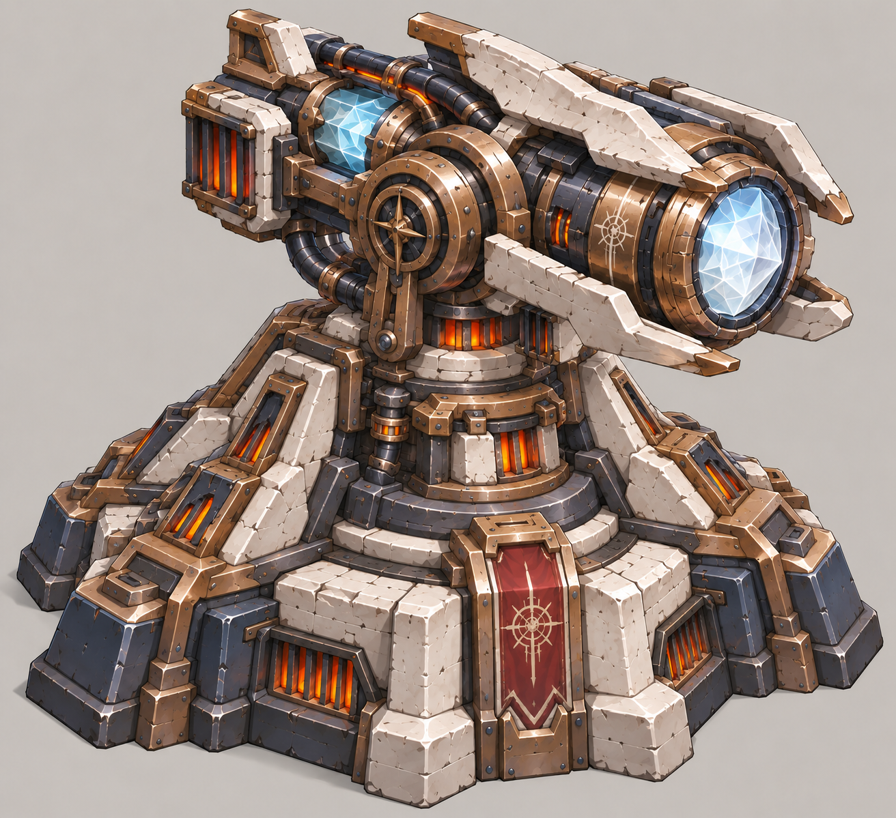
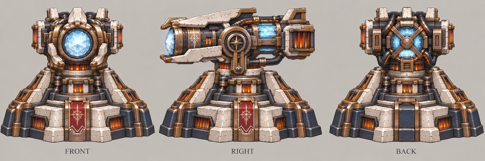

# 曙光

| 文档属性 | 内容 |
|---|---|
| 建筑编号 | BLD-023 |
| 建筑分类 | 军事建筑 |
| 版本 | v0.2 |
| 更新日期 | 2026-10-08 |
| 状态 | 魔法 3 本 + 科技 3 本终极塔、名称「曙光」、激光由白变红并过热、不限建、高能源需求已确定；全部数值为设计提案；价格见本轮原型基线 |
| 规则依赖 | [SYS-CBT-001 · 战斗与护甲规则](../../系统/战斗与护甲规则.md) · [SYS-TEC-001 · 科技系统](../../系统/科技系统.md) · [SYS-ENG-001 · 能源体系](../../系统/能源体系.md) |

[返回文档目录](../../../游戏设计文档.md)

<!-- combat-baseline-20261008:start -->
## 原型数值基线（2026-10-08 · 第二轮）

造价 **18000 金币 + 160 魔晶 + 180 钢铁**；维持费 **1000 金币/分钟**；能源占用 **300**。军事成本主表统一见[成本体系](../../系统/成本体系.md)。

本节为原型参数，不代表真人试玩已平衡。正文历史强度示例若使用修订前参数，须重新验算；不以历史例子的胜负作为新版本承诺。详见[生存数值配置](../../系统/生存数值配置.md)。
<!-- combat-baseline-20261008:end -->

## 1. 建筑定位

曙光是**魔法 3 本 + 科技 3 本的混搭塔**，也是全游戏最强的塔。主角用科技驾驭这个世界的魔力，造出一门魔晶激光炮；「曙光」寓意新时代的到来。

**核心机制：**发射一道**贯穿直线上所有敌人**的激光。持续发射时，激光**由白变红**，伤害随之升高；到达上限后**过热**，必须冷却一段时间才能再次发射（已确定）。

- **不限建**（已确定）：可以建多座，但能源需求很高，自然限制数量。
- **两种伤害各占一半**：面对重甲和魔法免疫的敌人都不会完全失效，体现两个体系的融合。

## 2. 属性表（设计提案）

| 属性 | 提案值 | 状态 |
|---|---|---|
| 解锁条件 | 法师营地 3 本 + 研究院 3 本 | — |
| 攻击方式 | 持续激光，长 **20 m**，贯穿直线上的所有敌人 | — |
| 伤害类型 | **一半物理、一半魔法**：物理部分受护甲影响；魔法部分无视护甲；魔法免疫的敌人只受物理部分 | — |
| 伤害 | 每 **0.5 秒**对激光上每个敌人造成伤害，随热量升高，见第 3 节 | — |
| 射程 | **20 m** | — |
| 攻击目标 | 地面单位 | — |
| 最大生命值 | **800** | — |
| 护甲 | **10**（减伤 25%） | — |
| 占地 | **5 × 5 m** | — |
| 视野 | **20 m** | — |
| 建造时间 | **45 秒**（1 名开拓者） | — |
| 成本 | 18000 金币 + 160 魔晶 + 180 钢铁 | 本轮原型基线（待试玩） |
| 维持费 | 1000 金币 / 分钟 | 本轮原型基线（待试玩） |
| 能源占用 | 300 | 本轮原型基线（待试玩） |
| 人口占用 | 不占用 | — |

## 3. 热量与过热（已确定机制，数值为设计提案）

持续发射时热量上升，激光颜色随热量变化，伤害也随之提高：

| 热量 | 激光颜色 | 每 0.5 秒伤害（每个敌人） |
|---|---|---|
| 0–40% | **白** | 20 |
| 40–80% | **橙** | 30 |
| 80–100% | **红** | 40 |

| 规则 | 提案 |
|---|---|
| 升温 | 持续发射 **6 秒**从 0 升到 100% |
| 过热 | 热量到 100% 时**强制停火**，冷却 **8 秒**；冷却期间炮管冒烟、发红，热量随后归零 |
| 自然降温 | 射程内没有敌人时，热量每秒下降 20% |

一个完整循环为发射 6 秒 + 冷却 8 秒，共 14 秒。

## 4. 瞄准规则（设计提案）

- 激光指向射程内最近的敌人，并跟随它转动；直线上的其他敌人一并受伤。
- 目标死亡后，立即转向下一个最近的敌人，热量不重置。

## 5. 强度检验

普通绿皮属性以设计提案为准：**200 生命、20 攻击、1.5 秒攻击间隔、无护甲、近战、移动速度 3 m/s**。

| 项目 | 结果 |
|---|---|
| 一个循环中，每个被持续照射的敌人受到的伤害 | 约 330（白 100 + 橙 150 + 红 80） |
| 消灭激光上的普通绿皮 | 约 3.5 秒，直线上的绿皮同时倒下 |
| 平均每秒伤害（含冷却） | 每个敌人约 24；直线上敌人越多，总伤害越高 |

**设计意图：**
- **过热形成节奏：**6 秒火力全开后有 8 秒空窗，空窗期需要钢雨、火炮塔等补位，不能只靠曙光。
- **越热越痛：**红光阶段伤害最高，也意味着马上要过热，画面上玩家一眼就能看出它的状态。
- **利用城墙把绿皮引成一条线**，再用曙光一次打穿整队。

## 6. 待设计内容

| 项目 | 需确定内容 |
|---|---|
| 价格 | 造价，预计需要大量魔晶与钢铁 |
| 研究 | 是否有降低过热、延长发射时间的研究 |
| 美术 | 概念图、俯视图、三视图；白、橙、红三段激光与过热冒烟的表现 |

## 7. 关联文档

[科技系统](../../系统/科技系统.md) · [法师营地](法师营地.md) · [研究院](研究院.md) · [钢雨](钢雨.md) · [缚灵塔](缚灵塔.md) · [能源体系](../../系统/能源体系.md) · [城墙](城墙.md) · [破咒小子](../../敌人/破咒小子.md)

## 8. 版本记录

| 版本 | 日期 | 变更 |
|---|---|---|
| v0.1 | 2026-09-30 | 建立文档：魔法 3 本 + 科技 3 本终极塔，名称定为曙光；激光由白变红、过热后冷却；不限建；数值为设计提案 |
| v0.2 | 2026-10-08 | 金币数量级整体 ×20（价格、维持费同比放大，平衡不变） |

## 美术图稿（2026-10-01 补充）

[三视图提示词](../../美术/主城/敌人与建筑设定图/曙光-三视图-v3-提示词.txt) · [图稿索引](../../美术/主城/敌人与建筑设定图/设定图索引.md)

2026-10-01 重新设计为厚重的魔晶机械炮塔：加宽底座、加厚承重支架与炮头装甲。概念图 v3 的厚重方向已获用户认可；三视图 v3 依此生成。三视图为美术参考，建模前需统一尺寸与结构。

**历史图稿：**

- [曙光概念图 v1（2026-09-30 提案，已被新版取代）](../../美术/主城/敌人与建筑设定图/曙光-概念图-v1.png) · [提示词](../../美术/主城/敌人与建筑设定图/曙光-概念图-v1-提示词.txt)

### 本轮数值版本记录

| 版本 | 日期 | 变更 |
|---|---|---|
| 2026.10.08-B2 | 2026-10-08 | 第二轮原型成本、维护与战斗边界；历史例需按新参数重验 |
