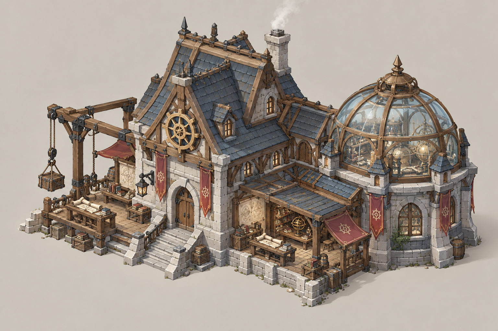
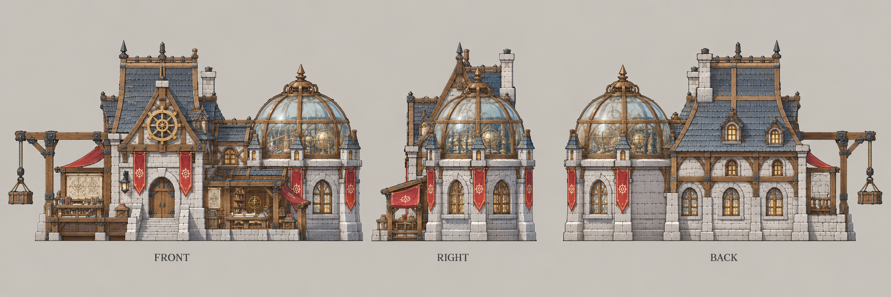

# 研究院

| 文档属性 | 内容 |
|---|---|
| 建筑编号 | BLD-018 |
| 建筑分类 | 军事建筑 |
| 版本 | v0.2 |
| 更新日期 | 2026-10-08 |
| 状态 | 科技体系的科技建筑、建成即科技 2 本、可升 3 本、升本资源与门槛、每个基地限建 1 座，已确定；生命值、占地等基础属性与外观为设计提案 |
| 规则依赖 | [SYS-TEC-001 · 科技系统](../../系统/科技系统.md) · [SYS-ENG-001 · 能源体系](../../系统/能源体系.md) · [BLD-007 · 采矿场](../经营建筑/采矿场.md) |

[返回文档目录](../../../游戏设计文档.md)

## 1. 建筑定位

研究院是**科技体系的科技建筑**：**建成即为科技 2 本，升级后为科技 3 本**，负责科技一侧的升本、解锁和研究（已确定）。它代表主角带来的原世界知识，与代表本土魔法的[法师营地](法师营地.md)相对。

它本身不生产单位、不参与战斗。科技靠经营建设成长，所以升本要看总人口，花费的是钢铁，见[科技系统](../../系统/科技系统.md)。

## 2. 升本条件与花费（已确定，数值为样例）

| 阶段 | 花费 | 能源占用 | 门槛 |
|---|---|---|---|
| 建成（科技 2 本） | 8000 金币 + 100 钢铁 | **200** | 总人口 50 |
| 2 → 3 本 | 16000 金币 + 300 钢铁 | **400**（不叠加，由 200 变为 400） | 总人口 120 |

- 每个基地限建 **1 座**（设计提案）。
- 建成或升级时需要有足够的剩余能源，之后持续占用，见[能源体系](../../系统/能源体系.md)。
- 钢铁来自[采矿场](../经营建筑/采矿场.md)，可以被[炼钢厂](../经营建筑/炼钢厂.md)提高产出。

## 3. 属性表

| 属性 | 2 本（建成） | 3 本（升级后） | 状态 |
|---|---|---|---|
| 最大生命值 | **500** | **700**（升级完成时回满） | 设计提案 |
| 护甲 | **5**（减伤约 14.3%） | 5 | 设计提案 |
| 攻击 | 无 | 无 | 已确定 |
| 占地 | **8 × 8 m** | 8 × 8 m | 设计提案 |
| 视野 | **10 m** | 10 m | 设计提案 |
| 建造 / 升级时间 | **40 秒**（1 名开拓者） | **60 秒** | 设计提案 |
| 成本 | 见上表 | 见上表 | 数值样例 |
| 维持费 | 无 | 无 | 设计提案，持续成本体现在能源占用上 |
| 能源占用 | 200 | 400 | 设计提案，见[能源体系](../../系统/能源体系.md) |
| 人口占用 | 不占用 | 不占用 | 设计提案 |
| 数量限制 | 每个基地 1 座 | | 已确定（限建 1 座） |

## 4. 功能

### 4.1 解锁内容

| 本数 | 解锁 |
|---|---|
| 科技 2 本（建成） | [双重箭塔](双重箭塔.md)（可升级为多重箭塔）、[炼钢厂](../经营建筑/炼钢厂.md)、[电影院](../经营建筑/电影院.md)、油井、海上石油平台；与法师营地 2 本共同解锁[魔导护盾器](魔导护盾器.md) |
| 科技 3 本 | [市政厅](../经营建筑/市政厅.md)、太阳能发电站、科技 3 本的 2 座塔（机枪塔等，待设计） |

箭塔 Lv2（弩塔）是否需要研究院 2 本，待定。

### 4.2 研究（设计提案）

研究院可以进行研究，强化已有的建筑和单位。研究一次只能进行一项，需要金币与钢铁。样例见[科技系统](../../系统/科技系统.md)：

| 研究（样例） | 效果 |
|---|---|
| 铁箭头 | 箭矢类塔（箭塔、双重箭塔、多重箭塔）攻击力 +30% |
| 加固城墙 | 城墙生命值 +20% |
| 改良工具 | 开拓者建造速度 +30% |

研究的价格、时间、本数要求待定。

## 5. 强度检验

普通绿皮属性以设计提案为准：**20 攻击、1.5 秒攻击间隔、近战**。

| 项目 | 结果 |
|---|---|
| 绿皮每次对研究院的实际伤害 | 20 × 30 ÷ 35 ≈ 17.1 |
| 一只绿皮拆掉 2 本研究院 | 30 次命中，约 43.5 秒 |
| 一只绿皮拆掉 3 本研究院 | 41 次命中，约 60 秒 |

研究院一旦被摧毁，科技路线的升本进度会受损，需要放在防线内部。

## 6. 美术提案

「原世界知识」的感觉：砖石主体，屋顶有烟囱与齿轮，侧面有玻璃穹顶的实验室，门前摆着木质工作台和滑轮吊架，与主城侧面的小工坊风格呼应。升到 3 本后增加高耸的烟囱、发光的能源管线和更多机械部件。风格沿用主城的手绘奇幻 RTS，机械只占一小部分。概念图与提示词后续另建。

## 7. 待设计内容

| 项目 | 需确定内容 |
|---|---|
| 研究列表 | 完整研究项目、价格、时间、本数要求 |
| 数值 | 生命值、占地、能源占用是否合适 |
| 摧毁后 | 被摧毁后已升的本数是否保留，重建需要多少花费 |
| 美术 | 概念图、俯视图、三视图 |

## 8. 关联文档

[科技系统](../../系统/科技系统.md) · [法师营地](法师营地.md) · [炼钢厂](../经营建筑/炼钢厂.md) · [电影院](../经营建筑/电影院.md) · [市政厅](../经营建筑/市政厅.md) · [双重箭塔](双重箭塔.md) · [采矿场](../经营建筑/采矿场.md) · [能源体系](../../系统/能源体系.md)

## 9. 版本记录

| 版本 | 日期 | 变更 |
|---|---|---|
| v0.1 | 2026-09-29 | 建立文档：整理科技系统中已确定的研究院规则，补充生命值、占地等基础属性与美术提案 |
| v0.2 | 2026-10-08 | 金币数量级整体 ×20（价格、维持费同比放大，平衡不变） |

## 美术图稿（2026-10-01 补充）

[概念图提示词](../../美术/主城/敌人与建筑设定图/研究院-概念图-v1-提示词.txt) · [三视图提示词](../../美术/主城/敌人与建筑设定图/研究院-三视图-v1-提示词.txt) · [图稿索引](../../美术/主城/敌人与建筑设定图/设定图索引.md)

沿用现有概念造型，三视图为美术参考；不可见部位为推定补全，建模前需统一尺寸与结构。
