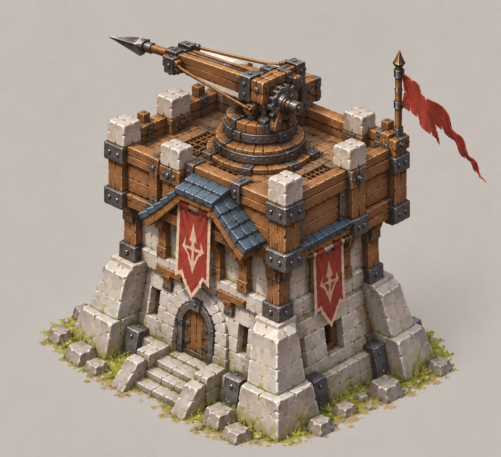
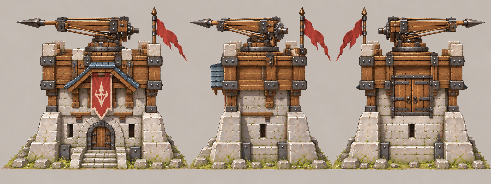

　# 箭塔

| 文档属性 | 内容 |
|---|---|
| 建筑编号 | BLD-002 |
| 建筑分类 | 军事建筑 |
| 版本 | v0.4 |
| 更新日期 | 2026-10-08 |
| 状态 | 名称、生命值、护甲、建造时间已确定；攻击数值为设计提案 |
| 规则依赖 | [SYS-CBT-001 · 战斗与护甲规则](../../系统/战斗与护甲规则.md) · [SYS-MOV-001 · 距离与移动速度标准](../../系统/距离与移动速度标准.md) |

[返回文档目录](../../../游戏设计文档.md)

## 1. 建筑定位

箭塔是最基础的攻击建筑，是装有单箭自动发射机构的木石塔楼。敌人进入射程后，塔顶机构自动瞄准、装填并射击；**不需要弓箭手或其他单位驻守**（已确定）。每次发射一支箭，仍按下表的单体攻击规则结算。

开局时这个世界还没有现代科技。基础箭塔使用木质箭轨、弓弦、齿轮等简易机械自动发射；具体动力与复位结构属于美术和建模提案，尚待定稿。随着主角把科技带进来，防御塔逐步升级，玩家从塔的名字和外观就能看出时代在推进。

**强度定位：**一座箭塔能守住零星骚扰，但顶不住成群进攻，需要多座箭塔和士兵配合防守。

## 2. 属性表

| 属性 | 当前设定 | 状态 |
|---|---|---|
| 最大生命值 | **300** | 已确定 |
| 护甲 | **3** | 已确定 |
| 减伤率 | **约 9.1%**（3 ÷ 33） | 按通用护甲公式计算 |
| 攻击力 | **20** / 次，单体 | 设计提案 |
| 攻击间隔 | **1.5 秒**（每秒伤害约 13.3） | 设计提案 |
| 射程 | **10 m** | 设计提案 |
| 视野 | **12 m** | 设计提案 |
| 攻击目标 | 地面单位 | 设计提案；对空能力待飞行单位出现后决定 |
| 占地 | **3 × 3 m** | 设计提案 |
| 建造时间 | **20 秒**（1 名开拓者） | 已确定 |
| 成本 | **2400 金币** | 已确定，见[成本体系](../../系统/成本体系.md) |
| 维持费 | 200 金币 / 分钟（箭矢补给与机构维护） | 数值已确定；费用用途按全自动设定修订 |
| 人口占用 | 不占用 | 已确定 |

攻击数值参考《植物大战僵尸》的直观风格：整数伤害配合常见的攻击间隔，便于玩家心算。

## 3. 强度检验

普通绿皮尚无正式数值，以下借用测试建议检验：**200 生命、20 攻击、1.5 秒攻击间隔、无护甲、近战、移动速度 3 m/s**。**这组数值仅用于检验，不属于已采纳的单位数据。**

### 3.1 单项数据

| 项目 | 结果 |
|---|---|
| 箭塔消灭一只绿皮 | 10 箭，约 15 秒 |
| 绿皮从射程边缘走到塔下 | 约 3.3 秒，箭塔可先射 2–3 箭 |
| 绿皮每次对箭塔的实际伤害 | 20 × 30 ÷ 33 ≈ 18.2 |
| 一只绿皮拆掉满血箭塔 | 17 次命中，约 25 秒 |
| 箭塔消灭开拓者 | 5 箭，约 7.5 秒（开拓者无护甲时） |

### 3.2 对抗结果

| 对抗情况 | 结果 |
|---|---|
| 1 塔 vs 1 绿皮 | 箭塔胜，剩余约 170 生命 |
| 1 塔 vs 2 绿皮 | 箭塔约 18 秒被拆，只消灭 1 只 |
| 1 塔 vs 3 绿皮 | 箭塔被拆 |

普通绿皮的正式数值确定后，需要重新验算本节。

## 4. 建造时间说明

建造时间定为 20 秒（已确定）。

**为什么保留建造时间：**开拓者是专门的建造单位，空间表现参考《Warcraft III》，玩法核心是经营基地和抵御进攻。建造时间让造塔需要提前规划，施工期间建筑和开拓者都比较脆弱，开拓者也因此有了存在的意义。基础建筑的建造时间控制在 15–30 秒，不让玩家长时间干等。

**为什么是 20 秒：**

- 一只绿皮单独拆塔约需 25 秒。建造时间短于这个值，玩家才有机会在进攻来临前临时补塔。
- 不低于 15 秒，避免箭塔可以随手堆出，让防守变得廉价。

建造中的箭塔生命值怎么计算、多名开拓者协作能否加速，待建造机制确定后补充。

## 5. 升级方向（示意）

**箭塔可以原地升级为「箭塔 Lv2」**（已确定）：仍是同一座塔，不是另一种塔。基础箭塔已经全自动；**Lv2 就是原先设想的弩塔**，采用更强的机械弩组件，提高单箭伤害与射程，而非从人工驻守改为自动发射。不再单独设弩塔。升级价格、时间、科技前置、Lv2 的具体数值和是否有更高等级，均待设计。

火炮塔、机枪塔等不是箭塔的升级结果，而是[科技系统](../../系统/科技系统.md)中由研究院 / 法师营地各本数解锁的**独立新塔**。

## 6. 调整方向

| 调整目标 | 可选做法 |
|---|---|
| 箭塔更能独当一面 | 攻击间隔缩短到 1.2 秒，或射程增加到 12 m |
| 更依赖士兵 | 射程缩短到 8 m |

## 7. 待设计内容

| 项目 | 需确定内容 |
|---|---|
| 目标选择 | 优先攻击最近的、最先进入射程的，还是正在攻击建筑的敌人 |
| 弹道 | 箭矢是即时命中还是飞行弹道，能否被躲避 |
| 自动机构 | 箭矢储量、自动装填和复位的具体表现；不需要单位驻守 |
| 修理 | 已有「修理」选项，由最近的开拓者执行，见[建造与修理](../../系统/建造与修理.md) |
| 美术 | 概念图、俯视图、三视图 |

## 8. 关联文档

[战斗与护甲规则](../../系统/战斗与护甲规则.md) · [距离与移动速度标准](../../系统/距离与移动速度标准.md) · [开拓者](../../单位/开拓者.md) · [哨塔](哨塔.md) · [兵营](兵营.md) · [城墙](城墙.md) · [主城设计](../经营建筑/主城设计.md)

## 9. 版本记录

| 版本 | 日期 | 变更 |
|---|---|---|
| v0.1 | 2026-09-26 | 建立文档：确定名称、生命值 300、护甲 3；提出攻击、射程、建造时间 20 秒等数值与升级方向 |
| v0.2 | 2026-09-26 | 确定保留建造时间机制，箭塔建造时间 20 秒 |
| v0.3 | 2026-10-01 | 确定基础箭塔全自动单箭射击，无弓箭手驻守；维持费改解释为箭矢补给与机构维护，数值不变；明确 Lv2 为自动机构强化 |
| v0.4 | 2026-10-08 | 金币数量级整体 ×20（价格、维持费同比放大，平衡不变） |

### 当前设定图：全自动单箭 v5（2026-10-01）

以用户认可的[双重箭塔 v2](双重箭塔.md)为同系列造型参考。基础箭塔使用一套单箭自动机构；双重箭塔是独立建筑，使用一体化双箭机构。建模前需校准三视图结构与尺寸。

[概念图提示词](../../美术/主城/敌人与建筑设定图/箭塔-概念图-v5-提示词.txt) · [三视图提示词](../../美术/主城/敌人与建筑设定图/箭塔-三视图-v5-提示词.txt)

### 旧版美术稿（仅供追溯）

v3 与 v4 仍使用过时的驻守弓箭手方向，不作为当前造型；历史图片仅通过链接查看，不在本文内展示。

- v3：[概念图](../../美术/主城/敌人与建筑设定图/箭塔-概念图-v3.png) · [三视图](../../美术/主城/敌人与建筑设定图/箭塔-三视图-v3.png) · [概念提示词](../../美术/主城/敌人与建筑设定图/箭塔-概念图-v3-提示词.txt) · [三视图提示词](../../美术/主城/敌人与建筑设定图/箭塔-三视图-v3-提示词.txt)
- v4：[概念图](../../美术/主城/敌人与建筑设定图/箭塔-概念图-v4.png) · [提示词](../../美术/主城/敌人与建筑设定图/箭塔-概念图-v4-提示词.txt)
- v1 历史合版：[设定图](../../美术/主城/敌人与建筑设定图/箭塔-设定图-v1.png) · [提示词](../../美术/主城/敌人与建筑设定图/箭塔-提示词-v1.txt)
