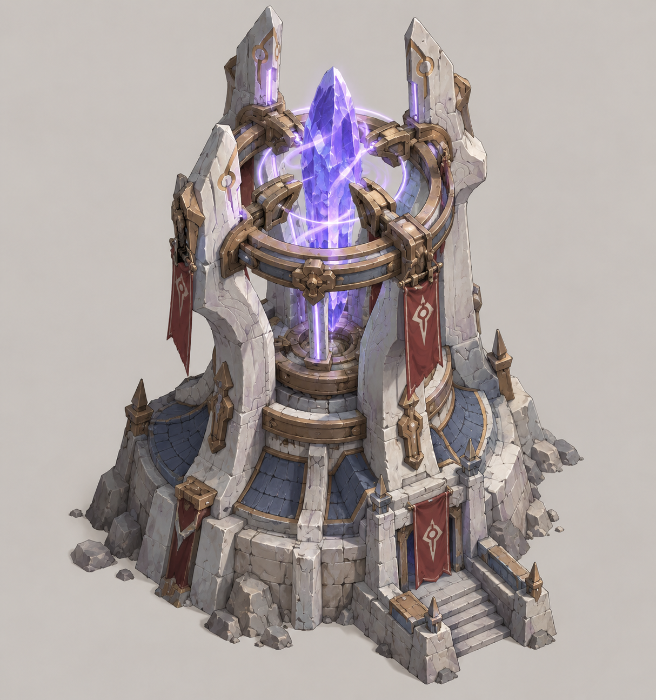
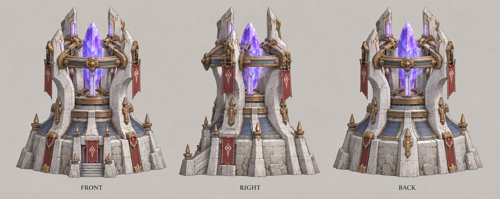

# 缚灵塔

| 文档属性 | 内容 |
|---|---|
| 建筑编号 | BLD-022 |
| 建筑分类 | 军事建筑 |
| 版本 | v0.3 |
| 更新日期 | 2026-10-08 |
| 状态 | 魔法 3 本 + 科技 2 本混搭塔、定身控制定位已确定；全部数值为设计提案；价格见本轮原型基线 |
| 规则依赖 | [SYS-CBT-001 · 战斗与护甲规则](../../系统/战斗与护甲规则.md) · [SYS-TEC-001 · 科技系统](../../系统/科技系统.md) · [SYS-ENG-001 · 能源体系](../../系统/能源体系.md) |

[返回文档目录](../../../游戏设计文档.md)

<!-- combat-baseline-20261008:start -->
## 原型数值基线（2026-10-08 · 第二轮）

造价 **8000 金币 + 60 魔晶 + 40 钢铁**；维持费 **600 金币/分钟**；能源占用 **100**。军事成本主表统一见[成本体系](../../系统/成本体系.md)。 保留每8秒最多3人、2.5秒定身且不能攻击；同目标定身不延长，结束4秒免再次定身，魔免仍免疫。

本节为原型参数，不代表真人试玩已平衡。正文历史强度示例若使用修订前参数，须重新验算；不以历史例子的胜负作为新版本承诺。详见[生存数值配置](../../系统/生存数值配置.md)。
<!-- combat-baseline-20261008:end -->

## 1. 建筑定位

缚灵塔是**混搭塔**，需要**魔法 3 本 + 科技 2 本**（法师营地 3 本、研究院建成）。它伤害很低，作用是**把敌人钉在原地**，让其他塔多打几轮。

- **与凝霜塔的关系：**[凝霜塔](凝霜塔.md)是 1 本的减速塔，缚灵塔是高本版本，从减速升级为定身。
- **世界观：**定身是魔法，研究院的机械装置放大了束缚法阵，因此同时需要两个体系。

## 2. 属性表（设计提案）

| 属性 | 提案值 | 状态 |
|---|---|---|
| 解锁条件 | 法师营地 3 本 + 研究院建成（科技 2 本） | — |
| 效果 | 每 **8 秒**定身射程内最多 **3** 个敌人，持续 **2.5 秒** | — |
| 伤害 | 定身时造成 **30**，魔法，无视护甲 | — |
| 目标选择 | 优先定身正在攻击建筑的敌人（如拆墙、拆塔），其次为最近的敌人 | — |
| 射程 | **10 m** | — |
| 攻击目标 | 地面单位；魔法免疫的敌人不受影响 | — |
| 最大生命值 | **400** | — |
| 护甲 | **5**（减伤约 14.3%） | — |
| 占地 | **3 × 3 m** | — |
| 视野 | **10 m** | — |
| 建造时间 | **30 秒**（1 名开拓者） | — |
| 成本 | 8000 金币 + 60 魔晶 + 40 钢铁 | 本轮原型基线（待试玩） |
| 维持费 | 600 金币 / 分钟 | 本轮原型基线（待试玩） |
| 能源占用 | 100 | 本轮原型基线（待试玩） |
| 人口占用 | 不占用 | — |

## 3. 定身规则（设计提案）

- 被定身的敌人不能移动、不能攻击，持续 2.5 秒。
- 同一个敌人在定身结束后 **4 秒内**不会再次被定身，避免被永久钉住。
- 多座缚灵塔会优先选择不同的目标。

## 4. 配合

| 搭配 | 效果 |
|---|---|
| [火炮塔](火炮塔.md) | 敌人站着不动，炮弹不会落空 |
| [曙光](曙光.md) | 被定住的敌人留在光束上，持续受伤 |
| [城墙](城墙.md) | 优先定身拆墙的绿皮，每 8 秒保护墙体 2.5 秒 |

**设计意图：**缚灵塔本身几乎不杀敌，价值在于放大其他塔的输出，是一座跨体系的辅助塔。

## 5. 待设计内容

| 项目 | 需确定内容 |
|---|---|
| 首领敌人 | 对首领类敌人是否减少定身时间 |
| 美术 | 概念图、俯视图、三视图；束缚法阵的表现 |

## 6. 关联文档

[科技系统](../../系统/科技系统.md) · [法师营地](法师营地.md) · [研究院](研究院.md) · [凝霜塔](凝霜塔.md) · [火炮塔](火炮塔.md) · [曙光](曙光.md) · [魔导护盾器](魔导护盾器.md) · [破咒小子](../../敌人/破咒小子.md)

## 7. 版本记录

| 版本 | 日期 | 变更 |
|---|---|---|
| v0.1 | 2026-09-30 | 建立文档：魔法 3 本 + 科技 2 本混搭塔，定身控制；数值为设计提案 |
| v0.2 | 2026-10-08 | 金币数量级整体 ×20（价格、维持费同比放大，平衡不变） |

## 美术图稿（2026-10-01 补充）

[概念图提示词](../../美术/主城/敌人与建筑设定图/缚灵塔-概念图-v1-提示词.txt) · [三视图提示词](../../美术/主城/敌人与建筑设定图/缚灵塔-三视图-v1-提示词.txt) · [图稿索引](../../美术/主城/敌人与建筑设定图/设定图索引.md)

沿用现有概念造型，三视图为美术参考；不可见部位为推定补全，建模前需统一尺寸与结构。

### 本轮数值版本记录

| 版本 | 日期 | 变更 |
|---|---|---|
| 2026.10.08-B2 | 2026-10-08 | 第二轮原型成本、维护与战斗边界；历史例需按新参数重验 |
| v0.3 | 2026-10-08 | 第五轮同步：定身后免疫窗 3 秒→4 秒（与基线块一致） |
