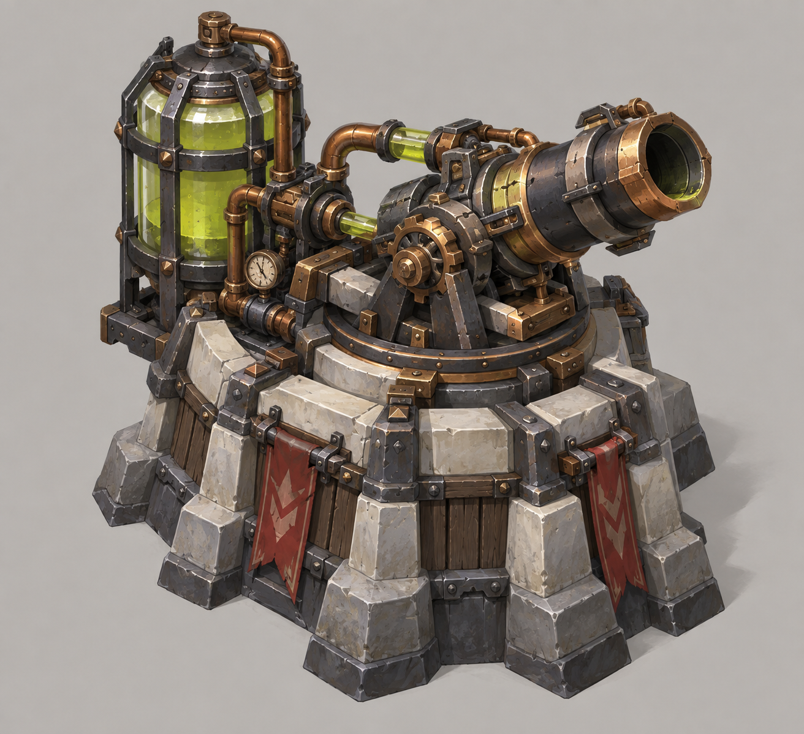
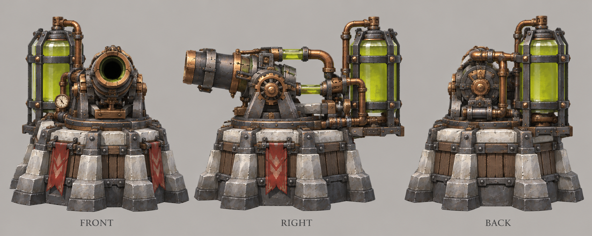

# 腐蚀塔

| 文档属性 | 内容 |
|---|---|
| 建筑编号 | BLD-027 |
| 建筑分类 | 军事建筑 |
| 版本 | v0.3 |
| 更新日期 | 2026-10-08 |
| 状态 | 名称、科技 2 本减甲塔、每次命中 −4 护甲、可将护甲降为负数（最低 −15）及负护甲增伤已确定；其余数值为设计提案；价格待定 |
| 规则依赖 | [SYS-CBT-001 · 战斗与护甲规则](../../系统/战斗与护甲规则.md) · [SYS-TEC-001 · 科技系统](../../系统/科技系统.md) · [SYS-ENG-001 · 能源体系](../../系统/能源体系.md) |

[返回文档目录](../../../游戏设计文档.md)

## 1. 建筑定位

腐蚀塔是**科技体系的 2 本塔**（研究院建成后解锁），发射酸液弹**降低敌人的护甲**，本身伤害很低。它是**物理路线的核心辅助**：箭塔、双重箭塔、火炮塔、钢雨等物理塔打被腐蚀的敌人时伤害大幅提高。

**名称：**腐蚀塔（已确定）。

**为什么需要负护甲：**多数敌人护甲为 0。如果护甲最低只能降到 0，减甲对普通绿皮毫无作用。因此允许护甲降为负数（已确定，最低 −15），负护甲按下表增加目标受到的物理伤害（已确定），见[战斗与护甲规则](../../系统/战斗与护甲规则.md)。

| 目标护甲 | 受到的物理伤害 |
|---|---|
| 0 | 100% |
| −4 | 115% |
| −8 | 136% |
| −12 | 167% |
| −15 | 200% |

## 2. 属性表（设计提案）

| 属性 | 提案值 |
|---|---|
| 解锁条件 | 研究院建成（科技 2 本） |
| 攻击方式 | 酸液弹，落点 **2 m** 内的所有敌人 |
| 伤害 | **10**，物理 |
| 减甲 | 每次命中 **−4** 护甲（已确定），叠加到下限 **−15** 为止：−4 / −8 / −12 / −15；持续 **8 秒**，再次命中刷新持续时间 |
| 攻击间隔 | **2 秒** |
| 射程 | **12 m** |
| 目标选择 | 优先攻击护甲尚未降到 −15 的敌人 |
| 攻击目标 | 地面单位 |
| 最大生命值 | **350** |
| 护甲 | **5**（减伤约 14.3%） |
| 占地 | **3 × 3 m** |
| 视野 | **12 m** |
| 建造时间 | **25 秒**（1 名开拓者） |
| 成本 | 待定 |
| 维持费 | **400** 金币 / 分钟（2 本塔标准） |
| 能源占用 | **50** |
| 人口占用 | 不占用 |

减甲只影响物理伤害；魔法伤害本来就无视护甲，不受影响。

## 3. 强度检验

普通绿皮属性以设计提案为准：**200 生命、20 攻击、1.5 秒攻击间隔、无护甲、近战、移动速度 3 m/s**。

| 项目 | 无腐蚀 | 叠满 −15 |
|---|---|---|
| 箭塔消灭 1 只普通绿皮 | 10 箭，约 15 秒 | **5 箭，约 7.5 秒** |
| 箭塔打[破咒小子](../../敌人/破咒小子.md)（护甲 10） | 受 75% 伤害 | 护甲 10 − 16 → 降到 −6，受 125% 伤害，约快 1.7 倍 |
| 火炮塔每发对每个敌人 | 40 | 80 |

从 0 降到 −15 需要连续命中 4 次，约 6 秒。

## 4. 待设计内容

| 项目 | 需确定内容 |
|---|---|
| 价格 | 造价 |
| 多塔叠加 | 多座腐蚀塔共用 −15 下限（提案） |
| 美术 | 概念图、俯视图、三视图；被腐蚀敌人的绿色酸液效果 |

## 5. 关联文档

[科技系统](../../系统/科技系统.md) · [战斗与护甲规则](../../系统/战斗与护甲规则.md) · [研究院](研究院.md) · [箭塔](箭塔.md) · [双重箭塔](双重箭塔.md) · [火炮塔](火炮塔.md) · [钢雨](钢雨.md) · [破咒小子](../../敌人/破咒小子.md)

## 6. 版本记录

| 版本 | 日期 | 变更 |
|---|---|---|
| v0.1 | 2026-09-30 | 建立文档：科技 2 本减甲塔，暂定名腐蚀塔；允许负护甲最低 −15；数值为设计提案 |
| v0.2 | 2026-09-30 | 确定名称腐蚀塔；每次命中改为 −4 护甲；确认负护甲增伤规则 |
| v0.3 | 2026-10-08 | 金币数量级整体 ×20（价格、维持费同比放大，平衡不变） |

<!-- art-20261005:start -->
## 美术设定图补充（2026-10-05）

本批补充概念稿和正面、侧面、背面三视图。用于造型与材质参考；建模时统一尺寸、结构和各视图细节。俯视图与动画另行制作。

### 腐蚀塔

[概念稿提示词](../../美术/主城/敌人与建筑设定图/腐蚀塔-概念图-v1-提示词.txt) · [三视图提示词](../../美术/主城/敌人与建筑设定图/腐蚀塔-三视图-v1-提示词.txt)

<!-- art-20261005:end -->
