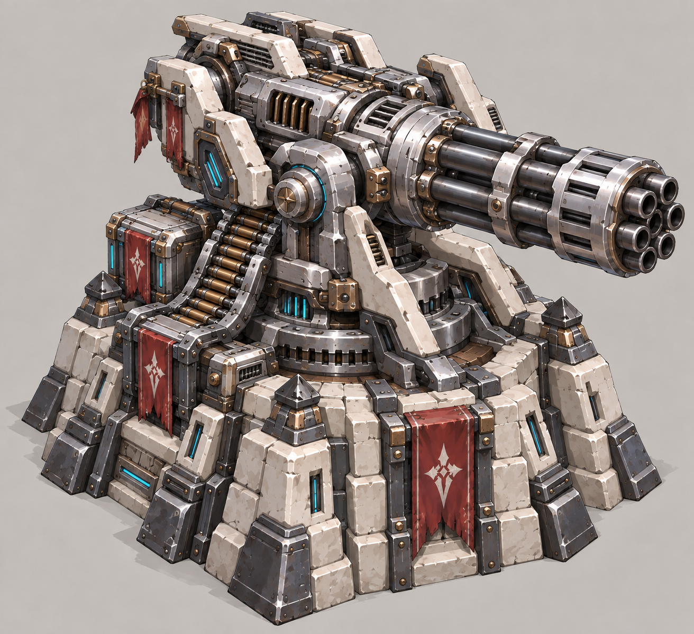
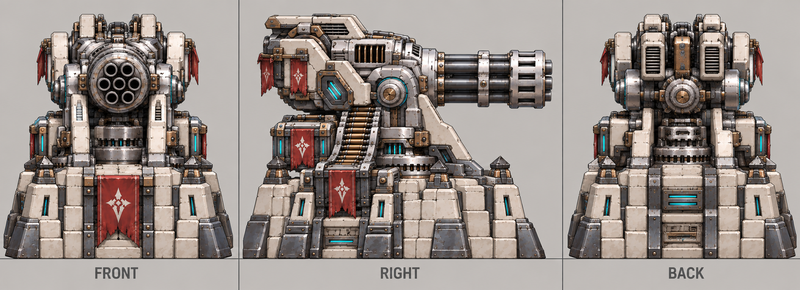

# 钢雨

| 文档属性 | 内容 |
|---|---|
| 建筑编号 | BLD-021 |
| 建筑分类 | 军事建筑 |
| 版本 | v0.3 |
| 更新日期 | 2026-10-08 |
| 状态 | 科技 3 本高射速单体塔、名称「钢雨」已确定；预热机制与全部数值为设计提案；价格待定 |
| 规则依赖 | [SYS-CBT-001 · 战斗与护甲规则](../../系统/战斗与护甲规则.md) · [SYS-TEC-001 · 科技系统](../../系统/科技系统.md) · [SYS-ENG-001 · 能源体系](../../系统/能源体系.md) |

[返回文档目录](../../../游戏设计文档.md)

## 1. 建筑定位

钢雨是**科技体系的 3 本塔**（研究院升到 3 本后解锁），是科技线后期的主力输出：连续射击，子弹像雨一样泼向敌人。原暂定名「机枪塔」，改为「钢雨」。

**弱点：需要预热。**刚开火时射速慢，连续射击 3 秒后才达到最高射速。敌人一波接一波连续涌来时最强，零星的敌人来不及让它热起来。

## 2. 属性表（设计提案）

| 属性 | 提案值 |
|---|---|
| 解锁条件 | 研究院 3 本 |
| 攻击方式 | 单体连射 |
| 伤害 | 每发 **8**，物理，受护甲影响 |
| 射速 | 从每秒 **1** 发开始，连续射击 **3 秒**内提升到每秒 **4** 发 |
| 满速每秒伤害 | **32** |
| 射程 | **12 m** |
| 攻击目标 | 地面单位 |
| 最大生命值 | **500** |
| 护甲 | **8**（减伤约 21.1%） |
| 占地 | **4 × 4 m** |
| 视野 | **12 m** |
| 建造时间 | **30 秒**（1 名开拓者） |
| 成本 | 待定 |
| 维持费 | **600** 金币 / 分钟（3 本塔标准，待确认） |
| 能源占用 | **100** |
| 人口占用 | 不占用 |

## 3. 预热规则（设计提案）

| 情况 | 射速变化 |
|---|---|
| 开始射击 | 每秒 1 发，3 秒内线性提升到每秒 4 发 |
| 更换目标 | 不掉速 |
| 射程内没有敌人 | 保持当前射速 2 秒；超过 2 秒后射速归零，下次重新预热 |

## 4. 强度检验

普通绿皮属性以设计提案为准：**200 生命、20 攻击、1.5 秒攻击间隔、无护甲、近战、移动速度 3 m/s**。

| 项目 | 结果 |
|---|---|
| 从零开始消灭 1 只绿皮 | 约 7.5 秒 |
| 满速时消灭 1 只绿皮 | 约 6 秒，约为箭塔的 2.5 倍 |
| 持续进攻 1 分钟 | 满速下约消灭 9–10 只 |

## 5. 待设计内容

| 项目 | 需确定内容 |
|---|---|
| 价格 | 造价，预计需要钢铁 |
| 研究 | 是否受「铁箭头」之类的研究影响，或有单独的弹药研究 |
| 美术 | 银色重装六管炮台概念图及三视图已更新；俯视图、射速提升时的枪口火光与声音待设计 |

## 6. 关联文档

[科技系统](../../系统/科技系统.md) · [研究院](研究院.md) · [箭塔](箭塔.md) · [火炮塔](火炮塔.md) · [曙光](曙光.md) · [普通绿皮](../../敌人/普通绿皮.md)

## 7. 版本记录

| 版本 | 日期 | 变更 |
|---|---|---|
| v0.1 | 2026-09-30 | 建立文档：科技 3 本高射速单体塔，名称定为钢雨；预热机制与数值为设计提案 |
| v0.2 | 2026-10-02 | 美术强化为高造价三本塔：银色六管自动炮台、加厚装甲、双侧供弹与白石强化基座；数值未改 |
| v0.3 | 2026-10-08 | 金币数量级整体 ×20（价格、维持费同比放大，平衡不变） |

### 钢雨概念图（2026-10-02 银色重装版）

炮台主体改为银色金属，增加装甲、供弹机构和冷却细节，使高造价三本塔的层级更明确；玩法与数值未改。旧版 v1 保留作历史对照。

[生成提示词](../../美术/主城/敌人与建筑设定图/钢雨-概念图-v2-提示词.txt) · [设定图索引](../../美术/主城/敌人与建筑设定图/设定图索引.md)

### 钢雨三视图（2026-10-02 银色重装版）

以当前概念图为参考的正面、右侧和背面美术图。建模前需校准尺寸、遮挡与细部。

[生成提示词](../../美术/主城/敌人与建筑设定图/钢雨-三视图-v2-提示词.txt)
