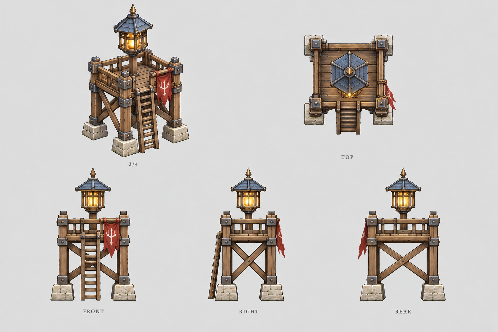

# 哨塔

| 文档属性 | 内容 |
|---|---|
| 建筑编号 | BLD-003 |
| 版本 | v0.4 |
| 更新日期 | 2026-09-26 |
| 状态 | 名称、定位、生命值、护甲、建造范围已确定；视野与照明数值为设计提案 |
| 规则依赖 | [SYS-CBT-001 · 战斗与护甲规则](../系统/战斗与护甲规则.md) · [SYS-MOV-001 · 距离与移动速度标准](../系统/距离与移动速度标准.md) |

[返回文档目录](../../游戏设计文档.md)

## 1. 建筑定位

哨塔是基础视野建筑，用来开视野、提前发现敌人。塔顶有灯，在黑夜、雨夜等视野受限的时段照亮周围。

哨塔可以随处建造，不限于基地内。玩家可以把它建在远处，当作一个固定的视野点，用来观察敌人动向、配合世界探索。

哨塔不能攻击。它负责「看见」，箭塔负责「打」，两者配合防守。

## 2. 属性表

| 属性 | 当前设定 | 状态 |
|---|---|---|
| 最大生命值 | **300**（与箭塔相同） | 已确定 |
| 护甲 | **5**（减伤约 14.3%） | 已确定 |
| 攻击 | 无 | 已确定 |
| 建造范围 | **随处可建**，不限于基地内 | 已确定 |
| 白天视野 | **20 m** | 设计提案 |
| 塔灯照明半径 | **15 m** | 设计提案 |
| 占地 | **2 × 2 m** | 设计提案 |
| 建造时间 | **15 秒**（1 名开拓者） | 已确定 |
| 成本 | **80 金币** | 已确定，见[成本体系](../系统/成本体系.md) |
| 维持费 | 5 金币 / 分钟（哨兵驻守） | 已确定 |
| 人口占用 | 不占用 | 已确定 |

白天视野 20 m 约为箭塔视野（12 m）的 1.7 倍，直径 40 m，大约覆盖一整屏。

## 3. 塔灯与昼夜视野

游戏存在黑夜、雨夜等昼夜与天气机制，会压缩视野。哨塔的塔灯用来抵消这部分影响。

### 3.1 各时段视野（设计提案）

| 时段 | 哨塔视野 | 说明 |
|---|---|---|
| 白天 | 20 m | 不受影响 |
| 黑夜 | 15 m | 由塔灯照明半径决定 |
| 雨夜 | 12 m | 雨水削弱灯光 |

### 3.2 照明作用（设计提案）

- 塔灯照亮的范围内，**所有友方单位和建筑都不受夜间视野惩罚**。
- 箭塔射程为 10 m，视野为 12 m。如果夜间视野被压到射程以下，箭塔就不能打满射程。把箭塔建在哨塔的照明范围内，可以恢复夜间战斗力。这样玩家需要把两种塔搭配着布置。

夜间和雨天视野怎样缩小、敌人会不会被灯光吸引、灯光能不能被破坏或关掉，要等昼夜与天气系统确定后再定。本节数值届时一并复核。

## 4. 强度检验

普通绿皮尚无正式数值，以下借用测试建议检验：**20 攻击、1.5 秒攻击间隔、近战**。**这组数值仅用于检验，不属于已采纳的单位数据。**

| 项目 | 结果 |
|---|---|
| 绿皮每次对哨塔的实际伤害 | 20 × 30 ÷ 35 ≈ 17.1 |
| 一只绿皮拆掉满血哨塔 | 18 次命中，约 26 秒 |
| 对比箭塔 | 箭塔需 17 次命中，约 25 秒 |

哨塔护甲高于箭塔，耐久略强；但它没有攻击，放着不管终究会被拆掉，需要箭塔或士兵保护。

## 5. 升级方向（示意）

**哨塔**（人工瞭望 + 油灯/火盆）→ **灯塔**（更强的照明，雨夜也能保持较大范围）→ **探照灯塔 / 雷达站**（科技化）

升级方式、科技前置和数值成长均待设计。

## 6. 待确认问题

敌情预警是全局功能，不属于哨塔：任何友方视野发现敌人都可能触发，规则后续单独设计。哨塔只负责提供视野。

| 问题 | 当前倾向 |
|---|---|
| 地形遮挡 | 视野能否越过树林、山坡等遮挡，可作为哨塔的高处视野特长；待地图系统确定 |
| 修理 | 消耗、速度、执行者 |
| 美术 | 概念图、俯视图、三视图；塔灯需要在夜间画面中清晰可辨 |

## 7. 关联文档

[箭塔](箭塔.md) · [兵营](兵营.md) · [战斗与护甲规则](../系统/战斗与护甲规则.md) · [距离与移动速度标准](../系统/距离与移动速度标准.md) · [开拓者](../单位/开拓者.md) · [主城设计](主城设计.md)

## 8. 版本记录

| 版本 | 日期 | 变更 |
|---|---|---|
| v0.1 | 2026-09-26 | 建立文档：确定名称、视野定位、塔顶有灯、生命值 300；提出护甲 1、视野与照明等数值 |
| v0.2 | 2026-09-26 | 护甲调整为 5 并确定；更新强度检验 |
| v0.3 | 2026-09-26 | 移除哨塔专属预警功能，明确预警为全局功能 |
| v0.4 | 2026-09-26 | 确定哨塔随处可建，作为远处视野点 |

### 哨塔设定图

造型提案 v1：沿用主城的手绘奇幻 RTS 风格。图内包含概念、俯视与正面／右侧／背面视图；建模时需统一尺寸与细节。

[生成提示词](../美术/主城/敌人与建筑设定图/哨塔-提示词-v1.txt)
