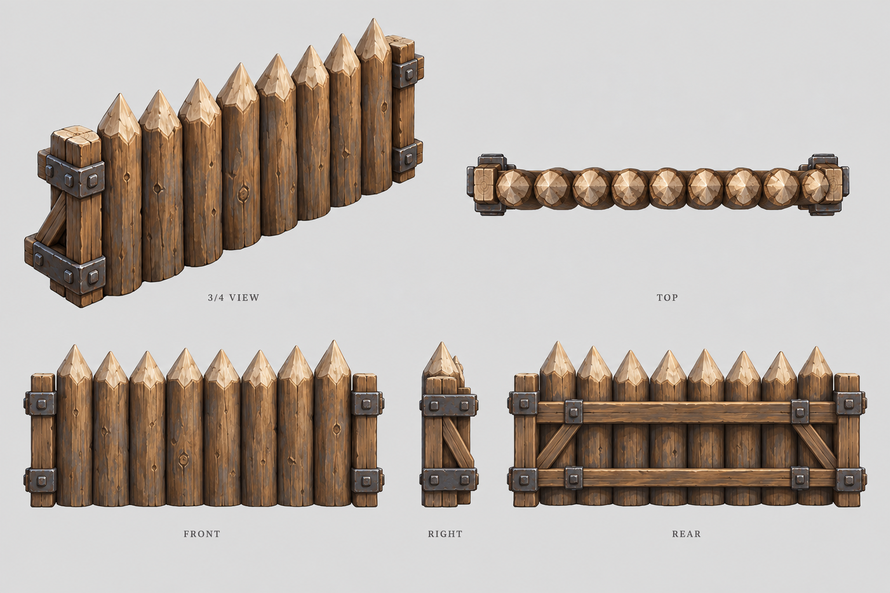
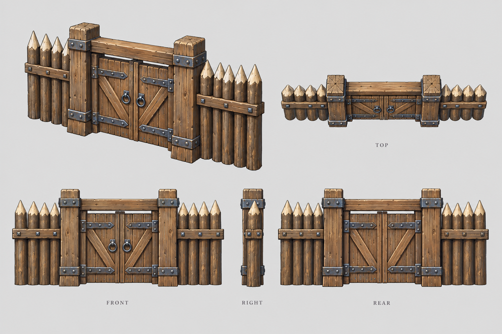

# 城墙

| 文档属性 | 内容 |
|---|---|
| 建筑编号 | BLD-005 |
| 版本 | v0.2 |
| 更新日期 | 2026-09-28 |
| 状态 | 定位、生命值、护甲、分段方式、绿皮拆墙规则、城门机制、价格与建造时间已确定；城门生命值与护甲为设计提案 |
| 规则依赖 | [SYS-CBT-001 · 战斗与护甲规则](../系统/战斗与护甲规则.md) · [SYS-BHV-001 · 单位行为与警戒规则](../系统/单位行为与警戒规则.md) |

[返回文档目录](../../游戏设计文档.md)

## 1. 建筑定位

城墙是单纯用来抵挡伤害的建筑。它不能攻击，不提供视野，也没有人驻守，只负责挡住绿皮、吸收伤害，为箭塔和民兵争取输出时间。

基础版为**木墙**（木栅墙），后续随科技升级为石墙、钢铁墙。

## 2. 属性表（每段）

| 属性 | 当前设定 | 状态 |
|---|---|---|
| 最大生命值 | **2000** | 已确定 |
| 护甲 | **15**（减伤约 33.3%） | 已确定 |
| 攻击 | 无 | 已确定 |
| 占地 | **长 4 m × 厚 1 m** | 已确定 |
| 建造时间 | **30 秒** / 段（1 名开拓者） | 已确定 |
| 维持费 | 无 | 已确定；没有人驻守 |
| 人口占用 | 无 | 已确定 |
| 成本 | **50 金币** / 段 | 已确定，见[成本体系](../系统/成本体系.md) |

## 3. 分段规则

**城墙按 4 m 一段建造**（已确定），每段有独立的生命值。

- **为什么是 4 m：**1 m 一段时，打破后只留下一条窄缝，单位只能一个接一个挤过去，画面也很碎。4 m 一段被打破后，会形成绿皮可以几只并排冲进来的缺口，更像「攻破了一片」。整面墙共用一个血量也不可取，一处被打，整条防线就没了。
- **拖动建造**：拖动时按 4 m 一段自动拼接，拐角自动生成墙角（设计提案）。
- **末端短段**：一排墙的长度不是 4 的倍数时，末端自动补一段 2 m 短墙（设计提案）。

### 3.1 破损表现（设计提案）

| 剩余生命值 H | 表现 |
|---|---|
| 1000 < H ≤ 2000 | 基本完整 |
| 500 < H ≤ 1000 | 出现裂缝、木桩松动 |
| 0 < H ≤ 500 | 明显塌落、缺损 |
| H = 0 | 整段倒塌，形成 4 m 缺口 |

整段倒塌时，相邻墙段带一些碎石效果，让破口看起来更自然。这只是画面效果，不额外扣血。

## 4. 绿皮与城墙

**绿皮被城墙挡住时，就近拆墙**（已确定），不会绕远路寻找缺口。

玩家需要把墙围严实，防线的突破口也会比较明确：绿皮从哪个方向来，就会在那附近破墙。

## 5. 城门

**城墙需要配套城门**（已确定），否则墙一封死，开拓者和民兵也出不去。参考《They Are Billions》。

### 5.1 城门机制（已确定）

- **自动开关**：友方单位靠近时自动开门放行，敌人无法通过。
- **替换墙段**：可以直接建在已有的墙段上，替换掉那一段墙。

### 5.2 城门数值（设计提案）

| 属性 | 提案值 | 说明 |
|---|---|---|
| 最大生命值 | 2000 | 与墙段相同 |
| 护甲 | **5**（减伤约 14.3%） | 明显低于墙段，是防线的薄弱点 |
| 占地 | 长 4 m × 厚 1 m | 与墙段一致 |
| 价格 | **50 金币** | 已确定 |
| 建造时间 | **30 秒** | 已确定 |
| 替换墙段时 | 返还该墙段价格的 50%（25 金币） | |
| 升级线 | 木门 → 石门 → 钢铁门 | 随城墙一起升级 |

**城门比墙弱**，「门开在哪」就成了布局决策：开在前线出兵方便但危险，开在侧面安全但要绕路。城门也可以用于基地内部隔断，某一块被攻破时，敌人不会一下子冲进整个基地。

## 6. 强度检验

普通绿皮尚无正式数值，以下借用测试建议检验：**20 攻击、1.5 秒攻击间隔、近战**。**这组数值仅用于检验，不属于已采纳的单位数据。**

| 项目 | 墙段 | 城门 |
|---|---|---|
| 绿皮每次实际伤害 | 20 × 30 ÷ 45 ≈ 13.3 | 20 × 30 ÷ 35 ≈ 17.1 |
| 一只绿皮打穿 | 150 次命中，约 3 分 45 秒 | 117 次命中，约 2 分 55 秒 |
| 10 只绿皮集中进攻 | 约 22 秒 | 约 17 秒 |

作为对比，一只绿皮拆掉箭塔、哨塔、兵营分别约需 25、26、17 秒。

**设计意图：**少量绿皮基本打不穿城墙，箭塔可以在墙后慢慢射杀；只有大群集中进攻或以后的攻城类绿皮才能真正破墙。城墙的作用是**逼迫敌人集中兵力**。

**风险：**如果绿皮进攻规模一直不大，城墙会显得过强。确定绿皮进攻节奏时需要复核。

## 7. 升级方向（示意）

**木墙** → **石墙**（石材加固）→ **钢铁墙**（消耗钢铁）

升级方式、成本和数值成长均待设计。

## 8. 待设计内容

| 项目 | 需确定内容 |
|---|---|
| 视野 | 城墙是否遮挡视野 |
| 站位 | 单位能否登上城墙，远程单位是否因此获得射程加成 |
| 修理 | 消耗、速度、执行者，战斗中能否修理 |
| 美术 | 墙段、墙角、短段、城门的造型与破损图 |

## 9. 关联文档

[箭塔](箭塔.md) · [哨塔](哨塔.md) · [兵营](兵营.md) · [主城设计](主城设计.md) · [单位行为与警戒规则](../系统/单位行为与警戒规则.md) · [战斗与护甲规则](../系统/战斗与护甲规则.md)

## 10. 版本记录

| 版本 | 日期 | 变更 |
|---|---|---|
| v0.1 | 2026-09-26 | 建立文档：确定生命值 2000、护甲 15、4 m 分段、绿皮就近拆墙、城门自动开关；提出建造时间与城门数值 |

### 木墙设定图

造型提案 v1：沿用主城的手绘奇幻 RTS 风格。图内包含概念、俯视与正面／右侧／背面视图；建模时需统一尺寸与细节。

[生成提示词](../美术/主城/敌人与建筑设定图/木墙-提示词-v1.txt)

### 木城门设定图

造型提案 v1：沿用主城的手绘奇幻 RTS 风格。图内包含概念、俯视与正面／右侧／背面视图；建模时需统一尺寸与细节。图稿不新增或改变玩法数值。

[生成提示词](../美术/主城/敌人与建筑设定图/木城门-提示词-v1.txt)
| v0.2 | 2026-09-28 | 确定墙段与城门价格 50 金币、建造时间 30 秒 |
