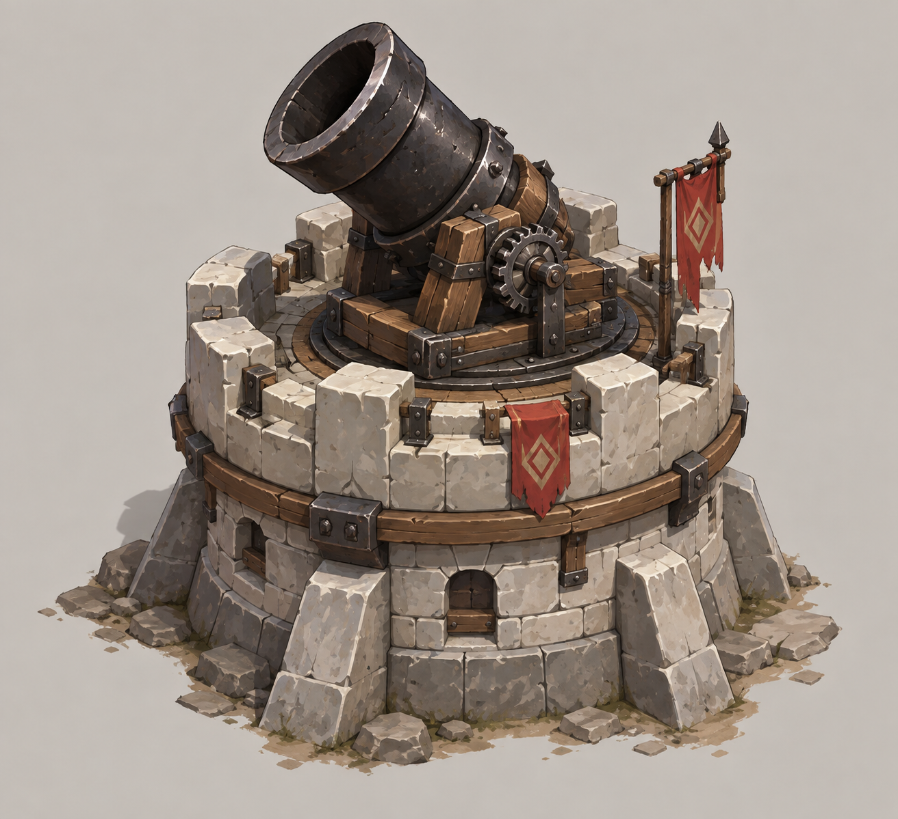
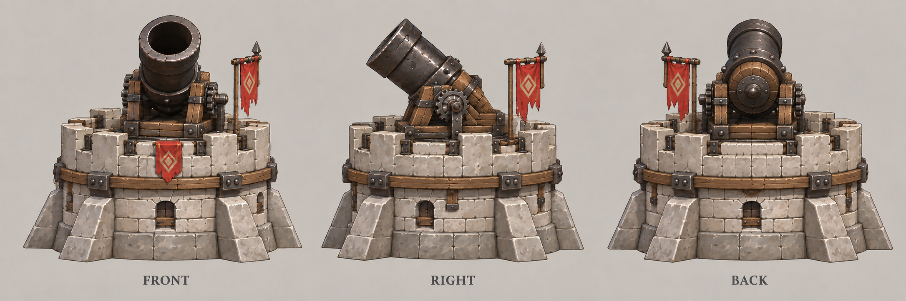

# 火炮塔

| 文档属性 | 内容 |
|---|---|
| 建筑编号 | BLD-020 |
| 版本 | v0.1 |
| 更新日期 | 2026-09-30 |
| 状态 | 科技 2 本范围伤害塔已确定；全部数值为设计提案；价格待定 |
| 规则依赖 | [SYS-CBT-001 · 战斗与护甲规则](../系统/战斗与护甲规则.md) · [SYS-TEC-001 · 科技系统](../系统/科技系统.md) · [SYS-ENG-001 · 能源体系](../系统/能源体系.md) |

[返回文档目录](../../游戏设计文档.md)

## 1. 建筑定位

火炮塔是**科技体系的 2 本塔**（研究院建成后解锁），发射抛物线炮弹，**落点周围的所有敌人一起受伤**，专门对付成群的绿皮。

**弱点：**近身有死角，4 m 以内打不到；炮弹飞行需要时间，跑得快的敌人可能躲开。适合放在城墙后面，或与[雷环塔](雷环塔.md)这类近身塔搭配。

与其他塔的分工：
- [箭塔](箭塔.md)、[双重箭塔](双重箭塔.md)：打单体或少数几个目标。
- **火炮塔：远距离打一片**，敌人越挤，总伤害越高。

## 2. 属性表（设计提案）

| 属性 | 提案值 |
|---|---|
| 解锁条件 | 研究院建成（科技 2 本） |
| 攻击方式 | 炮弹落点 **2.5 m** 半径内的所有敌人 |
| 伤害 | 每个敌人 **40**，物理，受护甲影响 |
| 攻击间隔 | **3 秒** |
| 射程 | **4–12 m**，4 m 以内为死角 |
| 弹道 | 抛物线，飞行约 1 秒；瞄准发射时目标所在位置 |
| 攻击目标 | 地面单位 |
| 最大生命值 | **400** |
| 护甲 | **5**（减伤约 14.3%） |
| 占地 | **4 × 4 m** |
| 视野 | **12 m** |
| 建造时间 | **25 秒**（1 名开拓者） |
| 成本 | 待定 |
| 维持费 | **20** 金币 / 分钟（2 本塔标准） |
| 能源占用 | **50** |
| 人口占用 | 不占用 |

## 3. 攻击规则（设计提案）

- 目标选择使用默认索敌：射程内（4–12 m）最近的敌人，见[单位行为与警戒规则](../系统/单位行为与警戒规则.md)。
- 炮弹落在发射时目标所在的位置。目标移动后，落点不变，范围内有谁就伤害谁。
- 不伤害友方单位与建筑。

## 4. 强度检验

普通绿皮属性以设计提案为准：**200 生命、20 攻击、1.5 秒攻击间隔、无护甲、近战、移动速度 3 m/s**。

| 项目 | 结果 |
|---|---|
| 消灭 1 只绿皮 | 5 发，约 13 秒（含炮弹飞行 1 秒） |
| 5 只绿皮挤在一起 | 5 发全部消灭，约 13 秒；箭塔打同样 5 只需要约 75 秒 |
| 绿皮贴到塔下 | 进入 4 m 死角，火炮塔打不到，需要其他塔或士兵处理 |

**设计意图：**火炮塔的价值取决于布局。把绿皮挡在墙外、让它们挤成一团，火炮塔就能发挥最大效果；[缚灵塔](缚灵塔.md)的定身也能让炮弹不落空。

## 5. 待设计内容

| 项目 | 需确定内容 |
|---|---|
| 价格 | 造价，是否需要钢铁 |
| 升级 | 是否有更高等级 |
| 美术 | 概念图、俯视图、三视图 |

## 6. 关联文档

[科技系统](../系统/科技系统.md) · [研究院](研究院.md) · [双重箭塔](双重箭塔.md) · [雷环塔](雷环塔.md) · [缚灵塔](缚灵塔.md) · [城墙](城墙.md) · [普通绿皮](../敌人/普通绿皮.md)

## 7. 版本记录

| 版本 | 日期 | 变更 |
|---|---|---|
| v0.1 | 2026-09-30 | 建立文档：科技 2 本范围伤害塔，数值为设计提案 |

## 美术图稿（2026-10-01 补充）

[概念图提示词](../美术/主城/敌人与建筑设定图/火炮塔-概念图-v1-提示词.txt) · [三视图提示词](../美术/主城/敌人与建筑设定图/火炮塔-三视图-v2-提示词.txt) · [图稿索引](../美术/主城/敌人与建筑设定图/设定图索引.md)

沿用现有概念造型，三视图为美术参考；不可见部位为推定补全，建模前需统一尺寸与结构。
