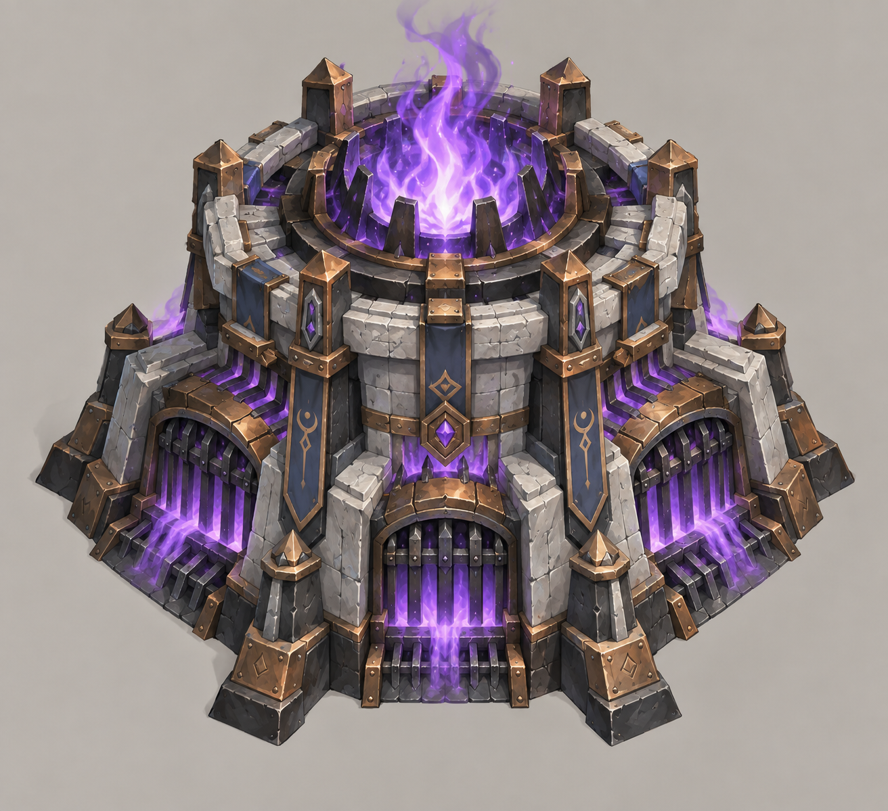
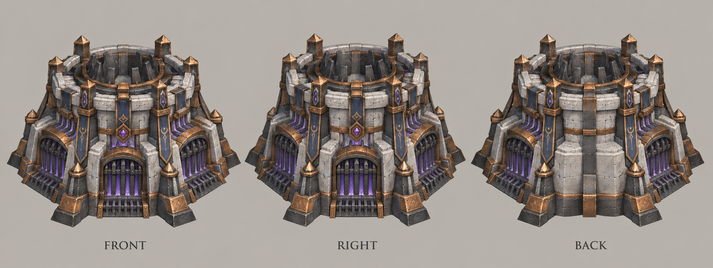

# 灵魂熔炉

| 文档属性 | 内容 |
|---|---|
| 建筑编号 | BLD-026 |
| 版本 | v0.1 |
| 更新日期 | 2026-09-30 |
| 状态 | 魔法 3 本、名称「灵魂熔炉」、攻击周围很近的所有敌人并造成高伤害已确定；全部数值为设计提案；价格待定 |
| 规则依赖 | [SYS-CBT-001 · 战斗与护甲规则](../系统/战斗与护甲规则.md) · [SYS-TEC-001 · 科技系统](../系统/科技系统.md) · [SYS-ENG-001 · 能源体系](../系统/能源体系.md) |

[返回文档目录](../../游戏设计文档.md)

## 1. 建筑定位

灵魂熔炉是**魔法体系的 3 本塔**（法师营地升到 3 本后解锁）。它**攻击身边很近范围内的所有敌人，伤害很高**，类似《植物大战僵尸》的忧郁菇。

适合放在城墙后面或路口，专门「吞掉」冲到跟前的敌人。

与其他近身魔法塔的区别：

| 塔 | 范围 | 伤害 |
|---|---|---|
| [雷环塔](雷环塔.md)（2 本） | 6 m | 每秒 6，低伤害、持续消耗 |
| **灵魂熔炉**（3 本） | **4 m** | 每秒约 53，高伤害 |

## 2. 属性表（设计提案）

| 属性 | 提案值 |
|---|---|
| 解锁条件 | 法师营地 3 本 |
| 攻击方式 | 攻击以塔为中心 **4 m** 内的**所有**敌人 |
| 伤害 | 每 **1.5 秒**对每个敌人 **80**，魔法，无视护甲 |
| 每秒伤害 | 每个敌人约 **53** |
| 特效 | 每消灭一个敌人，回复自身 **20** 生命 |
| 攻击目标 | 地面单位；魔法免疫的敌人不受伤害 |
| 最大生命值 | **600** |
| 护甲 | **10**（减伤 25%） |
| 占地 | **3 × 3 m** |
| 视野 | **8 m** |
| 建造时间 | **30 秒**（1 名开拓者） |
| 成本 | 待定 |
| 维持费 | **30** 金币 / 分钟 |
| 能源占用 | **100** |
| 人口占用 | 不占用 |

## 3. 强度检验

普通绿皮属性以设计提案为准：**200 生命、20 攻击、1.5 秒攻击间隔、无护甲、近战、移动速度 3 m/s**。

| 项目 | 结果 |
|---|---|
| 消灭 4 m 内的普通绿皮 | 3 次，约 3 秒；范围内的绿皮同时倒下 |
| 10 只绿皮在城墙外拆墙，全部在 4 m 内 | 约 3 秒全部消灭 |
| 绿皮每次对熔炉的实际伤害 | 20 × 30 ÷ 40 = 15；击杀回血可以抵消一部分 |

**弱点：**
- [绿皮弓手](../敌人/绿皮弓手.md)站在 4 m 以外射击，熔炉打不到。
- [破咒小子](../敌人/破咒小子.md)魔法免疫，熔炉完全无效。

因此灵魂熔炉必须与物理塔搭配，不能单独守一个口子。

## 4. 待设计内容

| 项目 | 需确定内容 |
|---|---|
| 价格 | 造价，预计需要魔晶 |
| 摆放 | 4 m 范围与 4 m 城墙段的配合，放在墙后能覆盖多少墙面 |
| 美术 | 概念图、俯视图、三视图；吞噬灵魂的特效 |

## 5. 关联文档

[科技系统](../系统/科技系统.md) · [法师营地](法师营地.md) · [雷环塔](雷环塔.md) · [风暴尖塔](风暴尖塔.md) · [城墙](城墙.md) · [绿皮弓手](../敌人/绿皮弓手.md) · [破咒小子](../敌人/破咒小子.md)

## 6. 版本记录

| 版本 | 日期 | 变更 |
|---|---|---|
| v0.1 | 2026-09-30 | 建立文档：魔法 3 本近身范围高伤塔，名称定为灵魂熔炉；数值为设计提案 |

<!-- art-20261005:start -->
## 美术设定图补充（2026-10-05）

本批补充概念稿和正面、侧面、背面三视图。用于造型与材质参考；建模时统一尺寸、结构和各视图细节。俯视图与动画另行制作。

### 灵魂熔炉

[概念稿提示词](../美术/主城/敌人与建筑设定图/灵魂熔炉-概念图-v1-提示词.txt) · [三视图提示词](../美术/主城/敌人与建筑设定图/灵魂熔炉-三视图-v1-提示词.txt)

<!-- art-20261005:end -->
