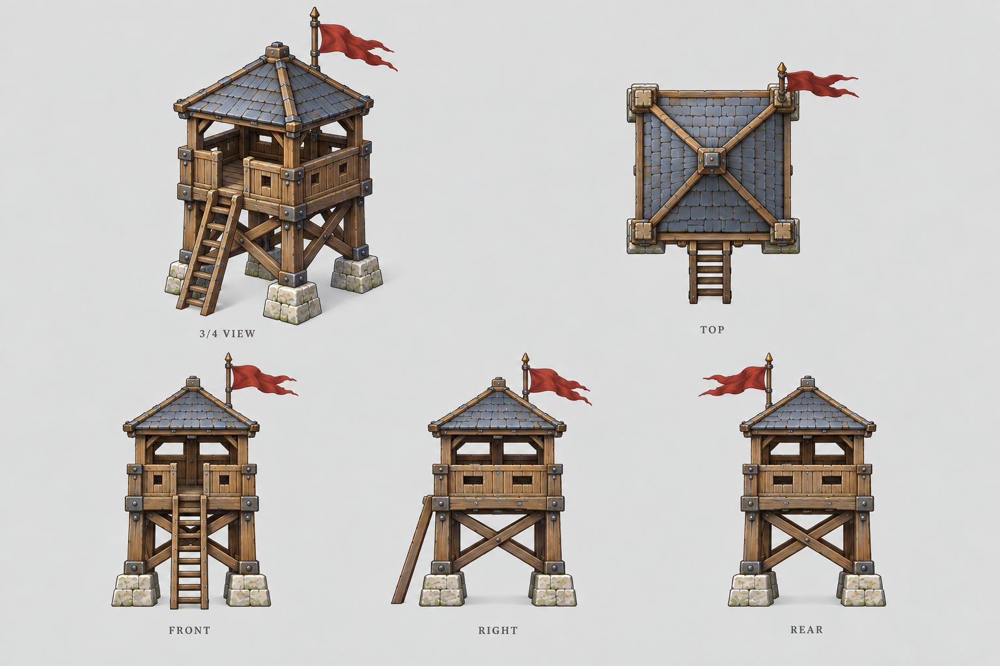

# 箭塔

| 文档属性 | 内容 |
|---|---|
| 建筑编号 | BLD-002 |
| 版本 | v0.2 |
| 更新日期 | 2026-09-26 |
| 状态 | 名称、生命值、护甲、建造时间已确定；攻击数值为设计提案 |
| 规则依赖 | [SYS-CBT-001 · 战斗与护甲规则](../系统/战斗与护甲规则.md) · [SYS-MOV-001 · 距离与移动速度标准](../系统/距离与移动速度标准.md) |

[返回文档目录](../../游戏设计文档.md)

## 1. 建筑定位

箭塔是最基础的攻击建筑，由弓箭手驻守的木石塔楼，自动射击进入射程的敌人。

开局时这个世界还没有现代科技，箭塔是纯中世纪的防御手段。随着主角把科技带进来，防御塔逐步升级，玩家从塔的名字和外观就能看出时代在推进。

**强度定位：**一座箭塔能守住零星骚扰，但顶不住成群进攻，需要多座箭塔和士兵配合防守。

## 2. 属性表

| 属性 | 当前设定 | 状态 |
|---|---|---|
| 最大生命值 | **300** | 已确定 |
| 护甲 | **3** | 已确定 |
| 减伤率 | **约 9.1%**（3 ÷ 33） | 按通用护甲公式计算 |
| 攻击力 | **20** / 次，单体 | 设计提案 |
| 攻击间隔 | **1.5 秒**（每秒伤害约 13.3） | 设计提案 |
| 射程 | **10 m** | 设计提案 |
| 视野 | **12 m** | 设计提案 |
| 攻击目标 | 地面单位 | 设计提案；对空能力待飞行单位出现后决定 |
| 占地 | **3 × 3 m** | 设计提案 |
| 建造时间 | **20 秒**（1 名开拓者） | 已确定 |
| 成本 | **120 金币** | 已确定，见[成本体系](../系统/成本体系.md) |
| 维持费 | 10 金币 / 分钟（弓箭手驻守） | 已确定 |
| 人口占用 | 不占用 | 已确定 |

攻击数值参考《植物大战僵尸》的直观风格：整数伤害配合常见的攻击间隔，便于玩家心算。

## 3. 强度检验

普通绿皮尚无正式数值，以下借用测试建议检验：**200 生命、20 攻击、1.5 秒攻击间隔、无护甲、近战、移动速度 3 m/s**。**这组数值仅用于检验，不属于已采纳的单位数据。**

### 3.1 单项数据

| 项目 | 结果 |
|---|---|
| 箭塔消灭一只绿皮 | 10 箭，约 15 秒 |
| 绿皮从射程边缘走到塔下 | 约 3.3 秒，箭塔可先射 2–3 箭 |
| 绿皮每次对箭塔的实际伤害 | 20 × 30 ÷ 33 ≈ 18.2 |
| 一只绿皮拆掉满血箭塔 | 17 次命中，约 25 秒 |
| 箭塔消灭开拓者 | 5 箭，约 7.5 秒（开拓者无护甲时） |

### 3.2 对抗结果

| 对抗情况 | 结果 |
|---|---|
| 1 塔 vs 1 绿皮 | 箭塔胜，剩余约 170 生命 |
| 1 塔 vs 2 绿皮 | 箭塔约 18 秒被拆，只消灭 1 只 |
| 1 塔 vs 3 绿皮 | 箭塔被拆 |

普通绿皮的正式数值确定后，需要重新验算本节。

## 4. 建造时间说明

建造时间定为 20 秒（已确定）。

**为什么保留建造时间：**开拓者是专门的建造单位，空间表现参考《Warcraft III》，玩法核心是经营基地和抵御进攻。建造时间让造塔需要提前规划，施工期间建筑和开拓者都比较脆弱，开拓者也因此有了存在的意义。基础建筑的建造时间控制在 15–30 秒，不让玩家长时间干等。

**为什么是 20 秒：**

- 一只绿皮单独拆塔约需 25 秒。建造时间短于这个值，玩家才有机会在进攻来临前临时补塔。
- 不低于 15 秒，避免箭塔可以随手堆出，让防守变得廉价。

建造中的箭塔生命值怎么计算、多名开拓者协作能否加速，待建造机制确定后补充。

## 5. 升级方向（示意）

以「塔」为统一后缀，材质和武器随科技进步：

**箭塔**（弓箭）→ **弩塔**（机械弩，主角的第一步改良）→ **火炮塔**（火药）→ **机枪塔**（自动武器）→ 更后期的科技塔

各阶段是箭塔直接升级还是另建新塔、需要什么科技前置、数值怎样成长，均待设计。另有「法术塔」可作为本土魔法路线的防御塔候选，是否采用待定。

## 6. 调整方向

| 调整目标 | 可选做法 |
|---|---|
| 箭塔更能独当一面 | 攻击间隔缩短到 1.2 秒，或射程增加到 12 m |
| 更依赖士兵 | 射程缩短到 8 m |

## 7. 待设计内容

| 项目 | 需确定内容 |
|---|---|
| 目标选择 | 优先攻击最近的、最先进入射程的，还是正在攻击建筑的敌人 |
| 弹道 | 箭矢是即时命中还是飞行弹道，能否被躲避 |
| 驻守 | 是否需要派单位驻守，驻守单位是否影响攻击 |
| 修理 | 消耗、速度、执行者 |
| 美术 | 概念图、俯视图、三视图 |

## 8. 关联文档

[战斗与护甲规则](../系统/战斗与护甲规则.md) · [距离与移动速度标准](../系统/距离与移动速度标准.md) · [开拓者](../单位/开拓者.md) · [哨塔](哨塔.md) · [兵营](兵营.md) · [城墙](城墙.md) · [主城设计](主城设计.md)

## 9. 版本记录

| 版本 | 日期 | 变更 |
|---|---|---|
| v0.1 | 2026-09-26 | 建立文档：确定名称、生命值 300、护甲 3；提出攻击、射程、建造时间 20 秒等数值与升级方向 |
| v0.2 | 2026-09-26 | 确定保留建造时间机制，箭塔建造时间 20 秒 |

### 箭塔设定图

造型提案 v1：沿用主城的手绘奇幻 RTS 风格。图内包含概念、俯视与正面／右侧／背面视图；建模时需统一尺寸与细节。

[生成提示词](../美术/主城/敌人与建筑设定图/箭塔-提示词-v1.txt)
