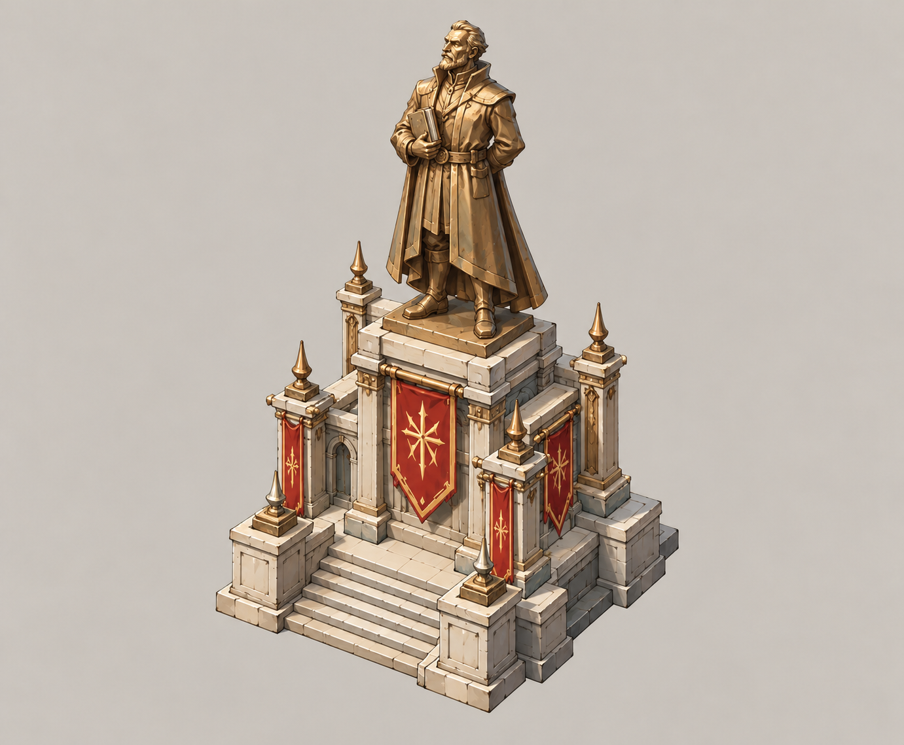
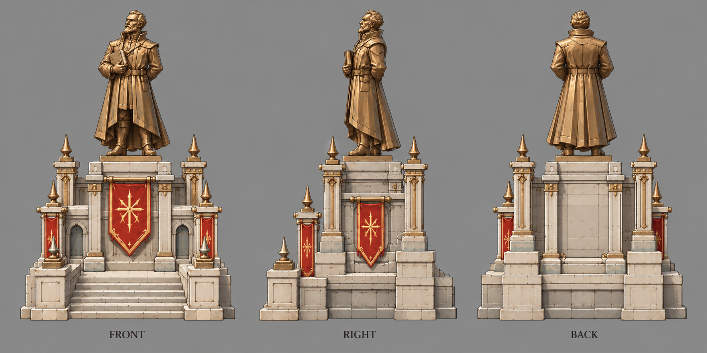

# 主角雕像

| 文档属性 | 内容 |
|---|---|
| 建筑编号 | BLD-041 |
| 建筑分类 | 经营建筑 |
| 版本 | v0.3 |
| 更新日期 | 2026-10-08 |
| 状态 | 城镇等级 6 解锁的地标（主角雕像），沿用城镇经营；效果、繁荣度、价格与全部数值为设计提案；本轮优化为原型测试基线 |
| 规则依赖 | [SYS-TWN-001 · 城镇经营](../../系统/城镇经营.md) · [SYS-TAG-001 · 标签](../../系统/标签.md) |

[返回文档目录](../../../游戏设计文档.md)

> 2026-10-08 数值迭代：既有用户确认规则保留；本轮新增或改动参数、结算与边界规则是优化后的原型测试基线，未经真人试玩，不代表用户已逐项定稿。

## 1. 建筑定位

主角雕像是第一座**地标**，城镇等级 6（开拓之都）解锁，每个基地 1 座。领民为「复活的祖先」立像，[古塞奇尤](../../单位/古塞奇尤.md)主持揭幕。她心里仍然半信半疑，但当着领民的面，只能带头鼓掌，见[世界观与角色](../../世界观与角色.md)。

它属于[〔公共建筑〕](../../系统/标签.md#公共建筑)：不直接赚钱，给周围加成。城里居民围着雕像逛街，**附近居民花钱更大方**。

## 2. 属性表

| 属性 | 当前设定 | 状态 |
|---|---|---|
| 解锁条件 | 城镇等级 6 | 沿用城镇经营；等级数为设计提案 |
| 标签 | [〔公共建筑〕](../../系统/标签.md#公共建筑) | 设计提案，见[标签](../../系统/标签.md) |
| 数量限制 | 每个基地 **1 座** | 设计提案 |
| 加成效果 | **30 m** 内居民的消费池上限 40 金 → **50 金** | 设计提案 |
| 繁荣度 | **+30** | 设计提案；电影院 +10、市政厅 +20 |
| 最大生命值 | **1000** | 设计提案 |
| 护甲 | **5** | 设计提案 |
| 攻击 | 无 | 设计提案 |
| 占地 | **6 × 6 m** | 设计提案 |
| 视野 | **10 m** | 设计提案 |
| 建造时间 | **60 秒**（1 名开拓者） | 设计提案 |
| 成本 | **20000 金币 + 200 钢铁** | 设计提案；价格已与[成本体系](../../系统/成本体系.md)主表一致 |
| 维持费 | 无 | 设计提案 |
| 能源占用 | 无 | 设计提案 |
| 人口占用 | 不占用 | 设计提案 |

## 3. 加成规则

| 规则 | 内容 | 状态 |
|---|---|---|
| 对象 | 家在雕像30m内的空闲已入住居民 | 设计提案 |
| 效果 | 每人每分钟最多花在商店的钱从 40 金提高到 **50 金** | 设计提案 |
| 不影响 | 民居的税收（每人每分钟 180 金）不变；不加电影院、市政厅那种民居收入 | 设计提案 |
| 总上限 | 商店收入仍计入城市形成的总加成上限（+100%） | 沿用城镇经营 |

**为什么加消费池上限，而不是直接加收入**：电影院、市政厅已经在加民居收入，雕像再加一层只是数字叠高。抬高消费池上限，让雕像旁边的商店街「能多开一种店还不分钱」，奖励的是把商业区围着雕像布置。

| 雕像旁边 | 每分钟多出的商店生意 |
|---|---|
| 100人，客单足够且税收增益未挤占共享上限 | +1000 金 |
| 200人，客单足够且税收增益未挤占共享上限 | +2000 金 |

消费池只提高潜在上限，不保证净增加。普通50、凯旋60秒100；税收加成+85%时居民商业剩余空间仅27，雕像不会凭空越过+100%总上限。各商店读取同一最终池，完整公式见城镇经营5.1。

> 第五轮说明（说明性，非新规则；数值策划 A 4.2(1)）：主角雕像**不作为烧钱出口恢复**。消费池 40→50 在税收加成叠满（共享 +100% 上限被占满）后净增为 0，实际只剩繁荣度 +30 与 200 钢铁的支出；现金宽裕的处理立场是接受，不靠它强制消耗金币。

## 4. 表现

- 揭幕时全城放烟花，和城镇升到 6 级的「主城金色外观」一起出现。
- 夜里雕像底座亮灯；居民白天在雕像周围散步、拍照。
- 雕像被拆时冒灰色「−繁荣 30」，居民围在废墟边上发呆。

## 5. 强度检验

普通绿皮属性以设计提案为准：**200 生命、20 攻击、1.5 秒攻击间隔、无护甲、近战**。

| 项目 | 结果 |
|---|---|
| 绿皮每次对主角雕像的实际伤害 | 20 × 30 ÷ 35 ≈ 17.1 |
| 一只绿皮拆掉满血主角雕像 | 59 次命中，约 88.5 秒 |

雕像是全城最结实的经营建筑，但它被拆的繁荣度损失也最大。

## 6. 待设计内容

| 项目 | 需确定内容 |
|---|---|
| 定位 | 以后是否有更多地标，每种地标给不同的加成 |
| 数值 | 30 m、50 金、繁荣度 +30 |
| 美术 | 雕像造型要用主角（祖先的身体）的形象，需先定主角外观 |

## 7. 关联文档

[城镇经营](../../系统/城镇经营.md) · [标签](../../系统/标签.md) · [电影院](电影院.md) · [市政厅](市政厅.md) · [世界观与角色](../../世界观与角色.md) · [古塞奇尤](../../单位/古塞奇尤.md)

## 8. 版本记录

| 版本 | 日期 | 变更 |
|---|---|---|
| v0.2 | 2026-10-08 | 同步成本唯一来源、人口边界及本轮经济结算；美术图稿保留；新内容为原型测试基线 |
| v0.1 | 2026-10-08 | 建立文档：城镇等级 6 地标，每基地 1 座；30 m 内居民消费池上限 40 金 → 50 金，繁荣度 +30 |
| v0.3 | 2026-10-08 | 第五轮同步：成本行删「待写入成本体系」；加注不作为烧钱出口恢复（消费池 +10 在税收叠满后净增为 0，说明性） |

<!-- shop-art-20261008:start -->
## 美术图稿补充（2026-10-08）

本批概念稿与三视图为造型提案；三视图按正面、侧面、背面组织，用于建模参考。建模时校准尺寸、结构与遮挡关系，俯视图另行补充。特效、角色活动和环境装饰不属于建筑模型。

[概念图提示词](../../美术/主城/敌人与建筑设定图/主角雕像-概念图-v1-提示词.txt) · [三视图提示词](../../美术/主城/敌人与建筑设定图/主角雕像-三视图-v1-提示词.txt)

雕像人物为临时造型提案，祖先／主角的正式外貌尚未定稿；当前图主要确定纪念碑轮廓、石座与材质。

<!-- shop-art-20261008:end -->
