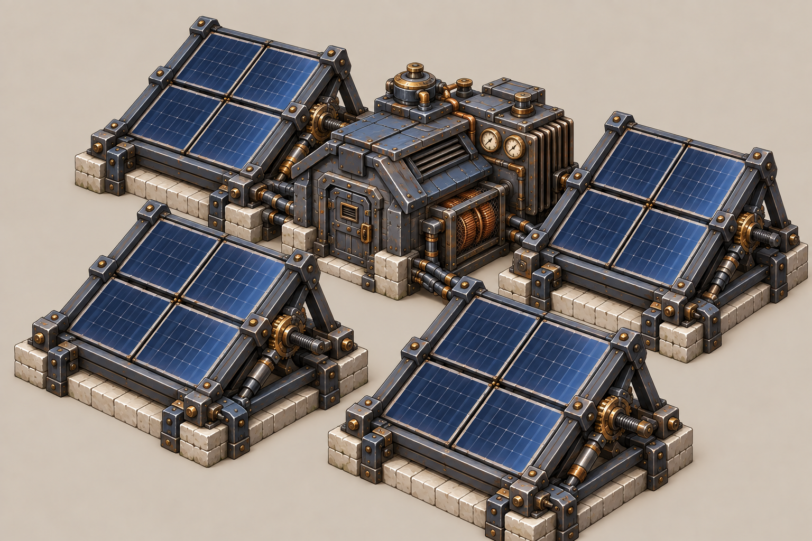
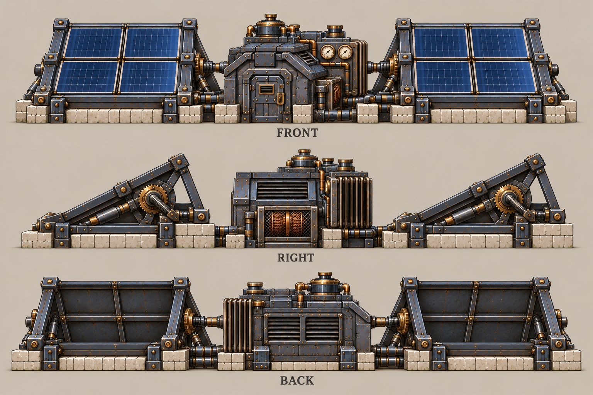

# 太阳能发电站

| 文档属性 | 内容 |
|---|---|
| 建筑编号 | BLD-046 |
| 建筑分类 | 经营建筑 |
| 版本 | v0.3 |
| 更新日期 | 2026-10-08 |
| 状态 | 研究院 3 本解锁、任意位置可建、全天固定 +300 能源、不受昼夜和天气影响、以价格高和占地大为代价，已确定；价格 10000 金币、占地 6 × 6 m 为能源体系提案；其余为设计提案；本轮优化为原型测试基线 |
| 规则依赖 | [SYS-ENG-001 · 能源体系](../../系统/能源体系.md) · [SYS-MAP-001 · 地图与资源点](../../系统/地图与资源点.md) |

[返回文档目录](../../../游戏设计文档.md)

> 2026-10-08 数值迭代：既有用户确认规则保留；本轮新增或改动参数、结算与边界规则是优化后的原型测试基线，未经真人试玩，不代表用户已逐项定稿。

## 1. 建筑定位

太阳能发电站是**不靠资源点**的能源，研究院 3 本解锁，任意位置都能建。产出全天固定 +300，不受昼夜、天气影响，也不会枯竭。

代价是**价格高、占地大**：它会挤占基地内盖民居和商店的地方。它适合资源点被占、或者不想往外扩的时候用。

## 2. 属性表

| 属性 | 当前设定 | 状态 |
|---|---|---|
| 解锁条件 | 研究院 3 本 | 已确定 |
| 建造位置 | 任意位置 | 已确定 |
| 能源产出 | 全天固定 **+300**；不吃距离倍率 | 已确定；距离倍率只给资源点建筑 |
| 标签 | [〔能源建筑〕](../../系统/标签.md#能源建筑) [〔科技体系〕](../../系统/标签.md#科技体系) | 设计提案 |
| 最大生命值 | **200** | 设计提案，能源体系「生命值偏低」 |
| 护甲 | **0** | 设计提案，能源体系提案 |
| 攻击 | 无 | 设计提案 |
| 占地 | **6 × 6 m** | 能源体系提案 |
| 视野 | **8 m** | 设计提案 |
| 建造时间 | **40 秒**（1 名开拓者） | 设计提案 |
| 成本 | **10000 金币** | 能源体系提案（原 500 金币，已按 ×20 数量级） |
| 维持费 | 无 | 设计提案，没有工人 |
| 人口占用 | 不占用 | 设计提案 |

## 3. 发电

能源规则见[能源体系](../../系统/能源体系.md)，这里只列要点：

- 能源是供给型资源：**剩余能源 = 总产出 − 总占用**，不能储存，也不会被花掉。
- 全局通用，不设供电范围。
- 发电建筑被拆时，已建成的建筑效果不变，只是不能再建新的耗能建筑、不能升本。
- 太阳能发电站产出的是固定**供给点数**（+300，不吃距离倍率），不是每秒或每分钟的产出速率，不随时间累积，也不吃任何速率类加成。

和煤矿比：同样 +300，煤矿 3000 金币但要矿点、在野外；太阳能 10000 金币，但能放在城里最安全的地方，也不用付维持费。煤矿每分钟 100 维持费，约 70 分钟后两者总花费持平。

## 4. 强度检验

普通绿皮属性以设计提案为准：**200 生命、20 攻击、1.5 秒攻击间隔、无护甲、近战**。

| 项目 | 结果 |
|---|---|
| 绿皮每次对太阳能发电站的实际伤害 | 20 × 30 ÷ 30 ≈ 20 |
| 一只绿皮拆掉满血太阳能发电站 | 10 次命中，约 15 秒 |

很脆，放在城里才安全，但放在城里又挤占民居和商店的位置，这是它的取舍。

## 5. 待设计内容

| 项目 | 需确定内容 |
|---|---|
| 数值 | 价格是否过高；是否也算繁荣度 |
| 美术 | v5 已暂定采用 |

## 6. 关联文档

[能源体系](../../系统/能源体系.md) · [地图与资源点](../../系统/地图与资源点.md) · [科技系统](../../系统/科技系统.md) · [成本体系](../../系统/成本体系.md) · [标签](../../系统/标签.md) · [研究院](../军事建筑/研究院.md) · [煤矿](煤矿.md) · [昼夜系统](../../系统/昼夜系统.md)

## 7. 版本记录

| 版本 | 日期 | 变更 |
|---|---|---|
| v0.2 | 2026-10-08 | 同步成本唯一来源、人口边界及本轮经济结算；美术图稿保留；新内容为原型测试基线 |
| v0.1 | 2026-10-08 | 建立文档：整理能源体系里已确定的太阳能规则（研究院 3 本、任意位置、全天 +300），补生命值 200、护甲 0、10000 金币、6 × 6 m、无维持费等提案 |
| v0.3 | 2026-10-08 | 第五轮同步：补产出为供给点数、不吃速率与距离倍率的说明 |

## 美术图稿

[概念图提示词](../../美术/主城/敌人与建筑设定图/太阳能发电站-概念图-v5-提示词.txt) · [三视图提示词](../../美术/主城/敌人与建筑设定图/太阳能发电站-三视图-v5-提示词.txt) · [图稿索引](../../美术/主城/敌人与建筑设定图/设定图索引.md)
