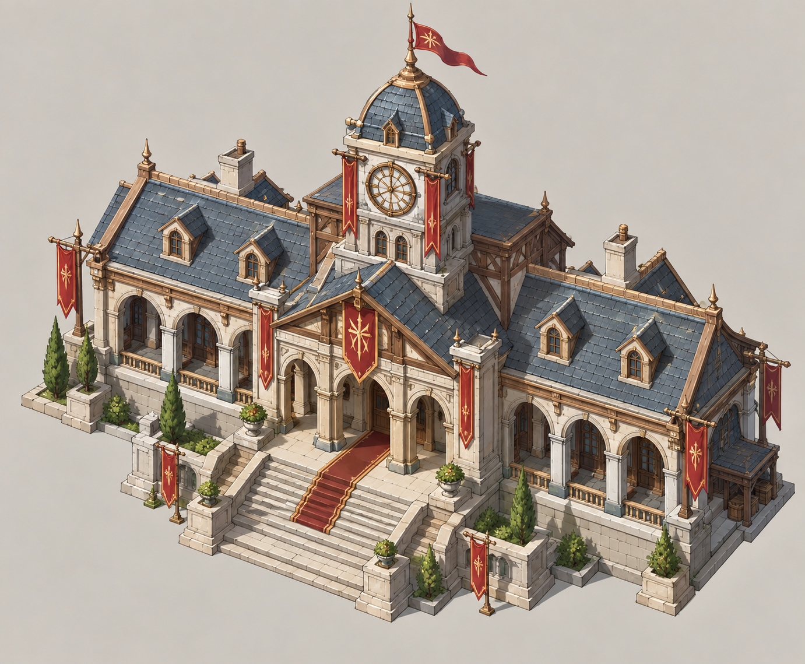
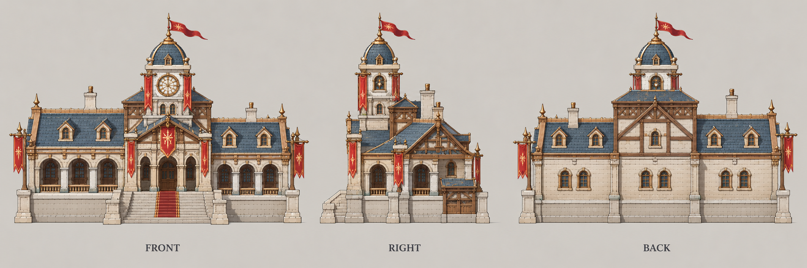

# 市政厅

| 文档属性 | 内容 |
|---|---|
| 建筑编号 | BLD-012 |
| 建筑分类 | 经营建筑 |
| 版本 | v0.6 |
| 更新日期 | 2026-10-08 |
| 状态 | 由城镇等级解锁（2026-10-07，原为 3 本建筑）、增加附近民居金币收入 +45%、范围比电影院小，已确定；具体范围与全部数值为设计提案；价格见成本体系主表；本轮优化为原型测试基线 |
| 规则依赖 | [BLD-006 · 民居](民居.md) · [BLD-011 · 电影院](电影院.md) · [SYS-TEC-001 · 科技系统](../../系统/科技系统.md) · [SYS-ENG-001 · 能源体系](../../系统/能源体系.md) |

[返回文档目录](../../../游戏设计文档.md)

> 2026-10-08 数值迭代：既有用户确认规则保留；本轮新增或改动参数、结算与边界规则是优化后的原型测试基线，未经真人试玩，不代表用户已逐项定稿。

## 1. 建筑定位

市政厅是**经济建筑**（城镇等级 5 解锁），是电影院的高阶版本：**范围内民居的金币收入 +45%，但覆盖范围比电影院小一点。**

它的定位是「在核心居住区放大收益」：电影院适合覆盖较大的居住区，市政厅适合放在最密集、最靠里的核心区。加成更高，但需要摆得更精准。

**解锁（已确定）：**由城镇等级解锁（暂定城镇等级 5），不再挂在研究院下，见[城镇经营](../../系统/城镇经营.md)。提供繁荣度 +20（设计提案）。

## 2. 属性表

| 属性 | 当前设定 | 状态 |
|---|---|---|
| 解锁条件 | 城镇等级 5 | 由城镇等级解锁已确定，等级数为设计提案 |
| 加成效果 | 范围内民居金币收入 **+45%** | 已确定 |
| 加成范围 | 以市政厅为中心 **25 m** | 已确定「比电影院小一点」；具体数值为设计提案 |
| 最大生命值 | **500** | 设计提案 |
| 护甲 | **5**（减伤约 14.3%） | 设计提案 |
| 攻击 | 无 | 已确定 |
| 占地 | **10 × 10 m** | 设计提案，与主城同量级 |
| 视野 | **10 m** | 设计提案 |
| 建造时间 | **40 秒**（1 名开拓者） | 设计提案 |
| 成本 | **24000 金币 + 120 钢铁** | 原型测试基线；以成本体系主表为准 |
| 维持费 | **600** 金币 / 分钟 | 设计提案 |
| 能源占用 | **200** | 设计提案，见[能源体系](../../系统/能源体系.md) |
| 人口占用 | 不占用 | 设计提案 |

## 3. 加成规则

### 3.1 加成对象（设计提案）

与[电影院](电影院.md)一致：对象是民居，加成的是民居实际产出的金币，主城的 10 名人口暂不受加成。

### 3.2 与电影院、其他市政厅的关系

- **与电影院可以叠加（已确定）：**同时覆盖同一座民居时，+30% 与 +45% 相加为 **+75%**（相加为设计提案，若相乘则约 +88.5%）。
- **市政厅之间不叠加（设计提案）：**多座市政厅覆盖同一座民居，只享受一次 +45%。

**结果：**市政厅覆盖的核心居住区，再叠一座电影院最划算，能拿到最高的 +75%；市政厅覆盖不到的外围区域，只靠电影院拿 +30%。

**平衡提示：**+75% 会让居住区的金币产出接近翻倍，比单独一座建筑强很多。这套叠加的价格、能源占用和维持费需要一起考虑，避免金币通胀加剧。

## 4. 收益估算

按每座木屋住满 10 人、每人每分钟 180 金币计算：

| 范围内民居 | 原金币 / 分钟 | +45% 后 | 多出 |
|---|---|---|---|
| 5 座木屋 | 9000 | 13050 | +4050 |
| 10 座木屋 | 18000 | 26100 | +8100 |
| 5 座瓦房 | 18000 | 26100 | +8100 |
| 10 座木屋，同时被电影院覆盖（+75%） | 18000 | 31500 | +13500 |

25 m 半径大约能覆盖 10–15 座 4 × 4 m 的民居，取决于摆放的疏密。

**平衡提示：**与电影院相同，市政厅是直接放大金币的建筑，价格、能源占用（200）和维持费（600）需要压得足够高，见[电影院](电影院.md)第 4 节。

### 4.1 首切片可选入围（设计提案，原型规则，第五轮 J15）

> 以下是设计提案，未经试玩，不是已确定规则。

- **繁荣度**：[城镇经营](../../系统/城镇经营.md)首切片示例路线的繁荣为 338（不含市政厅），不足 Lv6 的 340；加入市政厅（繁荣 +20）后示例为 358 ≥ 340，Lv6 可达（「中心城区」组合 +30 另算，未计入）。
- **能源**：市政厅占 200 能源，与研究院 3 本的 400 合计 600；出生点保底煤矿只供 300 × 距离倍率，因此需要**第二个能源点**（煤矿点、油田或太阳能）。
- **定位**：**可选而非必买**，不列入通关必买清单；首 2 本目标不因此放宽。

## 5. 强度检验

| 项目 | 结果 |
|---|---|
| 绿皮每次对市政厅的实际伤害 | 20 × 30 ÷ 35 ≈ 17.1 |
| 一只绿皮拆掉满血市政厅 | 30 次命中，约 44 秒 |

市政厅比电影院更耐拆，但仍没有攻击能力，需要放在防线内部。

## 6. 待设计内容

| 项目 | 需确定内容 |
|---|---|
| 归属 | 确认属于科技体系，还是其他 |
| 数值 | 加成范围（25 m）、生命值、能源占用是否合适 |
| 主城 | 主城的 10 名人口是否受加成 |
| 美术 | 概念图、俯视图、三视图 |

## 7. 关联文档

[电影院](电影院.md) · [民居](民居.md) · [科技系统](../../系统/科技系统.md) · [能源体系](../../系统/能源体系.md) · [成本体系](../../系统/成本体系.md) · [核心玩法循环](../../核心玩法循环.md)

## 8. 版本记录

| 版本 | 日期 | 变更 |
|---|---|---|
| v0.5 | 2026-10-08 | 补齐经济设施成本；炼钢收益按20钢铁基数重新验算；新内容为原型测试基线 |
| v0.1 | 2026-09-29 | 建立文档：3 本建筑，范围内民居金币收入 +45%，范围比电影院小；归属科技体系及全部数值为设计提案 |
| v0.2 | 2026-09-29 | 确定与电影院同时覆盖时可以叠加（+75%），改写叠加规则 |
| v0.3 | 2026-10-07 | 改由城镇等级解锁（暂定 5 级），不再属于研究院 3 本；市政厅只加民居收入，不加商店收入 |
| v0.4 | 2026-10-08 | 金币数量级整体 ×20（价格、收入、维持费同比放大，平衡不变），方便商店按秒跳金币数字 |
| v0.6 | 2026-10-08 | 第五轮同步：状态栏删价格待定；删过期价格待设计行；新增首切片可选入围说明（繁荣 358≥340、能源 600 需第二能源点、可选而非必买，设计提案） |

## 美术图稿（2026-10-01 补充）

[概念图提示词](../../美术/主城/敌人与建筑设定图/市政厅-概念图-v1-提示词.txt) · [三视图提示词](../../美术/主城/敌人与建筑设定图/市政厅-三视图-v1-提示词.txt) · [图稿索引](../../美术/主城/敌人与建筑设定图/设定图索引.md)

沿用现有概念造型，三视图为美术参考；不可见部位为推定补全，建模前需统一尺寸与结构。
