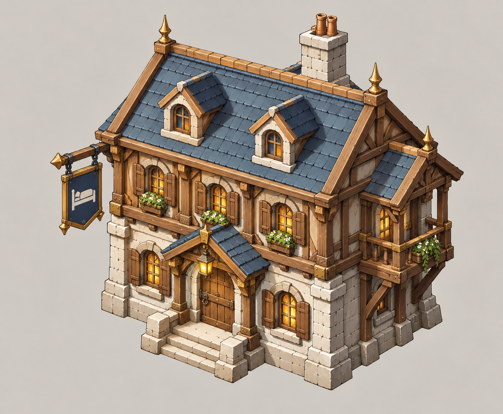
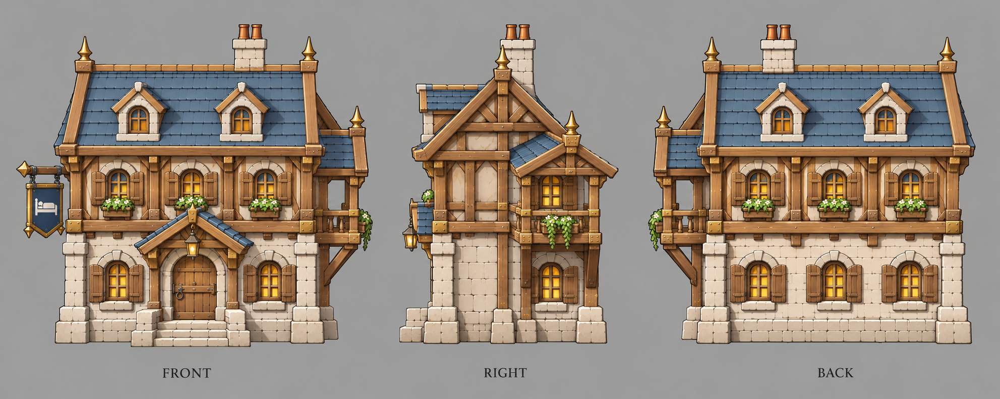

# 旅馆

| 文档属性 | 内容 |
|---|---|
| 建筑编号 | BLD-037 |
| 建筑分类 | 经营建筑 |
| 版本 | v0.3 |
| 更新日期 | 2026-10-08 |
| 状态 | 城镇等级 4 解锁、每次大波后来一位外来客商留下少量钢铁或随机小礼物、不收维持费，沿用城镇经营；礼物内容、客单、价格与全部数值为设计提案；本轮优化为原型测试基线 |
| 规则依赖 | [SYS-TWN-001 · 城镇经营](../../系统/城镇经营.md) · [SYS-TAG-001 · 标签](../../系统/标签.md) |

[返回文档目录](../../../游戏设计文档.md)

> 2026-10-08 数值迭代：既有用户确认规则保留；本轮新增或改动参数、结算与边界规则是优化后的原型测试基线，未经真人试玩，不代表用户已逐项定稿。

## 1. 建筑定位

旅馆**接待外来客商**。生意中等，夜里稍好。

附加作用：**每次大波打完，来一位外来客商**，住一晚，走时留下少量钢铁或一份随机小礼物。它把「打赢大波」和「经营」连起来：大波越早清完，客商越早上门。

## 2. 属性表

| 属性 | 当前设定 | 状态 |
|---|---|---|
| 解锁条件 | 城镇等级 4 | 城镇等级解锁已确定，等级数为设计提案 |
| 标签 | [〔商店〕](../../系统/标签.md#商店) [〔夜间营业〕](../../系统/标签.md#夜间营业) | 设计提案，见[标签](../../系统/标签.md) |
| 客单 | 白天 **8 金**、夜里 **16 金** / 人 / 分钟 | 设计提案 |
| 服务范围 | 居民家 **15 m** 内 | 设计提案，沿用城镇经营 |
| 最大生命值 | **300** | 设计提案 |
| 护甲 | **2** | 设计提案 |
| 攻击 | 无 | 已确定 |
| 占地 | **4 × 4 m** | 设计提案 |
| 视野 | **8 m** | 设计提案 |
| 建造时间 | **30 秒**（1 名开拓者） | 设计提案 |
| 成本 | **6000 金币 + 30 钢铁**（每多一座 +400 金币） | 设计提案；价格已与[成本体系](../../系统/成本体系.md)主表一致 |
| 维持费 | 无 | 设计提案，沿用城镇经营「商店不收维持费」 |
| 能源占用 | 无 | 设计提案 |
| 人口占用 | 不占用 | 沿用城镇经营 |

## 3. 生意

通用规则见[城镇经营 5.1](../../系统/城镇经营.md)，这里只列要点：

- 生意来自服务范围内住宅的**空闲已入住居民**，与税收共用同一人口记录；招募中的已预留人口和在役人员不当顾客。每居民消费池普通40、雕像范围内50，凯旋60秒池与客单同时×2；再受税收与商业共享的+100%上限约束。各店读取居民最终动态上限，按客单比例分账，同种店重叠再平分。完整公式以[城镇经营 5.1](../../系统/城镇经营.md#51-通用规则只用一套消费池公式)为准。
- 同种店服务范围重叠时，平分重叠处的顾客。
- 商店收入计入[城市形成](../../系统/城市形成.md)的总加成上限（+100%）。
- 玩家只看店铺星级（★1–★3）和建造预览里的「单店生意 / 全城净增加」。
- 不占人口；同种店每多建一座，下一座价格 +400 金币（设计提案）。
- 每开一种城里还没有的店，繁荣度 +8（按种类计，不按座数）。
- 账本按实际结算累积后显示金币飘字；无收入不显示。显示取整不能反向改变收入，低于1金币的尾数累积到下次。同屏频率限制仍依城镇经营。

按一天平均客单约 11.2 金估算（白天 6 分钟 × 8 + 夜里 4 分钟 × 16）：

| 附近居民 | 每分钟生意 |
|---|---|
| 30 人 | 约 336 金 |
| 60 人 | 约 672 金 |
| 100 人 | 约 1120 金 |

## 4. 附加作用：外来客商

| 规则 | 内容 | 状态 |
|---|---|---|
| 来客 | 每次大波结束后，每座旅馆来 **1 位**客商；全城最多算 **2 座**旅馆 | 每次大波 1 位沿用城镇经营；座数上限为设计提案 |
| 停留 | 客商从地图边缘走进城、进旅馆住下，到店**30秒**后赠礼；下个黎明离开仅为表现，不再延迟到账 | 设计提案 |
| 礼物 | 见下表，随机一种 | 设计提案 |
| 旅馆被拆 | 未赠礼则离开、不留礼物；已赠礼不会追回 | 设计提案 |
| 组合 | 凑成「城门客栈」后，客商多带一份礼物 | 沿用城镇经营 |

| 礼物 | 几率 | 说明 |
|---|---|---|
| 钢铁 40 | 60% | 约一座采矿场 2 分钟的产出，半次瓦房升级 |
| 金币 5000 | 30% | |
| 施工图纸 | 10% | 下一座商店最多抵 **3000金币**；不免材料、能源占用和解锁条件 |

不给魔晶，维持「魔晶只来自打怪和宝箱」，见[核心玩法循环](../../核心玩法循环.md)。

每次非最终大波按唯一波次ID发放一次来客事件；全基地最多2家旅馆领取，按旅馆建成顺序。事件发生时未建成的旅馆不追补；终波立即胜利，不再发供本局使用的礼物。客商行走时间计入到店延迟，30秒从实际到店开始计。

## 5. 相关组合

| 组合 | 需要 | 效果 |
|---|---|---|
| 城门客栈 | 旅馆 + 城门 | 外来客商多带一份礼物；离墙近，容易被拆 |
| 不夜城 | 电影院 + 酒馆 + 旅馆 | 夜里这三家的客单权重翻倍，居民消费池不额外翻倍，路灯全亮 |

## 6. 强度检验

普通绿皮属性以设计提案为准：**200 生命、20 攻击、1.5 秒攻击间隔、无护甲、近战**。

| 项目 | 结果 |
|---|---|
| 绿皮每次对旅馆的实际伤害 | 20 × 30 ÷ 32 ≈ 18.8 |
| 一只绿皮拆掉满血旅馆 | 16 次命中，约 24 秒 |

「城门客栈」要旅馆挨着城门，等于把一座 300 血的店放在墙边，这是城镇经营里有意设计的「冒险换收益」。

## 7. 待设计内容

| 项目 | 需确定内容 |
|---|---|
| 数值 | 礼物内容和几率；全城最多算 2 座是否合适 |
| 客商 | 客商走进城的路上会不会遇敌、能不能被打死（暂定无敌、不参战） |
| 美术 | 概念图、三视图已补充（见文末）；后续补俯视图及客商造型 |

## 8. 关联文档

[城镇经营](../../系统/城镇经营.md) · [标签](../../系统/标签.md) · [民居](民居.md) · [城市形成](../../系统/城市形成.md) · [成本体系](../../系统/成本体系.md) · [城墙](../军事建筑/城墙.md) · [酒馆](酒馆.md) · [电影院](电影院.md) · [出怪系统](../../系统/出怪系统.md)

## 9. 版本记录

| 版本 | 日期 | 变更 |
|---|---|---|
| v0.2 | 2026-10-08 | 统一动态消费池、空闲顾客、净收益预览与实际到账；相关经营装备/旅馆/百货边界同步；新内容为原型测试基线 |
| v0.1 | 2026-10-08 | 建立文档：城镇等级 4 商店，白天客单 8 金、夜里 16 金；每次大波后每座旅馆来一位客商（全城最多算 2 座），黎明离开时留下钢铁 40 / 金币 5000 / 施工图纸 |
| v0.3 | 2026-10-08 | 第五轮同步：成本行删「待写入成本体系」（已与主表一致） |

<!-- shop-art-20261008:start -->
## 美术图稿补充（2026-10-08）

本批概念稿与三视图为造型提案；三视图按正面、侧面、背面组织，用于建模参考。建模时校准尺寸、结构与遮挡关系，俯视图另行补充。特效、角色活动和环境装饰不属于建筑模型。

[概念图提示词](../../美术/主城/敌人与建筑设定图/旅馆-概念图-v1-提示词.txt) · [三视图提示词](../../美术/主城/敌人与建筑设定图/旅馆-三视图-v1-提示词.txt)

<!-- shop-art-20261008:end -->
