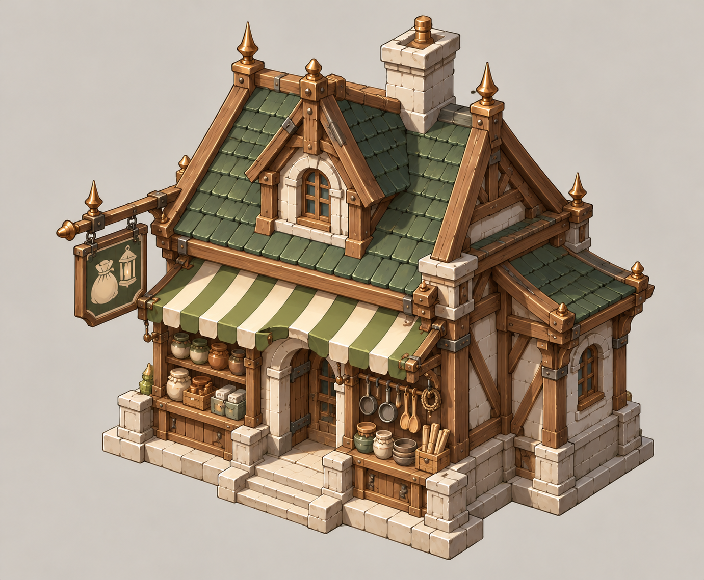
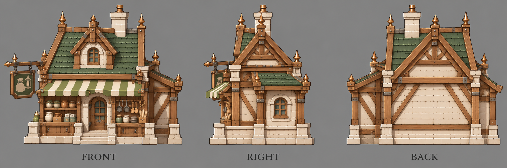

# 杂货铺

| 文档属性 | 内容 |
|---|---|
| 建筑编号 | BLD-032 |
| 建筑分类 | 经营建筑 |
| 版本 | v0.3 |
| 更新日期 | 2026-10-08 |
| 状态 | 城镇等级 1 解锁、附加作用「附近开拓者建造、修理略快」、不收维持费，沿用城镇经营；客单、范围、价格与全部数值为设计提案；本轮优化为原型测试基线 |
| 规则依赖 | [SYS-TWN-001 · 城镇经营](../../系统/城镇经营.md) · [SYS-TAG-001 · 标签](../../系统/标签.md) |

[返回文档目录](../../../游戏设计文档.md)

> 2026-10-08 数值迭代：既有用户确认规则保留；本轮新增或改动参数、结算与边界规则是优化后的原型测试基线，未经真人试玩，不代表用户已逐项定稿。

## 1. 建筑定位

杂货铺是**新手店**，开局就能建，生意平稳。

附加作用：**附近的[开拓者](../../单位/开拓者.md)建造、修理略快**。开拓者从这里拿工具和材料，所以商业区附近的施工更快，也鼓励玩家把杂货铺开在常要修补的地方附近（但别太靠墙，商店怕拆）。

## 2. 属性表

| 属性 | 当前设定 | 状态 |
|---|---|---|
| 解锁条件 | 城镇等级 1 | 城镇等级解锁已确定，等级数为设计提案 |
| 标签 | [〔商店〕](../../系统/标签.md#商店) | 设计提案，见[标签](../../系统/标签.md) |
| 客单 | **12 金** / 人 / 分钟 | 设计提案 |
| 服务范围 | 居民家 **15 m** 内 | 设计提案，沿用城镇经营 |
| 最大生命值 | **150** | 设计提案 |
| 护甲 | **0** | 设计提案 |
| 攻击 | 无 | 已确定 |
| 占地 | **3 × 3 m** | 设计提案，沿用城镇经营 |
| 视野 | **8 m** | 设计提案 |
| 建造时间 | **15 秒**（1 名开拓者） | 设计提案 |
| 成本 | **2000 金币**（每多一座 +400） | 设计提案；价格已与[成本体系](../../系统/成本体系.md)主表一致 |
| 维持费 | 无 | 设计提案，沿用城镇经营「商店不收维持费」 |
| 能源占用 | 无 | 设计提案 |
| 人口占用 | 不占用 | 沿用城镇经营 |

## 3. 生意

通用规则见[城镇经营 5.1](../../系统/城镇经营.md)，这里只列要点：

- 生意来自服务范围内住宅的**空闲已入住居民**，与税收共用同一人口记录；招募中的已预留人口和在役人员不当顾客。每居民消费池普通40、雕像范围内50，凯旋60秒池与客单同时×2；再受税收与商业共享的+100%上限约束。各店读取居民最终动态上限，按客单比例分账，同种店重叠再平分。完整公式以[城镇经营 5.1](../../系统/城镇经营.md#51-通用规则只用一套消费池公式)为准。
- 同种店服务范围重叠时，平分重叠处的顾客。
- 商店收入计入[城市形成](../../系统/城市形成.md)的总加成上限（+100%）。
- 玩家只看店铺星级（★1–★3）和建造预览里的「单店生意 / 全城净增加」。
- 不占人口；同种店每多建一座，下一座价格 +400 金币（设计提案）。
- 每开一种城里还没有的店，繁荣度 +8（按种类计，不按座数）。
- 账本按实际结算累积后显示金币飘字；无收入不显示。显示取整不能反向改变收入，低于1金币的尾数累积到下次。同屏频率限制仍依城镇经营。

按客单 12 金估算：

| 附近居民 | 每分钟生意 |
|---|---|
| 30 人 | 360 金 |
| 60 人 | 720 金 |
| 100 人 | 1200 金 |

## 4. 附加作用：施工更快

| 规则 | 内容 | 状态 |
|---|---|---|
| 效果 | 站在杂货铺 15 m 内施工的开拓者，**建造、修理速度 +15%** | 设计提案 |
| 判断 | 按开拓者施工时所站的位置判断，不看被修的建筑在哪 | 设计提案 |
| 叠加 | 多座杂货铺**不叠加** | 设计提案，沿用城镇经营 |
| 费用 | 不变，修理照常扣费 | 设计提案 |

20 秒的箭塔约 17 秒建好；修理也同样提速，见[建造与修理](../../系统/建造与修理.md)。

## 5. 相关组合

| 组合 | 需要 | 效果 |
|---|---|---|
| 早市 | 集市 + 面包房 + 杂货铺 | 白天三家店生意更好，路边长出摊位 |

## 6. 强度检验

普通绿皮属性以设计提案为准：**200 生命、20 攻击、1.5 秒攻击间隔、无护甲、近战**。

| 项目 | 结果 |
|---|---|
| 绿皮每次对杂货铺的实际伤害 | 20 × 30 ÷ 30 ≈ 20 |
| 一只绿皮拆掉满血杂货铺 | 8 次命中，约 12 秒 |

放在离墙太近的地方能让修墙更快，但也更容易被拆，这是摆放上的取舍。

## 7. 待设计内容

| 项目 | 需确定内容 |
|---|---|
| 数值 | +15% 是否明显；是否也影响开拓者跑路速度（暂不影响） |
| 美术 | 概念图、三视图已补充（见文末）；俯视图待补 |

## 8. 关联文档

[城镇经营](../../系统/城镇经营.md) · [标签](../../系统/标签.md) · [民居](民居.md) · [城市形成](../../系统/城市形成.md) · [成本体系](../../系统/成本体系.md) · [建造与修理](../../系统/建造与修理.md) · [开拓者](../../单位/开拓者.md) · [面包房](面包房.md)

## 9. 版本记录

| 版本 | 日期 | 变更 |
|---|---|---|
| v0.2 | 2026-10-08 | 统一动态消费池、空闲顾客、净收益预览与实际到账；相关经营装备/旅馆/百货边界同步；新内容为原型测试基线 |
| v0.1 | 2026-10-08 | 建立文档：城镇等级 1 商店，客单 12 金，附加作用为 15 m 内开拓者建造、修理 +15% |
| v0.3 | 2026-10-08 | 第五轮同步：成本行删「待写入成本体系」（已与主表一致） |

<!-- shop-art-20261008:start -->
## 美术图稿补充（2026-10-08）

本批概念稿与三视图为造型提案；三视图按正面、侧面、背面组织，用于建模参考。建模时校准尺寸、结构与遮挡关系，俯视图另行补充。特效、角色活动和环境装饰不属于建筑模型。

[概念图提示词](../../美术/主城/敌人与建筑设定图/杂货铺-概念图-v1-提示词.txt) · [三视图提示词](../../美术/主城/敌人与建筑设定图/杂货铺-三视图-v1-提示词.txt)

<!-- shop-art-20261008:end -->
