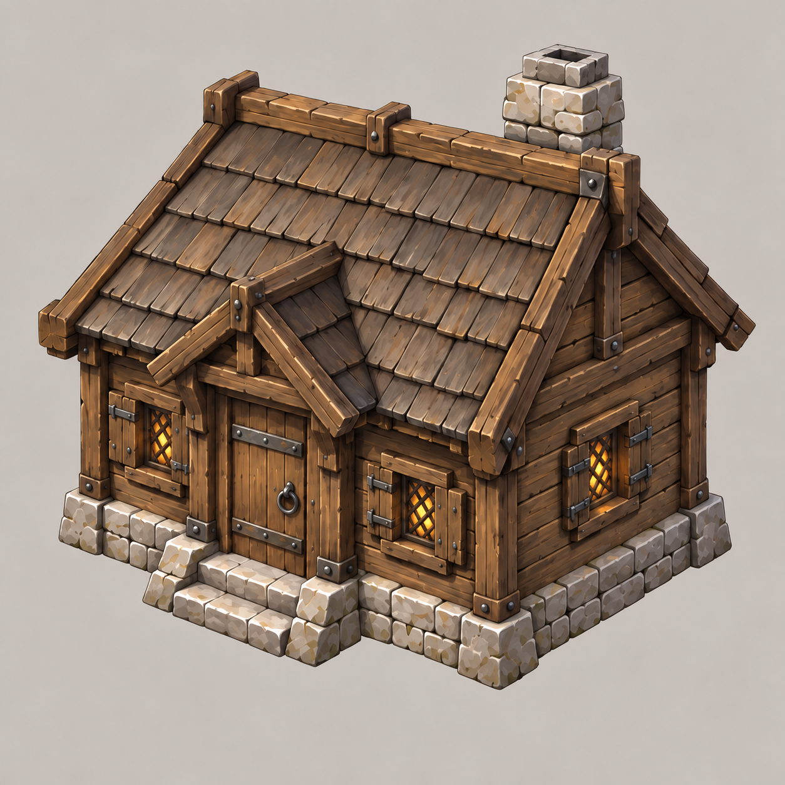
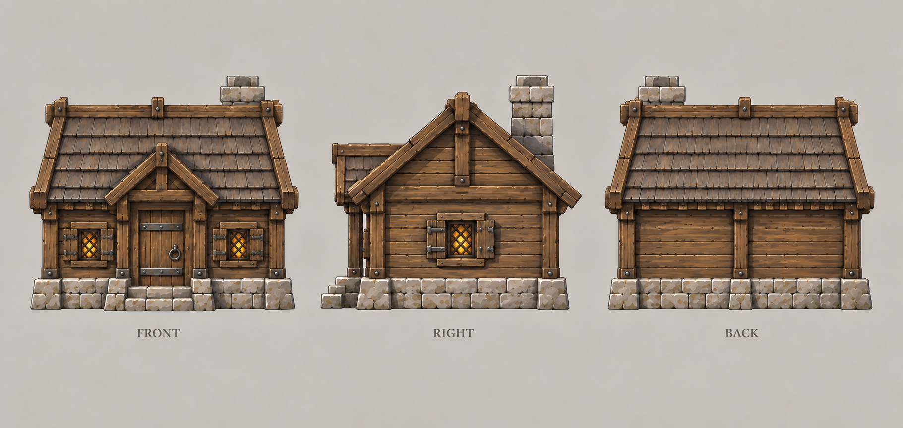
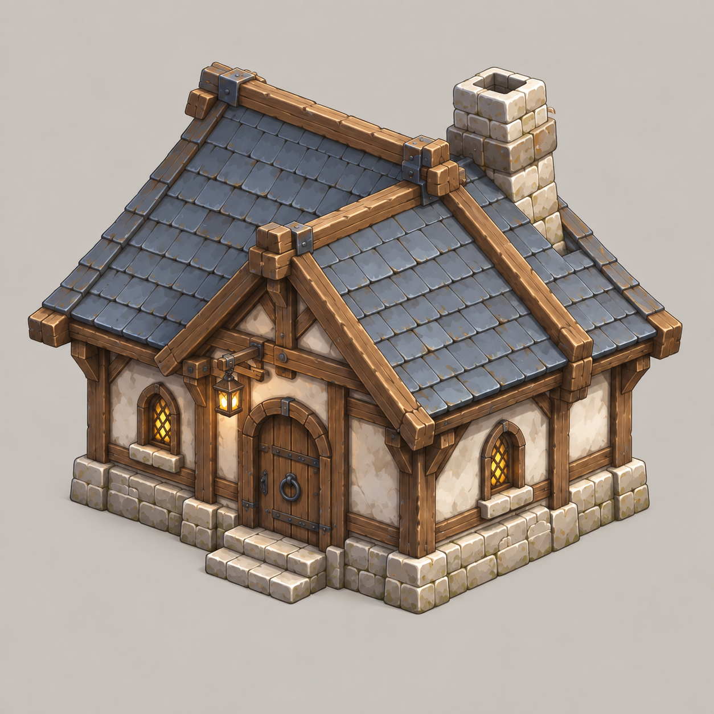
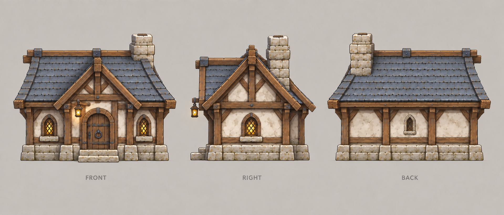
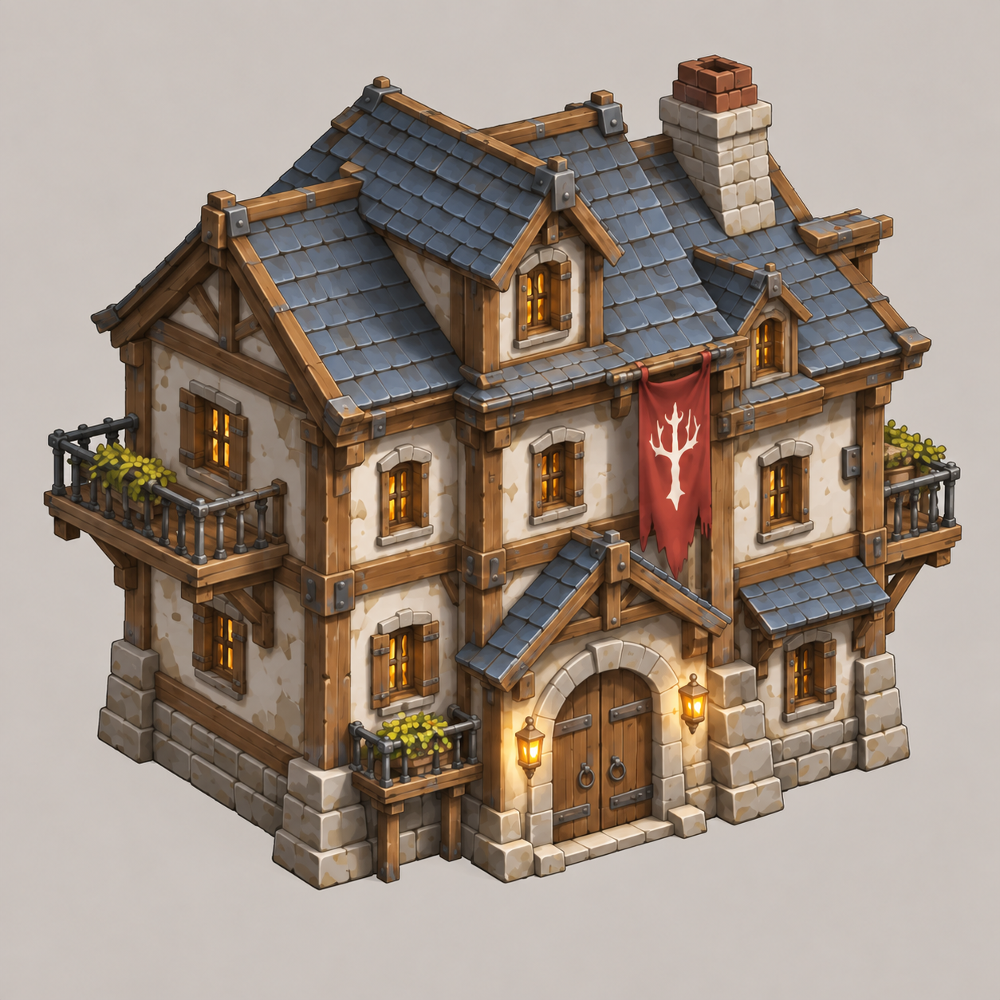
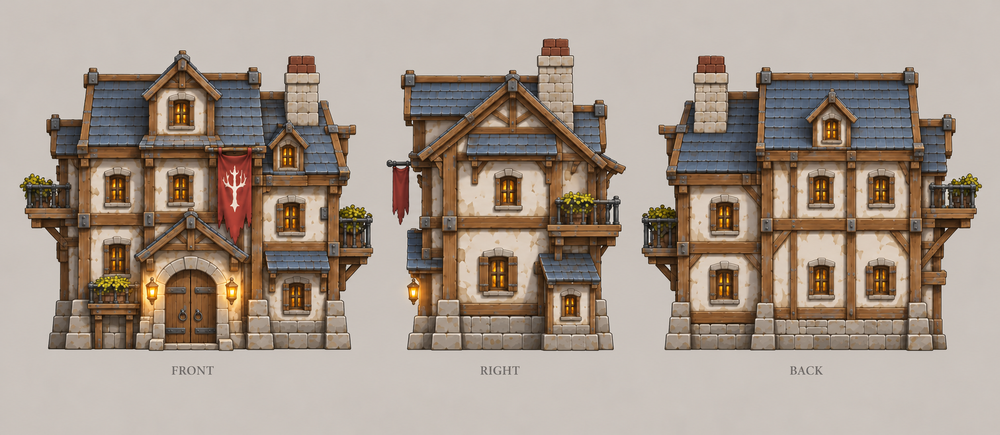

# 民居

| 文档属性 | 内容 |
|---|---|
| 建筑编号 | BLD-006 |
| 建筑分类 | 经营建筑 |
| 版本 | v0.7 |
| 更新日期 | 2026-10-08 |
| 状态 | 等级名称、人口、金币产出、升级规则、无维持费已确定；占地、建造时间、入住速度与人口规则为设计提案 |
| 规则依赖 | [GDD-002 · 核心玩法循环](../../核心玩法循环.md) · [SYS-CBT-001 · 战斗与护甲规则](../../系统/战斗与护甲规则.md) |

[返回文档目录](../../../游戏设计文档.md)

## 1. 建筑定位

民居是经济的起点：**民居 → 人口 → 金币**。修建民居增加人口，人口产生金币，开拓者和士兵也从人口中出。

民居是后方的脆弱建筑，不设防，需要城墙和防御塔保护。

## 2. 等级

民居共 3 级（已确定），名称随等级变化：

| 等级 | 名称 | 人口 | 金币产出 | 生命值上限 |
|---|---|---|---|---|
| 1 | **木屋** | 10 | 1800 / 分钟 | 200 |
| 2 | **瓦房** | 20 | 3600 / 分钟 | 250 |
| 3 | **公寓** | 30 | 5400 / 分钟 | 300 |

金币产出按住满且人口未被单位占用计算。

名称从简陋的木屋、体面的瓦房，到科技时代的公寓，体现时代推进。

### 2.1 升级规则（已确定）

- 每升一级，**人口 +10**。
- 每升一级，**生命值上限 +50**。
- 升级完成时**回满全部生命值**。

**解锁条件（已确定）：**瓦房需要城镇等级 2，公寓需要城镇等级 4（等级数为暂定），见[城镇经营](../../系统/城镇经营.md)。

升级费用见属性表；升级时间待定。**设计提示：**升级与新建都是 +10 人口；升级省地方、更好防守，新建则扩大基地面积。两者的价格需要平衡，避免玩家只选一条路。

## 3. 属性表

| 属性 | 当前设定 | 状态 |
|---|---|---|
| 最大生命值 | 见等级表（1 级 200） | 已确定 |
| 护甲 | **0** | 设计提案 |
| 攻击 | 无 | 已确定 |
| 提供人口 | 见等级表（1 级 10） | 已确定 |
| 占地 | **4 × 4 m** | 设计提案 |
| 建造时间 | **20 秒**（1 名开拓者） | 已确定 |
| 入住速度 | 每 **5 秒**入住 1 人，50 秒住满一级 | 设计提案 |
| 维持费 | **无** | 已确定；居民不是单位，只代表金币产出 |
| 视野 | **8 m** | 设计提案 |
| 成本 | 木屋 **2000 金币起，每已建民居 +300**（见成本体系）；升瓦房 **3000 金币 + 80 钢铁**；升公寓 **5000 金币** | 已确定，见[成本体系](../../系统/成本体系.md) |

升级后新增的 10 人同样按入住速度逐步入住。

## 4. 金币产出

**每名人口每分钟产出 180 金币**（已确定），见 [核心玩法循环](../../核心玩法循环.md)。

| 参照 | 结果 |
|---|---|
| 1 座住满的木屋 | 1800 金币 / 分钟 |
| 击杀 1 只[普通绿皮](../../敌人/普通绿皮.md)（平均 300 金币） | 约相当于 1 座木屋 10 秒的产出 |
| 新建木屋回本 | 住满后约 1 分钟 |

被开拓者、士兵占用的人口不再产出金币。

### 4.0 金币产出加成

范围内有[电影院](电影院.md)（+30%）和[市政厅](市政厅.md)（+45%）时，两者可以叠加，相加为 +75%；同类建筑之间不叠加。被单位占用的人口不产金币，不受加成影响。

### 4.1 无维持费（已确定）

**民居没有维持费。**居民不是单位，只是「产出金币」的抽象，不像士兵和驻守建筑那样需要供养。

## 5. 人口规则（设计提案）

| 情况 | 处理 |
|---|---|
| 招募开拓者或民兵 | 占用 1 名人口 |
| 没有空闲人口 | 不能招募 |
| 民居被摧毁 | 人口上限下降；已占用人口超过上限时，已有单位不消失，但不能继续招募，直到补足 |
| 开局 | 主城提供 10 名初始人口（已确定），开局就有收入和可用的开拓者 |

「民居被摧毁时单位不消失」用于避免死亡螺旋：房子被拆已经是损失，不再让单位凭空消失。

## 6. 强度检验

普通绿皮属性以设计提案为准：**20 攻击、1.5 秒攻击间隔、近战**。

| 等级 | 1 只绿皮拆除所需 |
|---|---|
| 木屋（200） | 10 次命中，约 14 秒 |
| 瓦房（250） | 13 次命中，约 18 秒 |
| 公寓（300） | 15 次命中，约 21 秒 |

民居被绿皮摸到后很快就会被拆，必须布置在防线以内。

## 7. 待设计内容

| 项目 | 需确定内容 |
|---|---|
| 升级时间 | 各级升级所需时间 |
| 前置条件 | 升级到瓦房、公寓需要的科技或主城等级 |
| 居民表现 | 画面中居民的走动方式，居民能否被绿皮攻击 |
| 美术 | 三个等级的造型与破损表现 |

## 8. 关联文档

[核心玩法循环](../../核心玩法循环.md) · [主城设计](主城设计.md) · [兵营](../军事建筑/兵营.md) · [城墙](../军事建筑/城墙.md) · [开拓者](../../单位/开拓者.md) · [民兵](../../单位/民兵.md) · [普通绿皮](../../敌人/普通绿皮.md)

## 9. 版本记录

| 版本 | 日期 | 变更 |
|---|---|---|
| v0.1 | 2026-09-27 | 建立文档：确定木屋 / 瓦房 / 公寓三级、每级人口 +10、生命值上限 +50 并回满、每人每分钟 6 金币 |
| v0.2 | 2026-09-27 | 确定维持费 50 金币 / 分钟且升级不增加；补充视野 8 m 与净收入 |
| v0.3 | 2026-09-27 | 人口产出改为每人每分钟 9 金币，更新净收入 |
| v0.4 | 2026-09-27 | 维持费改为 40 金币 / 分钟 |
| v0.5 | 2026-09-28 | 取消民居维持费：居民不是单位 |
| v0.6 | 2026-10-07 | 瓦房、公寓改由城镇等级解锁（暂定 2 级、4 级） |
| v0.7 | 2026-10-08 | 金币数量级整体 ×20（价格、收入、维持费同比放大，平衡不变），方便商店按秒跳金币数字 |

### 民居木屋设定图

造型提案 v3（2026-09-29）：概念稿与正面／右侧／背面三视图独立成图。沿用既有造型与玩法设定，建模时仍需统一精确尺寸与细节。

[概念图提示词](../../美术/主城/敌人与建筑设定图/民居木屋-概念图-v3-提示词.txt) · [三视图提示词](../../美术/主城/敌人与建筑设定图/民居木屋-三视图-v3-提示词.txt)

[历史合版](../../美术/主城/敌人与建筑设定图/民居木屋-设定图-v2.png)

[生成提示词](../../美术/主城/敌人与建筑设定图/民居木屋-提示词-v2.txt)

### 民居瓦房设定图

造型提案 v3（2026-09-29）：概念稿与正面／右侧／背面三视图独立成图。沿用既有造型与玩法设定，建模时仍需统一精确尺寸与细节。

[概念图提示词](../../美术/主城/敌人与建筑设定图/民居瓦房-概念图-v3-提示词.txt) · [三视图提示词](../../美术/主城/敌人与建筑设定图/民居瓦房-三视图-v3-提示词.txt)

[历史合版](../../美术/主城/敌人与建筑设定图/民居瓦房-设定图-v1.png) · [补回背窗修订提示词](../../美术/主城/敌人与建筑设定图/民居瓦房-三视图-v3-修订提示词.txt)

[生成提示词](../../美术/主城/敌人与建筑设定图/民居瓦房-提示词-v1.txt)

### 民居公寓设定图

造型提案 v3（2026-09-29）：概念稿与正面／右侧／背面三视图独立成图。保留两层主体加阁楼层的原稿结构。沿用既有造型与玩法设定，建模时仍需统一精确尺寸与细节。

[概念图提示词](../../美术/主城/敌人与建筑设定图/民居公寓-概念图-v3-提示词.txt) · [三视图提示词](../../美术/主城/敌人与建筑设定图/民居公寓-三视图-v3-提示词.txt)

[历史合版](../../美术/主城/敌人与建筑设定图/民居公寓-设定图-v2.png) · [层数修订提示词](../../美术/主城/敌人与建筑设定图/民居公寓-概念图-v3-修订提示词.txt)

[生成提示词](../../美术/主城/敌人与建筑设定图/民居公寓-提示词-v2.txt)
