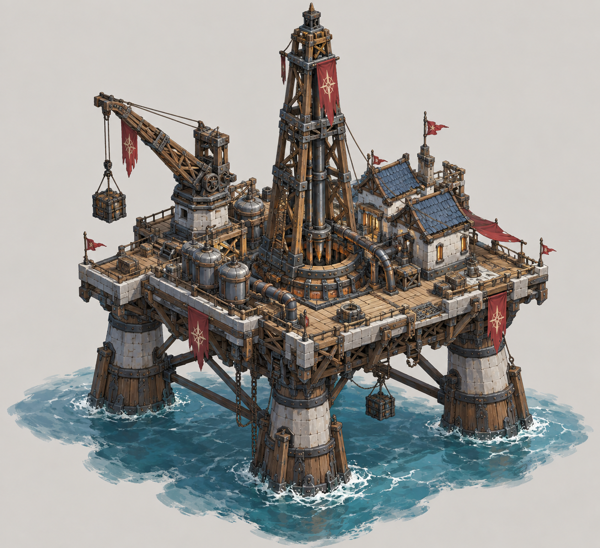
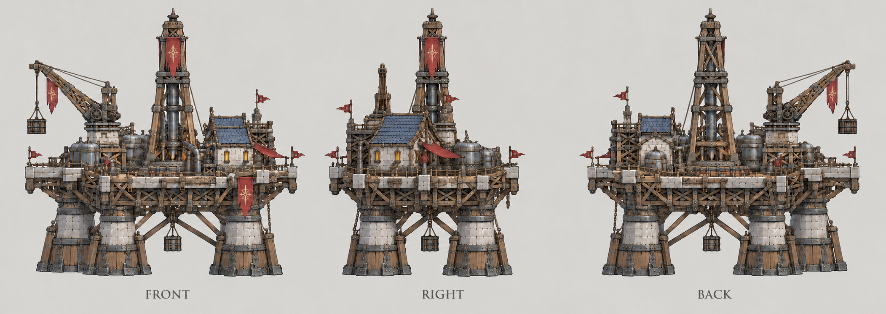

# 海上石油平台

| 文档属性 | 内容 |
|---|---|
| 建筑编号 | BLD-045 |
| 建筑分类 | 经营建筑 |
| 版本 | v0.3 |
| 更新日期 | 2026-10-08 |
| 状态 | 研究院 2 本（建成）解锁、只能建在海上、产出 +800 能源、建造与修理要用载有开拓者的运输舰，已确定；生命值、护甲、占地、价格、维持费为设计提案；本轮优化为原型测试基线 |
| 规则依赖 | [SYS-ENG-001 · 能源体系](../../系统/能源体系.md) · [SYS-MAP-001 · 地图与资源点](../../系统/地图与资源点.md) |

[返回文档目录](../../../游戏设计文档.md)

> 2026-10-08 数值迭代：既有用户确认规则保留；本轮新增或改动参数、结算与边界规则是优化后的原型测试基线，未经真人试玩，不代表用户已逐项定稿。

## 1. 建筑定位

海上石油平台是**产出最高**的能源建筑，只能建在浅海的**海上油田点**（海面有油膜标记）。研究院建成（科技 2 本）后解锁。

开拓者不能下海，建造和修理要召集载着开拓者的[运输舰](../../单位/运输舰.md)，见[建造与修理](../../系统/建造与修理.md)。所以它实际上要等[造船厂](../军事建筑/造船厂.md)出来才能建，是中后期的能源。

## 2. 属性表

| 属性 | 当前设定 | 状态 |
|---|---|---|
| 解锁条件 | 研究院 2 本（建成） | 已确定 |
| 建造位置 | 只能建在**海上油田点** | 已确定 |
| 建造方式 | 召集载有开拓者的运输舰 | 已确定 |
| 能源产出 | **+800**，乘以矿点的距离倍率（最高 ×1.5） | 已确定 |
| 储量 | 不会枯竭 | 已确定 |
| 标签 | [〔资源建筑〕](../../系统/标签.md#资源建筑) [〔能源建筑〕](../../系统/标签.md#能源建筑) [〔科技体系〕](../../系统/标签.md#科技体系) | 设计提案 |
| 最大生命值 | **600** | 设计提案 |
| 护甲 | **5** | 设计提案 |
| 攻击 | 无 | 设计提案 |
| 占地 | **8 × 8 m** | 设计提案 |
| 视野 | **10 m** | 设计提案 |
| 建造时间 | **60 秒**（1 名开拓者） | 设计提案 |
| 成本 | **10000 金币 + 100 钢铁** | 设计提案（金币已按 ×20 数量级）；价格已与[成本体系](../../系统/成本体系.md)主表一致 |
| 维持费 | **300** 金币 / 分钟 | 设计提案 |
| 人口占用 | 不占用 | 设计提案 |

## 3. 发电

能源规则见[能源体系](../../系统/能源体系.md)，这里只列要点：

- 能源是供给型资源：**剩余能源 = 总产出 − 总占用**，不能储存，也不会被花掉。
- 全局通用，不设供电范围。
- 发电建筑被拆时，已建成的建筑效果不变，只是不能再建新的耗能建筑、不能升本。
- 海上石油平台产出的是**供给点数**（800 × 距离倍率），不是每秒或每分钟的产出速率，不随时间累积，也不吃任何速率类加成。

一座平台 +800，就够两个体系都升到 3 本（800 占用）。代价是要先有造船厂和运输舰、价格最高，而且修理也要开船过去。

## 4. 强度检验

普通绿皮属性以设计提案为准：**200 生命、20 攻击、1.5 秒攻击间隔、无护甲、近战**。

| 项目 | 结果 |
|---|---|
| 绿皮每次对海上石油平台的实际伤害 | 20 × 30 ÷ 35 ≈ 17.1 |
| 一只绿皮拆掉满血海上石油平台 | 35 次命中，约 52.5 秒 |

绿皮走陆路，平台在海上，近战绿皮摸不到它；远程敌人能不能打到、敌人会不会从海上来，要等出怪系统定了海上规则再说。

## 5. 待设计内容

| 项目 | 需确定内容 |
|---|---|
| 安全 | 敌人能否攻击海上建筑 |
| 数值 | 维持费 300 是否合适（价格已写入成本体系，待试玩） |
| 海上油田 | 出生点附近是否保证能找到 |

## 6. 关联文档

[能源体系](../../系统/能源体系.md) · [地图与资源点](../../系统/地图与资源点.md) · [科技系统](../../系统/科技系统.md) · [成本体系](../../系统/成本体系.md) · [标签](../../系统/标签.md) · [造船厂](../军事建筑/造船厂.md) · [运输舰](../../单位/运输舰.md) · [建造与修理](../../系统/建造与修理.md) · [油井](油井.md)

## 7. 版本记录

| 版本 | 日期 | 变更 |
|---|---|---|
| v0.2 | 2026-10-08 | 同步成本唯一来源、人口边界及本轮经济结算；美术图稿保留；新内容为原型测试基线 |
| v0.1 | 2026-10-08 | 建立文档：整理能源体系里已确定的海上石油平台规则（研究院 2 本、+800、海上、运输舰载开拓者施工），补生命值 600、护甲 5、占地 8 × 8 m、10000 金币 + 100 钢铁、维持费 300 / 分钟等提案 |
| v0.3 | 2026-10-08 | 第五轮同步：成本行删「待写入成本体系」（已与主表一致）；补产出为供给点数、不吃速率的说明；待设计行去掉已定价格 |

## 美术图稿

[概念图提示词](../../美术/主城/敌人与建筑设定图/海上石油平台-概念图-v1-提示词.txt) · [三视图提示词](../../美术/主城/敌人与建筑设定图/海上石油平台-三视图-v3-提示词.txt) · [图稿索引](../../美术/主城/敌人与建筑设定图/设定图索引.md)
