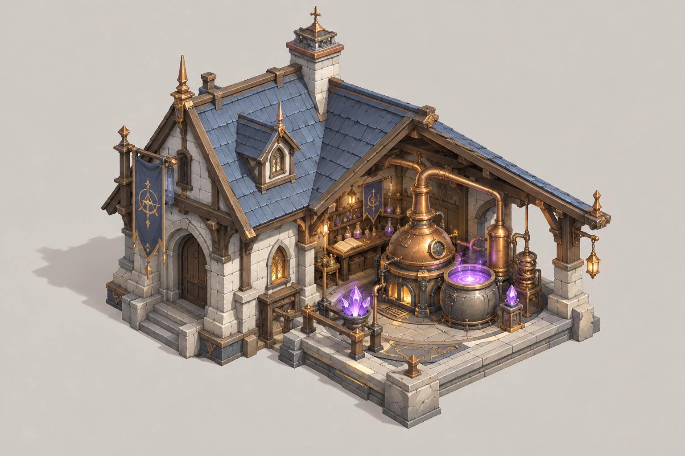
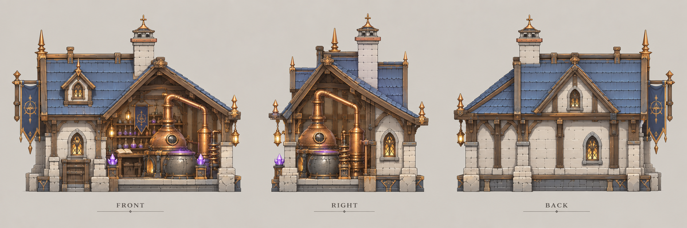

# 炼金坊

| 文档属性 | 内容 |
|---|---|
| 建筑编号 | BLD-042 |
| 建筑分类 | 经营建筑 |
| 版本 | v0.4 |
| 更新日期 | 2026-10-08 |
| 状态 | 魔法 2 本建筑、资源之间相互转换、每天有限额且每天刷新，已确定；名称暂定；汇率、限额与其余数值为设计提案；价格见成本体系主表；本轮优化为原型测试基线 |
| 规则依赖 | [SYS-TEC-001 · 科技系统](../../系统/科技系统.md) · [GDD-002 · 核心玩法循环](../../核心玩法循环.md) · [SYS-ECO-001 · 成本体系](../../系统/成本体系.md) |

[返回文档目录](../../../游戏设计文档.md)

> 2026-10-08 数值迭代：既有用户确认规则保留；本轮新增或改动参数、结算与边界规则是优化后的原型测试基线，未经真人试玩，不代表用户已逐项定稿。

## 1. 建筑定位

炼金坊是**魔法体系的 2 本经济建筑**（法师营地建成后解锁），主要功能是**把资源相互转换**（已确定）：金币、钢铁、魔晶之间可以互换。**每天有兑换限额，每天刷新**（已确定）。

它是玩家的**兜底与应急手段**：宝箱被拿完了、矿点被敌人占据或摧毁了、金币多到花不掉时，仍然可以通过炼金坊换成缺的资源。但汇率很差、每天限额，不能取代正常的产出方式。

**名称说明：**「炼金坊」为暂定名，取「点石成金」之意，符合魔法一侧的世界观，也比「市场」更有魔法感。备选：点金台、聚宝坊、魔晶交易所。

它也顺带解决了两个已知问题：金币在中后期难以消耗，以及魔晶只靠掉落和宝箱、来源不稳。

## 2. 属性表

| 属性 | 当前设定 | 状态 |
|---|---|---|
| 解锁条件 | 法师营地建成（魔法 2 本） | 已确定 |
| 主要功能 | 金币、钢铁、魔晶之间相互转换 | 已确定 |
| 兑换限额 | 每天有限额，每天刷新 | 已确定 |
| 最大生命值 | **300** | 设计提案 |
| 护甲 | **3** | 设计提案 |
| 占地 | **6 × 6 m** | 设计提案 |
| 视野 | **8 m** | 设计提案 |
| 建造时间 | **30 秒**（1 名开拓者） | 设计提案 |
| 成本 | **5000 金币 + 25 魔晶** | 原型测试基线；以成本体系主表为准 |
| 维持费 | **300** 金币 / 分钟 | 设计提案 |
| 能源占用 | **50** | 设计提案，见[能源体系](../../系统/能源体系.md) |
| 人口占用 | 不占用 | 设计提案 |
| 数量限制 | 每个基地 **1 座** | 设计提案，避免多座各自限额被叠加 |

## 3. 兑换规则

### 3.1 可兑换的资源（设计提案）

| 资源 | 是否可兑换 | 说明 |
|---|---|---|
| 金币 | 可以 | |
| 钢铁 | 可以 | |
| 魔晶 | 可以 | |
| 人口 | 不可以 | 由民居决定 |
| 能源 | 不可以 | 供给型资源，不能储存，无法兑换 |

### 3.2 汇率（设计提案）

汇率刻意设得比产出差很多，兑换只是应急：

| 兑换方向 | 汇率 |
|---|---|
| 金币 → 钢铁 | 240 金币 换 1 钢铁 |
| 钢铁 → 金币 | 1 钢铁 换 60 金币 |
| 金币 → 魔晶 | 800 金币 换 1 魔晶 |
| 魔晶 → 金币 | 1 魔晶 换 200 金币 |
| 钢铁 → 魔晶 | 8 钢铁 换 1 魔晶 |
| 魔晶 → 钢铁 | 1 魔晶 换 3 钢铁 |

**设计要点：**汇率保证**任何来回兑换都是亏的**，没有循环套利：例如金币 → 魔晶 → 金币，800 金币变 200 金币；金币 → 钢铁 → 魔晶，1920 金币才换 1 魔晶，而直接换只要 800。

**为什么这么差：**一个宝箱开出 30–60 魔晶，相当于 24000–48000 金币，宝箱和掉落依然是魔晶的主要来源，炼金坊只是补缺口。

### 3.3 每日限额（设计提案）

限额按**每天可以获得的资源数量**计算，全基地共用：

| 获得的资源 | 每天上限 |
|---|---|
| 钢铁 | **50** |
| 魔晶 | **15** |
| 金币 | **10000** |

| 规则 | 内容 |
|---|---|
| 「一天」 | 游戏内一次完整的昼夜循环，约 **10 分钟**（已确定，见[昼夜系统](../../系统/昼夜系统.md)） |
| 刷新时间 | 每天黎明刷新，当天没用完的限额**不累积** |
| 限额用完 | 当天不能再兑换获得该资源，界面上显示剩余额度与刷新倒计时 |
| 操作 | 玩家在建筑面板中选择兑换方向与数量，不会自动兑换 |

### 3.4 数量限制

每个基地限建 1 座，限额是全基地共用的，避免玩家靠多建炼金坊突破每日限额。

## 4. 强度检验

| 项目 | 结果 |
|---|---|
| 一天最多换到的魔晶 | 15，需要花 12000 金币；一个宝箱 30–60 魔晶，一天上限不到一个宝箱 |
| 攒够法师营地升 3 本所需魔晶（300） | 只靠炼金坊需要 20 天，即 200 分钟（3 个多小时），说明它无法取代宝箱与掉落 |
| 一天（10 分钟）最多换到的钢铁 | 50，相当于每分钟 5 钢铁，约为一座采矿场（每分钟 20，未计距离倍率）的 1/4 |
| 一天（10 分钟）最多换到的金币 | 10000，相当于每分钟 1000 金币，远低于中期净收入（第四轮样例约 1.4 万 / 分钟（20 分钟）至 2.7 万 / 分钟（50 分钟）） |
| 一天（10 分钟）最多换到的魔晶 | 15，相当于每分钟 1.5 魔晶，约等于击杀 5 只普通绿皮的掉落 |

**设计意图：**
- 魔晶和钢铁短缺时，炼金坊能让玩家花钱缓解，但不能靠它绕过探索、采矿的核心循环。
- 金币在后期难以消耗时，可以每天用炼金坊换一部分魔晶和钢铁，成为金币的一个出口，但出口有限，不足以解决所有通胀。
- 因为汇率差、限额少，玩家会把它用在真正卡关的时刻，比如升本差一点魔晶。

## 5. 强度检验（被攻击）

普通绿皮属性以设计提案为准：**20 攻击、1.5 秒攻击间隔、近战**。

| 项目 | 结果 |
|---|---|
| 绿皮每次对炼金坊的实际伤害 | 20 × 30 ÷ 33 ≈ 18.2 |
| 一只绿皮拆掉满血炼金坊 | 17 次命中，约 24 秒 |

被拆后当天的兑换限额（设计提案，第五轮 A#14，原型规则）：额度记在全局「当日已兑换量」上，不随建筑销毁或重建重置；重建后当天只能继续使用剩余额度，次日黎明照常刷新。

## 6. 待设计内容

| 项目 | 需确定内容 |
|---|---|
| 名称 | 是否采用「炼金坊」，或改用备选名 |
| 汇率与限额 | 数值是否合适，是否随本数或升级提高限额（日限额放宽仅为备选） |
| 被摧毁 | 已按第 5 节设计提案处理（额度记全局，不重置），待试玩验证 |
| 升级 | 是否可升级，提高每日限额或改善汇率 |
| 美术 | 概念图、俯视图、三视图，以炼金炉、魔晶罐为主要元素 |

## 7. 关联文档

[科技系统](../../系统/科技系统.md) · [法师营地](../军事建筑/法师营地.md) · [核心玩法循环](../../核心玩法循环.md) · [成本体系](../../系统/成本体系.md) · [采矿场](采矿场.md) · [能源体系](../../系统/能源体系.md)

## 8. 版本记录

| 版本 | 日期 | 变更 |
|---|---|---|
| v0.3 | 2026-10-08 | 补齐经济设施成本；炼钢收益按20钢铁基数重新验算；新内容为原型测试基线 |
| v0.1 | 2026-09-30 | 建立文档：魔法 2 本经济建筑，资源相互转换，每天有限额、每天刷新；暂定名炼金坊，汇率与限额为设计提案 |
| v0.2 | 2026-10-08 | 建筑编号由 BLD-020 改为 BLD-042（与火炮塔重复）；金币数量级整体 ×20（汇率与限额的金币一侧同比放大） |
| v0.4 | 2026-10-08 | 第五轮同步：状态栏删价格待定；采矿场产出改 20 钢铁/分钟、钢铁 50/天约 1/4 座；中期净收入改第四轮样例；被毁后当日额度记全局不重置（设计提案） |

<!-- art-20261005:start -->
## 美术设定图补充（2026-10-05）

本批补充概念稿和正面、侧面、背面三视图。用于造型与材质参考；建模时统一尺寸、结构和各视图细节。俯视图与动画另行制作。

### 炼金坊

[概念稿提示词](../../美术/主城/敌人与建筑设定图/炼金坊-概念图-v1-提示词.txt) · [三视图提示词](../../美术/主城/敌人与建筑设定图/炼金坊-三视图-v1-提示词.txt)

<!-- art-20261005:end -->
