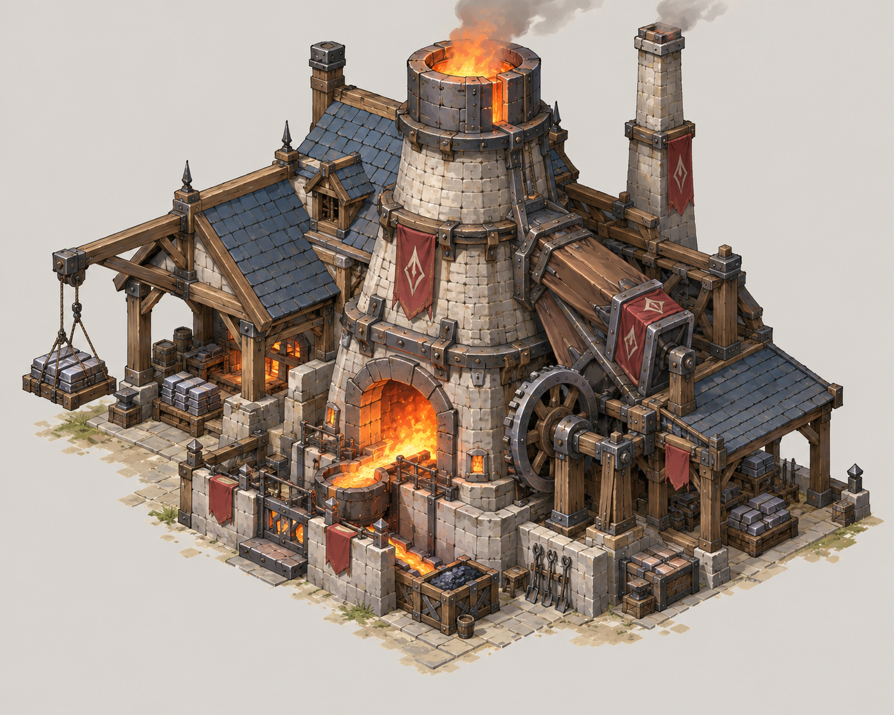
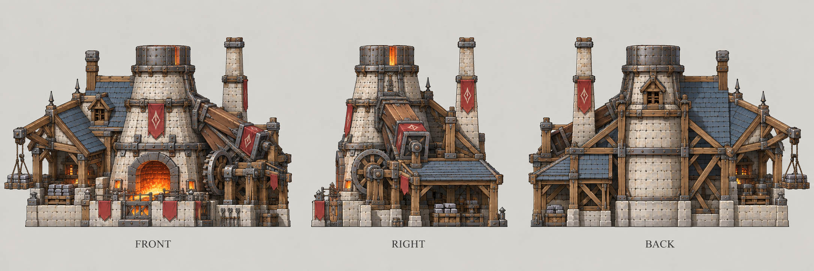

# 炼钢厂

| 文档属性 | 内容 |
|---|---|
| 建筑编号 | BLD-010 |
| 建筑分类 | 经营建筑 |
| 版本 | v0.7 |
| 更新日期 | 2026-10-08 |
| 状态 | 2 本建筑、建在采矿场附近、提升采矿场效率、加成可非线性叠加（第 1 座 +50%，每多一座收益递减）已确定；归属科技体系与全部数值为设计提案；价格见成本体系主表；本轮优化为原型测试基线 |
| 规则依赖 | [BLD-007 · 采矿场](采矿场.md) · [SYS-TEC-001 · 科技系统](../../系统/科技系统.md) · [SYS-ENG-001 · 能源体系](../../系统/能源体系.md) |

[返回文档目录](../../../游戏设计文档.md)

> 2026-10-08 数值迭代：既有用户确认规则保留；本轮新增或改动参数、结算与边界规则是优化后的原型测试基线，未经真人试玩，不代表用户已逐项定稿。

## 1. 建筑定位

炼钢厂是**2 本建筑**，建在[采矿场](采矿场.md)附近，**提升附近采矿场的钢铁产出效率**。它自己不产出钢铁，也不需要矿点，是对采矿场的加成建筑。

它承担了采矿场文档里一直待定的「采矿场能否升级提高产量」这个问题：产量不通过升级采矿场本身，而是通过在旁边建炼钢厂提高。

**归属（设计提案）：**科技体系，研究院建成（2 本）后解锁。钢铁是科技体系的升本资源，炼钢厂让走科技路线的玩家更快攒够钢铁。若想放在别的体系，需要调整。

## 2. 属性表

| 属性 | 当前设定 | 状态 |
|---|---|---|
| 解锁条件 | 研究院 2 本（建成） | 设计提案 |
| 建造位置 | 采矿场加成范围内；不需要矿点 | 已确定「采矿场附近」 |
| 加成范围 | 以炼钢厂为中心 **100 m**（原为 25 m，放大后一座炼钢厂可以同时覆盖同一片矿区里的几座采矿场） | 「放大范围」已确定；100 m 为设计提案 |
| 加成效果 | 范围内采矿场钢铁产出 **+50%**（每分钟 20 → 30） | 设计提案 |
| 叠加 | **可以叠加，非线性**（已确定）。第 1 座 +50%，之后每多一座，该座加成为前一座的 75%（少 25%） | 叠加已确定；递减比例的理解为设计提案 |
| 最大生命值 | **400** | 设计提案 |
| 护甲 | **3** | 设计提案 |
| 攻击 | 无 | 已确定 |
| 占地 | **6 × 6 m**，与采矿场相同 | 设计提案 |
| 视野 | **8 m** | 设计提案，与采矿场相同 |
| 建造时间 | **30 秒**（1 名开拓者） | 设计提案 |
| 成本 | **7000 金币 + 40 钢铁** | 原型测试基线；以成本体系主表为准 |
| 维持费 | **200** 金币 / 分钟 | 设计提案，有工人干活 |
| 能源占用 | **100** | 设计提案，需要持续用电，见[能源体系](../../系统/能源体系.md) |
| 人口占用 | 不占用 | 设计提案 |

## 3. 加成规则（设计提案）

### 3.1 加成对象与效果

- 加成只对**采矿场**生效，不影响其他资源建筑。
- 加成体现在钢铁产出速度上：一座加成中的采矿场每分钟产出 30 钢铁。
- 矿不会枯竭，加成只体现在**产出速度**上，没有储量的概念。

### 3.2 叠加规则

同一座采矿场处在多座炼钢厂的范围内时，加成叠加，但**收益逐座递减**（已确定）：

- 第 1 座提供 **+50%**。
- 之后每多一座，该座提供的加成是**前一座的 75%**，即比前一座少 25%（递减比例的具体理解为设计提案）：+50%、+37.5%、+28.1%、+21.1%……

**总加成 = 200% × (1 − 0.75^座数)。**

| 范围内炼钢厂数量 | 本座新增加成 | 总加成 | 钢铁/分钟（基础20） | 本座新增产出 |
|---|---|---|---|---|
| 0 | +0.000% | +0.000% | 20.000 | +0.000 |
| 1 | +50.000% | +50.000% | 30.000 | +10.000 |
| 2 | +37.500% | +87.500% | 37.500 | +7.500 |
| 3 | +28.125% | +115.625% | 43.125 | +5.625 |
| 4 | +21.094% | +136.719% | 47.344 | +4.219 |
| 5 | +15.820% | +152.539% | 50.508 | +3.164 |
| 10 | +3.754% | +188.737% | 57.747 | +0.751 |
| 无穷 | 趋近0 | 趋近+200% | 趋近60 | 趋近0 |

每座依然有效，边际收益递减；按各矿单独数100m内的炼钢厂。距离倍率再相乘，不能把远矿收益加法堆入。

### 3.3 能源不足时

炼钢厂占用能源。能源不足时，已建成的炼钢厂**加成照常**，只是不能再建新的炼钢厂（见[能源体系](../../系统/能源体系.md)）。炼钢厂被摧毁则加成立即消失，采矿场本身不受影响，恢复到基础产出。

### 3.4 布局影响

- 采矿场通常在防线外，炼钢厂需要建在它的附近，也就意味着炼钢厂同样处在防线外，需要被保护。
- 一座炼钢厂可以同时加成范围内的多座采矿场，鼓励把矿场集中在一片区域，配合[哨塔](../军事建筑/哨塔.md)和箭塔守卫，形成一个矿区据点。
- 矿点不会枯竭，炼钢厂一旦建好，就会一直加成范围内的采矿场。

## 4. 强度检验

普通绿皮属性以设计提案为准：**200 生命、20 攻击、1.5 秒攻击间隔、无护甲、近战**。

| 项目 | 结果 |
|---|---|
| 绿皮每次对炼钢厂的实际伤害 | 20 × 30 ÷ 33 ≈ 18.2 |
| 一只绿皮拆掉满血炼钢厂 | 22 次命中，约 33 秒 |
| 对比 | 采矿场约 25 秒，箭塔约 25 秒 |

炼钢厂比采矿场略耐拆，但没有攻击能力，放在矿区没人保护时，仍会被少量绿皮拆掉。

## 5. 收益估算

按「第 1 座 +50%，之后每座为前一座的 75%」估算：

| 场景 | 钢铁/分钟 | 本座新增 |
|---|---|---|
| 1矿 + 0厂 | 20.000 | 0.000 |
| 1矿 + 1厂 | 30.000 | 10.000 |
| 1矿 + 2厂 | 37.500 | 7.500 |
| 2矿 + 1厂 | 60.000 | 20.000 |
| 2矿 + 2厂 | 75.000 | 15.000 |
| 3矿 + 1厂 | 90.000 | 30.000 |
| 3矿 + 2厂 | 112.500 | 22.500 |
| 3矿 + 3厂 | 129.375 | 16.875 |

首厂与新增矿点是不同选择：双矿首厂额外20/分；三矿第2/3厂额外22.5/16.875，不把原表10.3错误继续放大。7000金币+40钢铁、100能源及外围保护须一起计账。

## 6. 待设计内容

| 项目 | 需确定内容 |
|---|---|
| 归属 | 确认属于科技体系，还是基础阶段或其他 |
| 数值 | 加成幅度（+50%）、叠加曲线（第 1 座 +50%，之后每座为前一座的 75%，隐含上限 +200%）、是否限制一座采矿场受影响的炼钢厂数量、范围（100 m）是否合适 |
| 矿点 | 矿点之间的距离，会影响一座炼钢厂能覆盖几座采矿场 |
| 升级 | 是否有更高等级的炼钢厂，提供更大加成 |
| 美术 | 概念图、俯视图、三视图，烟囱与炉火在夜间要清晰可辨 |

## 7. 关联文档

[采矿场](采矿场.md) · [科技系统](../../系统/科技系统.md) · [能源体系](../../系统/能源体系.md) · [成本体系](../../系统/成本体系.md) · [哨塔](../军事建筑/哨塔.md) · [核心玩法循环](../../核心玩法循环.md)

## 8. 版本记录

| 版本 | 日期 | 变更 |
|---|---|---|
| v0.6 | 2026-10-08 | 补齐经济设施成本；炼钢收益按20钢铁基数重新验算；新内容为原型测试基线 |
| v0.1 | 2026-09-29 | 建立文档：2 本建筑，建在采矿场附近，提升采矿场钢铁产出；归属科技体系及全部数值为设计提案 |
| v0.2 | 2026-09-29 | 确定加成可以叠加且为非线性：第 1 座 +50%，之后每多一座该座加成为前一座的 80%，总加成趋近 +250% |
| v0.3 | 2026-09-29 | 递减改为每座为前一座的 75%（收益 −25%），总加成趋近 +200% |
| v0.4 | 2026-09-30 | 加成范围由 25 m 放大到 100 m，适配 2048 m 世界里的矿点间距；取消储量与枯竭的说法 |
| v0.5 | 2026-10-08 | 金币数量级整体 ×20（价格、收入、维持费同比放大，平衡不变），方便商店按秒跳金币数字 |
| v0.7 | 2026-10-08 | 第五轮同步：状态栏删价格待定（7000 金币 + 40 钢铁已与主表一致）；删过期价格待设计行 |

## 美术图稿（2026-10-01 补充）

[概念图提示词](../../美术/主城/敌人与建筑设定图/炼钢厂-概念图-v1-提示词.txt) · [三视图提示词](../../美术/主城/敌人与建筑设定图/炼钢厂-三视图-v1-提示词.txt) · [图稿索引](../../美术/主城/敌人与建筑设定图/设定图索引.md)

沿用现有概念造型，三视图为美术参考；不可见部位为推定补全，建模前需统一尺寸与结构。
