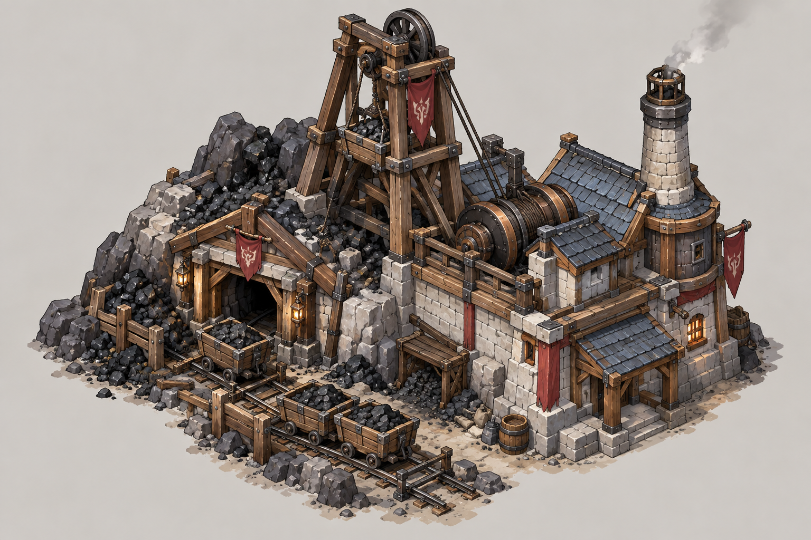
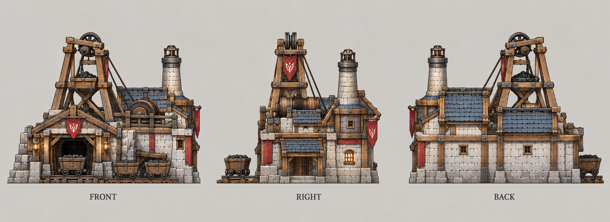

# 煤矿

| 文档属性 | 内容 |
|---|---|
| 建筑编号 | BLD-043 |
| 建筑分类 | 经营建筑 |
| 版本 | v0.2 |
| 更新日期 | 2026-10-08 |
| 状态 | 开局可建、建在煤矿点、产出 +300 能源、矿不会枯竭、出生点 200 m 内保证有一个煤矿点，已确定；生命值、护甲、占地、价格、维持费为设计提案；本轮优化为原型测试基线 |
| 规则依赖 | [SYS-ENG-001 · 能源体系](../../系统/能源体系.md) · [SYS-MAP-001 · 地图与资源点](../../系统/地图与资源点.md) |

[返回文档目录](../../../游戏设计文档.md)

> 2026-10-08 数值迭代：既有用户确认规则保留；本轮新增或改动参数、结算与边界规则是优化后的原型测试基线，未经真人试玩，不代表用户已逐项定稿。

## 1. 建筑定位

煤矿是**最早期的能源**，开局就能建，只能建在煤矿点上。出生点 200 m 内保证有一个煤矿点，矿不会枯竭。

它和[采矿场](采矿场.md)一样，通常在防线以外，需要哨塔和箭塔照看。早期能源主要用来点亮哨塔的塔灯，中期支撑研究院、法师营地升本。

## 2. 属性表

| 属性 | 当前设定 | 状态 |
|---|---|---|
| 解锁条件 | 开局可建 | 已确定 |
| 建造位置 | 只能建在**煤矿点**上，一个矿点一座 | 已确定 |
| 能源产出 | **+300**，乘以矿点的距离倍率（最高 ×1.5） | 已确定，见[地图与资源点](../../系统/地图与资源点.md) |
| 储量 | 矿不会枯竭 | 已确定 |
| 标签 | [〔资源建筑〕](../../系统/标签.md#资源建筑) [〔能源建筑〕](../../系统/标签.md#能源建筑) | 设计提案 |
| 最大生命值 | **300** | 设计提案，与采矿场相同 |
| 护甲 | **3** | 设计提案 |
| 攻击 | 无 | 设计提案 |
| 占地 | **6 × 6 m** | 设计提案 |
| 视野 | **8 m** | 设计提案 |
| 建造时间 | **30 秒**（1 名开拓者） | 设计提案 |
| 成本 | **3000 金币** | 设计提案（金币已按 ×20 数量级），待写入[成本体系](../../系统/成本体系.md)；与采矿场相同 |
| 维持费 | **100** 金币 / 分钟 | 设计提案，有矿工干活，与采矿场相同 |
| 人口占用 | 不占用 | 设计提案 |

## 3. 发电

能源规则见[能源体系](../../系统/能源体系.md)，这里只列要点：

- 能源是供给型资源：**剩余能源 = 总产出 − 总占用**，不能储存，也不会被花掉。
- 全局通用，不设供电范围。
- 发电建筑被拆时，已建成的建筑效果不变，只是不能再建新的耗能建筑、不能升本。

| 能源去向（提案） | 占用 | 一座煤矿够几个 |
|---|---|---|
| 哨塔塔灯 | 20 / 座 | 15 座 |
| 法师营地或研究院 2 本 | 200 | 1 座，剩 100 |
| 两个体系都 3 本 | 800 | 约 3 座煤矿 |

## 4. 强度检验

普通绿皮属性以设计提案为准：**200 生命、20 攻击、1.5 秒攻击间隔、无护甲、近战**。

| 项目 | 结果 |
|---|---|
| 绿皮每次对煤矿的实际伤害 | 20 × 30 ÷ 33 ≈ 18.2 |
| 一只绿皮拆掉满血煤矿 | 17 次命中，约 25.5 秒 |

和采矿场一样约 25 秒被一只绿皮拆掉。被拆不会让防线瘫痪（已建成的照常工作），但会卡住升本和新的耗能建筑。

## 5. 待设计内容

| 项目 | 需确定内容 |
|---|---|
| 数值 | 价格与维持费是否和采矿场一样 |
| 噪音 | 是否算工业建筑、影响附近民居（暂不算） |

## 6. 关联文档

[能源体系](../../系统/能源体系.md) · [地图与资源点](../../系统/地图与资源点.md) · [科技系统](../../系统/科技系统.md) · [成本体系](../../系统/成本体系.md) · [标签](../../系统/标签.md) · [采矿场](采矿场.md) · [油井](油井.md) · [哨塔](../军事建筑/哨塔.md)

## 7. 版本记录

| 版本 | 日期 | 变更 |
|---|---|---|
| v0.2 | 2026-10-08 | 同步成本唯一来源、人口边界及本轮经济结算；美术图稿保留；新内容为原型测试基线 |
| v0.1 | 2026-10-08 | 建立文档：整理能源体系里已确定的煤矿规则（开局可建、+300、不枯竭、出生点保底），补生命值 300、护甲 3、占地 6 × 6 m、3000 金币、维持费 100 / 分钟等提案 |

## 美术图稿

[概念图提示词](../../美术/主城/敌人与建筑设定图/煤矿-概念图-v1-提示词.txt) · [三视图提示词](../../美术/主城/敌人与建筑设定图/煤矿-三视图-v1-提示词.txt) · [图稿索引](../../美术/主城/敌人与建筑设定图/设定图索引.md)
