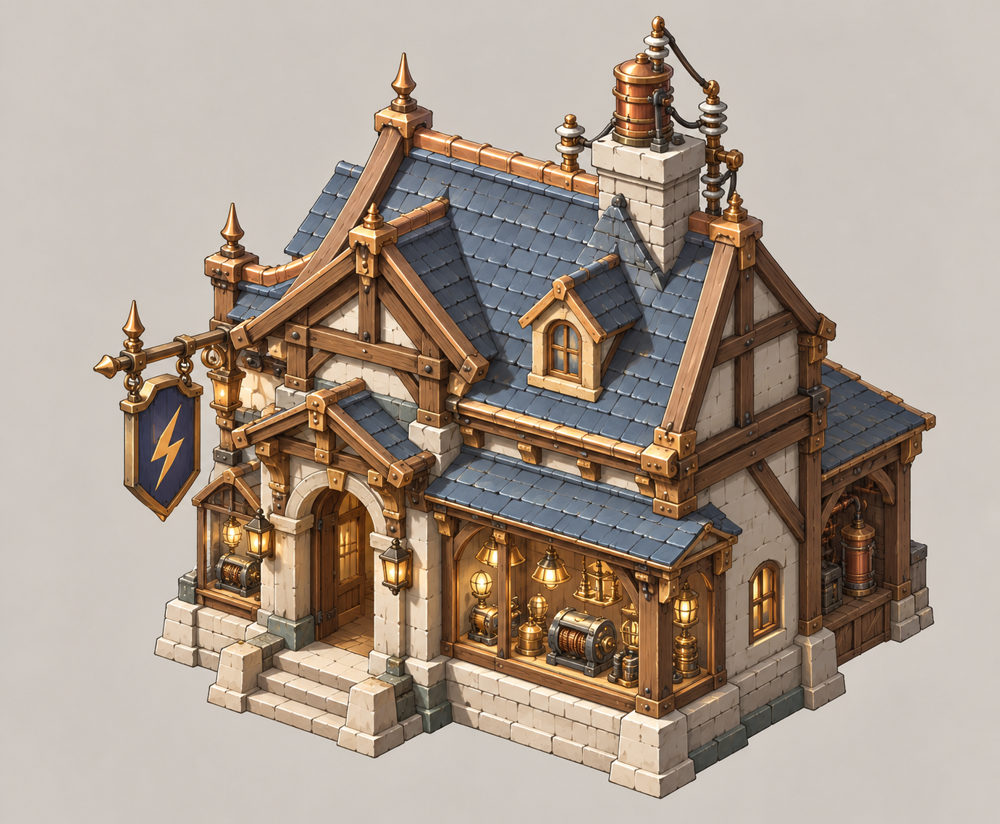
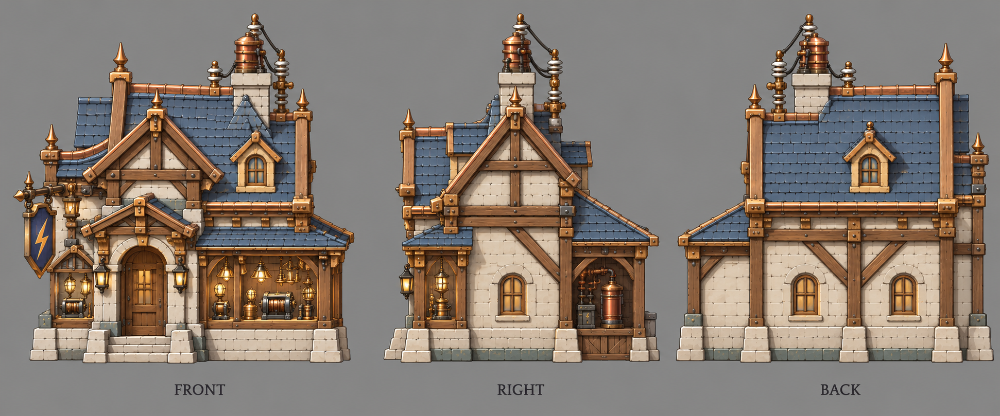

# 电器行

| 文档属性 | 内容 |
|---|---|
| 建筑编号 | BLD-038 |
| 建筑分类 | 经营建筑 |
| 版本 | v0.2 |
| 更新日期 | 2026-10-08 |
| 状态 | 城镇等级 5 解锁、后期高收入店、单价高、占用能源、附近哨塔视野变大、塔灯省能源，沿用城镇经营；客单、范围、能源、价格与全部数值为设计提案；本轮优化为原型测试基线 |
| 规则依赖 | [SYS-TWN-001 · 城镇经营](../../系统/城镇经营.md) · [SYS-TAG-001 · 标签](../../系统/标签.md) · [SYS-ENG-001 · 能源体系](../../系统/能源体系.md) |

[返回文档目录](../../../游戏设计文档.md)

> 2026-10-08 数值迭代：既有用户确认规则保留；本轮新增或改动参数、结算与边界规则是优化后的原型测试基线，未经真人试玩，不代表用户已逐项定稿。

## 1. 建筑定位

电器行是主角带来的科技店，**后期高收入**：单价高，但要占用能源。

附加作用：附近[哨塔](../军事建筑/哨塔.md)**视野变大**，塔灯**更省能源**。电器行卖灯泡和电线，顺手给附近的哨塔换上更亮、更省电的灯。

## 2. 属性表

| 属性 | 当前设定 | 状态 |
|---|---|---|
| 解锁条件 | 城镇等级 5 | 城镇等级解锁已确定，等级数为设计提案 |
| 标签 | [〔商店〕](../../系统/标签.md#商店) [〔高耗能〕](../../系统/标签.md#高耗能) [〔科技体系〕](../../系统/标签.md#科技体系) | 设计提案，见[标签](../../系统/标签.md) |
| 客单 | **20 金** / 人 / 分钟 | 设计提案 |
| 服务范围 | 居民家 **15 m** 内 | 设计提案，沿用城镇经营 |
| 最大生命值 | **250** | 设计提案 |
| 护甲 | **2** | 设计提案 |
| 攻击 | 无 | 已确定 |
| 占地 | **3 × 3 m** | 设计提案，沿用城镇经营 |
| 视野 | **8 m** | 设计提案 |
| 建造时间 | **30 秒**（1 名开拓者） | 设计提案 |
| 成本 | **8000 金币 + 60 钢铁**（每多一座 +400 金币） | 设计提案，待写入[成本体系](../../系统/成本体系.md) |
| 维持费 | 无 | 设计提案，沿用城镇经营「商店不收维持费」 |
| 能源占用 | **50** | 设计提案，见[能源体系](../../系统/能源体系.md) |
| 人口占用 | 不占用 | 沿用城镇经营 |

## 3. 生意

通用规则见[城镇经营 5.1](../../系统/城镇经营.md)，这里只列要点：

- 生意来自服务范围内住宅的**空闲已入住居民**，与税收共用同一人口记录；招募中的已预留人口和在役人员不当顾客。每居民消费池普通40、雕像范围内50，凯旋60秒池与客单同时×2；再受税收与商业共享的+100%上限约束。各店读取居民最终动态上限，按客单比例分账，同种店重叠再平分。完整公式以[城镇经营 5.1](../../系统/城镇经营.md#51-通用规则只用一套消费池公式)为准。
- 同种店服务范围重叠时，平分重叠处的顾客。
- 商店收入计入[城市形成](../../系统/城市形成.md)的总加成上限（+100%）。
- 玩家只看店铺星级（★1–★3）和建造预览里的「单店生意 / 全城净增加」。
- 不占人口；同种店每多建一座，下一座价格 +400 金币（设计提案）。
- 每开一种城里还没有的店，繁荣度 +8（按种类计，不按座数）。
- 账本按实际结算累积后显示金币飘字；无收入不显示。显示取整不能反向改变收入，低于1金币的尾数累积到下次。同屏频率限制仍依城镇经营。

按客单 20 金估算：

| 附近居民 | 每分钟生意 |
|---|---|
| 30 人 | 600 金 |
| 60 人 | 1200 金 |
| 100 人 | 2000 金 |

客单是普通小店的 1.7 倍，和两种小店一起开就接近 40 金上限，适合开在已经有面包房、杂货铺的老街区，挤占它们的份额。

## 4. 附加作用：哨塔换新灯

| 规则 | 内容 | 状态 |
|---|---|---|
| 范围 | 电器行 15 m 内的哨塔 | 设计提案 |
| 视野 | 白天视野 **+20%**（20 m → 24 m）；夜里的视野和塔灯照明半径同样 +20% | 设计提案 |
| 能源 | 塔灯占用从 20 降到 **10** | 设计提案 |
| 叠加 | 多座电器行**不叠加** | 沿用城镇经营 |

一座电器行本身占 50 能源，要覆盖 5 座以上哨塔才能把能源省回来，所以它主要是靠生意赚钱，哨塔是顺带的。

## 5. 强度检验

普通绿皮属性以设计提案为准：**200 生命、20 攻击、1.5 秒攻击间隔、无护甲、近战**。

| 项目 | 结果 |
|---|---|
| 绿皮每次对电器行的实际伤害 | 20 × 30 ÷ 32 ≈ 18.8 |
| 一只绿皮拆掉满血电器行 | 14 次命中，约 21 秒 |

电器行是高价店，被拆损失大；它照顾的哨塔又多在外围，摆放时要在「靠近哨塔」和「躲在内圈」之间取舍。

## 6. 待设计内容

| 项目 | 需确定内容 |
|---|---|
| 数值 | 客单 20 金、能源 50 |
| 哨塔 | +20% 是否和哨塔的隐形升级冲突 |
| 美术 | 概念图、三视图已补充（见文末）；后续补俯视图及橱窗里的电器 |

## 7. 关联文档

[城镇经营](../../系统/城镇经营.md) · [标签](../../系统/标签.md) · [民居](民居.md) · [城市形成](../../系统/城市形成.md) · [成本体系](../../系统/成本体系.md) · [哨塔](../军事建筑/哨塔.md) · [能源体系](../../系统/能源体系.md) · [百货公司](百货公司.md)

## 8. 版本记录

| 版本 | 日期 | 变更 |
|---|---|---|
| v0.2 | 2026-10-08 | 统一动态消费池、空闲顾客、净收益预览与实际到账；相关经营装备/旅馆/百货边界同步；新内容为原型测试基线 |
| v0.1 | 2026-10-08 | 建立文档：城镇等级 5 商店，客单 20 金，占 50 能源；15 m 内哨塔视野 +20%、塔灯能源 20 → 10 |

<!-- shop-art-20261008:start -->
## 美术图稿补充（2026-10-08）

本批概念稿与三视图为造型提案；三视图按正面、侧面、背面组织，用于建模参考。建模时校准尺寸、结构与遮挡关系，俯视图另行补充。特效、角色活动和环境装饰不属于建筑模型。

[概念图提示词](../../美术/主城/敌人与建筑设定图/电器行-概念图-v1-提示词.txt) · [三视图提示词](../../美术/主城/敌人与建筑设定图/电器行-三视图-v1-提示词.txt)

<!-- shop-art-20261008:end -->
