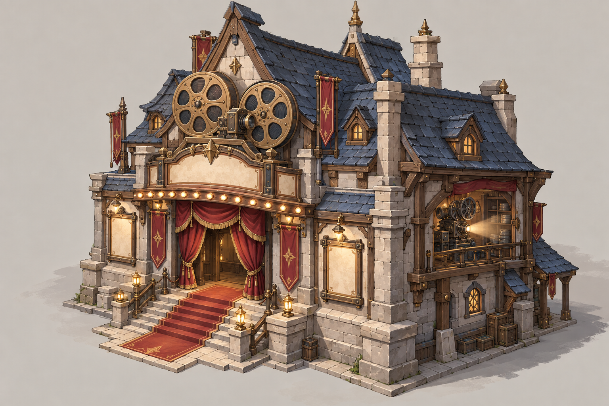
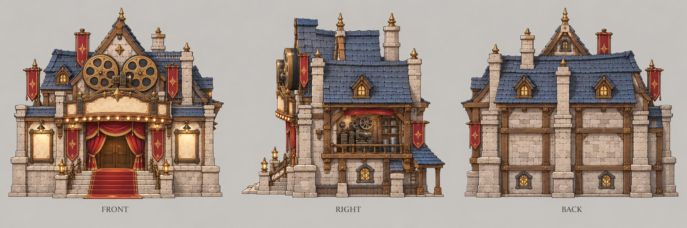

# 电影院

| 文档属性 | 内容 |
|---|---|
| 建筑编号 | BLD-011 |
| 建筑分类 | 经营建筑 |
| 版本 | v0.6 |
| 更新日期 | 2026-10-08 |
| 状态 | 由城镇等级解锁（2026-10-07，原为 2 本建筑）、增加附近民居金币收入 +30%（电影院之间不叠加，与市政厅可叠加），已确定；范围与全部数值为设计提案；价格见成本体系主表；本轮优化为原型测试基线 |
| 规则依赖 | [BLD-006 · 民居](民居.md) · [SYS-TEC-001 · 科技系统](../../系统/科技系统.md) · [SYS-ENG-001 · 能源体系](../../系统/能源体系.md) |

[返回文档目录](../../../游戏设计文档.md)

> 2026-10-08 数值迭代：既有用户确认规则保留；本轮新增或改动参数、结算与边界规则是优化后的原型测试基线，未经真人试玩，不代表用户已逐项定稿。

## 1. 建筑定位

电影院是**经济建筑**（城镇等级 3 解锁），让附近的[民居](民居.md)产出更多金币：**范围内民居的金币收入 +30%，不叠加。**

它是主角带来的科技娱乐设施，让居民更愿意工作和消费。它不产出金币，只放大民居的产出，因此摆放位置很重要：要放在民居最密集的地方。

**解锁（已确定）：**由城镇等级解锁（暂定城镇等级 3），不再挂在研究院下，见[城镇经营](../../系统/城镇经营.md)。提供繁荣度 +10（设计提案）。

## 2. 属性表

| 属性 | 当前设定 | 状态 |
|---|---|---|
| 解锁条件 | 城镇等级 3 | 由城镇等级解锁已确定，等级数为设计提案 |
| 加成效果 | 范围内民居金币收入 **+30%** | 已确定 |
| 叠加 | 多座电影院**不叠加**；与[市政厅](市政厅.md)**可以叠加** | 已确定 |
| 加成范围 | 以电影院为中心 **30 m** | 设计提案；比[市政厅](市政厅.md)大 |
| 最大生命值 | **300** | 设计提案 |
| 护甲 | **3** | 设计提案 |
| 攻击 | 无 | 已确定 |
| 占地 | **8 × 8 m** | 设计提案，与兵营相同 |
| 视野 | **8 m** | 设计提案 |
| 建造时间 | **30 秒**（1 名开拓者） | 设计提案 |
| 成本 | **8000 金币** | 原型测试基线；以成本体系主表为准 |
| 维持费 | **300** 金币 / 分钟 | 设计提案，有工作人员 |
| 能源占用 | **100** | 设计提案，见[能源体系](../../系统/能源体系.md) |
| 人口占用 | 不占用 | 设计提案 |

## 3. 加成规则

### 3.1 加成对象（设计提案）

- 加成对象是**民居**（木屋、瓦房、公寓），以民居的位置是否在范围内判断。
- 加成的是民居**实际产出的金币**：被开拓者、士兵占用的人口本来就不产金币，不因加成而多出。
- [主城](主城设计.md)虽然提供 10 名人口，但它不是民居，暂不受加成（待定）。

### 3.2 不叠加（已确定）

- 范围内有多座电影院时，民居只享受一次 +30%。
- 与[市政厅](市政厅.md)同时覆盖时，两者**可以叠加**（已确定）：+30% 与 +45% 相加为 **+75%**，加法相加（相加还是相乘为设计提案）。

结果：**同一片区域建一座电影院就够了**，想覆盖更大的区域，需要把电影院分散摆放，各自负责一片。市政厅覆盖的核心区域，仍然值得再叠一座电影院。

### 3.3 夜间营业标签（设计提案，原型规则，第五轮 J8）

〔夜间营业〕标签扩展到电影院（与[标签](../../系统/标签.md)同步）后，电影院可参与夜市灯火类加成（Lv2 经济池，不换卡），使首切片有酒馆与电影院两个夜间营业对象；该扩展未经试玩，需重跑六池枚举。电影院本身仍只加民居收入，不改上述已确定的 +30% 与叠加规则。

## 4. 收益估算

按每座木屋住满 10 人、每人每分钟 180 金币计算：

| 范围内民居 | 原金币 / 分钟 | +30% 后 | 多出 |
|---|---|---|---|
| 5 座木屋 | 9000 | 11700 | +2700 |
| 10 座木屋 | 18000 | 23400 | +5400 |
| 5 座瓦房 | 18000 | 23400 | +5400 |
| 10 座木屋，同时被市政厅覆盖（+75%） | 18000 | 31500 | +13500 |

**平衡提示：**这是一个直接放大金币的建筑。后期金币本来就容易通胀（见[核心玩法循环](../../核心玩法循环.md)），电影院的价格、能源占用和维持费需要压得足够高，否则会加重这个问题。民居价格随数量递增（每座 +300）也有助于抵消。

## 5. 强度检验

普通绿皮属性以设计提案为准：**200 生命、20 攻击、1.5 秒攻击间隔、无护甲、近战**。

| 项目 | 结果 |
|---|---|
| 绿皮每次对电影院的实际伤害 | 20 × 30 ÷ 33 ≈ 18.2 |
| 一只绿皮拆掉满血电影院 | 17 次命中，约 25 秒 |

电影院一旦被拆，范围内民居的收入立即下降，因此它应该放在防线内部的核心位置，受箭塔和城墙保护。

## 6. 待设计内容

| 项目 | 需确定内容 |
|---|---|
| 归属 | 确认属于科技体系，还是其他 |
| 数值 | 加成范围（30 m）、生命值、能源占用是否合适 |
| 主城 | 主城的 10 名人口是否受加成 |
| 美术 | 概念图、俯视图、三视图 |

## 7. 关联文档

[市政厅](市政厅.md) · [民居](民居.md) · [科技系统](../../系统/科技系统.md) · [能源体系](../../系统/能源体系.md) · [成本体系](../../系统/成本体系.md) · [核心玩法循环](../../核心玩法循环.md)

## 8. 版本记录

| 版本 | 日期 | 变更 |
|---|---|---|
| v0.5 | 2026-10-08 | 补齐经济设施成本；炼钢收益按20钢铁基数重新验算；新内容为原型测试基线 |
| v0.1 | 2026-09-29 | 建立文档：2 本建筑，范围内民居金币收入 +30%，不叠加；归属科技体系及全部数值为设计提案 |
| v0.2 | 2026-09-29 | 确定电影院与市政厅同时覆盖时可以叠加（+75%），电影院之间仍不叠加 |
| v0.3 | 2026-10-07 | 改由城镇等级解锁（暂定 3 级），不再属于研究院 2 本；电影院只加民居收入，不加商店收入 |
| v0.4 | 2026-10-08 | 金币数量级整体 ×20（价格、收入、维持费同比放大，平衡不变），方便商店按秒跳金币数字 |
| v0.6 | 2026-10-08 | 第五轮同步：状态栏删价格待定；删过期价格待设计行；注明〔夜间营业〕扩到电影院后参与夜市灯火类加成（设计提案） |

## 美术图稿（2026-10-01 补充）

[概念图提示词](../../美术/主城/敌人与建筑设定图/电影院-概念图-v1-提示词.txt) · [三视图提示词](../../美术/主城/敌人与建筑设定图/电影院-三视图-v1-提示词.txt) · [图稿索引](../../美术/主城/敌人与建筑设定图/设定图索引.md)

沿用现有概念造型，三视图为美术参考；不可见部位为推定补全，建模前需统一尺寸与结构。
