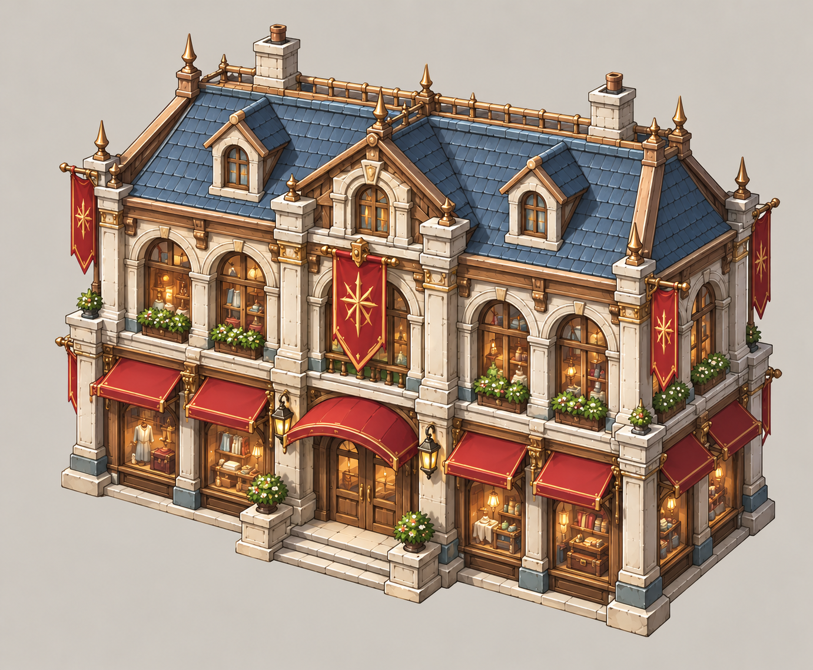
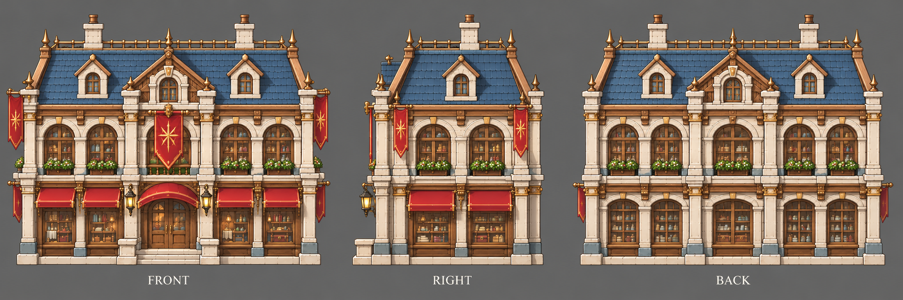

# 百货公司

| 文档属性 | 内容 |
|---|---|
| 建筑编号 | BLD-039 |
| 建筑分类 | 经营建筑 |
| 版本 | v0.3 |
| 更新日期 | 2026-10-08 |
| 状态 | 城镇等级 6 解锁、大店、每基地限 1 座、周围商店都升一星，沿用城镇经营；升一星的含义、范围、客单、能源、价格与全部数值为设计提案；本轮优化为原型测试基线 |
| 规则依赖 | [SYS-TWN-001 · 城镇经营](../../系统/城镇经营.md) · [SYS-TAG-001 · 标签](../../系统/标签.md) · [SYS-ENG-001 · 能源体系](../../系统/能源体系.md) |

[返回文档目录](../../../游戏设计文档.md)

> 2026-10-08 数值迭代：既有用户确认规则保留；本轮新增或改动参数、结算与边界规则是优化后的原型测试基线，未经真人试玩，不代表用户已逐项定稿。

## 1. 建筑定位

百货公司是**一座带动一条街**的大店，每个基地只能建 1 座。

附加作用：**周围商店客单×1.25**；星级依实际营业额变化，不能在消费饱和时凭空显示升星。它是商业区的收官建筑，适合放在已经成型的商店街正中。

## 2. 属性表

| 属性 | 当前设定 | 状态 |
|---|---|---|
| 解锁条件 | 城镇等级 6 | 城镇等级解锁已确定，等级数为设计提案 |
| 标签 | [〔商店〕](../../系统/标签.md#商店) [〔带动街区〕](../../系统/标签.md#带动街区) [〔高耗能〕](../../系统/标签.md#高耗能) | 设计提案，见[标签](../../系统/标签.md) |
| 客单 | **24 金** / 人 / 分钟 | 设计提案 |
| 服务范围 | 居民家 **25 m** 内 | 设计提案，沿用城镇经营 |
| 数量限制 | 每个基地 **1 座** | 沿用城镇经营 |
| 最大生命值 | **600** | 设计提案 |
| 护甲 | **3** | 设计提案 |
| 攻击 | 无 | 已确定 |
| 占地 | **6 × 6 m** | 设计提案 |
| 视野 | **8 m** | 设计提案 |
| 建造时间 | **45 秒**（1 名开拓者） | 设计提案 |
| 成本 | **16000 金币 + 150 钢铁** | 设计提案；价格已与[成本体系](../../系统/成本体系.md)主表一致 |
| 维持费 | 无 | 设计提案，沿用城镇经营「商店不收维持费」 |
| 能源占用 | **100** | 设计提案，见[能源体系](../../系统/能源体系.md) |
| 人口占用 | 不占用 | 沿用城镇经营 |

## 3. 生意

通用规则见[城镇经营 5.1](../../系统/城镇经营.md)，这里只列要点：

- 生意来自服务范围内住宅的**空闲已入住居民**，与税收共用同一人口记录；招募中的已预留人口和在役人员不当顾客。每居民消费池普通40、雕像范围内50，凯旋60秒池与客单同时×2；再受税收与商业共享的+100%上限约束。各店读取居民最终动态上限，按客单比例分账，同种店重叠再平分。完整公式以[城镇经营 5.1](../../系统/城镇经营.md#51-通用规则只用一套消费池公式)为准。
- 同种店服务范围重叠时，平分重叠处的顾客。
- 商店收入计入[城市形成](../../系统/城市形成.md)的总加成上限（+100%）。
- 玩家只看店铺星级（★1–★3）和建造预览里的「单店生意 / 全城净增加」。
- 不占人口；每基地限 1 座，所以没有递增价。
- 每开一种城里还没有的店，繁荣度 +8（按种类计，不按座数）。
- 账本按实际结算累积后显示金币飘字；无收入不显示。显示取整不能反向改变收入，低于1金币的尾数累积到下次。同屏频率限制仍依城镇经营。

百货公司的服务范围是 **25 m**（普通店 15 m），覆盖面积约是普通店的 2.8 倍。

| 附近居民 | 每分钟生意 |
|---|---|
| 60 人 | 1440 金 |
| 120 人 | 2880 金 |
| 200 人 | 4800 金 |

## 4. 附加作用：带动周围商店

| 规则 | 内容 | 状态 |
|---|---|---|
| 范围 | 百货公司 **20 m** 内的其他商店 | 设计提案 |
| 效果 | 客单 **×1.25**；星级只由实际营业额决定 | 设计提案；不额外发放虚假星级 |
| 上限 | 居民最终消费池与共享收益上限不因百货改变，所以只在附近店的客单合计还没到上限时，多出来的才是真赚 | 设计提案 |
| 叠加 | 和集市的服务范围加成可以同时生效 | 设计提案 |

**平衡提示：**百货公司本身客单就高，加上周围店 ×1.25，一片街区很容易顶到 40 金上限。上限是故意留的：它让百货公司最赚钱的用法是放在居民多、店还不够密的地方，而不是挤进已经饱和的老街。

## 5. 强度检验

普通绿皮属性以设计提案为准：**200 生命、20 攻击、1.5 秒攻击间隔、无护甲、近战**。

| 项目 | 结果 |
|---|---|
| 绿皮每次对百货公司的实际伤害 | 20 × 30 ÷ 33 ≈ 18.2 |
| 一只绿皮拆掉满血百货公司 | 33 次命中，约 49.5 秒 |

百货公司是全城最贵的店，一座被拆，周围一圈店一起掉星，必须放在防线最内层。

## 6. 待设计内容

| 项目 | 需确定内容 |
|---|---|
| 数值 | 客单 24 金、25 m 服务范围、×1.25 是否太强 |
| 星级 | 城镇经营里星级只是显示，这里第一次给了「升一星」实际效果，需确认 |
| 美术 | 概念图、三视图已补充（见文末）；后续补俯视图及多层橱窗 |

## 7. 关联文档

[城镇经营](../../系统/城镇经营.md) · [标签](../../系统/标签.md) · [民居](民居.md) · [城市形成](../../系统/城市形成.md) · [成本体系](../../系统/成本体系.md) · [集市](集市.md) · [电器行](电器行.md) · [能源体系](../../系统/能源体系.md)

## 8. 版本记录

| 版本 | 日期 | 变更 |
|---|---|---|
| v0.2 | 2026-10-08 | 统一动态消费池、空闲顾客、净收益预览与实际到账；相关经营装备/旅馆/百货边界同步；新内容为原型测试基线 |
| v0.1 | 2026-10-08 | 建立文档：城镇等级 6 大店，每基地 1 座，客单 24 金、服务范围 25 m、占 100 能源；20 m 内其他商店客单 ×1.25（星级 +1） |
| v0.3 | 2026-10-08 | 第五轮同步：成本行删「待写入成本体系」（已与主表一致） |

<!-- shop-art-20261008:start -->
## 美术图稿补充（2026-10-08）

本批概念稿与三视图为造型提案；三视图按正面、侧面、背面组织，用于建模参考。建模时校准尺寸、结构与遮挡关系，俯视图另行补充。特效、角色活动和环境装饰不属于建筑模型。

[概念图提示词](../../美术/主城/敌人与建筑设定图/百货公司-概念图-v1-提示词.txt) · [三视图提示词](../../美术/主城/敌人与建筑设定图/百货公司-三视图-v1-提示词.txt)

<!-- shop-art-20261008:end -->
