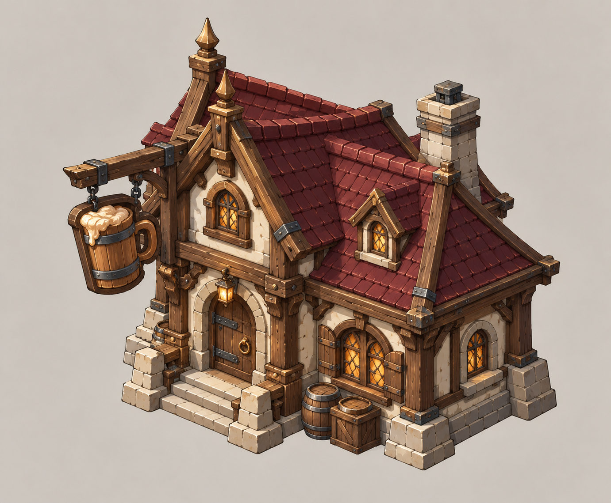
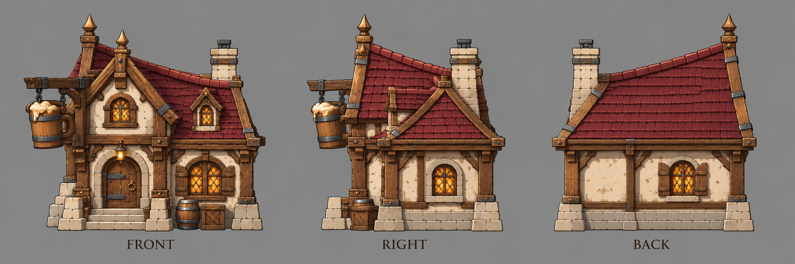

# 酒馆

| 文档属性 | 内容 |
|---|---|
| 建筑编号 | BLD-033 |
| 建筑分类 | 经营建筑 |
| 版本 | v0.2 |
| 更新日期 | 2026-10-08 |
| 状态 | 城镇等级 2 解锁、夜里生意好白天差、没有附加作用、不收维持费，沿用城镇经营；客单、价格与全部数值为设计提案；本轮优化为原型测试基线 |
| 规则依赖 | [SYS-TWN-001 · 城镇经营](../../系统/城镇经营.md) · [SYS-TAG-001 · 标签](../../系统/标签.md) |

[返回文档目录](../../../游戏设计文档.md)

> 2026-10-08 数值迭代：既有用户确认规则保留；本轮新增或改动参数、结算与边界规则是优化后的原型测试基线，未经真人试玩，不代表用户已逐项定稿。

## 1. 建筑定位

酒馆**晚上生意好**：白天冷清，入夜后客人满座。它没有附加作用，纯赚钱。

它的意思是「夜里赚钱，但夜里也危险」：夜晚是敌人更难对付的时候，酒馆最赚钱的时段正好是它最容易被拆的时段，见[城镇经营 第 7 节](../../系统/城镇经营.md)。

## 2. 属性表

| 属性 | 当前设定 | 状态 |
|---|---|---|
| 解锁条件 | 城镇等级 2 | 城镇等级解锁已确定，等级数为设计提案 |
| 标签 | [〔商店〕](../../系统/标签.md#商店) [〔饮食店〕](../../系统/标签.md#饮食店) [〔夜间营业〕](../../系统/标签.md#夜间营业) | 设计提案，见[标签](../../系统/标签.md) |
| 客单 | 白天 **6 金**、夜里 **24 金** / 人 / 分钟 | 设计提案 |
| 服务范围 | 居民家 **15 m** 内 | 设计提案，沿用城镇经营 |
| 最大生命值 | **200** | 设计提案 |
| 护甲 | **0** | 设计提案 |
| 攻击 | 无 | 已确定 |
| 占地 | **3 × 3 m** | 设计提案，沿用城镇经营 |
| 视野 | **8 m** | 设计提案 |
| 建造时间 | **20 秒**（1 名开拓者） | 设计提案 |
| 成本 | **3000 金币**（每多一座 +400） | 设计提案，待写入[成本体系](../../系统/成本体系.md) |
| 维持费 | 无 | 设计提案，沿用城镇经营「商店不收维持费」 |
| 能源占用 | 无 | 设计提案 |
| 人口占用 | 不占用 | 沿用城镇经营 |

## 3. 生意

通用规则见[城镇经营 5.1](../../系统/城镇经营.md)，这里只列要点：

- 生意来自服务范围内住宅的**空闲已入住居民**，与税收共用同一人口记录；招募中的已预留人口和在役人员不当顾客。每居民消费池普通40、雕像范围内50，凯旋60秒池与客单同时×2；再受税收与商业共享的+100%上限约束。各店读取居民最终动态上限，按客单比例分账，同种店重叠再平分。完整公式以[城镇经营 5.1](../../系统/城镇经营.md#51-通用规则只用一套消费池公式)为准。
- 同种店服务范围重叠时，平分重叠处的顾客。
- 商店收入计入[城市形成](../../系统/城市形成.md)的总加成上限（+100%）。
- 玩家只看店铺星级（★1–★3）和建造预览里的「单店生意 / 全城净增加」。
- 不占人口；同种店每多建一座，下一座价格 +400 金币（设计提案）。
- 每开一种城里还没有的店，繁荣度 +8（按种类计，不按座数）。
- 账本按实际结算累积后显示金币飘字；无收入不显示。显示取整不能反向改变收入，低于1金币的尾数累积到下次。同屏频率限制仍依城镇经营。

按[昼夜系统](../../系统/昼夜系统.md)，一天 10 分钟 = 白天 6 分钟 + 夜晚 4 分钟：

| 附近居民 | 白天每分钟 | 夜里每分钟 | 一整天合计 | 折合每分钟 |
|---|---|---|---|---|
| 30 人 | 180 金 | 720 金 | 3960 金 | 396 金 |
| 60 人 | 360 金 | 1440 金 | 7920 金 | 792 金 |
| 100 人 | 600 金 | 2400 金 | 13200 金 | 1320 金 |

平均下来和面包房差不多，但钱集中在夜里进账。夜里客单 24 金，和别的店加起来容易碰到 40 金上限，所以夜里附近店越多，酒馆越能把别人的生意抢过来。

## 4. 相关组合

| 组合 | 需要 | 效果 |
|---|---|---|
| 不夜城 | 电影院 + 酒馆 + 旅馆 | 夜里居民在这三家的消费额度翻倍，路灯全亮 |
| 望楼酒家（隐藏） | 哨塔 + 酒馆 | 夜里哨塔视野变大，酒馆客人多 |

## 5. 强度检验

普通绿皮属性以设计提案为准：**200 生命、20 攻击、1.5 秒攻击间隔、无护甲、近战**。

| 项目 | 结果 |
|---|---|
| 绿皮每次对酒馆的实际伤害 | 20 × 30 ÷ 30 ≈ 20 |
| 一只绿皮拆掉满血酒馆 | 10 次命中，约 15 秒 |

夜里收入占全天七成以上，被拆的损失主要在夜里，放在内圈或配一座哨塔。

## 6. 待设计内容

| 项目 | 需确定内容 |
|---|---|
| 数值 | 白天 / 夜里客单的比例 |
| 表现 | 入夜后亮灯、门口喧闹的表现 |
| 美术 | 概念图、三视图已补充（见文末）；俯视图待补 |

## 7. 关联文档

[城镇经营](../../系统/城镇经营.md) · [标签](../../系统/标签.md) · [民居](民居.md) · [城市形成](../../系统/城市形成.md) · [成本体系](../../系统/成本体系.md) · [昼夜系统](../../系统/昼夜系统.md) · [旅馆](旅馆.md) · [电影院](电影院.md)

## 8. 版本记录

| 版本 | 日期 | 变更 |
|---|---|---|
| v0.2 | 2026-10-08 | 统一动态消费池、空闲顾客、净收益预览与实际到账；相关经营装备/旅馆/百货边界同步；新内容为原型测试基线 |
| v0.1 | 2026-10-08 | 建立文档：城镇等级 2 商店，白天客单 6 金、夜里 24 金，没有附加作用 |

<!-- shop-art-20261008:start -->
## 美术图稿补充（2026-10-08）

本批概念稿与三视图为造型提案；三视图按正面、侧面、背面组织，用于建模参考。建模时校准尺寸、结构与遮挡关系，俯视图另行补充。特效、角色活动和环境装饰不属于建筑模型。

[概念图提示词](../../美术/主城/敌人与建筑设定图/酒馆-概念图-v1-提示词.txt) · [三视图提示词](../../美术/主城/敌人与建筑设定图/酒馆-三视图-v1-提示词.txt)

<!-- shop-art-20261008:end -->
