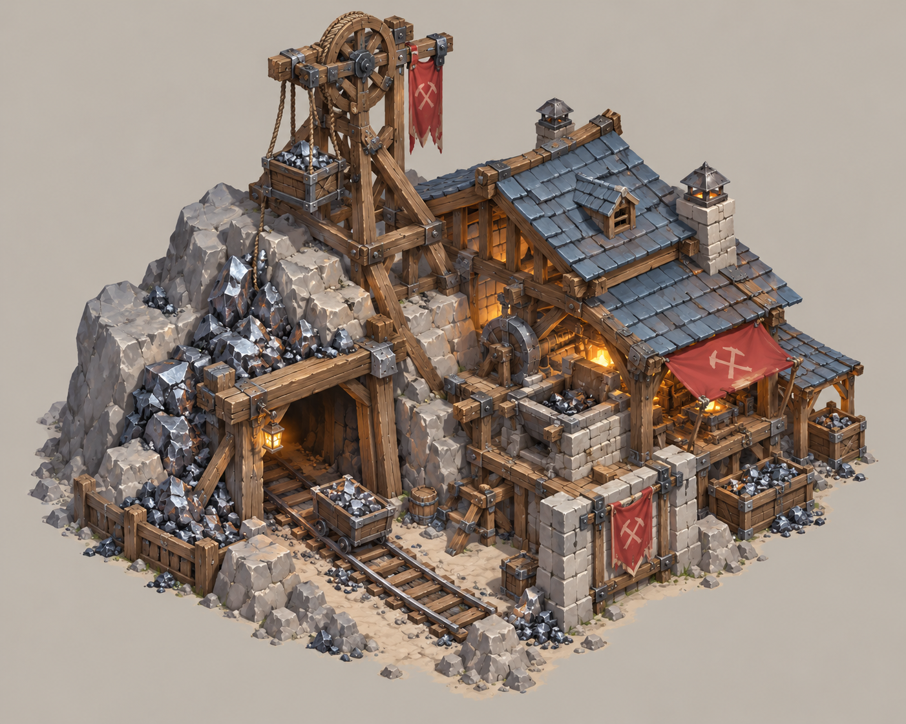
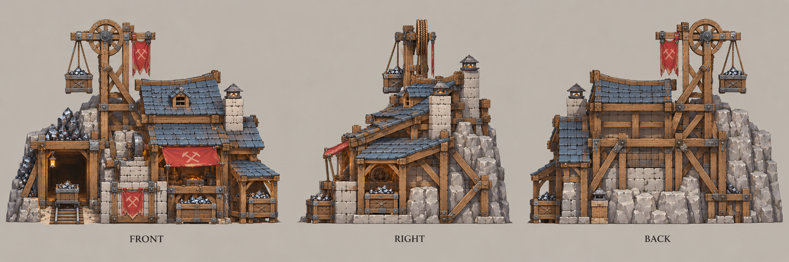

# 采矿场

| 文档属性 | 内容 |
|---|---|
| 建筑编号 | BLD-007 |
| 建筑分类 | 经营建筑 |
| 版本 | v0.4 |
| 更新日期 | 2026-10-08 |
| 状态 | 开采铁矿产出钢铁、只能建在矿点上、出生点附近保证有铁矿、矿不会枯竭已确定；数值为设计提案；本轮优化为原型测试基线 |
| 规则依赖 | [GDD-002 · 核心玩法循环](../../核心玩法循环.md) · [SYS-ECO-001 · 成本体系](../../系统/成本体系.md) |

[返回文档目录](../../../游戏设计文档.md)

> 2026-10-08 数值迭代：既有用户确认规则保留；本轮新增或改动参数、结算与边界规则是优化后的原型测试基线，未经真人试玩，不代表用户已逐项定稿。

## 1. 建筑定位

采矿场建在**铁矿矿点**上，持续产出**钢铁**（已确定），是钢铁的来源。

矿点通常在防线外面，采矿场需要[哨塔](../军事建筑/哨塔.md)盯住、需要兵力保护。开采资源与向外扩张绑在一起，体现[核心玩法循环](../../核心玩法循环.md)中扩张与防守的矛盾。

## 2. 矿点

| 规则 | 内容 | 状态 |
|---|---|---|
| 资源类型 | 铁矿 | 已确定 |
| 出现位置 | 出生点附近**保证有一个铁矿** | 已确定 |
| 建造限制 | 采矿场只能建在矿点上 | 已确定 |
| 距离 | 保底的铁矿在出生点 **200 m 内**，通常在防线以外；其余矿点分布在世界各处，见[地图与资源点](../../系统/地图与资源点.md) | 已确定 |
| 储量 | **矿不会枯竭**，采矿场可以永久产出 | 已确定 |

**没有枯竭之后的扩张动力：**不再靠「矿挖完了逼玩家往外走」，而是靠**矿点数量**：一个矿点只能建一座开采建筑（规则见[地图与资源点](../../系统/地图与资源点.md) §5.4），想要更多钢铁就得占据更多矿点，这些矿点分散在外面，需要防守和视野。

## 3. 属性表（设计提案）

| 属性 | 提案值 |
|---|---|
| 最大生命值 | **300** |
| 护甲 | **3** |
| 攻击 | 无 |
| 占地 | **6 × 6 m** |
| 建造 | **3000 金币**，30 秒 |
| 产出 | 每分钟 **20 钢铁**，再乘以矿点的距离倍率（离出生点越远越高，最高 ×1.5），见[地图与资源点](../../系统/地图与资源点.md) |
| 维持费 | 每分钟 **100 金币**（有矿工干活） |
| 人口占用 | 无 |
| 视野 | **8 m** |

## 4. 钢铁用途

| 用途 | 消耗 | 状态 |
|---|---|---|
| [民居](民居.md)：木屋升级为瓦房 | 3000 金币 + **80 钢铁** | 已确定 |
| 箭塔 Lv1→Lv2 升级 | 3000 金币 + **30 钢铁** | 成本体系主表；原型测试基线 |
| 铁箭头研究 | 3000 金币 + **30 钢铁** | 成本体系主表；原型测试基线 |

按本轮原型测试基线产出，一座采矿场 4 分钟可以攒够一次瓦房升级所需的钢铁。

## 5. 强度检验

普通绿皮属性以设计提案为准：**20 攻击、1.5 秒攻击间隔、近战**。

一只绿皮每次对采矿场造成约 18.2 伤害，17 次命中、约 25 秒拆掉满血采矿场，与箭塔相近。

## 6. 待设计内容

| 项目 | 需确定内容 |
|---|---|
| 矿点数量 | 世界里一共有多少个铁矿点（「一个矿点只能一座」已由[地图与资源点](../../系统/地图与资源点.md) §5.4 采纳，本处不再重复） |
| 升级 | 采矿场本身是否可升级；提高产量已由 [炼钢厂](炼钢厂.md)（2 本，建在附近加成）承担 |
| 美术 | 采矿场与矿点的造型 |

## 7. 关联文档

[核心玩法循环](../../核心玩法循环.md) · [成本体系](../../系统/成本体系.md) · [民居](民居.md) · [哨塔](../军事建筑/哨塔.md) · [游戏模式与关卡](../../游戏模式与关卡.md)

## 8. 版本记录

| 版本 | 日期 | 变更 |
|---|---|---|
| v0.3 | 2026-10-08 | 同步成本唯一来源、人口边界及本轮经济结算；美术图稿保留；新内容为原型测试基线 |
| v0.1 | 2026-09-28 | 建立文档：确定开采铁矿产出钢铁、矿点在出生点附近刷出；提出属性、产出与储量规则 |
| v0.2 | 2026-10-08 | 金币数量级整体 ×20（价格、收入、维持费同比放大，平衡不变），方便商店按秒跳金币数字 |
| v0.4 | 2026-10-08 | 第五轮同步：钢铁用途补箭塔 Lv2 与铁箭头（各 3000 金币 + 30 钢铁）；「一个矿点只能一座」改为引用地图与资源点 §5.4 |

## 美术图稿（2026-10-01 补充）

[概念图提示词](../../美术/主城/敌人与建筑设定图/采矿场-概念图-v1-提示词.txt) · [三视图提示词](../../美术/主城/敌人与建筑设定图/采矿场-三视图-v1-提示词.txt) · [图稿索引](../../美术/主城/敌人与建筑设定图/设定图索引.md)

沿用现有概念造型，三视图为美术参考；不可见部位为推定补全，建模前需统一尺寸与结构。
