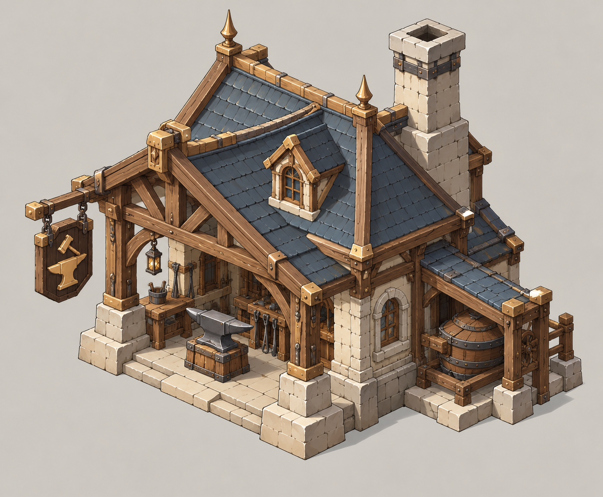
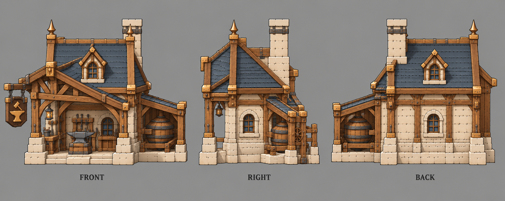

# 铁匠铺

| 文档属性 | 内容 |
|---|---|
| 建筑编号 | BLD-034 |
| 建筑分类 | 经营建筑 |
| 版本 | v0.2 |
| 更新日期 | 2026-10-08 |
| 状态 | 城镇等级 2 解锁、收入低有噪音、附近兵营之后招的近战兵护甲 +3、不收维持费，沿用城镇经营；客单、噪音、价格与全部数值为设计提案；本轮优化为原型测试基线 |
| 规则依赖 | [SYS-TWN-001 · 城镇经营](../../系统/城镇经营.md) · [SYS-TAG-001 · 标签](../../系统/标签.md) |

[返回文档目录](../../../游戏设计文档.md)

> 2026-10-08 数值迭代：既有用户确认规则保留；本轮新增或改动参数、结算与边界规则是优化后的原型测试基线，未经真人试玩，不代表用户已逐项定稿。

## 1. 建筑定位

铁匠铺**武装新兵**：附近[兵营](../军事建筑/兵营.md)之后招的近战兵护甲 +3。它是经营和打仗之间的一座桥：开在兵营旁边，新兵就更耐打。

代价是**收入低、有噪音**：叮叮当当影响周围的民居，所以它适合放在兵营一侧，离住宅区稍远。

## 2. 属性表

| 属性 | 当前设定 | 状态 |
|---|---|---|
| 解锁条件 | 城镇等级 2 | 城镇等级解锁已确定，等级数为设计提案 |
| 标签 | [〔商店〕](../../系统/标签.md#商店) [〔工业建筑〕](../../系统/标签.md#工业建筑) [〔招募加成〕](../../系统/标签.md#招募加成) | 设计提案，见[标签](../../系统/标签.md) |
| 客单 | **6 金** / 人 / 分钟 | 设计提案 |
| 服务范围 | 居民家 **15 m** 内 | 设计提案，沿用城镇经营 |
| 噪音 | 15 m 内民居的金币收入 −10%，和采矿场、炼钢厂一起算，最多 −20% | 设计提案，沿用[城市形成](../../系统/城市形成.md)的工业噪音规则 |
| 最大生命值 | **250** | 设计提案 |
| 护甲 | **2** | 设计提案 |
| 攻击 | 无 | 已确定 |
| 占地 | **3 × 3 m** | 设计提案，沿用城镇经营 |
| 视野 | **8 m** | 设计提案 |
| 建造时间 | **20 秒**（1 名开拓者） | 设计提案 |
| 成本 | **3000 金币 + 20 钢铁**（每多一座 +400 金币） | 设计提案，待写入[成本体系](../../系统/成本体系.md) |
| 维持费 | 无 | 设计提案，沿用城镇经营「商店不收维持费」 |
| 能源占用 | 无 | 设计提案 |
| 人口占用 | 不占用 | 沿用城镇经营 |

## 3. 生意

通用规则见[城镇经营 5.1](../../系统/城镇经营.md)，这里只列要点：

- 生意来自服务范围内住宅的**空闲已入住居民**，与税收共用同一人口记录；招募中的已预留人口和在役人员不当顾客。每居民消费池普通40、雕像范围内50，凯旋60秒池与客单同时×2；再受税收与商业共享的+100%上限约束。各店读取居民最终动态上限，按客单比例分账，同种店重叠再平分。完整公式以[城镇经营 5.1](../../系统/城镇经营.md#51-通用规则只用一套消费池公式)为准。
- 同种店服务范围重叠时，平分重叠处的顾客。
- 商店收入计入[城市形成](../../系统/城市形成.md)的总加成上限（+100%）。
- 玩家只看店铺星级（★1–★3）和建造预览里的「单店生意 / 全城净增加」。
- 不占人口；同种店每多建一座，下一座价格 +400 金币（设计提案）。
- 每开一种城里还没有的店，繁荣度 +8（按种类计，不按座数）。
- 账本按实际结算累积后显示金币飘字；无收入不显示。显示取整不能反向改变收入，低于1金币的尾数累积到下次。同屏频率限制仍依城镇经营。

按客单 6 金估算（只有面包房的一半）：

| 附近居民 | 每分钟生意 |
|---|---|
| 30 人 | 180 金 |
| 60 人 | 360 金 |
| 100 人 | 600 金 |

铁匠铺不是为了赚钱造的，生意只是让它不至于白占地方。

## 4. 附加作用：新兵护甲 +3

| 规则 | 内容 | 状态 |
|---|---|---|
| 效果 | 铁匠铺15m内兵营之后招的**近战**士兵护甲 **+3** | 原型测试基线；持续护甲与一次性护盾各有用途 |
| 对象 | 带[〔近战〕](../../系统/标签.md#近战)的[〔士兵〕](../../系统/标签.md#士兵)：民兵、骑士、圣骑士等 | 设计提案 |
| 距离 | 按两座建筑的边缘算 | 设计提案 |
| 叠加 | 多座铁匠铺**不叠加** | 沿用城镇经营 |
| 组合 | 凑成「军械所」后提高到 **+5** | 原型测试基线；取强不与基础+3相加 |

**每个兵最多带1项招募加成**。生产建筑可预设「护甲 / 药水 / 护盾」中的一项，招募时从附近有效设施取得对应装备，不强制高阶覆盖旧装备。只给之后招的兵；药水与持续护甲各有用途，单位面板显示已带装备。

基础+3对零甲民兵令物伤降低约9.09%，累计原始物伤1100时可少承受100；一次性护盾100更擅长承受致命首击，药水40%最大生命偏向高血兵。铁匠+3、军械所+5、招兵买马Lv1+5/Lv2+7是同一招募护甲来源，取最大，不相加，最高+7；这不是全部护甲的全局上限。生产建筑预设仍只选1项装备。

## 5. 相关组合

| 组合 | 需要 | 效果 |
|---|---|---|
| 军械所 | 铁匠铺 + 兵营 + 采矿场 | 铁匠铺给新兵的护甲加成提高到 +5 |

## 6. 强度检验

普通绿皮属性以设计提案为准：**200 生命、20 攻击、1.5 秒攻击间隔、无护甲、近战**。

| 项目 | 结果 |
|---|---|
| 绿皮每次对铁匠铺的实际伤害 | 20 × 30 ÷ 32 ≈ 18.8 |
| 一只绿皮拆掉满血铁匠铺 | 14 次命中，约 21 秒 |

铁匠铺跟着兵营走，往往离前线比别的店近，所以生命和护甲比普通小店高一点。

## 7. 待设计内容

| 项目 | 需确定内容 |
|---|---|
| 数值 | 基础+3/军械所+5与一次护盾、治疗的实际选择；招募护甲同源取强最高+7 |
| 噪音 | 是否和采矿场、炼钢厂一样 −10% |
| 美术 | 概念图、三视图已补充（见文末）；后续补俯视图及炉火与打铁火星 |

## 8. 关联文档

[城镇经营](../../系统/城镇经营.md) · [标签](../../系统/标签.md) · [民居](民居.md) · [城市形成](../../系统/城市形成.md) · [成本体系](../../系统/成本体系.md) · [兵营](../军事建筑/兵营.md) · [民兵](../../单位/民兵.md) · [采矿场](采矿场.md) · [药水铺](药水铺.md) · [魔导器专卖店](魔导器专卖店.md)

## 9. 版本记录

| 版本 | 日期 | 变更 |
|---|---|---|
| v0.2 | 2026-10-08 | 统一动态消费池、空闲顾客、净收益预览与实际到账；相关经营装备/旅馆/百货边界同步；新内容为原型测试基线 |
| v0.1 | 2026-10-08 | 建立文档：城镇等级 2 商店，客单 6 金，有噪音（15 m 内民居 −10%），附近兵营之后招的近战兵护甲 +1 |

<!-- shop-art-20261008:start -->
## 美术图稿补充（2026-10-08）

本批概念稿与三视图为造型提案；三视图按正面、侧面、背面组织，用于建模参考。建模时校准尺寸、结构与遮挡关系，俯视图另行补充。特效、角色活动和环境装饰不属于建筑模型。

[概念图提示词](../../美术/主城/敌人与建筑设定图/铁匠铺-概念图-v1-提示词.txt) · [三视图提示词](../../美术/主城/敌人与建筑设定图/铁匠铺-三视图-v2-提示词.txt)

<!-- shop-art-20261008:end -->
