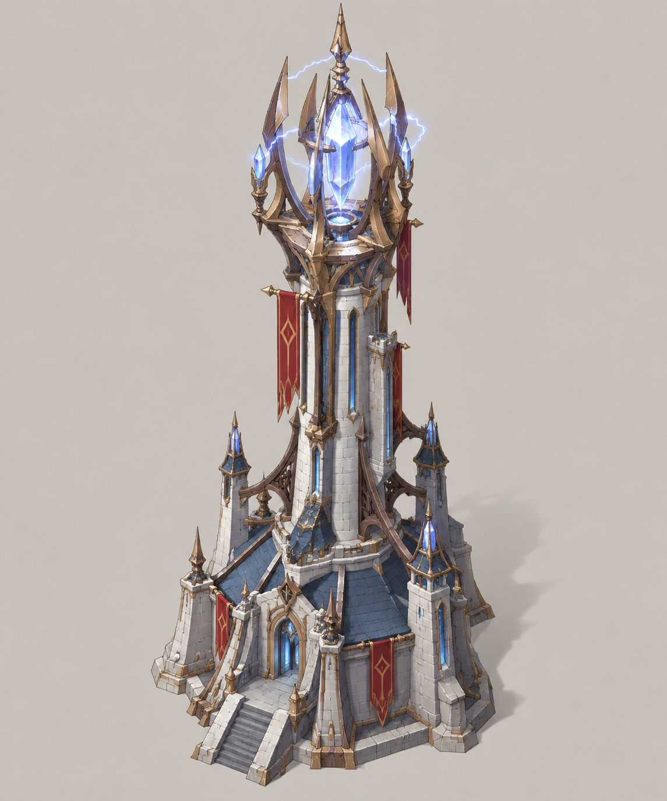
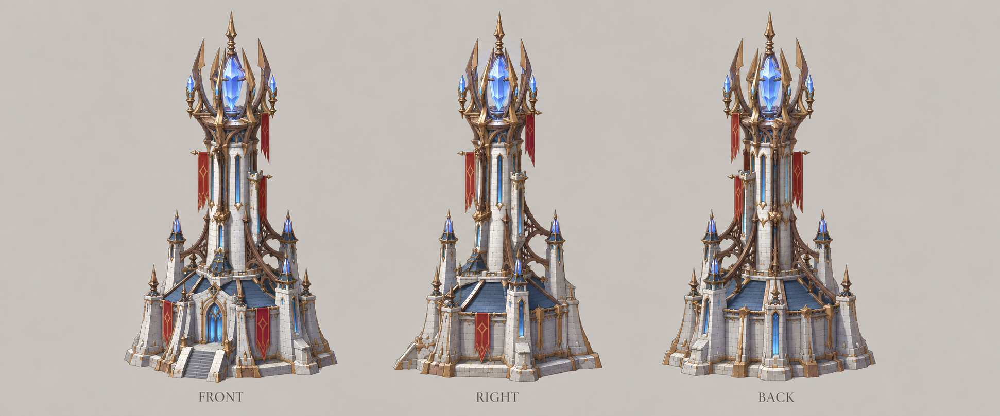

# 风暴尖塔

| 文档属性 | 内容 |
|---|---|
| 建筑编号 | BLD-024 |
| 版本 | v0.1 |
| 更新日期 | 2026-09-30 |
| 状态 | 魔法 3 本连锁闪电塔、名称「风暴尖塔」已确定；全部数值为设计提案；价格待定 |
| 规则依赖 | [SYS-CBT-001 · 战斗与护甲规则](../系统/战斗与护甲规则.md) · [SYS-TEC-001 · 科技系统](../系统/科技系统.md) · [SYS-ENG-001 · 能源体系](../系统/能源体系.md) |

[返回文档目录](../../游戏设计文档.md)

## 1. 建筑定位

风暴尖塔是**魔法体系的 3 本塔**（法师营地升到 3 本后解锁）。塔尖召来风暴，闪电从一个敌人跳到下一个，**每次攻击都会连锁**，伤害逐跳衰减。原样例名为「雷霆塔」。

它是[古塞奇尤](../单位/古塞奇尤.md)连环闪电的塔版本：英雄的闪电靠概率触发，风暴尖塔每发必连。

与其他群伤塔的分工：

| 塔 | 打群体的方式 | 弱点 |
|---|---|---|
| [火炮塔](火炮塔.md) | 敌人挤成一团才打得多 | 近身死角 |
| [雷环塔](雷环塔.md) | 只打塔身周围 | 射程短 |
| **风暴尖塔** | 敌人相隔 5 m 以内、排成一串就能打到 | 打不动魔法免疫的敌人 |

## 2. 属性表（设计提案）

| 属性 | 提案值 |
|---|---|
| 解锁条件 | 法师营地 3 本 |
| 攻击方式 | 连锁闪电：首个目标之后最多再跳 **4** 次，共 5 个目标 |
| 伤害 | 首个目标 **60**，每跳衰减 20%：60 / 48 / 38 / 31 / 25，一次合计约 200 |
| 伤害类型 | 魔法，**无视护甲**；魔法免疫的敌人不受伤害，闪电也不会跳向它 |
| 攻击间隔 | **2.5 秒** |
| 跳跃距离 | 相邻目标之间不超过 **5 m** |
| 射程 | **11 m** |
| 攻击目标 | 地面单位 |
| 最大生命值 | **450** |
| 护甲 | **5**（减伤约 14.3%） |
| 占地 | **3 × 3 m** |
| 视野 | **11 m** |
| 建造时间 | **30 秒**（1 名开拓者） |
| 成本 | 待定 |
| 维持费 | **30** 金币 / 分钟（3 本塔标准，待确认） |
| 能源占用 | **100** |
| 人口占用 | 不占用 |

## 3. 攻击规则（设计提案）

- 首个目标使用默认索敌：射程内最近的敌人，见[单位行为与警戒规则](../系统/单位行为与警戒规则.md)。
- 每一跳选择距上一个目标最近、且本次闪电尚未命中过的敌人。
- 跳跃不受射程限制，只受 5 m 跳跃距离限制。

## 4. 强度检验

普通绿皮属性以设计提案为准：**200 生命、20 攻击、1.5 秒攻击间隔、无护甲、近战、移动速度 3 m/s**。

| 项目 | 结果 |
|---|---|
| 只有 1 只绿皮 | 每次 60，4 次消灭，约 7.5 秒 |
| 5 只绿皮排成一串 | 每次平均每只约 40，约 5 次（10 秒）全部消灭 |
| 对比箭塔打 5 只 | 约 75 秒 |

**设计意图：**敌人越多、站得越散越成串，风暴尖塔越强；只剩零星几只时，效率接近 3 本单体塔的平均水平。

## 5. 待设计内容

| 项目 | 需确定内容 |
|---|---|
| 价格 | 造价，预计需要魔晶 |
| 研究 | 法师营地的「雷电强化」是否同时作用于风暴尖塔 |
| 美术 | 概念图、俯视图、三视图；塔尖风暴与闪电跳跃的表现 |

## 6. 关联文档

[科技系统](../系统/科技系统.md) · [法师营地](法师营地.md) · [古塞奇尤](../单位/古塞奇尤.md) · [火炮塔](火炮塔.md) · [雷环塔](雷环塔.md) · [曙光](曙光.md) · [破咒小子](../敌人/破咒小子.md)

## 7. 版本记录

| 版本 | 日期 | 变更 |
|---|---|---|
| v0.1 | 2026-09-30 | 建立文档：魔法 3 本连锁闪电塔，名称定为风暴尖塔；数值为设计提案 |

<!-- art-20261005:start -->
## 美术设定图补充（2026-10-05）

本批补充概念稿和正面、侧面、背面三视图。用于造型与材质参考；建模时统一尺寸、结构和各视图细节。俯视图与动画另行制作。

### 风暴尖塔

[概念稿提示词](../美术/主城/敌人与建筑设定图/风暴尖塔-概念图-v1-提示词.txt) · [三视图提示词](../美术/主城/敌人与建筑设定图/风暴尖塔-三视图-v1-提示词.txt)

<!-- art-20261005:end -->
