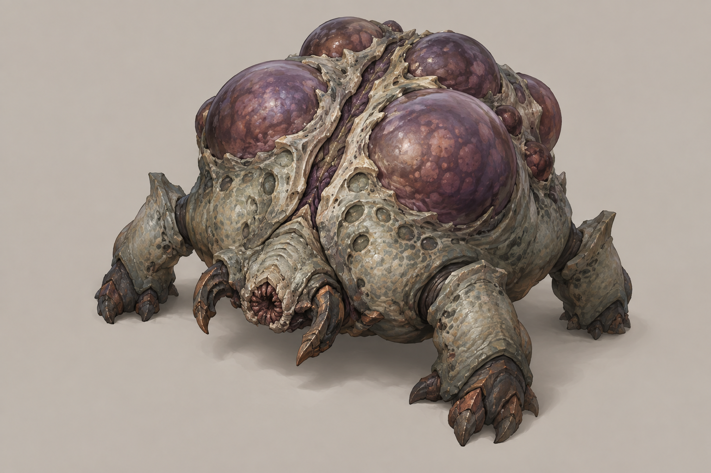
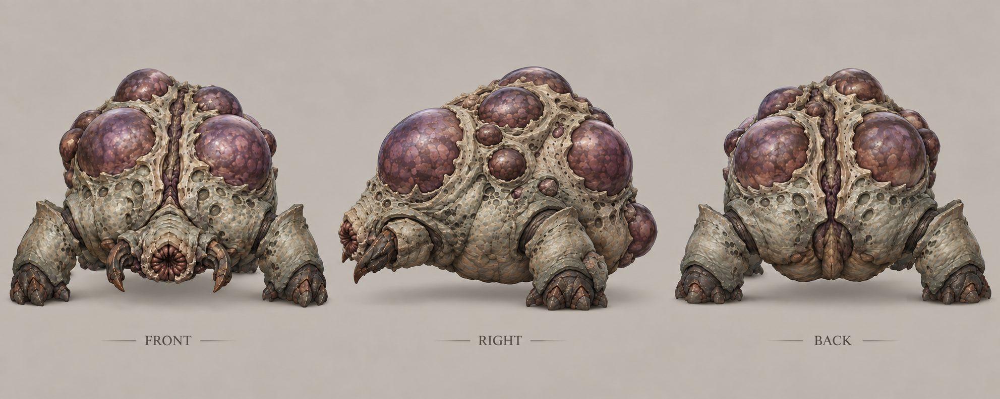
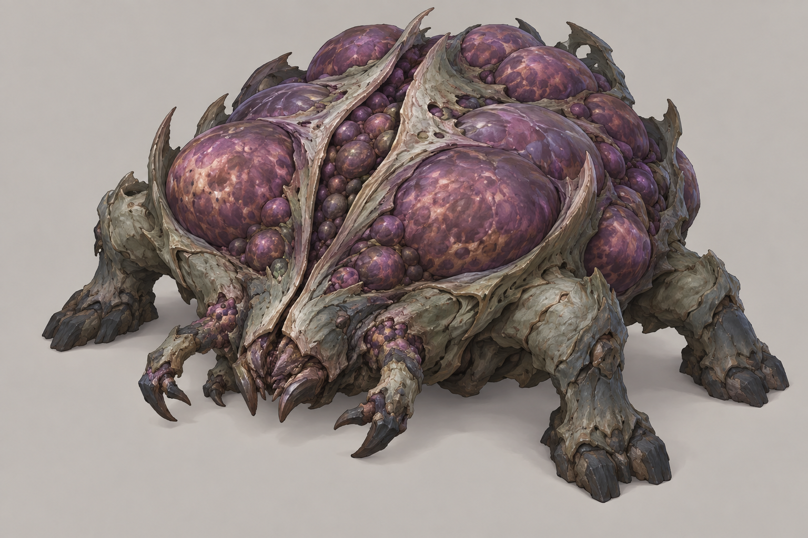
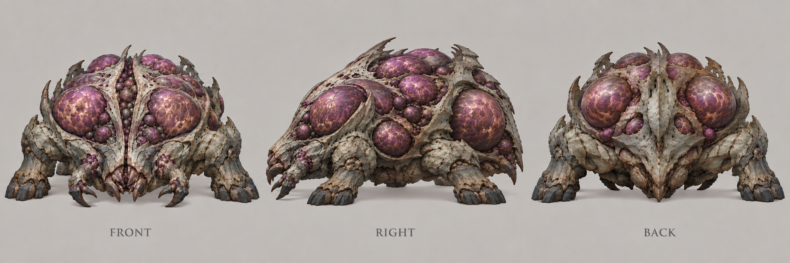
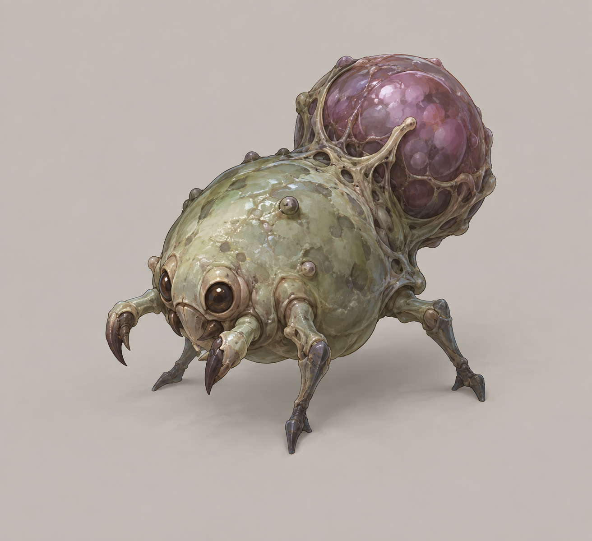
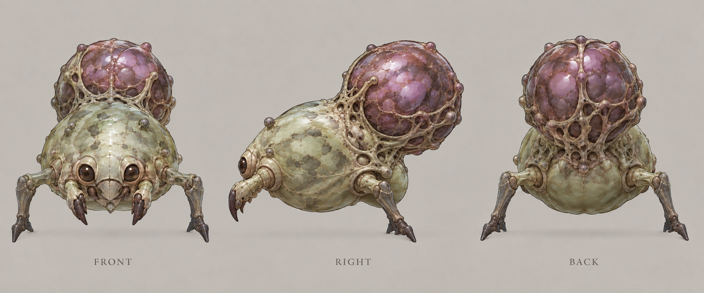
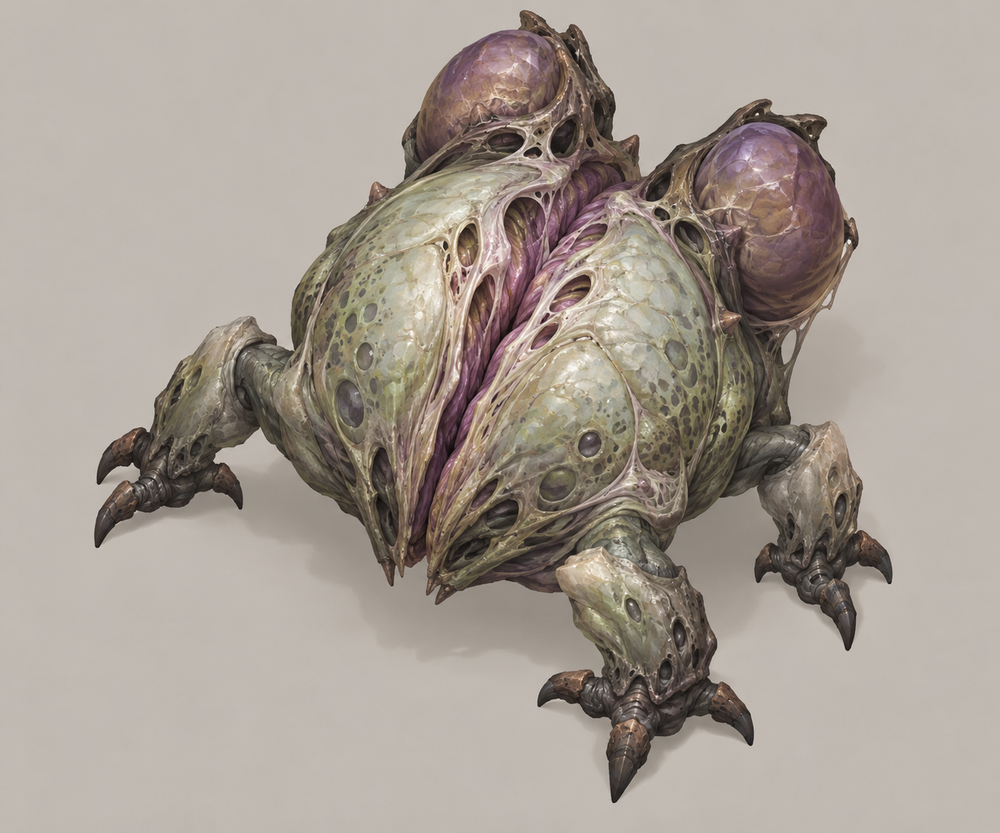
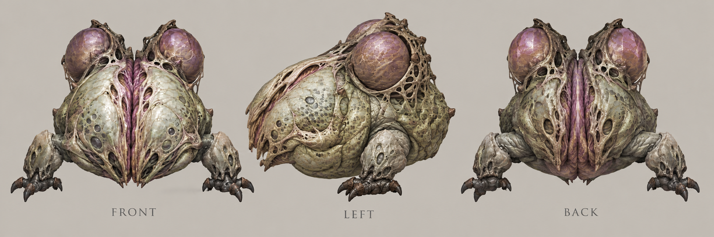
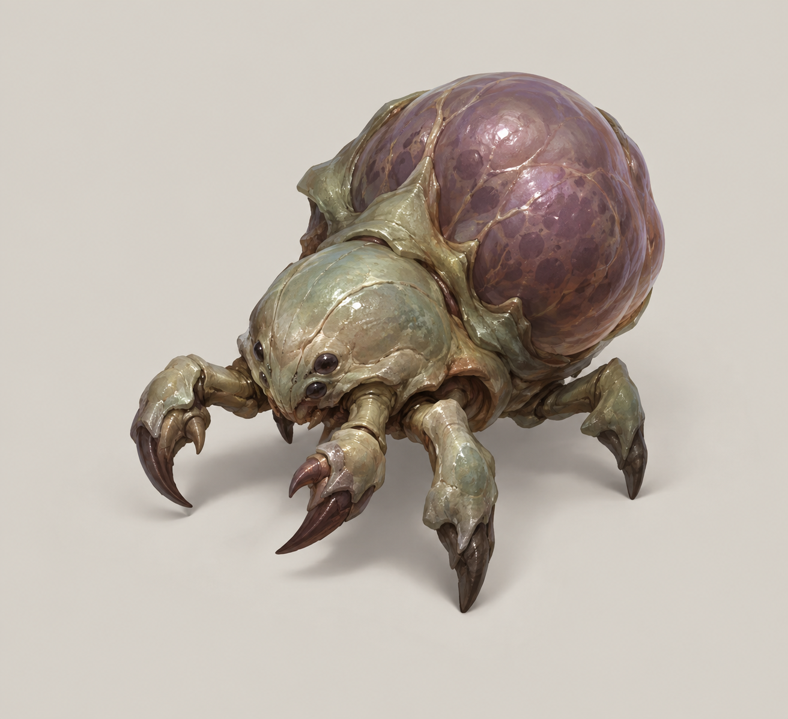
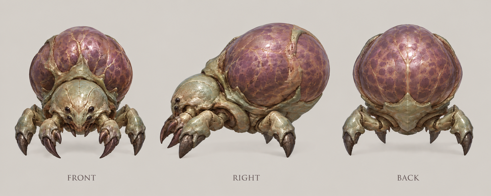

# 孢囊怪

| 文档属性 | 内容 |
|---|---|
| 敌人编号 | ENM-004 |
| 版本 | v0.2 |
| 更新日期 | 2026-09-30 |
| 状态 | 「死亡分裂成两个、进阶版可继续分裂、被群体 AOE 克制」已确定；全部数值为设计提案 |
| 规则依赖 | [SYS-CBT-001 · 战斗与护甲规则](../系统/战斗与护甲规则.md) · [SYS-MOV-001 · 距离与移动速度标准](../系统/距离与移动速度标准.md) · [SYS-BHV-001 · 单位行为与警戒规则](../系统/单位行为与警戒规则.md) |

[返回文档目录](../../游戏设计文档.md)

## 1. 单位定位

孢囊怪是**用数量惩罚单体输出的近战敌人**（已确定）：**被打死后分裂成两个更小的个体**，进阶版可以接着分裂。

- 对单体输出（箭塔、火枪手、圣堂刺客）：要多打好几次，而且越打敌人越多、越散。
- 对群体 AOE：几乎是送分。[雷环塔](../建筑/雷环塔.md)、[灵魂熔炉](../建筑/灵魂熔炉.md)、[法师](../单位/法师.md)的魔法龙破斩，能把分裂出来的小个体一起清掉。

它让「只堆单体塔」的玩家吃亏，逼着玩家配一个范围伤害。

名称取自异星生物的孢囊：母体是孢囊，裂开后散出孢子。进阶版叫孢巢母体。

## 2. 两个阶级

| 阶级 | 说明 |
|---|---|
| **孢囊怪**（一阶） | 死亡后分裂 1 次：母体 → 2 个孢子 |
| **孢巢母体**（二阶） | 死亡后分裂 2 次：母体 → 2 个大孢子 → 各 2 个小孢子，最多 7 个个体 |

孢子 / 小孢子**不再分裂**，防止无限增殖。

## 3. 属性表（设计提案）

护甲全部为 **0**，全部近战、攻击距离 **1 m**。

**孢囊怪（一阶母体）：**

| 属性 | 当前设定 | 状态 |
|---|---|---|
| 最大生命值 | **240** | 设计提案 |
| 护甲 | **0** | 设计提案 |
| 攻击力 | **15** / 次，近战单体 | 设计提案 |
| 攻击间隔 | **1.5 秒** | 设计提案 |
| 攻击距离 | **1 m** | 设计提案 |
| 移动速度 | **3.0 m/s**（标准档） | 设计提案 |
| 击杀奖励 | 随机 **5–8** 金币，分裂出的每个个体另算 | 设计提案 |
| 魔晶掉落 | **15%** 概率掉落 **1** 魔晶，只有母体 | 设计提案 |
| 死亡分裂 | 分裂成 **2 个孢子**（生命 80） | 已确定 |

**各阶个体一览：**

| 个体 | 生命 | 攻击力 | 攻击间隔 | 移动速度 | 击杀奖励 |
|---|---|---|---|---|---|
| 孢囊怪（母体） | **240** | 15 | 1.5 秒 | 3.0 m/s | 5–8 金币 |
| 孢子 | **80** | 10 | 1.2 秒 | 3.4 m/s（快档下沿） | 3–5 金币 |
| 孢巢母体 | **360** | 18 | 1.5 秒 | 3.0 m/s | 8–12 金币 |
| 大孢子 | **150** | 12 | 1.3 秒 | 3.2 m/s | 4–6 金币 |
| 小孢子 | **60** | 10 | 1.2 秒 | 3.4 m/s | 2–4 金币 |

| 汇总 | 一阶 | 二阶 |
|---|---|---|
| 个体总数 | 3 | 7 |
| 需要打掉的总生命 | 240 + 2×80 = **400** | 360 + 2×150 + 4×60 = **900** |
| 魔晶掉落 | 只有母体，**15%** 掉 1 个 | 只有母体，**25%** 掉 1–2 个 |

金币按每个个体各算一次，合计接近普通绿皮的奖励（10–20 金币）：一阶合计约 12–18，二阶合计约 24–34。魔晶只由母体掉落，避免分裂刷魔晶。

## 4. 分裂规则（设计提案）

| 规则 | 内容 |
|---|---|
| 触发 | 生命降到 0 时分裂，无论死于哪种伤害（魔法、物理、塔、单位） |
| 出现位置 | 死亡点周围约 1.5 m 内散开 |
| 新个体 | 满血，立即行动，没有无敌时间 |
| 分裂后的目标 | 继承母体的进攻目标和当前仇恨 |
| 攻击建筑 | 与普通绿皮相同，遇墙就近拆墙 |
| 秒杀 | [裁决](../建筑/裁决.md)秒杀母体，照常分裂 |

**为什么没有无敌时间：**这个怪的克制关系全靠「AOE 能立刻打到新个体」。如果新个体要无敌几秒，雷环塔的持续伤害就浪费了。

## 5. 强度检验

| 对象 | 结果 |
|---|---|
| [雷环塔](../建筑/雷环塔.md)（每秒 6 点/目标） | 一阶全部个体在范围内时，母体 40 秒、孢子 13 秒；但分裂出来的个体同时受伤，总耗时不叠加，是最好的克制 |
| 单座[箭塔](../建筑/箭塔.md)（20 点，1.5 秒） | 一阶需要 400 ÷ 20 = 20 发左右（约 30 秒），期间孢子贴上来拆塔 |
| 二阶 vs 单体输出 | 900 总生命、7 个个体，单体输出很难处理 |
| 孢囊怪单体 vs [民兵](../单位/民兵.md) | 母体不比普通绿皮强多少，威胁在于分裂后包围 |

**设计意图：**
- 打孢囊怪不能盯着一个打。塔的单体输出被分摊到更多个体上，AOE 则一次全吃。
- 一阶用来教玩家：「分裂了，要配范围伤害」；二阶作为后期压力。

## 6. 待设计内容

| 项目 | 需确定内容 |
|---|---|
| 分裂表现 | 死亡动画（爆开成两团）、大小比例，美术需要统一 |
| 数量上限 | 单个区域内个体太多时的性能保护（例如同时存在个体的上限） |
| 出场 | 何时出现、每波数量，留到出怪阶段设计 |
| 数值 | 生命、个体数量是否合适 |

## 7. 关联文档

[普通绿皮](普通绿皮.md) · [雷环塔](../建筑/雷环塔.md) · [灵魂熔炉](../建筑/灵魂熔炉.md) · [法师](../单位/法师.md) · [裁决](../建筑/裁决.md) · [战斗与护甲规则](../系统/战斗与护甲规则.md)

## 8. 版本记录

| 版本 | 日期 | 变更 |
|---|---|---|
| v0.1 | 2026-09-30 | 建立文档：死亡分裂成两个的近战敌人，分一阶与进阶；克制群体 AOE；数值为设计提案 |
| v0.2 | 2026-09-30 | 定名孢囊怪（进阶版孢巢母体，分裂出的个体为孢子）；原名分裂怪 |

<!-- art-20261005:start -->
## 美术设定图补充（2026-10-05）

本批补充概念稿和正面、侧面、背面三视图。用于造型与材质参考；建模时统一尺寸、结构和各视图细节。俯视图与动画另行制作。

### 孢囊怪

[概念稿提示词](../美术/主城/敌人与建筑设定图/孢囊怪-概念图-v1-提示词.txt) · [三视图提示词](../美术/主城/敌人与建筑设定图/孢囊怪-三视图-v2-提示词.txt)

### 孢巢母体

[概念稿提示词](../美术/主城/敌人与建筑设定图/孢巢母体-概念图-v1-提示词.txt) · [三视图提示词](../美术/主城/敌人与建筑设定图/孢巢母体-三视图-v2-提示词.txt)

### 孢子

[概念稿提示词](../美术/主城/敌人与建筑设定图/孢子-概念图-v1-提示词.txt) · [三视图提示词](../美术/主城/敌人与建筑设定图/孢子-三视图-v2-提示词.txt)

### 大孢子

[概念稿提示词](../美术/主城/敌人与建筑设定图/大孢子-概念图-v1-提示词.txt) · [三视图提示词](../美术/主城/敌人与建筑设定图/大孢子-三视图-v2-提示词.txt)

### 小孢子

[概念稿提示词](../美术/主城/敌人与建筑设定图/小孢子-概念图-v1-提示词.txt) · [三视图提示词](../美术/主城/敌人与建筑设定图/小孢子-三视图-v2-提示词.txt)

<!-- art-20261005:end -->
