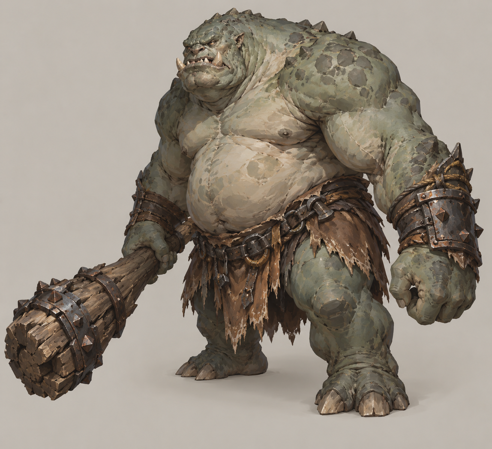
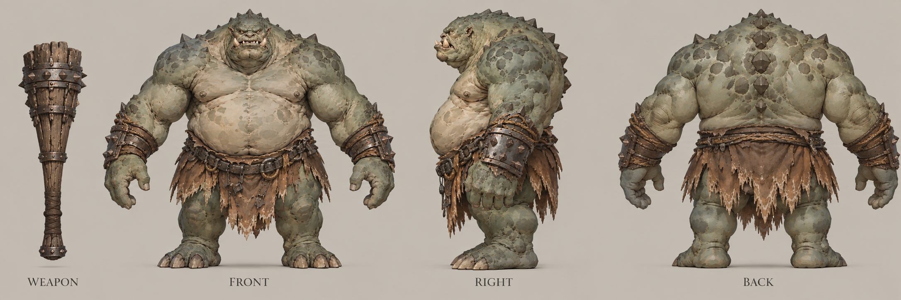

# 巨怪

| 文档属性 | 内容 |
|---|---|
| 敌人编号 | ENM-007 |
| 版本 | v0.3 |
| 更新日期 | 2026-10-08 |
| 状态 | 「超高生命值、移速慢、伤害也高」已确定；全部数值为设计提案 |
| 规则依赖 | [SYS-CBT-001 · 战斗与护甲规则](../系统/战斗与护甲规则.md) · [SYS-MOV-001 · 距离与移动速度标准](../系统/距离与移动速度标准.md) · [SYS-BHV-001 · 单位行为与警戒规则](../系统/单位行为与警戒规则.md) |

[返回文档目录](../../游戏设计文档.md)

## 1. 单位定位

巨怪是**又慢又硬又疼的重型敌人**（已确定）：生命值很高，走得很慢，一下打得很重。它是一波进攻里的「重点」，玩家会提前看到它一步步走过来。

- 慢：给玩家足够的时间集火，也能让它走过塔的射程时吃满输出。
- 硬：普通的单体输出要打很久，一座塔单独处理不了。
- 疼：一旦走到塔前，塔和墙撑不了几下。

它考验的是**总输出**和**减速、控制**：把它拖在塔的射程里，比单纯堆塔更有效。

名称已定为「巨怪」。

## 2. 属性表（设计提案）

| 属性 | 当前设定 | 状态 |
|---|---|---|
| 最大生命值 | **2000** | 设计提案，约为普通绿皮的 10 倍 |
| 护甲 | **5**（减伤约 14.3%） | 设计提案 |
| 攻击力 | **80** / 次，近战单体 | 设计提案 |
| 攻击间隔 | **2.5 秒**（每秒伤害 32） | 设计提案 |
| 攻击距离 | **2 m**（体型大） | 设计提案 |
| 移动速度 | **1.6 m/s**（很慢档） | 设计提案 |
| 视野 / 警戒 | **10 m / 10 m** | 设计提案 |
| 击杀奖励 | 随机 **2000–3000** 金币 | 设计提案 |
| 魔晶掉落 | **100%** 掉落 **3–5** 魔晶 | 设计提案 |

## 3. 行为（设计提案）

| 规则 | 内容 |
|---|---|
| 进攻目标 | 向最近合法建筑推进，途中先打警戒范围内最近目标 |
| 遇墙 | 就近拆墙，与普通绿皮一致 |
| 撤退 | 不撤退，打到死为止 |
| 减速 | 受[凝霜塔](../建筑/军事建筑/凝霜塔.md)影响，正常生效（不免疫） |

## 4. 强度检验

护甲 5 的实际伤害比例约 85.7%。

| 对象 | 结果 |
|---|---|
| [箭塔](../建筑/军事建筑/箭塔.md)（20 点，1.5 秒）单塔消灭一只 | 每发 17.1，需要 117 发，约 174 秒 |
| [裁决](../建筑/军事建筑/裁决.md)（600 点魔法） | 约 4 次才能击杀（2000 ÷ 600），不会被一击秒杀 |
| [雷环塔](../建筑/军事建筑/雷环塔.md)（每秒 6 点） | 约 333 秒，只适合当辅助 |
| 巨怪拆满血箭塔 | 每次 80 × 30 ÷ 33 ≈ 72.7，约 5 次，约 10 秒 |
| 穿过 10 m 箭塔射程 | 约 6 秒，走进射程到贴脸只被打约 4 发 |
| 穿过 60 m 空地 | 约 38 秒 |

**设计意图：**
- 它慢，所以玩家有时间准备；它硬，所以准备必须够用。
- 对策是多塔叠加输出、凝霜塔减速，或者把它拖在城墙前：拆墙的时间就是输出窗口。
- 拆一段城墙对它并不慢，所以不能只靠一段墙拖。

**首次遭遇提示（设计提案）：**巨怪首次出现时，屏幕下方出一行可关闭的提示并录入图鉴；不预知出现时间（见[出怪系统](../系统/出怪系统.md)）。

## 5. 待设计内容

| 项目 | 需确定内容 |
|---|---|
| 特殊能力 | 是否有范围践踏等，目前没有 |
| 是否算 Boss | 是否作为固定波次的 Boss 级敌人，与后续 Boss 设计一起考虑 |
| 美术 | 体型明显大于其他绿皮，普通绿皮的 2–3 倍高 |
| 出场 | 何时出现、每波数量，留到出怪阶段设计 |

## 6. 关联文档

[普通绿皮](普通绿皮.md) · [野猪骑手](野猪骑手.md) · [箭塔](../建筑/军事建筑/箭塔.md) · [裁决](../建筑/军事建筑/裁决.md) · [凝霜塔](../建筑/军事建筑/凝霜塔.md) · [城墙](../建筑/军事建筑/城墙.md)

## 7. 版本记录

| 版本 | 日期 | 变更 |
|---|---|---|
| v0.1 | 2026-09-30 | 建立文档：超高生命、移速慢、伤害高的重型敌人；数值为设计提案 |
| v0.2 | 2026-10-08 | 金币数量级整体 ×20（价格、维持费、奖励同比放大，平衡不变） |

<!-- art-20261005:start -->
## 美术设定图补充（2026-10-05）

本批补充概念稿和正面、侧面、背面三视图。用于造型与材质参考；建模时统一尺寸、结构和各视图细节。俯视图与动画另行制作。

### 巨怪

[概念稿提示词](../美术/主城/敌人与建筑设定图/巨怪-概念图-v1-提示词.txt) · [三视图提示词](../美术/主城/敌人与建筑设定图/巨怪-三视图-v1-提示词.txt)

<!-- art-20261005:end -->

<!-- enemy-baseline-20261008:start -->
## 第二轮原型预算与结算（2026-10-08）

本轮威胁点 **18**；根谱系本人击杀10XP/点、15米内友方击杀5XP/点；分裂子代不重复送XP/老兵星数/预算，但金币仍按原个体规则。基础HP、甲、单次攻击与速度沿本页，不以普遍涨生命制造难度。出场构成和时间唯一见[生存数值配置](../系统/生存数值配置.md)。

推进目标统一最近合法建筑，遇局部单位/墙按行为规则交战；不是无限直奔主城。特殊本体能力（魔免、越墙、五投矛、分裂、快慢差异）保留。大波及根谱系子代/生成队列清零才开始休整，母体死亡不提前清场。

| 版本 | 日期 | 变更 |
|---|---|---|
| 2026.10.08-B2 | 2026-10-08 | 统一威胁点、成长与谱系清场；原型需试玩 |
| v0.3 | 2026-10-08 | 第五轮同步：统一进攻目标措辞（最近合法建筑）；补首次遭遇提示 |
<!-- enemy-baseline-20261008:end -->
